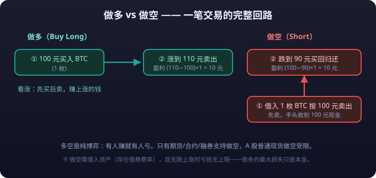
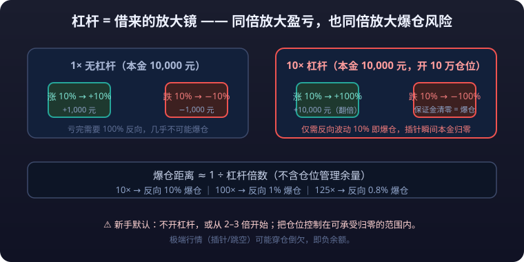
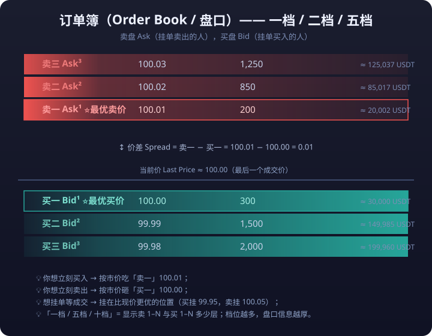

# 02 · 交易核心概念

> 本篇是交易术语的「字典」：行情软件上每一个按钮、每一栏数字，在这里都有解释。每个概念给出**通俗解释 + 一句话例子**，并附计算示例，务必亲手算一遍。
>
> **免责声明**：本站全部内容仅用于学习与研究，不构成任何投资建议。市场有风险，投资需谨慎。

---

## 一、方向类：多头与空头

### 多头（Long）/ 做多（Buy Long） <KbBadge t="最基础" c="c-teal" />

- **通俗解释**：看涨，先买入、等价格涨上去再卖出赚差价。
- **一句话例子**：你 100 元买入 BTC，涨到 110 元卖出，赚 10 元——这就是做多。

### 空头（Short）/ 做空（Short） <KbBadge t="需**<mark>杠杆</mark>**/融券" c="c-amber" />

- **通俗解释**：看跌，先借入资产卖出、等价格跌下来再买回归还，赚下跌的钱。
- **一句话例子**：你 100 元借来 BTC 卖掉，价格跌到 90 元时买回归还，赚 10 元——这就是做空。



::: tip 💡 多空铁律：有买才有卖，有赚就有亏
只有期货、合约、融券等市场支持做空；A 股普通现货交易做空受限。加密合约与期货市场里，多空是纯博弈关系——**有人赚，就有人亏**。零和（加手续费）不是「运气问题」，是结构性事实。
:::

---

## 二、资金类：杠杆、**<mark>保证金</mark>**、**<mark>爆仓</mark>**

### 杠杆（Leverage）



- **通俗解释**：借钱放大资金倍数，用少量本金撬动更大**<mark>仓位</mark>**。杠杆 10x 意味着你只需付出合约价值的 1/10。
- **一句话例子**：本金 1000 元、10 倍杠杆，就能开 10000 元的仓位，价格上涨 1% 你的本金就赚 10%。

### **<mark>保证金</mark>**（Margin）

- **通俗解释**：开杠杆仓位时抵押给交易所的「押金」，用于承担亏损。
- **一句话例子**：合约价值 10000 元、10 倍杠杆，你需要支付 1000 元保证金才能开仓。

### 爆仓 / **<mark>强平</mark>**（Liquidation / Forced Liquidation）

- **通俗解释**：价格朝反方向走，亏损吞掉了大部分保证金，交易所**强制平掉你的仓位**，避免亏损扩大。
- **一句话例子**：10 倍杠杆做多，价格下跌 10%，你的保证金**<mark>归零</mark>**，仓位被系统强平——**本金没了**。

---

::: danger ⚠️ 杠杆是把双刃剑，爆仓可能亏掉全部本金
- 杠杆放大收益，**同倍率放大亏损**：10 倍杠杆下，价格反向波动 10% 即爆仓。
- 爆仓后保证金清零，部分极端行情下（插针、跳空）甚至出现**穿仓倒欠**（**<mark>负余额</mark>**）。
- 新手默认建议：**不开杠杆，或从 2–3 倍极低杠杆开始**，并把仓位控制在可承受归零的范围内。
- 任何「稳赚不赔」「高杠杆带你飞」的宣传都默认按骗局对待，参见 [08-入土篇](../08-入土篇/)。
:::

---

## 三、市场结构类：**<mark>流动性</mark>**、**<mark>价差</mark>**、**<mark>滑点</mark>**

### 流动性（Liquidity）

- **通俗解释**：市场里买卖挂单的厚度与活跃度。流动性好 = 想买有人卖、想卖有人买，成交快且价格冲击小。
- **一句话例子**：BTC 每秒成交几千笔、深度挂单几十层，是流动性最好的资产；小币种一天没几笔交易，想卖还得排队等接盘。

### 买卖价差（Bid-Ask Spread）



- **通俗解释**：买价（Bid，别人愿出的最高价）与卖价（Ask，别人愿意卖的最低价）之间的差。价差是流动性差时交的「过路费」。
- **一句话例子**：盘口显示买价 100.00、卖价 100.02，价差 0.02 元——你市价买入立即亏损 0.02 元。

### 盘口术语：一档/二档、ask/bid、买入价/卖出价

行情软件右侧或下方那组「买一/卖一、买二/卖二…」数字，就是**订单簿（Order Book / 盘口）** 的直观呈现。读它之前，先把这几个词钉死：

| 中文 | 英文 | 含义 |
|---|---|---|
| 卖一 / 一档卖价 | Best Ask / Ask¹ | **现在最低的卖出挂牌价**，即「别人愿意卖的最低价」 |
| 买一 / 一档买价 | Best Bid / Bid¹ | **现在最高的买入挂牌价**，即「别人愿意出的最高价」 |
| 卖二 / 买二（二档） | Ask² / Bid² | 次低的卖单 / 次高的买单，往后依次三档、四档… |
| 卖盘 / 卖单墙 | Ask side | 上方所有挂单卖出的人 |
| 买盘 / 买单墙 | Bid side | 下方所有挂单买入的人 |
| 一档 / **<mark>五档</mark>** / 十档盘口 | Level | 软件一次性显示卖买各几层挂单（1/5/10 档） |
| 买入价 | Bid price | 你现在**卖出**实际能立即拿到的价（被买一吃掉） |
| 卖出价 | Ask price | 你现在**买入**实际要付的价（吃掉卖一） |

::: warning 🎚 盘口是快照，几十毫秒就变
**档位是快照，会变——盘口是「实时刷新的一瞬间」，几十毫秒后可能全变。** 看盘口下单，永远以点下按钮那一刻为准，别被几秒前的挂单量迷惑。
:::

**四个铁规则（记住少踩坑）：**

1. **「买入价」≠「卖出价」**：软件上的「买入价/卖出价」是**对手方**的价——你想买就按卖一价付，你想卖就按买一价拿。差出来的那点就是价差，交易成本之一。
2. **一档越厚，成交越快**：买一/卖一挂单量（盘口数字）大，**<mark>市价单</mark>**瞬间就能吃掉；一档稀疏时一单砸穿好几层，价格剧烈跳动。
3. **档位是快照，会变**：盘口是「实时刷新的一瞬间」，几十毫秒后可能全变。看盘口下单，永远以点下按钮那一刻为准。
4. **盘口可以被伪装**：挂大单砸墙、撤单诱多都是常见手法，详见 [12-市场生态篇](../12-市场生态篇/) 的市场操纵识别。

### 滑点（Slippage）

- **通俗解释**：预期成交价与实际成交价之间的偏差，市价单在大单/低流动性行情下尤为明显。
- **一句话例子**：你想以 100 元市价买入 1 万枚，但卖盘深度不足，实际成交均价 100.5 元——多付的 0.5 元就是滑点。

---

## 四、下单类：市价单、**<mark>限价单</mark>**、**<mark>止损</mark>**止盈

### 市价单（Market Order）

- **通俗解释**：以当前最优可成交价立即买入/卖出，**保证成交速度，不保证价格**。
- **一句话例子**：行情暴跌时你市价清仓，可能比看到的盘口价格低几个点成交。

### 限价单（Limit Order）

- **通俗解释**：挂一个指定价格，只有价格到达才成交，**保证价格，不保证成交**。
- **一句话例子**：你挂单 95 元买 BTC，价格没跌到 95 元就永远不成交，也可能直接挂在半空。

### 止损单（Stop-Loss）与**<mark>止盈</mark>**单（Take-Profit）

- **通俗解释**：预设离场价，价格触发后自动平仓：止损控制最大亏损，止盈锁定利润。
- **一句话例子**：100 元做多，止损设在 95、止盈设在 115——最坏亏 5%，最好赚 15%，剩下的交给系统。

::: tip 💡 止损是保命符，不是认怂
**止损不是「亏了认怂」，而是「活下来的保命符」**。所有交易系统篇会反复强调：入场前先定止损，再谈目标。详见 [07-交易系统篇](../07-交易系统篇/)。
:::

---

## 五、盈亏计算：点位、百分比、合约面值

### 点位（Points / Ticks）

- **通俗解释**：价格变动的最小计量单位，期货/指数里常说「涨了多少点」。
- **一句话例子**：上证指数从 3500 涨到 3520，就是「涨了 20 个点」。

### 百分比盈亏（现货口径）

现货盈亏公式：

```text
盈亏 = （卖出价 - 买入价）× 数量
盈亏百分比 = （卖出价 - 买入价）÷ 买入价 × 100%
```

<details>
<summary>📖 点击展开：现货盈亏完整数字推演</summary>

- 买入 2 个 BTC，价格 100,000 元 → 花费 200,000 元
- 涨到 110,000 元卖出 → 盈利（110,000 - 100,000）× 2 = **20,000 元**
- 盈亏百分比 = 10,000 ÷ 100,000 × 100% = **10%**
- 若跌到 90,000 元止损卖出 → 亏损（90,000 - 100,000）× 2 = **-20,000 元**，即 **-10%**

</details>

### 杠杆下的百分比盈亏

```text
杠杆后盈亏百分比 = 标的涨跌幅 × 杠杆倍数
```

**数字例子：**

- 本金 10,000 元，10 倍杠杆，开 100,000 元仓位
- 价格上涨 3% → 盈利 3% × 10 = **30%**，即 3,000 元（对比本金）
- 价格下跌 3% → 亏损 **30%**，本金剩 7,000 元

### 合约面值（Contract Face Value / Notional）

- **通俗解释**：一张合约对应的标的数量 × 单价，即「这张合约值多少钱」，是计算保证金与盈亏的基础。
- **一句话例子**：某期货合约乘数为 10 吨/手，价格 5,000 元/吨 → 合约面值 = 10 × 5,000 = **50,000 元**；10% 保证金 = 5,000 元/手。

> 加密永续合约的面值口径各交易所不同（币本位/U 本位、张数换算），下单前务必看清「1 张 = 多少 BTC」的说明，详见 [05-加密合约篇](../05-加密合约篇/)。

### 盈亏平衡价（Breakeven Price）

- **通俗解释**：不赚不亏的离场价格 = 入场价 + 手续费 + **<mark>资金费率</mark>**（合约）。**扣除费用后，其实涨了也未必赚。**
- **一句话例子**：买入价 100 元、手续费合计 0.3 元 → 盈亏平衡价 = 100.3 元，卖在 100.15 元看似赚了 0.15 元，实际还是亏的。

---

## 六、一张表复习

| 概念 | 一句话记忆 | 常见误区 |
|---|---|---|
| 做多/做空 | 多=先买后卖赌涨，空=先卖后买赌跌 | 以为做空是「反着做就能赢」 |
| 杠杆 | 借钱放大仓位 | 只想到放大盈利，忘了同倍放大亏损 |
| 保证金 | 开仓押金 | 以为保证金=最大亏损（实际约等于） |
| 爆仓/强平 | 亏损吃掉保证金，系统强制平仓 | 以为「扛一扛能回来」——强平不等你 |
| 流动性 | 市场买卖的厚度 | 在小币种上做市价大单，吃到天价滑点 |
| 盘口（买卖档位） | 买一~买N / 卖一~卖N 的实时挂单 | 把「买入价/卖出价」当成自己想成交的价 |
| Asks/Bids | 卖盘 / 买盘，Ask¹ 最低卖价、Bid¹ 最高买价 | 忽略价差 = 忘了交易成本 |
| 买卖价差 | 买价与卖价之差 | 忽略价差导致「开仓即亏损」 |
| 滑点 | 实际成交价≠预期成交价 | 只用盘口价预估成交，忽视深度 |
| 市价/限价 | 市价保成交、限价保价格 | 行情剧烈时挂限价单永远成交不了 |
| 止损止盈 | 自动离场线 | 止损设太近被反复打脸，或干脆不设 |
| 合约面值 | 一张合约值多少钱 | 混淆「一张」与「一个币」 |
| 盈亏平衡价 | 扣完费用的真·成本价 | 只看买卖差价，忽略手续费 |

---

## 七、给新手的三条行动建议

::: danger 💀 开仓前必备三问
1. **杠杆倍数是多少？** —— 价格反向多少会打爆你？
2. **爆仓距离在哪？** —— 用上面的公式提前算出来，写下来。
3. **止损位设哪？** —— 没有止损的单子，等于裸奔过雷区。

**回答不上这三个问题，就不该开这一单。**
:::

1. **手续费也要当成本**：频繁短线交易时，手续费与价差常吃掉大部分利润，详见盈亏平衡价一节。
2. **先用小资金练计算**：任何新交易所/新功能，第一单都从最小仓位开始，把上面的公式逐一验证一遍。

::: warning ⚠️ 风险提示
**杠杆是本篇最危险的词汇：10 倍杠杆下反向波动 10% 即本金归零。所有公式请先用模拟盘或最小仓位验证，切勿在实盘中「边学边算」。**
:::
