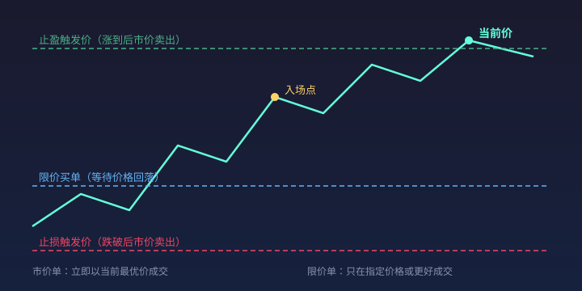

# 05 · 订单类型与执行机制

> 你在交易界面按下「买入」的那一刻，背后发生了一连串事件：订单进入撮合引擎、与对手方挂单匹配、部分或全部成交、剩余部分继续等待或取消。本篇把每种订单类型的触发逻辑讲透，让你知道**什么时候该用哪种单**。
>
> **免责声明**：本站全部内容仅用于学习与研究，不构成任何投资建议。市场有风险，投资需谨慎。

---

## 一、最基础的两种：市价单与限价单

### 1.1 市价单（Market Order） <KbBadge t="立即成交" c="c-teal" />

- **通俗解释**：「不管什么价，现在就给我成交。」系统按当前盘口最优价格立刻买入或卖出。
- **一句话例子**：BTC 当前卖一价 100,100，你下市价买单，系统立刻以 100,100（或更高，取决于深度）成交。

::: warning ⚠️ 滑点风险
市价单不保证价格，只保证成交量。在流动性差的市场或大额交易时，实际成交价可能远差于下单时看到的报价——这就是**<mark>滑点</mark>**。极端行情下滑点可达数个百分点。
:::

### 1.2 限价单（Limit Order） <KbBadge t="指定价格" c="c-blue" />

- **通俗解释**：「只在我要的价格（或更好）成交。」你指定一个价格，只有当市场到达该价位时才可能成交。
- **一句话例子**：你在 99,000 挂一个 BTC 限价买单，即使当前市价 100,000，你的单也会挂在订单簿上等待价格回落到 99,000 才成交。

| 对比 | 市价单 | 限价单 |
|---|---|---|
| 成交速度 | **<mark>立即</mark>** | 等待市场到达 |
| 成交价格 | 不确定（有滑点） | 确定（或更好） |
| 是否一定成交 | 是（只要流动性足够） | 否（可能永远不成交） |
| 适用场景 | 急着进出、止损 | 耐心等回调、埋伏 |



---

## 二、条件单：让交易所帮你盯盘

### 2.1 止损单（Stop Market） <KbBadge t="保命" c="c-red" />

- **通俗解释**：「如果价格跌到 X，就立刻市价卖出。」用于限制亏损。
- **一句话例子**：你在 100,000 买入 BTC，设置止损价 95,000。当价格触及 95,000 时，系统自动发出一张市价卖单。

::: danger ⚠️ 止损不等于保命
止损单触发后发出的是**市价单**，在剧烈下跌或闪崩中，实际成交价可能远低于止损价。如果你加了高杠杆，止损滑点可能导致亏损超过预期甚至爆仓。永远不要认为「设了止损就安全了」。
:::

### 2.2 止损限价单（Stop Limit）

- **通俗解释**：「如果价格跌到 X，就在 Y 或更好的价格卖出（Y ≤ X）。」比普通止损多一层价格保护。
- **一句话例子**：止损触发价 95,000，限价 94,800。价格跌到 95,000 触发后，系统挂一个 94,800 的限价卖单。
- **风险**：如果价格跳过限价直接跌到 93,000，你的限价单不会成交，仓位继续暴露在下跌中。

### 2.3 追踪止损（Trailing Stop）

- **通俗解释**：「止损线跟着价格上涨自动上移，但价格回撤固定幅度就触发。」锁定利润的同时给行情留空间。
- **一句话例子**：追踪距离 2%，BTC 从 100,000 涨到 110,000，止损线从 98,000 自动上移到 107,800。价格回落到 107,800 时触发卖出。

### 2.4 OCO（One Cancels Other）

- **通俗解释**：「同时挂两个条件单，一个成交另一个自动取消。」通常用于止盈 + 止损的组合。
- **一句话例子**：100,000 买入 BTC 后，同时挂 105,000 止盈限价单和 96,000 止损单。先触发的那个成交，另一个自动撤销。

---

## 三、高级订单类型

### 冰山单（Iceberg Order）

大额订单拆成多个小额订单分批显示，只露出「冰山一角」，避免暴露真实意图引发市场跟风。机构常用。

### 时间加权平均价格单（TWAP）

把大单按时间均匀拆分，每隔 N 秒/分钟下一笔小额市价单，减少对市场的冲击。量化基金常用。

### 只做 Maker 单（Post Only）

如果限价单会立即成交（即吃掉对手方挂单），则自动取消而不是成交。确保你只提供流动性（Maker），享受更低的手续费率。

---

## 四、订单簿与撮合机制


### 4.1 订单簿结构

| 术语 | 含义 |
|---|---|
| 买一（Bid 1） | 最高的买入挂单价 |
| 卖一（Ask 1） | 最低的卖出挂单价 |
| **<mark>点差</mark>** | 卖一 − 买一，越小代表流动性越好 |
| 深度 | 各价位上的挂单量总和 |

### 4.2 撮合优先级

1. **价格优先**：买单出价高的先成交，卖单要价低的先成交
2. **时间优先**：同价位的单，先到的先成交
3. **数量优先**（部分交易所）：同价位同时间的单，量大者优先

### 4.3 部分成交

当你的订单量超过对手方挂单量时，会发生**部分成交**：

```text
你想买 10 BTC
卖一价挂了 3 BTC → 先成交 3 BTC
卖二价挂了 5 BTC → 再成交 5 BTC
卖三价挂了 8 BTC → 再成交 2 BTC
剩余 0 BTC → 全部成交完毕
```

三笔成交的均价就是你的**实际成交均价**，可能明显高于你看到的「卖一价」。这就是大额市价单滑点的来源。

---

## 五、手续费：Maker 与 Taker

| 角色 | 行为 | 典型费率 |
|---|---|---|
| Taker（吃单方） | 下市价单或可立即成交的限价单，消耗订单簿流动性 | 0.05%–0.10% |
| Maker（挂单方） | 下不会立即成交的限价单，为订单簿增加流动性 | 0.00%–0.02% |

::: tip 💡 降低成本的核心策略
高频交易者会刻意使用 Post Only 限价单来保持 Maker 身份，手续费差距可达 5–50 倍。对于频繁交易的人，手续费差异长期累积是一笔巨大的隐性成本。
:::

---

## 六、实战速查表

| 场景 | 推荐订单类型 |
|---|---|
| 急着买入/卖出 | 市价单 |
| 在特定价位埋伏 | 限价单 |
| 控制最大亏损 | 止损单或止损限价单 |
| 同时设止盈和止损 | OCO |
| 让利润奔跑但锁住回撤 | 追踪止损 |
| 大额交易减少冲击 | TWAP 或冰山单 |
| 降低手续费 | Post Only 限价单 |

::: warning ⚠️ 风险提示
本文所有内容仅用于学习与研究，不构成任何投资建议。加密货币交易具有高风险，杠杆交易可能导致全部本金损失。请根据自身风险承受能力谨慎决策。
:::
