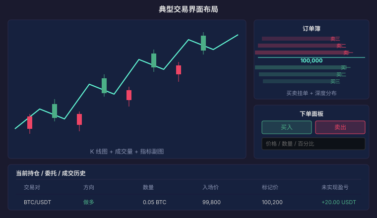

# 07 · 你的第一笔交易：从开户到下单的完整流程

> 前面六篇讲了市场是什么、术语是什么意思、图表怎么读、订单怎么下、仓位怎么管。本篇把它们串成一条线：从零开始完成你的**第一笔加密货币交易**。
>
> **免责声明**：本站全部内容仅用于学习与研究，不构成任何投资建议。市场有风险，投资需谨慎。

---

## 一、选择交易平台

### 1.1 核心考量

| 维度 | 关注点 |
|---|---|
| 安全性 | 是否有过被盗记录？冷钱包比例？是否有保险基金？ |
| 流动性 | 日成交量多少？点差小不小？深度够不够？ |
| 手续费 | Maker/Taker 费率？有无 VIP 等级减免？ |
| 合规性 | 是否在你的司法辖区合法运营？ |
| 用户体验 | 界面是否清晰？客服响应速度？ |

### 1.2 主流平台概览

| 平台 | 特点 | 适合人群 |
|---|---|---|
| Binance | 全球最大，流动性最好，币种最全 | 有一定经验的交易者 |
| OKX | 功能全面，合约工具丰富 | 合约交易者 |
| Coinbase | 合规友好，界面简洁，美国用户首选 | 美国/欧洲新手 |
| Bybit | 合约起家，移动端体验好 | 合约/移动端用户 |

::: warning ⚠️ 平台风险
交易所是中心化机构，「不是你的钥匙，就不是你的币」。大额资产建议提到自托管钱包。平台可能遭遇黑客攻击、监管冻结或经营不善。
:::

---

## 二、注册与入金

### 2.1 KYC（Know Your Customer）

几乎所有合规平台都要求身份验证：

```text
1. 邮箱/手机号注册
2. 上传身份证件（身份证/护照）
3. 人脸识别
4. 等待审核（几分钟到几天）
```

KYC 等级越高，可充值和提现的额度越大。

### 2.2 入金方式

| 方式 | 到账时间 | 手续费 | 门槛 |
|---|---|---|---|
| 银行卡/信用卡买币 | 几分钟 | 较高（2%–5%） | 最低 |
| P2P（场外交易） | 不定 | 低/免费 | 中 |
| 链上转账（从其他钱包） | 几分钟到几小时 | 链上 Gas 费 | 需有 crypto |
| 内部转账（同平台用户） | 秒到 | 免费 | 双方都在同一平台 |

---

## 三、看懂交易界面



以 Kline Buty 或 Binance 为例，一个典型的现货交易页面分为四个区域：

| 区域 | 内容 |
|---|---|
| 左侧 / 中央 | K 线图 + 成交量 + 指标 |
| 右侧上方 | 订单簿（买卖挂单 + 深度图） |
| 右侧下方 | 下单面板（买入/卖出按钮 + 价格/数量输入框） |
| 底部 | 当前持仓 / 委托列表 / 成交历史 |

### 关键字段速查

- **最新价**：最近一笔成交的价格
- **24h 涨跌**：相对 24 小时前的变化百分比
- **24h 高/低**：过去 24 小时的最高价/最低价
- **24h 成交量**：过去 24 小时总共成交了多少个 BTC（或 USDT）

---

## 四、你的第一笔交易

### Step 1：选交易对

在搜索栏输入 `BTC`，选择 `BTC/USDT` 交易对。USDT 是与美元锚定的稳定币，相当于加密市场的「现金」。

### Step 2：确定买入金额

::: tip 💡 第一笔交易的建议
第一次买入金额控制在你能承受完全损失的范围内——比如 100–500 元人民币等值。这不是因为你大概率会亏光，而是因为**小额试错的心理成本最低**，你能在没有情绪压力的情况下走完整个流程。
:::

### Step 3：下单

```text
订单类型：限价单
价格：输入当前市价的 99%（比市价低 1%，练习等待成交）
数量：输入你想买的 BTC 数量（或点击百分比按钮选 25%）
方向：买入

→ 点击「买入 BTC」按钮
```

如果价格没回落到你的限价，订单会挂在「当前委托」里等待。

### Step 4：设置止盈止损

成交后立刻做两件事：

```text
止损单：价格 = 入场价 × 95%（最多亏 5%）
止盈单：价格 = 入场价 × 110%（赚 10% 就走）
用 OCO 把两张单绑在一起
```

### Step 5：监控与退出

- 价格到达止损或止盈 → 自动成交 → 完成
- 你主动决定提前退出 → 用市价单平仓
- 到了预设持有时间但什么都没发生 → 平仓退出，不恋战

---

## 五、新手最常见的七个错误

| # | 错误 | 后果 |
|---|---|---|
| 1 | 全仓梭哈一种币 | 一次黑天鹅亏光 |
| 2 | 不设止损 | 小亏拖成大亏 |
| 3 | 追涨杀跌 | 高买低卖，反复割肉 |
| 4 | 频繁交易 | 手续费吃掉利润 |
| 5 | 杠杆开太高 | 一次正常波动就爆仓 |
| 6 | FOMO 追热点 | 接盘侠 |
| 7 | 不记录交易日志 | 同样的错反复犯 |

::: danger ⚠️ 如果你正在犯这些错误
停下来。关掉交易软件，回到第 06 篇重新读一遍仓位管理。大多数新手的亏损不是因为「不懂技术分析」，而是因为**没有纪律**。
:::

---

## 六、下一步学习路径

完成第一笔交易后，按以下顺序继续：

```text
01 · 金融市场全景 ✅（已读）
02 · 交易核心概念 ✅（已读）
03 · K 线与图表入门 ✅（已读）
04 · 交易时间全景 ✅（已读）
05 · 订单类型与执行机制 ✅（已读）
06 · 仓位管理与资金管理 ✅（已读）
07 · 你的第一笔交易 ← 你在这里

→ 02 · 现货篇：深入了解现货交易的进阶策略
→ 05 · 加密合约篇：了解杠杆与永续合约（高风险，谨慎进入）
→ 06 · 技术分析篇：系统学习技术指标与形态
→ 07 · 交易系统篇：建立你自己的交易规则
```

> **⚠️ 风险提示**：本文所有内容仅用于学习与研究，不构成任何投资建议。加密货币交易具有高风险，杠杆交易可能导致全部本金损失。请根据自身风险承受能力谨慎决策。
