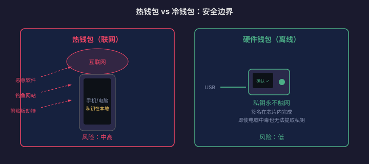

# 安全存储与钱包管理

> 「不是你的钥匙，就不是你的币。」加密货币的去中心化特性把安全责任从银行转移到了你自己身上。一次助记词泄露、一次钓鱼签名、一次交易所暴雷，都可能让你归零。本篇讲的是**怎么不丢币**。
>
> **免责声明**：本站全部内容仅用于学习与研究，不构成任何投资建议。市场有风险，投资需谨慎。

---

## 一、钱包的本质：钥匙，不是保险箱

::: info 📖 钱包 ≠ 存钱罐
加密货币钱包不存储币本身——币永远在区块链上。钱包存储的是**私钥**：一串证明你拥有链上资产的密码学凭证。谁拿到私钥，谁就控制资产。
:::

### 私钥 → 助记词 → 地址

```text
私钥（64 位十六进制字符串）
  ↓ BIP39 标准转换
助记词（12 或 24 个英文单词）
  ↓ 椭圆曲线推导
公钥 → 地址（你给别人收款的"账号"）

助记词 = 私钥的易读备份形式
丢失助记词 = 永久失去资产访问权
```

---

## 二、钱包类型对比

| 类型 | 私钥存储 | 联网 | 安全性 | 适用场景 |
|---|---|---|---|---|
| 交易所托管 | 平台保管 | 是 | 取决于平台 | 小额交易、新手入门 |
| 热钱包（软件） | 手机/电脑本地 | **<mark>是</mark>** | 中（有被黑风险） | 日常小额操作 |
| 浏览器插件 | 浏览器内 | 是 | 中低 | DeFi 交互 |
| 硬件钱包 | 离线芯片 | **否** | **高** | 大额长期持有 |
| 纸钱包 | 纸上手写/打印 | 否 | 高（怕物理损坏） | 极端离线备份 |



### 2.1 热钱包

手机 App（如 Trust Wallet、Rainbow）或浏览器插件（如 MetaMask）。方便但暴露在网络中：

- 恶意软件可以读取剪贴板中的地址
- 钓鱼网站诱导你签名恶意交易
- 手机丢失且未设密码 → 直接被盗

::: warning ⚠️ 热钱包只放「零花钱」
热钱包里放的金额应该控制在你能接受完全损失的范围（比如几百到几千元）。大额资产必须用硬件钱包。
:::

### 2.2 冷钱包 / 硬件钱包

私钥生成、存储、签名全部在离线芯片中完成，从不触网。代表产品：Ledger、Trezor、KeepKey。

- **签名过程**：交易在电脑/手机上构建 → 发送到硬件钱包 → 硬件钱包屏幕显示交易详情 → 你物理按键确认 → 签名回传广播
- **即使电脑中毒**：私钥不会离开硬件设备，攻击者最多看到地址和余额

---

## 三、助记词管理：一条命的备份

### 3.1 核心规则

::: danger ⚠️ 助记词管理的生死线
1. **绝不拍照**——云相册同步等于上传到服务器
2. **绝不截图**——同上
3. **绝不输入到任何网站/App**（除了钱包初始化时）
4. **绝不告诉任何人**——包括自称客服的人
5. **不用网络传输**——不发微信、不发邮件、不用网盘
6. **至少两份物理备份**——分开存放，防止单点故障
7. **防火防水**——钢板蚀刻 > 纸张手写 > 打印纸
:::

### 3.2 备份方案

| 方案 | 做法 | 优点 | 缺点 |
|---|---|---|---|
| 手写纸质 | 写在纸上 × 2 份分开放 | 免费、简单 | 怕火怕水怕褪色 |
| 钢板蚀刻 | 不锈钢板 + 刻字笔 | 防火防水耐腐蚀 | 需要工具 |
| 多地点分散 | 两份放不同城市/保险柜 | 抗灾难 | 管理成本高 |
| Shamir 分片 | 助记词拆成 N 份，集齐 M 份恢复 | 任一单份泄露不影响安全 | 需要支持的钱包 |

---

## 四、交易所托管风险

### 4.1 历史教训

| 事件 | 年份 | 损失 |
|---|---|---|
| Mt.Gox 被盗 | 2014 | 850,000 BTC（当时约 4.5 亿美元） |
| FTX 挪用用户资金 | 2022 | 约 80 亿美元用户资产缺口 |
| Celsius 冻结提款 | 2022 | 约 47 亿美元用户资产被锁定 |

### 4.2 风险评估框架

```text
平台风险 = 技术风险 + 运营风险 + 监管风险 + 道德风险

技术风险：被黑客攻击、智能合约漏洞
运营风险：内部管理混乱、挪用资金
监管风险：政策变化导致冻结/关停
道德风险：创始人跑路、庞氏骗局
```

### 4.3 实用建议

| 资金规模 | 建议 |
|---|---|
| < 1,000 元等值 | 放交易所没问题，方便交易 |
| 1,000–10,000 元 | 交易完提到热钱包 |
| 10,000–100,000 元 | 提到硬件钱包 |
| > 100,000 元 | 硬件钱包 + 多签 + 多地点备份 |

---

## 五、进阶安全：多签与社交恢复

### 5.1 多重签名（Multi-Sig）

需要 M 把私钥中的 N 把才能动用资金（如 2/3、3/5）。任何一把被盗都无法单独转走资产。

```text
2/3 多签示例：
钥匙 A（自己日常携带）
钥匙 B（家里保险柜）
钥匙 C（信任的家人/律师保管）

转账需要任意 2 把同时签名
丢失任何 1 把仍可用剩余 2 把恢复资金
```

### 5.2 社交恢复

没有传统私钥，而是设置多个「守护人」（Guardian），丢失访问权时由多数守护人投票恢复。适合不想管私钥的用户。

---

## 六、防盗防丢检查清单

每次涉及资产操作前过一遍：

- [ ] 我确认了接收地址的前 6 位和后 6 位吗？
- [ ] 这个网站 URL 是正确的吗？（检查拼写、HTTPS）
- [ ] 这个签名请求合理吗？（是否要求无限授权？）
- [ ] 我的助记词有没有在任何联网设备上出现过？
- [ ] 我的大额资产是否在硬件钱包上？
- [ ] 我的助记词备份是否至少两份且物理分离？

::: tip 💡 一条铁律
任何人（包括自称交易所客服、警察、项目方）向你索要助记词或要求你点击链接输入助记词——**100% 是骗子**。没有例外。
:::

::: warning ⚠️ 风险提示
本文所有内容仅用于学习与研究，不构成任何投资建议。加密货币交易具有高风险，请妥善保管私钥与助记词，任何丢失均不可恢复。
:::
