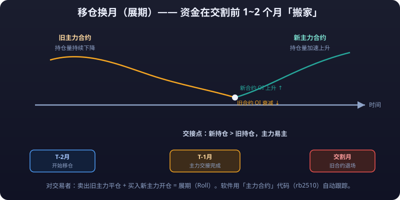

# 03 · 交割与**<mark>展期</mark>**：时间站在谁那边

> 期货是「有到期日的合同」。股票可以持有十年，期货不行——每个合约都有交割月，到期必须了结。本篇讲清楚交割制度、交割月的风险、主力合约的形成与移仓换月，以及散户应该如何选择合约月份。

---

## 1. 交割制度：实物交割与现金交割

交割（Delivery）是期货合约到期后的履约方式，分两大类：

### 1.1 实物交割

- 卖方按合约标准交付实物商品，买方支付货款。
- 用于**商品期货**：玉米、大豆、铜、原油、螺纹钢、黄金等。
- 交割质量、地点、包装、溢短装都有严格规定，涉及仓单、检验、运费等一系列成本。
- **个人投资者不能参与商品实物交割**（国内规则），必须提前平仓或移仓。

### 1.2 现金交割

- 不涉及实物，按到期结算价与开仓价之间的差额划拨资金。
- 用于**金融期货**：股指期货（沪深 300 等）、国债期货。
- 结算价通常取交割月最后交易日的特定时段加权平均价（如股指取最后两小时算术平均价），避免单点操纵。

### 1.3 哪些品种用哪种方式

| 交割方式 | 典型品种 | 特点 |
|---|---|---|
| 实物交割 | 铜、铝、螺纹钢、铁矿石、焦炭、原油、豆粕、玉米、白糖、棉花、黄金、白银 | 期现价格收敛性强，交割成本高 |
| 现金交割 | 股指期货（IF/IH/IC/IM）、国债期货（TS/TF/T/ TL） | 无实物成本，纯资金结算 |

> 无论哪种交割，**对散户而言都只有一个目标：在交割之前平仓离场**。真正走到交割的，只有具备现货渠道的产业客户（套保者）。

---

## 2. 交割月风险

临近交割月，持仓者会面对一连串「规则风险」，对散户极不友好：

| 风险 | 说明 |
|---|---|
| **<mark>保证金</mark>骤增** | 交易所对临近交割月合约大幅上调保证金（可能从 10% 提到 20%～40%），持仓成本陡增 |
| **流动性枯竭** | 持仓向主力合约集中，近月合约成交清淡，买卖**<mark>价差</mark>**拉大，平仓困难 |
| **限仓限制** | 个人投资者在交割月前若干日起不允许开新仓、持仓手数受限，超限将被**<mark>强平</mark>** |
| **规则跳变** | 涨跌停幅度、**<mark>保证金</mark>**、开仓权限在交割月均有特殊规定 |
| **逼仓风险** | 多空一方利用持仓与现货不平衡制造极端波动（逼多/逼空），散户最易受害 |
| **实物交割义务** | 个人若忘记平仓被带入交割流程，将面临无法履约的违约罚款 |

::: danger 💀 散户绝不能在交割月前后持仓
**散户绝不能在交割月前后持仓。** 保证金骤增、**<mark>流动性</mark>**枯竭、限仓强平、逼仓风险——临近交割月的规则全部不利于散户，商品期货应至少提前 1~3 周离场。
:::

**结论：散户绝不能在交割月前后持仓。** 一般规则是：

- 商品期货：最后交易日（交割月前的某日）之前 **至少提前 1～3 周**离场。
- 股指/国债期货：可以交易到最后交易日，但流动性与波动同样在最后几天放大。

### 2.1 交割流程详解（以实物交割为例）

若你是法人客户并选择交割，流程大致为：

| 环节 | 内容 | 时间点 |
|---|---|---|
| 标准仓单 | 卖方提交符合质量标准的仓单（货物已入库并通过检验） | 交割月前/中 |
| 配对 | 交易所按持仓配对多空双方 | 最后交易日 |
| 交割结算价 | 按交易所规定的结算价（如交割月所有交易日结算价加权）结算 | 最后交易日 |
| 货款划转 | 买方付全款、卖方交付仓单，交易所居中结算 | 交割日 |
| 提货/转仓单 | 买方凭仓单提货或继续流转 | 交割后 |

> 这一套流程对产业客户是日常，对个人投资者则是「规则的深水区」：仓单、质检、开票、违约罚则……每一步都有坑。**所以规则直接剥夺了个人参与实物交割的权利——这对散户是保护，不是歧视。**

### 2.2 交割为什么让期现价格收敛

交割制度是期货市场的「锚」：

- 若期货价 > 现货价 + 持仓成本 → **<mark>套利</mark>**者买入现货、卖出期货、交割赚钱，把期货价「压」向现货。
- 若期货价 < 现货价 → 套利者反向操作（买期货、卖现货），把期货价「托」向现货。

因此**越临近交割，期货价格越贴近现货**。这个收敛机制是套期保值有效、期现套利可行的根基。

---

## 3. 主力合约与移仓换月

### 3.1 什么是主力合约

主力合约 = 同一品种所有合约中 **成交量与持仓量最大** 的那个合约月。它代表市场资金的主战场：

| 品种 | 常见主力月份 | 备注 |
|---|---|---|
| 螺纹钢（rb） | 1 月、5 月、10 月 | 三个主力轮流活跃 |
| 豆粕（m） | 1 月、5 月、9 月 | 随种植收获节奏 |
| 沪铜（cu） | 连续活跃，近远月均活跃 | 持仓长期居前 |
| 沪深 300 股指（IF） | 当月合约为主 | 流动性集中于当月与次月 |
| 国债期货（T） | 主力季月（3/6/9/12） | 随可交割国债变化 |



### 3.2 主力合约为什么会换月

随着一个合约临近交割月，资金开始「搬家」到下一个活跃月份，这个过程叫**移仓换月**：

- 持仓者卖出旧主力（平仓），同时买入新主力（开仓）——对交易者而言，这叫**展期/换仓**。
- 换月通常发生在交割月前 **1～2 个月**，成交量与持仓量在某个节点完成「交接」，新合约成为主力。

### 3.3 换月的标志

```text
旧合约：持仓量/成交量 持续下降、价差扩大、保证金上调
新合约：持仓量/成交量 加速上升、价差收敛
```

当新合约的成交量**连续数日**超过旧合约，主力地位即完成交接。交易软件通常用「主力合约」代码（如 `rb2510`）自动跟踪。

---

## 4. 换月时的**<mark>基差</mark>**与跳空

### 4.1 基差（Basis）

```text
基差 = 期货价格 − 现货价格
```

- **正向市场（期货升水）**：期货价 > 现货价，远月 > 近月，常见于商品供给宽松或存在持仓成本。
- **反向市场（期货贴水）**：期货价 < 现货价，近月 > 远月，常见于现货紧缺或市场预期价格下跌。
- 临近交割月，基差向 0 收敛（期现价格在交割日必须一致，否则存在无风险套利机会）。

### 4.2 换月的「跳空」

从旧主力切到新主力时，两个合约的价格并不相同：

| 情形 | 新旧主力价差 | 对换仓者的影响 |
|---|---|---|
| 正向市场（升水） | 新主力 > 旧主力 | 换仓后多单成本抬高、空单成本降低 |
| 反向市场（贴水） | 新主力 < 旧主力 | 换仓后多单成本降低、空单成本抬高 |

**K 线图上的「跳空缺口」**：若软件把不同合约的 K 线接续成连续图，换月点会出现明显的跳空缺口——这不是价格暴涨暴跌，而是**两个不同合约的价格差**。新手若在连续图上把缺口当突破信号，极易误判。

### 4.3 示例：豆粕移仓换月

- 5 月合约收在 3300 元/吨（即将到期，贴水现货）。
- 9 月合约成交 3350 元/吨（升水结构）。
- 你持有 5 月多单 3 手，换仓卖出 5 月、买入 9 月：
  - 5 月平仓：+0（按 3300 平，无盈亏）
  - 9 月开仓：成本 3350，比原成本高 50 元/吨
  - **多单换仓成本 = +50 元/吨（3 手 = 1500 元）**——这不是行情亏损，是期限结构的成本，常被称作**展期损失**。
- 若你持的是空单，则该结构下换仓反而**赚到** 50 元/吨的移仓收益（卖高买低）。

> 换月不是简单的「把**<mark>仓位</mark>**搬过去」，它是一笔有成本、有方向的交易。长期持有期货的「持有成本」中，展期损益往往比保证金利息重要得多。

### 4.4 期限结构的成因：持有成本理论

为什么远月通常比近月贵？用**持有成本理论（Cost of Carry）**解释：

```text
远期价格 ≈ 现货价格 + 仓储费 + 保险费 + 资金占用利息 − 便利收益
```

- 持有商品（谷物、黄金、原油）需要仓储与资金成本 → 远月天然偏贵（升水/Contango）。
- 若商品现货紧缺、市场急需现货运转（便利收益很高），远月反而更便宜（贴水/Backwardation）。

| 期限结构 | 形状 | 隐含的市场信号 | 常见情形 |
|---|---|---|---|
| 升水（Contango） | 近月低、远月高 | 供给充裕、现货无压力 | 黄金、供过于求的原油 |
| 贴水（Backwardation） | 近月高、远月低 | 现货紧缺、库存告急 | 紧平衡原油、缺货品种 |

> 期限结构本身就是一个「信号源」：**贴水市场往往预示着短期供需紧张**，很多趋势交易者把期限结构当作重要的辅助确认指标。

### 4.5 展期收益的计算示例

假设你长期做多某个贴水品种，持有 1 年，每月移仓一次：

| 项目 | 数值 |
|---|---|
| 初始价格（近月） | 100.0 元 |
| 远月折价（月差） | 0.5 元/月 |
| 每月换仓收益 | +0.5 元/吨 |
| 全年展期收益 | +6 元（≈ 6% 的额外收益） |

反之，在升水市场做多，每月换仓「买贵 0.5 元」，一年就白亏 6%。**这就是为什么「期货长期持有」的收益与现货资产（如黄金 ETF）的收益可以相差巨大。**

---

## 5. 展期策略

展期（Rolling）指持有跨月仓位的投资者，在旧合约到期前平旧开新、把头寸移到下一个月份的操作。

### 5.1 按方向：换仓时机策略

| 策略 | 操作 | 适用场景 |
|---|---|---|
| 提前展期 | 交割月前 3～4 周就换 | 追求流动性安全，规避交割规则 |
| 临界展期 | 拖到交割月前最后几天 | 期望基差收敛带来更好价格，但风险高（流动性差） |
| 滚动式展期 | 分批次（如每 5 天换 1/3）换仓 | 平滑换月跳空，适合大资金 |

### 5.2 按结构：期限结构策略（持有期货的长期玩法）

- **升水市场（Contango）**：远月贵于近月。多头长期持有者每次展期都「买贵」，累积展期损失；空头反之获益。
- **贴水市场（Backwardation）**：近月贵于远月。多头展期「买便宜」，可累积展期收益。

| 期限结构 | 多头展期 | 空头展期 | 典型品种 |
|---|---|---|---|
| 升水（Contango） | 亏损 | 获益 | 黄金（仓储成本高）、原油供过于求期 |
| 贴水（Backwardation） | 获益 | 亏损 | 原油紧平衡期、部分农产品青黄不接期 |

> 对想做「期货版长期投资」的人，**期限结构是决定长期盈亏的关键变量**——很多「买黄金期货长期持有」的投资者，长期收益被展期成本吃掉了大半，而现货黄金（ETF/实物）没有这个问题。

### 5.3 展期操作注意事项

1. 展期应在流动性充足的窗口内完成（避开最后交易日附近的波动）。
2. 关注新旧合约价差（跨期价差），价差极端时展期可能非常有利或非常不利。
3. 大资金分批次展期，避免单次冲击市场。
4. 展期不等于「无成本换仓」：手续费 × 2（平旧 + 开新）+ 可能的价格差异。

---

## 6. 合约月份选择

### 6.1 为什么交易主力合约

| 维度 | 主力合约 | 非主力（远月/近月）合约 |
|---|---|---|
| 流动性 | 好，买卖价差小，随时进出 | 差，价差大，平仓难 |
| 波动 | 反映市场共识，走势连续 | 易被资金操纵，走势怪异 |
| 保证金 | 正常 | 近月可能被大幅上调 |
| 规则 | 常规交易规则 | 临近交割月规则收紧 |
| 数据 | 有完整的成交、持仓、资金流 | 数据稀疏，参考价值低 |

**散户交易第一原则：只在主力合约上开仓平仓。**

### 6.2 什么时候可以碰非主力合约

- **套利**：跨期套利需要同时持近月与远月仓（专业操作）。
- **产业客户**：套期保值需要匹配实际交割月份。
- **流动性较差的特殊时机**：部分品种（如部分农产品）主力交接期，新主力刚起量、价差结构有优势。

### 6.3 实操建议

1. 软件上直接看「主力连续」/「主连」合约做交易，或按主力合约月份手动下单。
2. 持仓期间**定期检查合约月份**，主力交接前主动移仓。
3. 设置换月提醒：当持仓月份距交割月 ≤ 1 个月时，无条件准备平仓/移仓。
4. 切勿为了「价格低」「便宜」去买远月贴水合约——远月便宜通常有它的理由（市场预期、资金成本）。

### 6.4 一次完整的移仓换月演练

以螺纹钢为例，假设当前是 2025 年 8 月中旬：

| 时间 | 合约状态 | 你的操作 |
|---|---|---|
| 8 月 | 10 月合约（rb2510）为主力，成交活跃 | 正常交易 rb2510 |
| 9 月初 | rb2510 临近交割月（10 月中到期），保证金上调、持仓下滑；1 月合约（rb2601）持仓量加速上升 | 关注 rb2601，计划移仓 |
| 9 月中旬 | rb2601 成交量连续 3 日超过 rb2510 → 新主力交接 | 择机卖出 rb2510、买入 rb2601（注意两者价差） |
| 10 月 | rb2510 进入交割月规则，流动性枯竭 | 已完全持有 rb2601，无风险暴露 |

> 演练结论：**移仓的窗口期大约在交割月前 4～8 周**。拖到交割月前两周才想起移仓的人，往往已经在流动性枯竭的合约里割肉离场。

::: warning ⏰ 移仓窗口在交割月前 4~8 周
**移仓的窗口期大约在交割月前 4～8 周——拖到交割月前两周才想起移仓的人，往往已经在流动性枯竭的合约里割肉离场。** 提前观察主力交接信号，别等流动性消失才动手。
:::

---

## 风险提示

> ⚠️ **风险提示**：
> - 临近交割月的持仓会面临保证金上调、限仓、流动性枯竭与逼仓等风险，**个人投资者应杜绝在交割月前后持仓**。
> - 移仓换月会产生展期成本（升水结构下多头长期持有持续亏损），并非「无成本搬家」。
> - 连续 K 线图在换月点出现的跳空缺口不代表真实行情，请勿据此追涨杀跌。
> - 交割规则、限仓标准、最后交易日以各交易所最新规定为准；本文为教学口径。

---

## 小结

- 实物交割用于商品期货，现金交割用于金融期货；散户都不必参与。
- 交割月 = 风险放大器：保证金上调、流动性枯竭、规则收紧、逼仓风险。
- 主力合约是资金主战场，散户只交易主力合约。
- 换月时存在基差差异与 K 线跳空，理解它，不要被它骗。
- 展期有成本也有收益，取决于期限结构（升水/贴水）。
- 时间在期货里不是朋友：**每一份合约都有到期日，规则不会等你的持仓。**
