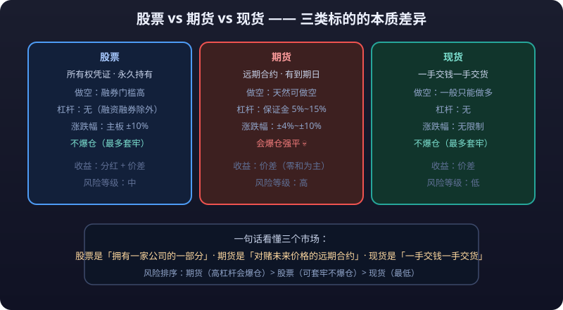

# 01 · 股票基础

> 股票是"公司所有权"的凭证——买股票就是当股东。本篇从零讲清：股票是什么、市场里都有谁、一家公司怎么上市、指数代表什么、分红送转怎么算，最后用一张表对比股票、期货、现货三者的本质差异。这是整个股票篇的地基。

---

## 股票是什么

### 从"集资"说起

公司想扩张，要么借钱（发债），要么出让一部分所有权换钱（发股票）。股票（Stock / Share）就是公司所有权的凭证：**你持有多少股，就拥有这家公司多少比例的所有权**（按总股本折算）。

| 概念 | 说明 |
|---|---|
| 股票 | 公司所有权的凭证，可自由买卖 |
| 股东 | 持有股票的人，是公司的所有者之一 |
| 股本 | 公司发行的股票总数 |
| 市值 | 股价 × 总股本，即市场给公司的"标价" |

### 股东的权利

| 权利 | 说明 |
|---|---|
| 分红权 | 公司盈利后可分红，按持股比例分配 |
| 投票权 | 参加股东大会，对公司重大事项（选董事、并购等）投票 |
| 剩余索取权 | 公司清算时，清偿债务后剩余资产按比例分配（排在债权人之后） |
| 优先认购权 | 增发新股时，老股东可优先按比例认购 |

### 股票的类型

| 类型 | 特点 |
|---|---|
| 普通股 | 有投票权、有分红权，A 股散户持有的基本都是普通股 |
| 优先股 | 分红与清算顺序优先于普通股，但一般无投票权 |
| A 股 / B 股 | 人民币计价普通股 / 外币计价普通股（已边缘化） |
| H 股 / 红筹 | 在港上市的内地注册公司 / 在港上市的境外注册中资公司 |

> 股票赚的钱只有两个来源：**企业盈利的分红 + 股价上涨的价差**。除此之外，任何"保本高收益"的承诺都不属于股票。

::: tip 📈 股票收益两个来源：分红 + 价差
**股票赚的钱只有两个来源：企业盈利的分红 + 股价上涨的价差**。除此之外，任何"保本高收益"的承诺都不属于股票——多出来的那部分，通常是骗局。
:::

---

## 股票市场参与者

| 参与者 | 角色 | 特点 |
|---|---|---|
| 散户 | 个人投资者 | 数量最多、资金占比小、信息与工具劣势明显 |
| 机构投资者 | 公募基金、私募、保险、社保、QFII 等 | 资金量大、研究能力强、有严格风控，是市场定价主力 |
| 做市商 | 为股票提供双边报价的券商 | 赚取买卖价差，提供流动性，常见于科创板与美股 |
| 游资 | 短线资金群体 | 追逐题材与涨停板，制造短期波动 |
| 上市公司 | 股票的发行方 | 通过融资发展，受信息披露义务约束 |
| 交易所 | 组织交易的场所 | 沪深北港美等，制定交易规则 |
| 监管机构 | 证监会、交易所自律监管 | 管发行、管披露、管违规、管退市 |

---

## 发行流程（IPO）与一二级市场

### 一级市场与二级市场

| 市场 | 定义 | 参与者 |
|---|---|---|
| 一级市场 | 新股发行市场，公司直接向投资者卖股票 | 发行人与申购者 |
| 二级市场 | 股票流通市场，股东之间互相买卖 | 全体投资者（交易所） |

**打新（申购新股）赚的是"一级市场发行价 → 二级市场上市价"的差价**；注册制下新股可能破发，这个差价不再稳赚。

### IPO 全流程（以 A 股为例）

```text
① 改制辅导 → ② 申报受理 → ③ 审核问询 → ④ 注册/核准 → ⑤ 发行定价 → ⑥ 申购配售 → ⑦ 挂牌上市
```

| 步骤 | 说明 |
|---|---|
| 改制辅导 | 公司股改，聘请券商、会计师、律师 |
| 申报受理 | 向交易所报送招股书等材料 |
| 审核问询 | 交易所多轮问询，披露硬伤与疑点 |
| 注册 | 证监会注册生效（全面注册制后主板也走此流程） |
| 发行定价 | 询价/定价，机构为主 |
| 申购配售 | 网上打新（散户）+ 网下配售（机构） |
| 挂牌上市 | 上市首日起可交易 |

### 上市门槛（沪深北）

| 板块 | 定位 | 大致财务门槛（简化） |
|---|---|---|
| 沪市主板 | 大盘蓝筹、成熟企业 | 连续盈利，最近三年累计净利润 1.5 亿+ |
| 深市主板 | 大盘蓝筹 | 同上（2021 年与中小板合并） |
| 创业板 | 成长型创新企业 | 两套标准：盈利 or 营收+研发 |
| 科创板 | 硬科技企业 | 允许未盈利、特殊股权结构（同股不同权） |
| 北交所 | 创新型中小企业 | 门槛最低，多数从新三板精选层平移 |

> 以上为教学口径，具体以交易所最新上市规则为准。

---

## 股票指数

### 指数是什么

指数 = 按规则选出的一篮子股票的价格加权值，用来代表"某类股票整体涨跌"。**指数不包含"买卖成本"，只反映行情。**

### A 股主要指数

| 指数 | 代码 | 成分股 | 代表什么 |
|---|---|---|---|
| 上证指数 | 000001 | 沪市全部股票 | 沪市大盘，老股民口中的"大盘" |
| 深证成指 | 399001 | 深市 500 只样本 | 深市整体 |
| 沪深300 | 000300 | 沪深两市市值与流动性前 300 的大盘股 | A 股蓝筹，公募业绩基准 |
| 中证500 | 000905 | 剔除沪深300后市值靠前的 500 只 | 中盘股 |
| 中证1000 | 000852 | 剔除前 800 后的 1000 只 | 小盘股 |
| 创业板指 | 399006 | 创业板市值前 100 | 成长/创新风格 |
| 科创50 | 000688 | 科创板市值前 50 | 硬科技风格 |

### 港股与美股主要指数

| 指数 | 成分 | 代表什么 |
|---|---|---|
| 恒生指数（HSI） | 港交所约 80 只大盘蓝筹（汇丰、腾讯、阿里等） | 港股市场风向标 |
| 恒生科技指数 | 港股 30 只科技龙头 | 港股科技风格 |
| 标普500（S&P 500） | 美股 500 家大公司 | 美股整体、全球资产配置基准 |
| 纳斯达克综合指数 | 纳斯达克全部上市股票 | 科技股浓度极高 |
| 纳斯达克100 | 纳斯达克市值前 100（剔除金融） | 苹果、微软、英伟达等科技巨头 |
| 道琼斯工业指数 | 30 只蓝筹 | 历史最悠久，参考价值有限 |

### 指数的使用与局限

- **指数涨 ≠ 所有股票涨**：沪深300 涨时，可能有 3000 只小票在跌。
- 看"结构性行情"要同时看上证、创业板指、中证1000 的分化。
- 指数基金（ETF）是普通人参与股票市场**成本最低、最省心**的方式之一。

---

## 分红送转

### 四种方式

| 方式 | 本质 | 钱从哪来 |
|---|---|---|
| 现金分红 | 公司把利润直接分现金 | 未分配利润 |
| 送股 | 用未分配利润转成股本送给你 | 未分配利润 |
| 转增 | 用资本公积转成股本送给你 | 资本公积（账上"别的钱"） |
| 配股 | 按比例打折卖新股给老股东 | 老股东掏钱 |

> **分红不是白送**：分红后股价要"除权除息"自动下修，你的总资产（持股+现金）在除息日当天不变。很多人以为"分红=赚钱"，其实红利收益来自公司持续盈利，而不是除息那一天。

::: warning 💰 分红不是白送，除息日总资产不变
**分红不是白送：分红后股价要"除权除息"自动下修，你的总资产（持股+现金）在除息日当天不变。** 很多人以为"分红=赚钱"，其实红利收益来自公司持续盈利，而不是除息那一天。
:::

### 除权除息

| 关键日 | 含义 |
|---|---|
| 股权登记日 | 当天收盘仍持有者，才享有本次分红 |
| 除权除息日 | 股价自动下修的日子，多数在登记日次日 |
| 除息价 | 前收盘价 − 每股现金红利 |
| 除权价 | 前收盘价 ÷（1 + 送转比例） |
| 除权除息价 | （前收盘价 − 现金红利）÷（1 + 送转比例） |

例：股价 10 元，每 10 股派 2 元 + 送 3 股转 2 股（合计送转 5 股）：

```text
除权除息价 = (10 − 0.2) ÷ (1 + 0.5) ≈ 6.53 元
```

### 分红税（持股期限差别化）

| 持股期限 | 税率 |
|---|---|
| ≤ 1 个月 | 20% |
| 1 个月 ~ 1 年 | 10% |
| > 1 年 | 免税 |

> 注意：2023 年 6 月起，**转增股本也纳入"视同分红"计税范围**（此前资本公积转增可暂免），送股、转增均按面值计征，实际规则以税务机关最新口径为准。**短线炒作者吃分红，税可能比红利还多。**

### 填权与贴权

- **填权**：除息后股价涨回去——你的红利+价差双收，说明市场认可公司价值。
- **贴权**：除息后股价继续跌——你的"分红"只是账面数字，实际总资产在缩水。

---

## 股票代码规则

### A 股代码前缀

| 前缀 | 板块 | 举例 |
|---|---|---|
| 600 / 601 / 603 / 605 | 沪市主板 | 贵州茅台 600519 |
| 688 / 689 | 科创板（689 为存托凭证 CDR） | 中芯国际 688981 |
| 000 / 001 / 002 | 深市主板（002 原中小板，已合并） | 平安银行 000001 |
| 300 / 301 | 创业板 | 宁德时代 300750 |
| 830~839 / 870~879 / 920 | 北交所 | 贝特瑞 835185 |
| 900 开头 | 沪市 B 股 | — |
| 200 开头 | 深市 B 股 | — |

### 港股与美股

| 市场 | 规则 | 举例 |
|---|---|---|
| 港股 | 5 位数字，4 位+英文为新上市临时代码 | 腾讯控股 00700 |
| 美股 | 英文字母 ticker，无统一规则 | AAPL、TSLA、BABA（ADR） |

---

## 股票 vs 期货 vs 现货 对比表



| 维度 | 股票 | 期货 | 现货 |
|---|---|---|---|
| 标的物 | 公司股权 | 标准化合约（商品/指数/利率） | 实物商品/加密货币 |
| 本质 | 所有权凭证 | 远期合约，双向对赌 | 一手交钱一手交货 |
| 做空 | 融券（门槛高，A 股难） | 天然可以做空 | 一般只能做多（加密可合约做空） |
| **<mark>杠杆</mark>** | 无（融资融券除外） | **<mark>保证金</mark>** 5%~15%，天然高杠杆 | 无 |
| 期限 | 无到期日，可永久持有 | 有到期日，需移仓/交割 | 无到期日 |
| 涨跌幅 | 有（主板±10%等） | 各品种不同（±4%~±10%为主） | 无 |
| **<mark>爆仓</mark>** | 不爆仓（最多套牢） | 会爆仓**<mark>强平</mark>** | 不爆仓 |
| 收益来源 | 分红 + 价差 | 价差（零和博弈为主） | 价差 |
| 门槛 | 100 股一手，几百元起 | 一手保证金数千元起 | 最低 |
| 风险等级 | 中 | 高 | 低 |

---

## ⚠️ 风险提示

::: warning ⚠️ 风险提示
股票没有"保本"承诺，价格波动是常态，个股可能因基本面恶化、财务造假、退市而长期阴跌甚至**<mark>归零</mark>**；追高买入热门股、全仓押注单一股票是散户亏损的最常见原因。本篇文章仅为知识科普，不构成任何投资建议。**任何投资决策前，请先评估自身风险承受能力，并学习第四篇「股票分析方法」后再动手。**
:::
