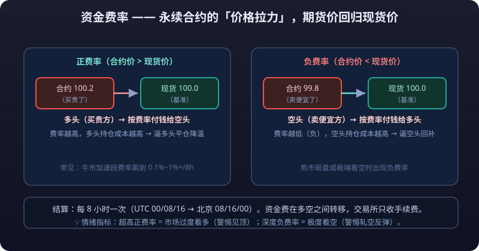

# 02 · 资金费率

> 永续合约没有交割日，价格凭什么贴着现货走？答案就是**<mark>资金费率</mark>**（Funding Rate）。
> 它是多头和空头之间定期结算的「过路费」，也是散户最容易忽视、长期主义者最该盯紧的一项成本。

> ⚠️ **风险提示：资金费率是双刃剑。**
> 它负责把合约价格「锚」回现货，但极端行情下资金费率可能高得离谱——在牛市末期，只持有仓位、什么都不做，持仓成本也能以日计费地吞噬本金。
> 以下规则以币安、OKX 等主流交易所最新规定为准。

---

## 什么是资金费率



永续合约没有「到期日」，也就没有「到期价格收敛」的机制。为了让合约价格长期贴着现货价格走，交易所设计了资金费率：

- **资金费率是一个定期结算的款项**，由多头和空头之间互相支付；
- 它的方向由「合约价格 vs 现货价格」的偏差决定：
  - 合约价格 > 现货价格 → 多头付钱给空头（把多头买贵的热度浇下去）；
  - 合约价格 < 现货价格 → 空头付钱给多头（把空头卖便宜的势头托起来）；
- 资金费**不归交易所所有**，只是在多空双方之间转移，交易所只做结算。

一句话：**资金费率 = 让永续合约价格长期贴近现货价格的「价格拉力」。**

| 概念 | 说明 |
|---|---|
| 利率部分 | 基础利息（各交易所常数，通常约 0.01%/8h） |
| 溢价部分 | 由合约价格与现货指数价格的偏离程度决定 |
| 资金费率 = 利率部分 + 溢价部分 | 合起来就是一次结算的费率 |

> 简化理解：**谁推动了价格偏离现货，谁就要付钱给对方**。价格偏离越大，费率越高，付钱越多——直到有人受不了退出，价格回归。

---

## 8 小时结算与结算时间

主流交易所（币安、OKX、Bybit 等）普遍采用**每 8 小时结算一次**资金费：

| 时区 | 结算时间 |
|---|---|
| UTC | 00:00 / 08:00 / 16:00 |
| 北京时间（UTC+8） | **08:00 / 16:00 / 00:00（次日凌晨）** |

- 每次结算时，按**当时的持仓名义价值 × 资金费率**收付；
- 只有**在结算时刻仍持有仓位**的人才会收/付资金费；结算前平仓则无需支付；
- 部分交易所/币种有资金费率上下限（默认常见上限约 ±0.75%，个别币种在极端行情下由交易所临时调高上限），具体以交易所最新公告为准。

```text
示例：持仓 1 BTC 永续，资金费率 0.01%，持仓名义价值 60,000 USDT
单次资金费 = 60,000 × 0.01% = 6 USDT
一天 3 次结算 = 18 USDT/天（若方向是付费方）
```

> 8 小时一次的结算频率，意味着**一年要结算 1,095 次**。0.01% 的单次费率看着不起眼，累积起来是长期持仓不可忽视的成本或收益。

---

## 正费率与负费率

| 费率符号 | 谁付给谁 | 通常伴随的市场状态 |
|---|---|---|
| **正费率（+）** | 多头 → 空头 | 合约价格 > 现货价格，市场看多情绪浓，多头拥挤 |
| **负费率（−）** | 空头 → 多头 | 合约价格 < 现货价格，市场看空情绪浓，空头拥挤 |
| 0 | 无收付 | 合约价格与现货基本一致 |

- **资金费率为正** = 市场上做多的人过多、合约比现货贵，交易所通过让多头付费来「降温」；
- **资金费率为负** = 做空的人过多、合约比现货便宜，空头付钱给多头；
- 注意：**做多不意味着你总是付钱方**。在下跌行情里合约往往贴水现货，此时做多反而能收到资金费；反之在火热行情里做空能收到高额资金费。

---

## 资金费率常见区间

| 区间（每 8 小时） | 状态 | 含义 |
|---|---|---|
| ±0.01% ~ ±0.03% | 正常 | 价格偏离很小，多空力量均衡，市场健康 |
| ±0.03% ~ ±0.10% | 偏热 | 单方向情绪明显，持仓成本开始显眼 |
| ±0.10% 以上 | 过热 | 单方向极端拥挤，随时可能出现反转 |

换算成年化概念帮助理解：

```text
0.01%/8h × 3 次/天 × 365 天 ≈ 年化 10.95%（单向付费）
0.05%/8h × 3 次/天 × 365 天 ≈ 年化 54.75%
```

- 所以即使是「正常」的 ±0.01%，一年下来单向支付的资金费也超过年化 10%——**对于期货贴水/升水长期持有多头的人来说，这是真实存在的成本**。

---

## 极端行情下的资金费

牛市末期和逼空行情中，资金费率会大幅偏离正常区间：

| 场景 | 资金费率表现 | 后果 |
|---|---|---|
| 牛市末期 | BTC 资金费率长期 > 0.1%/8h，部分币种甚至出现 **0.5%~1%+** 的单次费率 | **<mark>杠杆</mark>**多头每天被「割」资金费，现货与合约价差拉大 |
| 逼空行情（轧空） | 空头被挤，费率短期冲上 0.1%+ | 追空者一边亏损一边付资金费 |
| 2021 年牛市期间 | BTC 永续资金费曾持续高于 0.1%，个别时间点超过 1% | 持有永续多头的人年化资金费成本远超 100% |

```text
极端例子：资金费率 1%/8h 时，持有仓位 8 小时就要付出名义价值的 1%
一天 3 次 = 3%/天，一周 ≈ 21%
```

- **1% 的单次资金费意味着什么**：你的仓位只要放 3 天，光资金费就可能吃掉全部本金的一半以上；
- 极端资金费率往往是**情绪顶点的信号**：散户一边倒做多、合约升水现货离谱时，距离价格反转往往不远；
- 交易所会在极端行情下临时调整资金费上限（如从 0.75% 上调到 1.5% 甚至更高），以加速价格回归。

> ⚠️ **风险提示：不要在费率过热时无脑追多。**
> 牛市末期最常见的收割剧本：合约升水 → 费率飙到 0.1%+ → 新手追高买入永续 → 价格小幅回调 + 持续收取高额资金费 → 追高者两头挨打。
> **高费率 + 高价格 = 高情绪 = 高风险**，看到 0.1%+ 的费率请先想清楚自己是渔夫还是鱼。

---

## 资金费率**套利**

资金费率的本质是「合约价格偏离现货的补偿」，所以它天然催生了一个策略：**现货 + 永续对冲**，赚取资金费（也叫「资金费率套利 / **基差**套利」）。

### 原理

```text
当资金费率为正（多头付空头）时：
① 现货市场买入 1 BTC（持有现货，享受币价涨跌）
② 永续合约做空 1 BTC（方向完全相反）
→ 币价无论涨跌，两边的盈亏互相抵消（delta 中性）
→ 每 8 小时仍能收到空头仓位的资金费（正费率 = 多付空，做空方收钱）
```

### 收益与成本

| 项目 | 说明 |
|---|---|
| 收益 | 每次结算的资金费（约名义价值的 0.01%~0.05%） |
| 成本 | 现货买入成本、合约手续费、资金占用（现货需要全额资金） |
| 年化估算 | 0.01%/8h 约年化 10%；0.05%/8h 约年化 54%（未计手续费） |
| 常见载体 | 交易所现货 + 该所永续合约（同一币种） |

### 风险点

| 风险 | 说明 |
|---|---|
| 费率转负 | 市场转向后资金费变负，套利方向反着亏 |
| 价差波动 | 合约与现货价差短期扩大时，账面上可能浮亏（需要耐心等收敛） |
| **<mark>强平</mark>**风险 | 合约仓位被强制平仓后，只剩现货裸多/裸空，风险放大 |
| 资金占用 | 现货需要全额资金，收益率被资金效率稀释 |
| 平台风险 | 交易所限制套利账户、费率规则变更、出入金延迟 |
| 极端行情 | 插针导致合约强平、现货流动性枯竭，对冲失效 |

> ⚠️ **风险提示：资金费率套利不是无风险收益。**
> 它赚的是「情绪的钱」，本质是**把散户的 FOMO 情绪变现**。
> 但极端行情下，现货与合约同时剧烈波动、强平与流动性枯竭同时发生，所谓的「无风险套利」也可能变成「双向**<mark>爆仓</mark>**」。小资金、大杠杆、满仓梭哈式套利尤其危险。

---

## 如何查看与利用资金费率

### 在哪里看

| 渠道 | 位置 |
|---|---|
| 币安 | 合约交易页面 → 右上角「资金费率」/合约信息栏 |
| OKX | 合约交易页面 → 交易参数 → 资金费率 |
| 第三方网站 | Coinglass、Laevitas 等（可看历史费率与多空比） |
| 行情软件 | 多数加密行情 App 合约详情页有资金费率实时值 |

### 怎么用：判断市场情绪

| 费率状态 | 情绪解读 | 参考含义 |
|---|---|---|
| 持续高位（0.05%+） | 散户做多过热，多头拥挤 | 追多危险，警惕回调 |
| 极端高位（0.1%+） | 情绪顶点，FOMO 顶点 | 历史上常对应阶段顶 |
| 持续低位/负值 | 空头拥挤，合约贴水 | 做空拥挤，警惕反弹/逼空 |
| 正常区间（±0.01%~0.03%） | 多空均衡 | 情绪中性 |

### 实战要点

- **结合多空持仓比看**：资金费率 + 多头持仓比双高，过热信号更可靠；
- **结合价格位置看**：高位横盘 + 高费率 = 顶部特征；暴跌后费率转负 = 底部特征之一；
- **费率转向比费率高低更重要**：从 +0.1% 快速回落，往往意味着多头在撤退；
- **结算前博弈**：部分短线玩家会在结算前 5 分钟平仓规避/突击资金费，导致结算时刻价格短暂波动。

::: warning ⚠️ 风险提示
资金费率只是辅助指标，不是交易信号。**
高费率可以持续数周（牛市里「贵了可以更贵」），低费率也不代表马上反转。
把它当作「情绪温度计」而不是「反转信号灯」，永远用**<mark>止损</mark>**保护自己。
:::


---

## 总结

| 要点 | 一句话 |
|---|---|
| 资金费率是什么 | 多空之间定期结算的款项，锚定永续价格 |
| 结算频率 | 主流交易所每 8 小时一次（UTC 0/8/16 点） |
| 正费率 | 多头付空头，合约升水、多头拥挤 |
| 负费率 | 空头付多头，合约贴水、空头拥挤 |
| 常见区间 | ±0.01%~0.03% |
| 极端情况 | 牛市末期 0.1%+ 甚至 1%，是情绪过热的标志 |
| 套利玩法 | 现货 + 合约对冲吃正费率，但有费率反转与强平风险 |
| 情绪用法 | 持续高费率 = 散户做多过热，追多需谨慎 |

> 下一篇 [03-加密衍生品.md](03-加密衍生品.md) 将带你认识期权、杠杆代币、双币投资等进阶品种——其中很多产品的定价逻辑，都建立在资金费率与波动率之上。

::: danger 💀 高费率 + 高价格 = 高情绪 = 高风险
**高费率 + 高价格 = 高情绪 = 高风险，看到 0.1%+ 的费率请先想清楚自己是渔夫还是鱼。** 牛市末期最常见的收割剧本：合约升水 → 费率飙到 0.1%+ → 新手追高买入永续 → 价格小幅回调 + 持续收取高额资金费 → 追高者两头挨打。
:::
