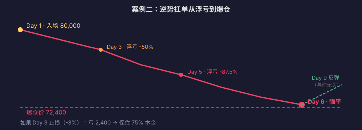

# 合约爆仓案例复盘

> 理论讲再多，不如看一次真实的爆仓过程。本篇用三个虚构但高度典型的案例，还原从「自信开仓」到「账户归零」的完整时间线。每个案例都标注了**本可以止损的关键节点**。
>
> **免责声明**：本站全部内容仅用于学习与研究，不构成任何投资建议。市场有风险，投资需谨慎。以下案例为教学虚构，数字仅为说明计算过程。

---

## 案例一：20 倍杠杆追多被插针

### 背景

小李看到 BTC 从 95,000 快速拉升至 100,000，判断「突破确认，要上 110,000」。他决定用 20 倍杠杆做多。

### 时间线

```text
14:00  BTC 价格 100,000
       小李以 5,000 USDT 保证金开 100,000 USDT 多头仓位（20x）
       爆仓价 ≈ 95,250（距离 −4.75%）
       未设止损：「我有信心，不需要止损」

14:15  BTC 涨到 101,200（+1.2%）
       浮盈 = 12,000 USDT（保证金的 +240%）
       小李：「看吧，我说会涨」→ 加仓 50%

15:30  BTC 开始回落到 99,500
       浮盈缩水到 +7,500 → 小李不以为意

16:00  一笔大额卖单砸穿支撑位
       BTC 在 3 分钟内从 99,500 跌到 94,800（−4.7%）

16:01  触发强平
       加仓后的总仓位 150,000 USDT / 保证金 7,500
       强平价 ≈ 96,000（加仓后更近了）
       全部保证金归零：−7,500 USDT
```

### 关键节点分析

| 时间 | 发生了什么 | 本可以怎么做 |
|---|---|---|
| 14:00 | 开仓时未设止损 | 设止损在 97,000（−3%），最多亏 3,000 |
| 14:15 | 浮盈 +240% 时加仓 | 应该部分止盈锁定利润，而不是加仓 |
| 15:30 | 回落时未警觉 | 浮盈从 12,000 缩到 7,500 已经是明确信号 |

::: danger ⚠️ 教训
1. **追涨开仓的入场价天然偏高**——你的爆仓价离市价很近
2. **浮盈不是你的钱**——没平仓之前都是纸面数字
3. **加仓让爆仓价更近**——仓位越大，容错空间越小
4. **没有止损 = 把命运交给市场**
:::

---

## 案例二：逆势扛单不设止损

### 背景

老王认为 BTC「已经跌得够多了」，在 80,000 开了 10 倍杠杆的多头仓位。

### 时间线

```text
Day 1   BTC 80,000 → 老王开多，保证金 8,000，仓位 80,000
        爆仓价 ≈ 72,400

Day 3   BTC 跌到 76,000（−5%）
        浮亏 = 4,000（保证金的 −50%）
        老王：「洗盘而已，扛住」

Day 5   BTC 跌到 73,000（−8.75%）
        浮亏 = 7,000（−87.5%）
        老王：「马上就要反弹了」（开始焦虑但不愿认输）

Day 6   BTC 跌到 72,300
        接近爆仓价 72,400
        老王考虑追加保证金 → 但已经没有多余资金

Day 6 下午 BTC 触及 72,350
        强平触发 → 保证金归零：−8,000 USDT

Day 9   BTC 反弹到 78,000
        如果老王没有爆仓，此时只亏 2,000（−25%）
        但他已经出局了
```

### 关键节点分析

| 时间 | 发生了什么 | 本可以怎么做 |
|---|---|---|
| Day 1 | 开仓时未设止损 | 止损设在 77,600（−3%），最多亏 2,400 |
| Day 3 | 浮亏 50% 时仍不行动 | 至少减半仓位或追加止损线 |
| Day 5 | 浮亏 87.5%，接近爆仓 | 此时平仓还能保住 1,000（12.5%） |



::: danger ⚠️ 教训
1. **「扛住」不是策略，是情绪**——市场不在乎你的成本价
2. **逆势交易的止损必须更紧**——因为你是在对抗趋势
3. **爆仓后反弹与你无关**——你已经被迫出局，没有筹码了
4. **「马上反弹」是最危险的四个字**
:::

---

## 案例三：资金费率拖垮长期持仓

### 背景

小张看好 ETH 长期走势，用 5 倍杠杆做多并计划持有一个月。他忽略了资金费率的累积效应。

### 时间线

```text
Day 0   ETH 价格 3,000，小张开多
        保证金 6,000，仓位 30,000（5x）
        资金费率：每 8 小时 0.05%（多头付给空头）

Day 0-30  ETH 价格横盘在 2,900–3,100 区间
          小张认为「没亏就行」

每日资金费率成本：
  30,000 × 0.05% × 3 次/天 = 45 USDT/天
  30 天累计 = 1,350 USDT

Day 30  ETH 收盘 3,050（+1.67%）
        价差盈利 = 30,000 × 1.67% = 500 USDT
        资金费率支出 = −1,350 USDT
        净盈亏 = 500 - 1,350 = **−850 USDT**

        ETH 涨了，但小张亏了 850 USDT（保证金的 −14.2%）
```

### 成本拆解

| 项目 | 金额 | 占保证金比 |
|---|---|---|
| 价差收益 | +500 | +8.3% |
| 开平仓手续费（Taker） | −30 | −0.5% |
| 资金费率（30 天） | **−1,350** | **−22.5%** |
| **净盈亏** | **−850** | **−14.2%** |

::: warning ⚠️ 教训
1. **方向对了也可能亏钱**——持仓成本可以吃掉全部利润
2. **正资金费率时期做多 = 你在给空头打工**
3. **长期持仓应优先考虑现货而非高费率合约**
4. **开仓前先算清楚：预期涨幅能否覆盖总持仓成本？**
:::

---

## 三个案例的共同点

| 共同错误 | 案例 | 后果 |
|---|---|---|
| 没有止损 | 一、二、三 | 无法控制最大亏损 |
| 入场前未计算爆仓价 | 一、二 | 不知道自己会在哪里出局 |
| 忽视持仓成本 | 三 | 方向对了仍然亏损 |
| 情绪驱动决策 | 一、二 | 追涨、扛单、拒绝认错 |
| 仓位过重 | 一、二 | 容错空间太小 |

---

## 自检清单：下单前过一遍

- [ ] 我的爆仓价在哪里？距离入场价多远？
- [ ] 我设止损了吗？止损价和爆仓价之间有多少缓冲？
- [ ] 这笔交易的总持仓成本是多少？（手续费 + 资金费率 × 预期持有天数）
- [ ] 如果我错了，我最多亏多少？这个金额我能接受吗？
- [ ] 我是在执行交易计划，还是在追逐行情？

::: warning ⚠️ 风险提示
以上案例为教学虚构，任何与真实事件的相似均为巧合。合约交易可能导致全部本金损失甚至倒欠交易所。请充分理解风险后再参与。
:::
