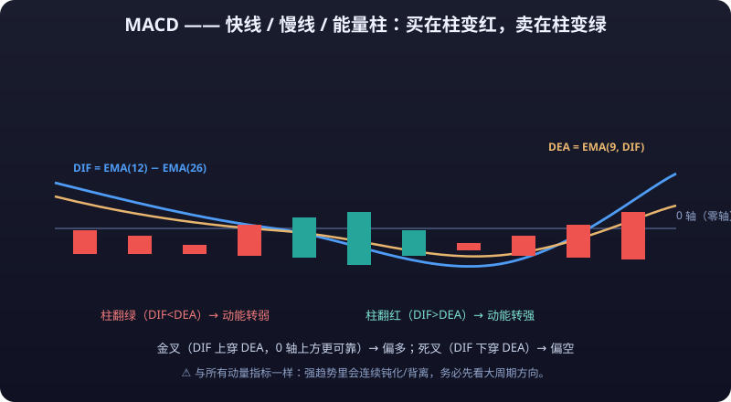
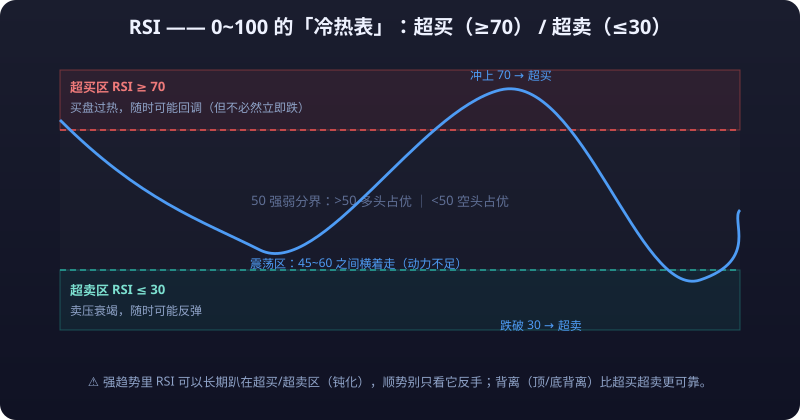

# 02 · 技术指标详解

> 技术指标是对「价格 + 成交量」的二次加工：均线是价格的平均数，MACD 是均线的差，KDJ 是区间位置的百分比……**理解每个指标「原料是什么、加工了几步」，比背公式重要得多**——这决定了你能否看穿指标在什么行情下会失真。
>
> 一句话总纲：**所有指标都是滞后的**。指标只在「描述历史」时 100% 准确，在「预测未来」时没有任何保障。

---

## 1. 趋势类指标

### 1.1 MA 移动平均线（Moving Average）

**计算公式**：

```
MA(n) = (C₁ + C₂ + ... + Cₙ) / n     （C = 收盘价）
```

**默认参数**：5 / 10 / 20 / 60 / 120 / 250 日均线（软件默认常为 5/10/20/60）。周期越长越平缓、越滞后。

**核心用法**：

| 用法 | 说明 |
|---|---|
| 金叉/死叉 | 短期均线上穿长期均线 = 金叉（看涨）；下穿 = 死叉（看跌） |
| 多头/空头排列 | 短 > 中 > 长（如 5>10>20>60）= 多头排列，趋势向上；反之空头排列 |
| 支撑/压力 | 上涨趋势中价格回踩 MA 不破 = 支撑；下跌趋势中反弹触 MA 受压 = 压力 |
| 价格与均线乖离 | 价格离均线过远 = 乖离率过大，短期有回归需求（配合 BOLL 外轨理解） |

**常见误区**：
- 均线金叉死叉在**震荡市里反复被打脸**（一金叉就跌、一死叉就涨），因为震荡市本来就没有趋势可跟。
- 均线是「跟势工具」不是「抄底工具」：空头排列的股票每次反弹到均线附近都是离场点，而不是买点。
- 短周期均线（如 5/10）在高波动品种上金叉死叉极频繁，信号噪音巨大，需放大周期使用。

### 1.2 EMA 指数移动平均线（Exponential Moving Average）

**计算公式**：

```
EMA(n) = EMA(前一日) + α × (今日收盘 − EMA(前一日))
α = 2 / (n + 1)
```

即：今天 EMA = 昨天 EMA + 2/(n+1) × 今日价差。给最近的价格更高权重。

**默认参数**：12 / 26 / 50（加密市场常看 EMA 20/50/200）。

**与 MA 的区别**：

| 对比项 | MA | EMA |
|---|---|---|
| 权重 | 所有价格等权 | 近期价格权重更大 |
| 反应速度 | 慢 | 快 |
| 滞后性 | 更强 | 较弱 |
| 噪音 | 少一些 | 多一些 |
| 适用 | 大级别慢趋势 | 中短线、对拐点敏感的品种（如加密） |

**核心用法**：
- EMA 金叉死叉用法同 MA，但信号略早；
- EMA20 常作为短线趋势生命线，EMA50/200 作为牛熊分界（价格站上 EMA200 = 长期多头趋势）。

**常见误区**：
- 以为 EMA「更快」就等于「更准」：速度换来的是更多假信号，快与准不可兼得。
- EMA 200 在 A 股/加密中被大量交易者共同关注，具有「自我实现」效应——但自我实现也会失效（趋势转换初期所有人一起割肉，形成超跌）。

### 1.3 BOLL 布林带（Bollinger Bands）


**计算公式**：

```
中轨 MB = MA(20)
上轨 UP = MB + 2 × SD    （SD = 20 日收盘价标准差）
下轨 LO = MB − 2 × SD
```

**默认参数**：20 日，2 倍标准差（20/2）。

**核心用法**：

| 用法 | 说明 |
|---|---|
| 三轨含义 | 中轨 = 20 日均线（方向判断）；上下轨 = 统计意义上 95% 的价格波动区间 |
| 开口/收口 | 开口（带子变宽）= 波动加大、行情启动；收口（带子极窄）= 波动压缩、变盘临近（「布林线收口必变盘」） |
| 出轨回归 | 价格突破上轨 → 超买，通常回归中轨；跌破下轨 → 超卖，通常回归中轨 |
| 中轨支撑 | 趋势中价格沿中轨运行，回踩中轨不破 = 趋势健康 |

**常见误区**：
- **「触碰上下轨 = 卖出/买入」是最大误区**：强势趋势中价格会贴着上轨/下轨持续运行（单边逼空行情），做反向单会被反复打脸。上下轨是「统计边界」不是「交易信号」。
- 收口后「必变盘」但**不知道往哪变**，需要其他信号定方向。
- 布林带在低波动品种上常年收口，参考价值下降。

---

## 2. 动量类指标

> 动量指标的本质：把「涨跌速度」量化。它们回答的不是「价格在哪」，而是「涨/跌还有没有劲」。

### 2.1 MACD 指数平滑异同移动平均线



**计算公式**：

```
DIF = EMA(12) − EMA(26)
DEA = EMA(9, DIF)
MACD 柱 = 2 × (DIF − DEA)
```

**默认参数**：12 / 26 / 9。

**核心用法**：

| 用法 | 说明 |
|---|---|
| 金叉/死叉 | DIF 上穿 DEA = 金叉（看涨）；下穿 = 死叉（看跌）。0 轴上方金叉最可靠（多头市场），0 轴下方死叉最危险（空头市场） |
| 0 轴 | DIF 在 0 轴上方 = 中期多头；下方 = 中期空头 |
| 柱状图 | 柱子缩短 = 动能衰减（趋势可能接近尾声）；红柱变绿柱 = 多空易手 |
| 顶背离 | 价格创新高，但 DIF 高点比前一次低 = 顶背离（上涨动能衰竭，看跌，见下图） |
| 底背离 | 价格创新低，但 DIF 低点比前一次高 = 底背离（下跌动能衰竭，看涨） |

```
顶背离示意：
  价格        ↗ ↗
        ╱╲ ╱╲          ← 价格创新高
DIF     ╱  ╲╱
      ╱        ← DIF 高点降低（没跟上）→ 顶背离
```

**常见误区**：
- **背离可以持续很久**（「背离了还能再背离」），在强趋势中背离信号经常被直接碾过去，不能当绝对的反转依据。
- 金叉死叉在震荡市频繁出现，信号噪音大——MACD 适合趋势行情，不适合横盘。
- 只看柱状图不看 DIF/DEA 位置，会错过 0 轴上下的关键背景信息。

### 2.2 KDJ 随机指标

**计算公式**：

```
RSV = (C − L₉) / (H₉ − L₉) × 100        （9 日内的相对位置）
K = K(前一日) × 2/3 + RSV × 1/3
D = D(前一日) × 2/3 + K × 1/3
J = 3K − 2D
```

**默认参数**：9 / 3 / 3（RSV 周期 9，K、D 平滑 3）。

**核心用法**：

| 用法 | 说明 |
|---|---|
| 超买/超卖 | K、D 值 > 80 超买；< 20 超卖 |
| 金叉/死叉 | K 上穿 D = 金叉（看涨），低位（<20 区）金叉更可靠；K 下穿 D = 死叉（看跌），高位（>80）死叉更可靠 |
| J 值 | J > 100 极度超买，J < 0 极度超卖；J 值钝化时参考 K/D |
| 背离 | K/D 顶背离看跌、底背离看涨 |

**常见误区**：
- **钝化**：强趋势中 KDJ 会在超买/超卖区长时间钝化（K/D 贴在 80 以上或 20 以下不动），此时按「超买就卖、超卖就买」操作会被趋势反复收割。
- KDJ 对短期价格极度敏感，日内信号噪音最大，适合短线，不适合判断中长期方向。
- 低位金叉不是底部的充分条件——阴跌中 KDJ 可以连续多次低位金叉后又死叉。

### 2.3 RSI 相对强弱指标



**计算公式**：

```
RS = n 日内平均涨幅 / n 日内平均跌幅
RSI = 100 − 100 / (1 + RS)
```

**默认参数**：14（常用 6 / 14 / 24 三根）。

**核心用法**：

| 用法 | 说明 |
|---|---|
| 超买/超卖 | RSI > 70 超买，< 30 超卖 |
| 50 分界 | RSI > 50 多方占优（强势），< 50 空方占优 |
| 背离 | 顶背离（价格新高 RSI 不新高）看跌；底背离看涨 |
| 区间参考 | RSI 长期在 40~60 间徘徊 = 震荡市，信号失效 |

**常见误区**：
- **钝化与 KDJ 同病**：单边行情里 RSI 长期 >70 或 <30，「超买超卖」信号完全失效（强势股 RSI 可以 90 以上持续一个月）。
- RSI 背离在趋势中经常「背了又背」，与 MACD 背离同理，需配合价格结构使用。
- 把 RSI 的 30/70 当绝对阈值是教条：波动率高的品种（如加密）常态区间远宽于 30~70。

### 2.4 CCI 顺势指标（Commodity Channel Index）

**计算公式**：

```
TP = (H + L + C) / 3
CCI = (TP − SMA(TP)) / (0.015 × MD)     （MD = TP 的平均绝对偏差）
```

**默认参数**：14。

**核心用法**：
- CCI > +100：进入强势区（超买，但强势可能延续）；CCI < −100：弱势区。
- 从 +100 上方回落跌破 +100 = 多头离场信号；从 −100 下方回升突破 −100 = 空头离场信号。
- CCI 数值无量纲、围绕 0 波动，没有固定上下限——比 RSI 更能表达「偏离均值」的极端程度。

**常见误区**：
- CCI > 100 不必然见顶：趋势行情中 CCI 可以长期 >200，逆向操作必死。
- CCI 参数（14）对价格噪音敏感，参数周期过短时信号杂乱。

### 2.5 WR 威廉指标（Williams %R）

**计算公式**：

```
WR = (Hₙ − C) / (Hₙ − Lₙ) × 100        （n 周期内收盘价的位置）
```

（与 KDJ 的 RSV 互为镜像：WR 高 = 收盘价靠近区间底部 = 超卖，取值 0 ~ −100 的软件写法同理。）

**默认参数**：14（常用 10 / 6 双线）。

**核心用法**：
- WR > −20（或 >80，看软件取正负）超买，WR < −80（或 <20）超卖。
- 两线金叉死叉同 KDJ 逻辑，但 WR 更敏感、波动更大。

**常见误区**：
- 敏感性带来的高噪音：WR 的超买超卖信号一天可以出现多次，直接照做 = 给手续费打工。
- 与 KDJ/RSI 一样存在钝化问题，单边行情中失效。

---

## 3. 量能类指标

### 3.1 OBV 能量潮（On Balance Volume）

**计算公式**：

```
今日收阳：OBV = OBV(前一日) + 今日成交量
今日收阴：OBV = OBV(前一日) − 今日成交量
今日平盘：OBV 不变
```

**默认参数**：无（累计值，从起始日起累加）。

**核心用法**：
- OBV 与价格趋势同步上行 = 量价配合，趋势健康。
- **OBV 顶背离**：价格创新高但 OBV 不创新高 = 上涨缺乏量能支撑，警惕见顶。
- OBV 底部率先走平/抬高而价格仍下跌 = 底部吸筹迹象（「量先于价」）。

**常见误区**：
- OBV 是累计值，量级受历史影响，只可看「形态与斜率」不可看绝对值大小。
- OBV 背离同样有「背离之后还能背离」的问题，须等价格结构确认。

### 3.2 VWAP 成交量加权平均价（Volume Weighted Average Price）

**计算公式**：

```
VWAP = Σ(成交价 × 成交量) / Σ(成交量)     （当日/当根周期累计）
```

**默认参数**：日内累计（每个交易日/结算周期重置），软件常默认显示当日 VWAP。

**核心用法**：
- 机构资金常用的「当日成本价」：价格在 VWAP 上方 = 当日买入者整体盈利（偏多），下方 = 亏损（偏空）。
- 日内交易者以 VWAP 为多空分界：回踩 VWAP 不破做多，跌破 VWAP 反手做空。
- 加密合约的「结算价」通常按某时段加权均价计算，与 VWAP 原理一致。

**常见误区**：
- VWAP 每日重置，只看一天没有参考价值；跨周期的 VWAP（周/月）需要单独设置，不要混用。
- VWAP 是「成本参考」不是「支撑/压力」，它本身不产生任何买卖点，只是描述统计。

---

## 4. 波动类指标

### 4.1 ATR 平均真实波幅（Average True Range）

**计算公式**：

```
TR = max(当日最高 − 当日最低, |当日最高 − 前日收盘|, |当日最低 − 前日收盘|)
ATR(n) = TR 的 n 日均值
```

**默认参数**：14。

**核心用法**：ATR 衡量的是「这个品种最近平均每天波动多少钱」，是**止损与仓位计算的基石**：

| 用法 | 公式 | 说明 |
|---|---|---|
| 波动止损 | 止损价 = 入场价 ∓ k × ATR（k 常取 2~3） | 止损距离随波动自适应，不被噪音扫掉，又不脱离保护 |
| 仓位计算 | 仓位 = 单笔可亏金额 / (k × ATR) | 把「亏多少钱」换算成「买多少量」 |
| 突破入场 | 收盘价突破 入场价 + k × ATR | 波动突破法（如海龟交易法） |
| 趋势状态 | ATR 走高 = 波动放大（趋势启动/剧烈）；ATR 走低 = 波动收敛（横盘/变盘前） |

**常见误区**：
- ATR 只是「波动尺子」，没有方向性——它不会告诉你涨还是跌，只告诉你「每一步迈多大」。
- ATR 止损是「波动自适应」不是「保证不亏」：极端行情中单根 K 线波幅可以远超 3×ATR（如插针行情），仓位管理才是最后防线。

---

## 5. 其他指标

### 5.1 SAR 抛物线指标（Stop And Reverse）

**计算公式**：

```
SAR(今日) = SAR(前一日) + AF × (EP − SAR(前一日))
AF：加速因子，初始 0.02，创新高/低时 +0.02，上限 0.2
EP：当前趋势的极值（最高/最低点）
```

**默认参数**：0.02 / 0.2。

**核心用法**：
- SAR 点状线在价格下方 = 多头趋势，价格下方有支撑点；SAR 在价格上方 = 空头趋势。
- 趋势跟踪工具：SAR 由下方翻到上方（或反之）= 反转信号，常被用作「移动止盈/跟踪止损」——价格一直涨，止损点一直跟着抬。
- 与均线类指标相比，SAR 更擅长「锁住利润」，而不是「抓拐点」。

**常见误区**：
- SAR 在横盘震荡时点状线会上下反复翻转，被反复打脸——震荡市禁用。
- SAR 只适合有明显趋势的品种与周期，参数 0.02 在低波动品种上止损过紧。

### 5.2 Ichimoku 一目均衡表（云图指标）

**计算公式**：

```
转换线 = (9 日最高 + 9 日最低) / 2
基准线 = (26 日最高 + 26 日最低) / 2
先行带A = (转换线 + 基准线) / 2        （前移 26 日绘制）
先行带B = (52 日最高 + 52 日最低) / 2   （前移 26 日绘制）
延迟线 = 今日收盘价后移 26 日绘制
```

**默认参数**：9 / 26 / 52。

**核心用法**：

| 组成 | 含义 |
|---|---|
| 云层（A/B 之间） | 支撑/压力区：价格在云上 = 多头市场，云下 = 空头市场，云内 = 震荡 |
| 云层厚度 | 厚云 = 强支撑/压力（不易穿越）；薄云 = 易穿越 |
| 转换线/基准线 | 类似 9 日与 26 日均线：短线上穿长线 = 看涨，缠绕 = 震荡 |
| 延迟线 | 与 26 日前价格比较：在其上方看涨，下方看跌 |

**常见误区**：
- 云图由 5 个组成部分构成，新手把「价格在云上」当唯一信号，忽略了云层厚度与延迟线验证——**单条件使用 = 随机信号**。
- 「价格穿越云层」信号滞后严重：在快速行情中云层经常追不上价格，信号发出时行情已走完大半。

---

## 6. 指标组合建议

### 6.1 怎么搭配

**基本原则：同一维度只留一个指标，不同维度互补验证。**

| 维度 | 推荐指标 | 组合示例 |
|---|---|---|
| 主图（价格区） | MA 或 EMA 一组（如 EMA 20/50/200）+ BOLL 中轨 | 判断趋势方向与趋势健康度 |
| 副图 1（动量） | MACD 或 RSI 二选一 | 判断动能强弱、找背离 |
| 副图 2（量能） | 成交量（OBV） | 验证突破与背离的真假 |

**推荐组合示例**：

```
主图：MA20 + MA60（趋势方向） + BOLL（波动区间）
副图：MACD（12/26/9，动量 + 背离）
副图：成交量 / OBV（量能确认）
```

**工作流程**：主图定方向 → MACD 定进场时机 → 成交量定信号真假 → ATR 定止损距离。

### 6.2 为什么指标越多越容易亏

1. **信号互相矛盾**：KDJ 超卖（该买）但 MACD 死叉（该卖）时，你永远在纠结——纠结本身就是亏损的开始。
2. **滞后叠加**：每个指标都滞后，10 个指标叠加 = 10 层滞后，你看到的「信号」已经是旧闻。
3. **噪音相乘**：每个指标都会产生假信号，指标越多，交集越少但矛盾越多，最终只能靠「感觉」决定——又回到了凭感觉交易。
4. **曲线拟合陷阱**：当你刻意挑选「恰好同时满足 5 个指标的入场点」，你其实在过拟合历史行情，这类条件在未来几乎不会重现。
5. **决策瘫痪**：指标多 = 决策慢 = 滑点大 = 犹豫中错过止损点。

**一个能长期执行的简单系统，远胜一个理论上完美的复杂系统。** 大多数稳定盈利的交易者只用一个主图指标 + 一个副图指标 + 成交量。

---

## 局限与误区（指标通病汇总）

1. **滞后性是不可消除的**：所有指标都基于历史价格计算，「今天」的指标信号反映的是「过去」的动能。金叉出现时，价格通常已经从底部涨了一段。
2. **指标在震荡市全面失效**：均线、MACD、KDJ、RSI 在横盘中会密集产生假信号，这是指标的天性（它们默认假设「趋势存在」）。
3. **背离不是反转按钮**：背离只说明「动能衰竭」，不保证「价格反转」——背离后价格可以继续新高/新低很长时间。
4. **参数没有魔法**：把 RSI 改成 7、9、21 不会让你获得优势，只是换一种滞后/灵敏度的组合；真正决定盈亏的是出场规则与仓位。
5. **自我实现的假象**：许多指标被广泛使用后，其信号会在短期内「自我实现」（大家都按金叉买），但一旦失效（趋势转换），伤害同样被放大。
6. **指标永远回答不了「为什么」**：MACD 金叉在财报暴雷的股票上毫无意义。**基本面与消息面构成的地雷，指标是测不出来的**——技术分析只处理价格，不处理价值。
