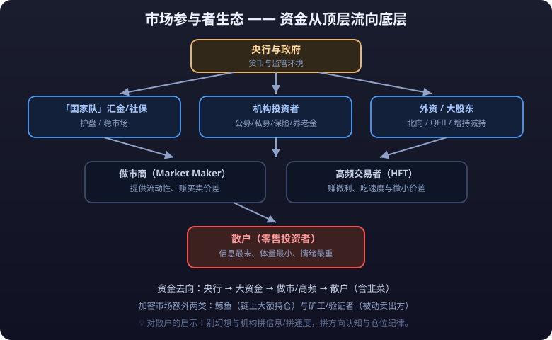

# 01 · 市场参与者全景

> 行情软件上跳动的价格，是成千上万个目的各异的参与者博弈的结果。同一时刻，有人因为恐惧在割肉，有人因为套保在开空，有人因为调仓在砸盘，有人因为算法到期在平仓——**价格不是「市场先生的报价」，而是一群具体的人的合谋与搏杀。**
>
> 本篇按参与者的类型逐一拆解：他们是谁、目的是什么、行为有什么特征、对你交易有什么启示。最后收束到一个核心思维——**<mark>对手盘思维</mark>**。

> **⚠️ 风险提示**
>
> 本文对参与者行为特征与资金结构的描述均为教学口径，数据随市场与年份变化，不构成任何投资建议。文中对「庄家/国家队/鲸鱼」等角色的行为描述不构成对其未来行为的预测。市场有风险，投资需谨慎。

---

## 写在前面：一张市场生态图



::: info 📖 加密市场特有的两类参与者
注：加密市场额外有两类参与者——**<mark>鲸鱼</mark>**（链上大额持仓者）与**<mark>矿工/验证者</mark>**（网络的维护者与被动卖出方）。
:::

---

## ① 散户

### 是谁

- 个人投资者，资金体量从几千到数百万不等，是 A 股市场持股账户数量占比最高的群体（散户账户数占 A 股账户总数的 99% 以上）。
- 但**数量多 ≠ 钱多**：A 股市场中散户持有的自由流通市值比例约三成左右（含游资），其余由机构、外资、产业资本持有。加密市场类似：链上大户（>1000 枚 BTC 的地址）持有供应量的相当比例。

### 目的

- 多数散户目的是「赚钱、改善生活」，少数是「娱乐」。
- 没有考核压力、没有排名、没有赎回，理论上是最自由的参与者——但这也意味着**没有纪律约束**。

### 行为特征

| 特征 | 表现 |
|---|---|
| 信息滞后 | 多在消息见报、K 线放量之后才进场 |
| 追涨杀跌 | 高位 FOMO 买入，低位恐慌割肉 |
| 持仓时间短 | 换手率远高于机构，交易成本占比高 |
| 处置效应 | 赚一点就跑，亏了死扛不平仓 |
| 羊群效应 | 跟随大 V、群友、媒体情绪行动 |
| 择时能力差 | 高位加仓、低位离场，贡献市场大部分「动量」 |

### 对你交易的启示

- 如果你在牛市顶部附近开户、在利好见报后追入——你的接盘概率最大，因为此时你的对手是信息更早、成本更低的机构与产业资本。
- **<mark>散户唯一的优势是资金小、进出快、没有考核</mark>**：不追涨、不接最后一棒，反而能活得比很多机构好。
- 把「我是信息最末端的参与者」写进你的交易纪律，任何基于「消息」的下单都要打个问号。

::: tip 💡 散户唯一的优势是资金小、进出快、没有考核
**散户唯一的优势是资金小、进出快、没有考核。** 不追涨、不接最后一棒，反而能活得比很多机构好——把「我是信息最末端的参与者」写进交易纪律，任何基于「消息」的下单都要打个问号。
:::

---

## ② 机构投资者

### 是谁

| 机构类型 | 资金来源 | 考核与压力 | 典型行为 |
|---|---|---|---|
| 公募基金 | 基民申购 | 季度排名、年度考核 | 业绩排名压力下追热点、抱团 |
| 私募基金 | 合格投资者 | 净值**回撤**触发清盘线 | 风控更严，但同样追趋势 |
| 保险资金 | 保费 | 长期负债匹配，看绝对收益 | 偏好高股息、低波动，逆势布局 |
| 社保/养老金 | 国民养老储备 | 超长期、极度稳健 | 只买大蓝筹，几乎不参与炒作 |
| 自营/资管 | 机构自有资金 | 与策略相关 | 量化、做市、**套利**等专业化操作 |

### 为什么机构也会追涨杀跌

机构看起来「专业」，但他们的行为被两件事绑架：

1. **考核排名**：公募基金按季度/年度排名考核，排名靠后会被赎回。所以「不买别人都在买的热门股」才是真正的风险——**<mark>踏空比亏损更难向客户交代</mark>**。
2. **净值曲线**：净值大幅回撤会引发赎回、清盘线、暂停新发。于是机构被迫在下跌中砍仓（哪怕长期看是错的），在上涨中追入（哪怕估值已经贵了）。

结果就是：**<mark>机构在行为上并不比散户「更理性」，只是资金更大、动作更慢、后果更重。</mark>** 2021 年「抱团股」的起落就是典型：机构一起买核心资产推高泡沫，随后一起踩踏式卖出。

::: warning ⚠️ 机构在行为上并不比散户更理性只是资金更大动作更慢后果更重
**机构在行为上并不比散户「更理性」，只是资金更大、动作更慢、后果更重。** 公募按季度排名考核，踏空比亏损更难向客户交代——所以机构一起追涨、一起踩踏，和散户一样被情绪绑架，只是他们踩得动整个市场。
:::

### 对你交易的启示

- 机构的大动作会形成**趋势惯性**（抱团买入→趋势延续；集中减仓→阴跌不止），读懂机构考核周期（季末、年末调仓）能解释很多「奇怪行情」。
- 不要迷信「机构持有」就等于安全——机构也会错，而且错起来规模巨大。
- 观察基金重仓股、北向持仓变化、ETF 申赎数据，是跟踪机构动向的公开渠道。

---

## ③ 外资（北向资金 / QFII / 国际资本）

### 是谁

| 渠道 | 说明 |
|---|---|
| 北向资金 | 沪股通+深股通，外资通过互联互通买卖 A 股，2014 年起开通 |
| QFII / RQFII | 合格境外机构投资者，可投资 A 股额度更大、持仓更长期 |
| 国际资本 | 通过港股、期货、衍生品间接暴露中国资产 |

### 为什么外资被视为「聪明钱」

- 外资（尤其是主权基金、养老金）资金成本低、**久期**长，很少做短线博弈，多基于**全球配置与估值**做长周期决策。
- 北向资金历史上有较强的「低吸高抛」特征：在 A 股估值洼地净流入、在泡沫区净流出，且常在市场恐慌时逆势买入。
- 外资研究体系成熟：跟踪基本面、汇率、宏观**流动性**，较少被短期题材左右。

### 行为特征

- 重仓高 ROE、大市值、流动性好的龙头（「核心资产」）。
- 对汇率与全球流动性极其敏感：美联储加息、美元走强时通常减配新兴市场。
- 通过多市场联动交易：同时持有 A 股、港股、中概股、离岸人民币资产。

### 对你交易的启示

- 北向资金流向是免费且公开的高频观察窗口（部分时段实时数据已隐藏，可看日度），可作情绪参考而非单一信号。
- 外资偏好是「选股过滤器」：被外资长期重仓的标的大概率通过了流动性与基本面的初筛。
- 注意：外资也非万能——2022-2024 年北向资金同样经历了大进大出，「聪明钱」也会被宏观误判，勿神话化。

---

## ④ 做市商与高频交易者

### 是谁

- **<mark>做市商</mark>**：在交易所取得做市资格，向市场持续提供买卖双边报价（挂买单+卖单），赚取买卖**价差**。详细机制见 [02-做市商与流动性.md](02-做市商与流动性.md)。
- **<mark>高频交易者（HFT）</mark>**：用极低延迟的硬件与算法，在毫秒级捕捉价差与套利机会，单笔利润极小、靠次数取胜。

### 行为特征

- 做市商：价格波动越大越谨慎（报价越宽），暴跌时反而会撤单——**他们不是护盘者，是生意人**。
- HFT：不判断涨跌方向，只赚「速度钱」；在消息发布瞬间领先普通订单一步成交。
- 两者共同占据成熟市场 50%+ 的成交量，加密市场尤甚。

### 对你交易的启示

- 你的对手中有一批「比你快几个毫秒、成本接近零」的机器——**不要在盘口博弈上跟它们硬拼**。
- 挂**<mark>限价单</mark>**有时会被 HFT 抢先成交到你的不利方向，大单进场会被做市商「嗅」到并调整报价。
- 应对策略：用限价单+耐心成交，避免用**<mark>市价单</mark>**在薄盘口下单；关注大周期而非盘口微观博弈。

---

## ⑤ 「国家队」（汇金 / 社保 / 平准基金）

### 是谁

- **中央汇金**：代表国家对国有金融机构持股，也直接买入 ETF/银行股托底。
- **社保基金**：超长期资金，历史上多次在极端底部区间入场（2008、2015、2024 均有增持记录）。
- **平准基金**：政府主导设立的维稳资金，多国在极端行情下使用（日本 ETF 购买、韩国股市稳定基金等）。中国至今未官宣设立常设平准基金，但有汇金等类似角色。

### 托底行为特征

- **<mark>只托不举</mark>**：在恐慌性抛售、流动性枯竭、指数跌破关键位时进场买入权重股/宽基 ETF，目标是「稳定」，不是「拉升」。
- 入场特征：往往买在跌得最惨、情绪最绝望、成交最放大的阶段。
- 通过「国家队」入场的**信号**（披露持仓、ETF 大额申购、增持公告）给市场注入信心——心理学意义常大于资金意义。

### 对你交易的启示

- 国家队是「政策底」的重要标志：其入场往往意味着**急跌阶段接近尾声**，但未必是市场底——历史上政策底之后常有市场底。
- 国家队重仓方向（大金融、央企、宽基 ETF）长期波动小，适合作为底仓参考。
- 不要指望国家队「救你」：它只买少数品种，不买你的重仓小票。

---

## ⑥ 上市公司大股东与内部人

### 是谁

- 控股股东、持股 5% 以上的大股东、董监高（董事、监事、高管）及其近亲属。
- 他们比任何人都了解公司——是典型的**<mark>内幕信息持有者</mark>**（但利用非公开信息交易是违法行为）。

### 行为与信号意义

| 行为 | 含义（信号） | 注意事项 |
|---|---|---|
| 减持（大宗/二级市场卖出） | 短期利空，反映股东对公司估值或流动性的判断 | 需要公告，时间差内可能已跌完 |
| 增持 | 股东自掏腰包买入，信号相对积极 | 也可能为配合定增/护盘 |
| 回购 | 公司现金买回股票，通常注销或做股权激励 | 注销式回购对每股价值更实在 |
| 股权质押 | 大股东拿股权质押融资 | 股价跌至平仓线会引发连锁抛压 |
| 解禁 | 限售股到期可流通 | 解禁前常有大股东「精准」披露利好**对冲** |

### 对你交易的启示

- 减持公告当天不追、不接；增持/回购需看**金额相对市值比例**（百亿市值回购 1 亿，象征意义大于实际意义）。
- 质押比例高的公司（质押率 >50%）在下跌行情中风险显著放大——一旦跌破平仓线，质押盘**<mark>强平</mark>**会自我强化下跌。
- 内部人交易数据在多数市场需公开披露（如 A 股董监高持股变动、美股 Form 4），是免费的一手信号源。

---

## ⑦ 央行与政府

### 是谁

- 中央银行：美联储、中国人民银行、欧央行等，掌握货币供给与利率。
- 政府/监管：财政部、证监会、金融监管总局等，制定规则并干预市场。

### 行为特征

| 工具 | 效果 |
|---|---|
| 降息/降准 | 增加流动性，推升风险资产估值 |
| 加息/缩表 | 收紧流动性，压制估值 |
| 量化宽松（QE） | 直接买入资产，历史上常推升股市/加密市场 |
| 直接干预 | 汇市干预、股市托底（如 2015 年 A 股救市）、熔断机制 |
| 监管收紧 | 打击炒作，短期利空，长期净化生态 |

### 对你交易的启示

- 宏观流动性是行情的总开关：**美联储加息周期中，风险资产整体承压；降息周期中水涨船高**——这解释了为什么「个股再好也扛不过系统性紧缩」。
- 关注央行议息会议日历与措辞变化（如美联储 FOMC 的「鸽派/鹰派」转向），比看任何技术指标更能把握大方向。
- 政府干预多发生在极端时刻，不可预测、不可依赖，但要知道它们存在——遇到「救市」政策出台，先评估自己的持仓是否在被救范围。

---

## ⑧ 鲸鱼与巨鲸（加密市场特有）

### 是谁

- **鲸鱼**：持有大量加密资产（如 >1000 枚 BTC、或单一代币流通量 1%+）的地址。
- **巨鲸**：体量更大的头部持仓者，如早期矿工、交易所冷钱包、基金托管地址。
- 由于链上数据公开，鲸鱼行为**可追踪**——这是加密市场与股市最大的信息差异。

### 行为特征

- **巨鲸移动**：大额转账到交易所，常被解读为「准备卖出」；转入冷钱包，常被解读为「囤币」。
- 鲸鱼可以在小市值币种上直接制造行情：单笔买入即可拉涨 10%+。
- 部分鲸鱼在交易所之间搬运资产做套利，需结合上下文判断而非见转账即恐慌。

### 对你交易的启示

- 用链上工具（如 BTC 巨鲸转账监测、交易所净流入/流出数据）跟踪大资金动向，是加密市场独有的「一手情报」。
- 小市值币种中，鲸鱼是隐形庄家：不要在鲸鱼出货时接盘（结合 [03-市场操纵手法识别.md](03-市场操纵手法识别.md)）。
- 注意「巨鲸计数」被造假：有人把大额资金拆成多笔小额转出以规避监测，信号需结合价格与成交量验证。

---

## ⑨ 矿工 / 验证者（加密市场特有）

### 是谁

- **矿工**：POW 链（BTC、早期 ETH）上通过算力竞争获得出块奖励的参与者。
- **验证者**：POS 链（ETH 2.0、Solana 等）上质押代币获得出块权的参与者。
- 他们是网络的「供应商」：生产区块、维护账本，同时天然持有大量原生代币。

### 行为特征

- **被动卖出方**：矿工需要支付电费、矿机成本、人工成本，必须定期卖出部分挖矿所得——这是加密市场持续的结构性卖压。
- 算力网络活跃度（哈希率）反映网络健康度与矿工信心。
- POS 时代：验证者质押锁定代币，减少了流通供给；但解锁/质押率变化会影响抛压。
- 极端情况下矿工被迫清仓：币价跌破「关机价」（矿工的成本价）时，矿工大规模关机或卖出。

### 对你交易的启示

- 理解结构性卖压（矿工/解锁/团队释放）后，你会明白「币价为什么总在牛市中段震荡」——每轮上涨都要先消化持续抛压。
- 关注「减半」周期（BTC 约每 4 年区块奖励减半）：供给增速下降是长期叙事基础，但短期影响有限。
- 链上「矿工储备」指标（矿工持有量变化）是判断他们是否在囤币或派发的公开数据。

---

## 对手盘思维（本篇小结）

```text
你下买单 ──→ 对手是：正在减仓的机构 / 解套卖出的大股东 / 获利了结的鲸鱼 / 对冲风险的做市商
你下卖单 ──→ 对手是：低位吸筹的机构 / 逆势抄底的散户 / 回补仓位的空头 / 护盘的「国家队」
```

**每一笔成交背后都有对手，且对手通常比你更早知道、更早行动。** 交易不是「与市场对赌」这种抽象说法，而是与这些具体参与者博弈：

| 对手类型 | 他们的优势 | 你的应对 |
|---|---|---|
| 机构 | 资金、研究、考核驱动的纪律 | 利用他们的惯性，不与其正面抢跑 |
| 大股东/内部人 | 信息优势 | 重视增减持/回购/质押公告 |
| 做市商/HFT | 速度、成本 | 用限价单、不拼盘口 |
| 鲸鱼/庄家 | 资金量、可操纵 | 识别出货信号，不接最后一棒 |
| 央行/政府 | 规则制定权 | 理解宏观周期，顺势 |

**终极问题清单（下单前问自己）：**

1. 谁在卖给我？他为什么卖？
2. 这个价格，我更懂还是对手更懂？
3. 如果对手知道我不知道的信息，我凭什么赢？

::: tip 💡 想清楚你在跟谁交易
想清楚「你在跟谁交易」，比研究「该买什么」更重要。**<mark>大多数人亏损，不是因为方向看错，而是因为没看清对手。</mark>**
:::

---

::: warning ⚠️ 风险提示
本文参与者结构、比例与行为特征均为教学口径，各市场、各年份差异巨大；「国家队」「鲸鱼」等角色的行为可观察但不可预测，**不构成任何跟随信号**。文中提及的大股东减持、内幕信息等均为法律规制的行为，利用未公开信息交易属违法犯罪。市场有风险，投资需谨慎；本文不构成投资建议。
:::
