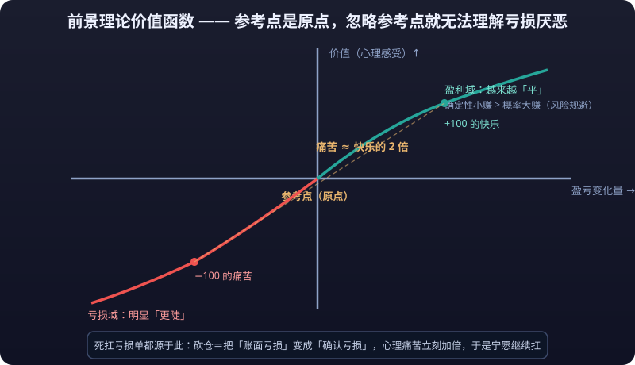

# 01 · 行为金融学基础

> 传统金融学假设你是个理性人：信息充分、计算精准、永远追求自身利益最大化。但现实中的你会在 99 元打折时抢购、会卖了赚钱的股票留着亏钱的、会在熊市底部恐慌割肉。**行为金融学做的第一件事，就是把「理性人」这个假设拆掉，换成「真人」。**

---

## 一、传统金融学的假设：理性人与有效市场

### 1.1 理性人（Homo Economicus）假设

古典与现代金融学大厦的地基，是三块砖：

| 假设 | 含义 |
|---|---|
| 理性偏好 | 每个投资者都追求效用最大化，能用数学精确比较不同选择 |
| 完美信息 | 所有信息免费、即时、人人可得 |
| 预期一致 | 大家对未来的判断基于相同的信息集与贝叶斯规则 |

在这个世界里，人的行为完全可以用期望效用理论描述：面对不确定结果，理性人会选择「期望效用」最高的选项——把每个结果乘以概率，加总，选最大的那个。

### 1.2 有效市场假说（EMH）

建立在理性人假设之上，法马（Eugene Fama）提出有效市场假说：如果市场参与者都理性，那么**价格会反映所有可得信息**，任何人都无法持续获得超额收益。

| 形式 | 价格反映的信息 | 含义 |
|---|---|---|
| 弱式有效 | 历史价格与成交量 | 技术分析无效 |
| 半强式有效 | 所有公开信息 | 基本面分析无效 |
| 强式有效 | 一切信息（含内幕） | 什么分析都无效 |

**如果这套理论成立，本知识库的绝大部分内容都该删掉。** 而行为金融学要回答的问题是：市场为什么不是这样的？

### 1.3 理性人假设的问题：他从来不存在

理性人假设最大的问题不是逻辑，而是**它描述的人不存在**：

1. **信息不可能完美**：你连明天涨跌都不知道，更别说「所有信息」。
2. **算力不可能无限**：人脑的注意力和计算能力极其有限（见后文「有限理性」）。
3. **情绪不可关闭**：真实决策带着恐惧、贪婪与后悔，不是「纯计算」。

更关键的是：**偏差不是随机噪音，而是系统性、可重复的方向性错误。** 如果 90% 的人都在恐慌时过度抛售，这些错误不会互相抵消，而是会汇聚成可观测的市场现象——这正是本篇章 02、03 篇要展开的内容。

::: danger 💀 铁律：偏差不是随机噪音，而是系统性、可重复的方向性错误
**偏差不是随机噪音，而是系统性、可重复的方向性错误。** 如果 90% 的人都在恐慌时过度抛售，这些错误不会互相抵消，而是会汇聚成可观测的市场现象——这就是为什么行为金融学不是"锦上添花"的理论，而是解释市场为什么会"出错"的核心框架。
:::

---

## 二、挑战一：西蒙的有限理性

在卡尼曼之前，经济学家赫伯特·西蒙已经动摇了理性人的地基：**人的理性是「有限理性」（Bounded Rationality）。**

有限理性有三层含义：

| 限制 | 说明 |
|---|---|
| 信息有限 | 不可能掌握全部信息，只能基于「够用」的信息决策 |
| 认知有限 | 记忆、注意力、计算能力都有天花板 |
| 时间有限 | 现实决策常常没有时间慢慢算 |

由此推出关键概念——**满意化（Satisficing）**：人通常不是追求「最优解」，而是找到一个「足够好」的答案就停手。购物如此，选股如此，判断行情也如此。

> **意义：** 有限理性意味着人的决策不是「理性计算的简化版」，而是**另一套完全不同的算法**。这套算法的细节，由下一节的卡尼曼与特沃斯基揭晓。

---

## 三、挑战二：卡尼曼与特沃斯基的前景理论

### 3.1 为什么期望效用理论打不过实验

期望效用理论有个核心推论：人对「得 100 元」和「亏 100 元」的感受强度相同（只是符号相反），因此面对确定结果与有概率的结果时，会按期望值理性选择。

卡尼曼与特沃斯基（Kahneman & Tversky, 1979）用一批精巧实验证明这个推论不成立，并据此提出了**前景理论（Prospect Theory）**，它后来成为行为经济学奠基之作（2002 年卡尼曼因此获诺贝尔经济学奖）。前景理论的精髓，可以压缩成四个要素。

### 3.2 四大要素之一：参考点依赖（Reference Dependence）

人的效用不是由「最终财富」决定，而是由「相对于参考点的变化」决定。

```text
最终财富 10 万 ≠ 感受相同
参考点 5 万时：开心（+5 万）
参考点 20 万时：沮丧（-10 万）
```

**交易中的表现：** 你在 60,000 买入，涨到 70,000 你是赚的；但对一个 80,000 买入的人来说，70,000 是巨亏。同一价格，不同参考点，完全不同的情绪——价格本身没有情绪，参考点赋予它情绪。

### 3.3 四大要素之二：损失厌恶（Loss Aversion）

在参考点附近，损失函数比收益函数**更陡**。实验反复显示：**同等金额的损失带来的心理痛苦，约为同等收益带来的快乐的 2 倍左右。**（不同实验得出的倍数在 1.5-2.5 之间浮动，「约 2 倍」是通行说法。）

用价值函数草图描述：



**交易中的表现：** 一切「死扛亏损单」的行为都源于此——砍仓意味着把「账面亏损」变成「确认亏损」，心理痛苦立刻加倍，于是人宁愿继续扛。

### 3.4 四大要素之三：确定性效应（Certainty Effect）

面对「100% 拿到 800 元」vs「85% 概率拿到 1000 元」，多数人选前者；即使后者的期望值（850）更高。**确定性的东西被高估，概率性的东西被低估**——这是人在获利域里的保守倾向。

反之，在纯概率比较里，人又不按概率行事：同样期望值下，「99% vs 100%」的差距被感知为巨大，而「1% vs 2%」的差距几乎被忽略。**概率的感知是扭曲的，不是线性的。**

**交易中的表现：** 赚了 5% 立刻落袋——「确定的小钱」胜过「可能的更大利润」；而彩票类赌博（极小概率、极大赔率）被严重高估——这正是 03 篇「彩票偏好股」现象的心理学源头。

### 3.5 四大要素之四：反射效应（Reflection Effect）

把 3.4 的选择全部搬到亏损域，偏好会发生**戏剧性翻转**：

| 场景 | 选项 | 多数人选择 |
|---|---|---|
| 获利域 | 确定得 800 vs 85% 得 1000 | 确定得 800（风险厌恶） |
| 亏损域 | 确定亏 800 vs 85% 概率亏 1000 | 85% 概率亏 1000（风险偏好） |

**亏钱时，人变成赌徒。** 反正要亏 800，不如搏一把——万一不用亏呢。这种「在亏损域里风险偏好翻转」就是反射效应，它是「死扛」「摊平加仓」「扛单到**<mark>爆仓</mark>**」的心理学根基：**损失越大，越敢赌，赌得越狠，亏得越多。**

::: danger 💀 铁律：损失越大，越敢赌，赌得越狠，亏得越多
**损失越大，越敢赌，赌得越狠，亏得越多。** 这就是反射效应——人在亏损域里风险偏好翻转，从保守变得激进：反正要亏 800，不如搏一把。这正是「死扛」「摊平加仓」「扛单到爆仓」的心理学根基，也是散户账户走向**<mark>归零</mark>**的经典路径。
:::

### 3.6 前景理论的完整结构

把四要素串起来，就是完整的前景理论：

```text
决策 = f(参考点) × [获利域：确定性偏好 / 亏损域：风险偏好] × [损失更痛]
        └─ 参考点依赖 ─┘   └── 确定性效应 + 反射效应 ──┘   └─ 损失厌恶 ─┘
```

> **一句话总结：人在获利时是保守的胆小鬼，在亏损时是激进的赌徒，而亏损本身比收益疼得多。** 记住这句话，本篇章 02、03、04、05 的所有内容都是它的展开。

---

## 四、经典实验：病人生存治疗方案的选择

### 4.1 实验设计

卡尼曼与特沃斯基的经典「外科医生实验」，是检验「框架」如何影响理性决策的教科书案例。同一个治疗方案，用两种措辞描述：

| 版本 | 措辞 | 效果 |
|---|---|---|
| 生存框架 | 手术：术后存活率 90% | 多数人倾向选择手术 |
| 死亡框架 | 手术：术后死亡率 10% | 选择手术的比例显著下降 |

两种说法**描述的是完全相同的事实**，只是参考点不同：生存框架让「活着」成为参考点（获得框架），死亡框架让「死了」成为参考点（损失框架）。**信息一字不差，决策天壤之别。**

### 4.2 对期望效用理论的致命一击

在这个实验里，任何「理性」的决策模型都会得出「两版措辞的决策应该相同」的结论——因为信息完全相同。但实验结果清楚地显示：**人的决策被措辞改变了**。这意味着：

1. 期望效用理论描述的不是人的真实决策过程。
2. 「理性人」在面对相同信息时，会因**表述方式**不同而做出不同选择。
3. 决策受框架影响这件事本身，就是系统性偏差（完整讨论见 04 篇「框架效应」）。

**对交易者的直接启示：** 你手机上每一根红绿 K 线、每一句「暴涨暴跌」的推送，都是别人在给你换框架。**同一个事实，换个说法，就能改变你的操作。**

---

## 五、两套思维：系统 1 与系统 2

### 5.1 快与慢

卡尼曼在《思考，快与慢》中把人的思维分为两套系统（该命名源自心理学理论传统，为便于叙述称为「系统」）：

| | 系统 1（快思考） | 系统 2（慢思考） |
|---|---|---|
| 运行方式 | 自动、直觉、无意识 | 主动、逻辑、有意识 |
| 速度 | 毫秒级 | 秒到分钟级 |
| 能耗 | 极低 | 极高（需要努力） |
| 特点 | 永远在线、无法关闭 | 懒、易被占据、易被绕开 |
| 擅长的 | 模式识别、日常习惯 | 计算、概率、抽象推理 |
| 交易中的表现 | 「涨疯了！快买！」 | 「按计划，**<mark>止损</mark>**在 58,200」 |

### 5.2 为什么系统 2 常常输

系统 2 的三个致命弱点：

1. **懒惰**：能省则省，默认把决策权交给系统 1（认知懒散）。
2. **容易被耗尽**：连续决策、疲劳、血糖低、情绪激动时，系统 2 的工作能力直线下降（自我损耗）。
3. **事后才知道**：系统 1 已经把决定做完了，系统 2 只是「为决定找理由」——这就是确认偏差与自利归因（见 02 篇）的神经基础。

### 5.3 什么时候该用哪个

| 场景 | 应该用 | 原因 |
|---|---|---|
| 看盘扫一眼、识别形态 | 系统 1 | 模式识别是它的强项，够快 |
| 下单前的**<mark>仓位</mark>**计算 | 系统 2 | 数字和概率，必须慢慢算 |
| 止损决策 | 系统 2 | 这是反本能的动作，只能靠逻辑 |
| 消息面快速反应 | 都不该用 | 先停下来，别急着反应 |
| 复盘、写计划 | 系统 2 | 平静时才有算力 |

**核心原则：让系统 1 干它擅长的（识别），让系统 2 干它该干的（决策），而决策要提前在平静时做完。** 这正是「交易计划」存在的最深层理由——你不可能在行情跳动时让系统 2 全程在线，但你可以在平静时把预案写好。

::: warning ⚠️ 反直觉：决策要提前在平静时做完
**决策要提前在平静时做完。** 你不可能在行情跳动时让系统 2 全程在线——因为系统 2 本来就"懒、易被占据、易被绕开"。所以「交易计划」存在的最深层理由是：让平静时的你，替激动时的你做决定，而不是把生死交给情绪化的自己。
:::

---

## 六、行为金融学的边界：解释 ≠ 预测

学习行为金融学之前，先划清三条边界：

### 6.1 它是描述性的，不是规范性的

行为金融学告诉你「人会这样犯错」，不告诉你「你应该这样犯错」。知道了损失厌恶，不等于建议你规避一切亏损——该止损还是要止损。

### 6.2 它能解释过去，很难预测未来

偏差规律是统计性的：它说「羊群行为在情绪极端时明显」，但它说不准「明天会不会反转」。**解释力强、预测力弱**，是所有行为科学的通病。

### 6.3 它描述的是「平均人」，不是「你」

实验结论是群体统计结果：总体存在损失厌恶，不代表你每一笔交易都会如此。**把统计规律当个人命运，本身就是一种偏差。**

> 记住这三条边界再进入 02 篇——否则你会在「我知道人类会犯错」和「我知道市场明天会怎样」之间，自欺欺人地划上等号。

---

## 七、本篇小结

| 核心概念 | 一句话 |
|---|---|
| 理性人假设 | 传统金融学的地基，现实中不存在 |
| 有效市场假说 | 理性人假设的市场版本，被异象动摇（见 03 篇） |
| 有限理性 | 西蒙：人不求最优，只求「够好」 |
| 前景理论 | 卡尼曼：参考点 + 损失厌恶 + 确定性效应 + 反射效应 |
| 损失厌恶 | 亏 100 的痛 ≈ 赚 200 的乐（约 2 倍） |
| 反射效应 | 获利域保守、亏损域赌博 |
| 系统 1 / 系统 2 | 快思考永远在线，慢思考容易掉线 |
| 解释 ≠ 预测 | 行为金融学的最大边界 |

---

::: warning ⚠️ 风险提示
本内容仅用于学习与研究，不构成任何投资建议。前景理论等结论来自实验统计，个体行为存在巨大差异；「损失厌恶约 2 倍」等表述是不同实验的综合口径，不应作为精确心理定价参数。理解人性规律有助于自我觉察，但任何交易决策仍应以资金管理与纪律为前提（见 [07-交易系统篇](../07-交易系统篇/)）。
:::
