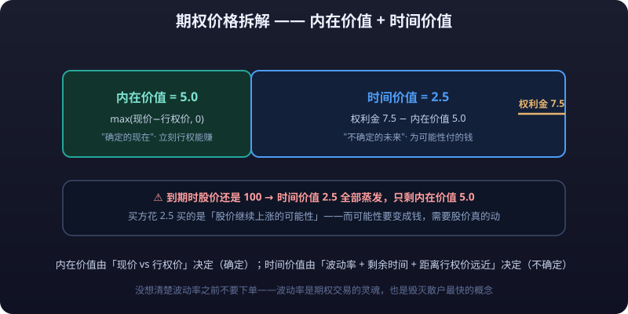

# 01 · 期权定价与波动率：价格怎么来的，贵不贵怎么看

> 期权基础篇只告诉你「**<mark>权利金</mark>** = **<mark>内在价值</mark>** + **<mark>时间价值</mark>**」这个公式。本篇回答三个更致命的问题：**这个数字到底怎么算出来的？为什么有时候「看起来便宜」的期权其实是天价？怎么看一个期权到底贵不贵？**
>
> 答案的核心只有一个词：**波动率（Volatility）**。期权定价的全部艺术，就是给「未来波动」定价。

---

## 一、期权价值构成：**内在价值** + 时间价值



期权价格（权利金）只有两半：

```text
期权价格 = 内在价值 + 时间价值

内在价值：立刻行权能赚到手的钱（实值部分）
时间价值：为「未来的可能性」付的钱
```

| 部分 | 定义 | 存在条件 | 谁决定它 |
|---|---|---|---|
| **内在价值** | max(现价 − **<mark>行权价</mark>**, 0)（Call）/ max(行权价 − 现价, 0)（Put） | 只有实值期权有；虚值为 0 | 标的现价与行权价的差（确定） |
| **时间价值** | 期权价格 − 内在价值 | 只要还有剩余时间就有 | **波动率、剩余时间、距离行权价远近**（不确定） |

数字例子：某股票现价 100，行权价 95 的 Call 报价 7.5：

- 内在价值 = 100 − 95 = **5.0**
- 时间价值 = 7.5 − 5.0 = **2.5**
- 如果到期时股价还是 100，这份期权只剩 5.0 → **2.5 的时间价值全部蒸发**

::: tip 💡 关键认知
**内在价值是「确定的现在」，时间价值是「不确定的未来」**。买方花 2.5 买的是「股价继续上涨的可能性」——而可能性要变成钱，需要股价真的动。
:::

---

## 二、时间价值 = 波动率价值

如果市场对某个标的**未来毫无波动预期**，时间价值就应该为零——因为「明天的股价 = 今天的股价」，未来没有任何可能性，期权毫无意义。

所以更准确的说法是：

```text
时间价值 ≈ 波动率价值 +（一点点）剩余时间溢价
```

- **波动率预期越高** → 未来可能到达的价格区间越宽 → 可能赚到的钱越多 → 时间价值越贵
- **波动率预期越低** → 未来价格区间越窄 → 时间价值越便宜

直观理解：一个未来 30 天可能波动 ±30% 的股票，和一个 ±3% 的股票，同一份行权价 Call 的权利金相差几倍——**差别不在方向，在波动**。

> 推论一：**买入期权 = 买入波动率**；卖出期权 = 卖出波动率。你交易的不仅是方向，更是「波动」。这解释了为什么很多看对方向的买方照样亏钱（波动不足）。

::: tip 期权交易的底层认知
**买入期权 = 买入波动率，卖出期权 = 卖出波动率。** 你交易的不仅是方向，更是「波动」——这解释了为什么很多看对方向的买方照样亏钱：方向对了，波动不足，照样亏。
:::
>
> 推论二：虚值期权 = **纯波动率**（内在价值为 0，价格全部是时间价值）。所以虚值期权是观察「市场波动预期」最干净的窗口。

---

## 三、Black-Scholes 的直觉：五个输入

1973 年 Black-Scholes 公式给出了期权定价的解析解，数学家拿它拿了诺贝尔奖。但实战中你**不需要背公式**，只需要理解它背后一句话：

> **期权价格 = 波动率 × 剩余时间 × 距离行权价远近**，再被标的价格、利率微调。

五个输入如下：

| 输入 | 对 Call 价格的影响 | 直觉 |
|---|---|---|
| **标的价格 S** | 涨 → 变贵（Put 反向） | 现价越靠近行权价、越往上穿，内在价值越高 |
| **行权价 K** | 越远离现价 → 越便宜 | 越难到达的价位，可能性越小 |
| **剩余时间 T** | 越长 → 越贵 | 时间越长，到达行权价的路径越多 |
| **无风险利率 r** | 利率越高 → Call 越贵 | Call 是「延迟付款买股票」，省了利息（对短期期权影响极小） |
| **波动率 σ** | 越大 → 越贵（Call/Put 同向） | 波动越大，爆发行情的可能性越大 |

其中**前四项基本是「已知事实」**（标的价格、行权价、到期日、利率都是确定的），**只有波动率是需要猜测的**。这也是为什么整个期权行业都在研究「这个波动率该是多少」。

```text
期权价格 ≈ 函数(标的价格, 行权价, 剩余时间, 利率, 波动率)
                      └──────── 已知 ────────┘  └─ 唯一需要猜的 ─┘
```

### 三个直觉例子（虚拟数字）

1. **同样的 Call，剩余 5 天 vs 剩余 60 天**：5 天的约等于「看明天会不会涨」，60 天的约等于「看接下来两个月会不会有一次像样行情」。后者贵得多。
2. **同样的剩余时间，行权价 100 vs 行权价 120**：现价 100，120 的 Call 需要股价涨 20% 才盈利，概率低，所以便宜。
3. **同样的合约，IV 20% vs IV 40%**：波动预期翻倍，期权价格可能贵 2-3 倍——**这是五个输入里威力最大、也最容易被新手忽略的一个**。

> 实战提醒：几乎所有券商软件都会在期权链上**实时给出每个合约的 IV**。你不需要会算 BS 公式，但一定要会读「当前价格对应的 IV 是多少」。

<OptionCalc />

---

## 四、**隐含波动率** IV：从价格反推的市场预期

**<mark>隐含波动率</mark>（Implied Volatility, IV）** 是拿**真实的期权市场价格**代入 BS 公式，反推出来的波动率数字。

- 已知：标的价格、行权价、剩余时间、利率（都是确定的）
- 已知：期权现在的成交价
- 反推：什么样的波动率假设，能让公式算出来的价格 = 市场价？这个波动率就是 **IV**

所以 IV 不是「算出来的历史数据」，而是**市场用真金白银投票出来的对未来波动的预期**：

| 对比 | 含义 | 谁说了算 |
|---|---|---|
| **历史波动率（HV）** | 过去 30/60 天标的实际走了多远 | 过去的事实 |
| **隐含波动率（IV）** | 市场认为未来会波动多少 | 现在所有人的预期 + 供需 |

- IV 高 → 市场预期未来波动剧烈（恐慌、狂热、重大事件前）→ 期权卖得贵
- IV 低 → 市场预期平静 → 期权便宜

::: info 📖 情绪定价示例
某股票平时 IV 25%，财报公布前 IV 飙升到 60%。同一份期权在财报前 vs 财报后，价格可能差一倍——**但股票本身一动没动**。这就是「情绪定价」。
:::

---

## 五、IV 与期权价格的关系

规则极其简单：**IV 涨 = 期权变贵（Call 和 Put 一起涨）；IV 跌 = 期权变便宜。**

| 场景 | IV 变化 | 期权价格 | 买方 | 卖方 |
|---|---|---|---|---|
| 重大事件前（财报/议息/选举） | 上升 | 全面变贵 | 买贵了，赌事件 | 卖得爽，赚 IV 溢价 |
| 事件落地后 | **IV Crush（骤降）** | 暴跌 | 「方向对也亏钱」双杀 | 快速收割 IV 回落 |
| 恐慌性暴跌 | 大幅上升 | 虚值 Put 天价 | 追涨买保险巨贵 | 收天价权利金但担尾部风险 |
| 平静横盘 | 缓慢下降 | 持续变便宜 | 天天被磨 | 天天收租 |

**最经典的坑：IV Crush「双杀」。** 财报前买入期权赌方向，财报出来方向对了，但事件落地不确定性消失、IV 一夜跌回 20%，期权价格照样跌——**你赚了方向的钱，却亏了波动率的钱。**

::: danger IV Crush 双杀陷阱
**你赚了方向的钱，却亏了波动率的钱。** 财报前买入期权赌方向，方向对了但 IV 一夜从 60% 跌回 20%，期权价格照样跌——买期权前先问自己「IV 现在高不高」，IV 高的时候买等于高价买入波动率。
:::

```text
事件前：期权价格 = 内在价值(低) + 时间价值(IV 60%，很贵)
事件后：期权价格 = 内在价值(涨了) + 时间价值(IV 20%，崩了)
净效果：可能还是亏的
```

> 一句话：**买期权前，先问自己「IV 现在高不高」——IV 高的时候买，等于高价买入波动率，方向对了也可能白干。**

---

## 六、波动率曲面：微笑与偏斜

把「同一标的、不同行权价 × 不同到期日」的 IV 全部摊开，会得到一个三维表面，叫**波动率曲面（Volatility Surface）**。

### 6.1 波动率微笑（Volatility Smile）

如果横轴是行权价、纵轴是 IV，很多市场画出的是**两头翘起的微笑形状**：

```text
IV
 │                      ★
 │                    ★   ★
 │                 ★        ★
 │              ★             ★
 │         ★                    ★
 │    ★                            ★
 └─────────────────────────────────────▶ 行权价
   虚值Put    平值ATM       虚值Call
```

- 平值（ATM）附近的 IV 最低
- 越往实值/虚值两端，IV 越高（尤其是虚值 Put 一侧）

**为什么尾部贵？** 因为极端行情（黑天鹅）实际发生的概率，**比正态分布模型假设的更频繁**。市场吃过亏，愿意为「防止小概率大灾难」付更高的价——所以虚值 Put 贵，本质是**给尾部风险标了价**。

### 6.2 波动率偏斜（Volatility Skew）

股票/股指期权最常见的形态是**单边偏斜**：左侧（低行权价 / 虚值 Put）IV 明显高于右侧（高行权价 / 虚值 Call）。

```text
IV
 │              ★
 │            ★
 │         ★
 │       ★
 │     ★
 │   ★
 └─────────────────────▶ 行权价
 低K（虚值Put贵）  高K（虚值Call便宜）
```

| 市场类型 | 常见形态 | 成因 |
|---|---|---|
| **股票/股指** | 左高右低（偏斜） | 股灾比暴涨更频繁，「保险」（Put）常年被抢购 |
| **外汇/商品（部分）** | 两头翘（微笑） | 双向极端行情都有（如外汇脱锚、油价暴动） |
| **加密货币** | 波动大、整体偏高 | 暴涨暴跌都极端，且随市场情绪剧烈漂移 |

::: tip 💡 曲面的实战意义
**「虚值 Put 贵」是市场常态**。你要么接受它的贵（买保险本来就贵），要么别用昂贵的虚值 Put 去投机——那是给市场交「恐慌溢价」。
:::

---

## 七、IV 高低怎么判断

「IV 25% 算高还是低？」——**没有绝对答案**，判断靠三个参照：

### 7.1 IV 分位数（最重要）

把某标的过去 2-3 年的 IV 全部拉出来排序，看当前 IV 处在历史什么位置：

| 当前 IV 位置 | 含义 | 操作含义 |
|---|---|---|
| 历史 **20% 分位以下** | 极度便宜（市场预期异常平静） | 买方窗口：买期权划算，卖方不划算 |
| 历史 **50% 分位（中位数）** | 正常水平 | 不贵不便宜，看其他条件 |
| 历史 **80% 分位以上** | 极度昂贵（恐慌/狂热） | 卖方窗口：卖期权赚 IV 溢价，买方别追 |

### 7.2 HV 与 IV 的差值（IV/HV 溢价）

- **IV > HV**：市场预期未来波动比过去大（正常，期权的保险属性使 IV 通常略高于 HV）
- **IV − HV 显著偏高**：情绪过热，期权被高估，卖方有利
- **IV 显著低于 HV**：市场预期未来风平浪静（或期权被错杀），买方有利

> 交易员会看 **IV/HV 比值**：大于 1 说明 IV 有溢价，小于 1 说明 IV 折价。

### 7.3 绝对水平的常识

| IV 绝对水平 | 对大多数股票/股指的含义 |
|---|---|
| **IV ≈ 20%** | 温和：年化波动 20%，市场平静偏正常，期权中等价格 |
| **IV ≈ 30-40%** | 偏紧张：有重大事件或趋势行情，期权开始贵 |
| **IV ≈ 60%+** | 恐慌级：如 2020 年 3 月美股、重大危机时刻，期权贵到离谱（买虚值 Put 是「天价保险」） |
| **IV 100%+** | 极度恐慌/加密极端行情：期权价格几乎全在博尾部，普通策略毫无性价比 |

::: info 📖 「正常 IV」因标的而异
**不同标的的「正常 IV」完全不同**——银行股常年 15-20%，成长股 40-60%，比特币 50-100%。所以跨品种比较 IV 绝对值没有意义，**只在同一标的内部分位比较**。
:::

---

## 八、不同市场的 IV 特征

| 市场 | 典型 IV 水平 | IV 特征 | 实战影响 |
|---|---|---|---|
| **大盘股指**（SPX/上证50） | 15-25%（正常）；恐慌期 40-80% | 偏斜明显，虚值 Put 贵；VIX 即其「IV 指数」 | 指数期权做卖方/**<mark>价差</mark>**的多，散户买方要特别防 IV Crush |
| **个股期权**（AAPL/TSLA 等） | 成长股 40-70%，蓝筹 20-40% | 财报前 IV 飙升、财报后 Crush，个股特有「事件 IV」 | 事件驱动交易的核心战场；财报前买 Call 是常见亏损源 |
| **商品期权**（豆粕/原油/黄金） | 农产品 15-30%，能源 30-60% | 受供需/天气/库存/地缘驱动，季节性强（种植季、检修季 IV 高） | 卖方要盯商品基本面的「突发供给冲击」 |
| **加密期权**（BTC/ETH） | 常态 40-80%，极端 >100% | 全市场最高、漂移最快；期权几乎全为时间价值 | 波动率交易天堂但也最危险；IV 回归极快，买方极难拿住 |

> 记忆法：**IV 与「不确定性」正相关**。指数的不确定性来自宏观、个股来自财报、商品来自供需、加密来自一切。先判断你交易的市场「不确定性有多大、事件什么时候落地」，再看 IV 贵不贵。

---

## 风险提示

::: warning ⚠️ 风险提示
期权定价与波动率是期权交易的**地基**，但也是散户最容易犯错的地方：

**① IV 幻觉**：看到期权「贵」就卖、看到「便宜」就买，是典型的**把 IV 高低当买卖信号**。IV 高低只代表贵贱，不代表方向——IV 高可以更高（恐慌加剧），IV 低可以更低（平静到死），**贵贱不是预测工具**。
**② IV Crush 双杀**：事件前买入期权，方向对了但 IV 骤降，照样亏损。买期权前必须评估「我的 IV 买入成本会不会被 Crush」。
**③ 尾部分位**：波动率曲面告诉我们尾部风险被定价贵，但这不代表「卖虚值 Put 很安全」——**定价贵 ≠ 风险小**，它只说明市场愿意付高价买保险，而保险卖方的责任是真实的。
**④ 数据口径**：文中所有 IV 数字、分位、偏斜形态均为教学示意，不同软件/券商的 IV 计算口径与数据源不同，数值会有差异，**以你所用交易软件的实时数据为准**。

本文不构成投资建议。波动率是期权交易的灵魂，也是毁灭散户最快的概念——**没想清楚波动率之前，不要下单。**
:::


---

## 小结

- 期权价格 = 内在价值 + 时间价值；**时间价值本质是波动率价值**
- BS 五输入里，标的价格/行权价/时间/利率是已知事实，**只有波动率需要猜**
- IV 是市场用价格反推出来的波动预期，**IV 涨期权贵、IV 跌期权便宜**
- 波动率曲面呈现微笑/偏斜：**尾部风险被市场定价贵**（虚值 Put 常年贵）
- 判断 IV 高低：看**历史分位数**、看 **IV/HV 差值**、看绝对水平与品种常识
- 不同市场 IV 差异巨大：**只在同一标的内部分位比较，不要跨品种比绝对值**
