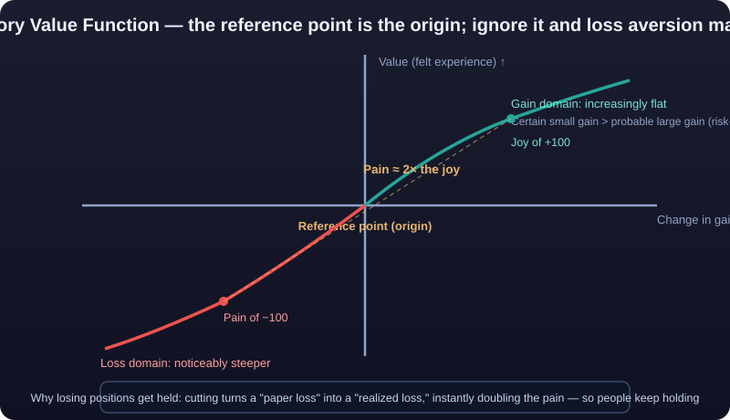

# Foundations of Behavioral Finance

> Traditional finance assumes you are a rational agent: fully informed, precisely calculating, always maximizing your own utility. In reality, you snap up 20%-off deals, sell the stocks that made money and keep the ones losing money, and panic-sell at the bottom of a bear market. **The first thing behavioral finance does is tear down the "rational agent" assumption and replace it with an actual human being.**

---

## I. The Assumptions of Traditional Finance: Rational Agents and Efficient Markets

### 1.1 Homo Economicus

The edifice of classical and modern finance rests on three bricks:

| Assumption | Meaning |
|---|---|
| Rational preferences | Every investor maximizes utility and can compare choices with mathematical precision |
| Perfect information | All information is free, instantaneous, and available to everyone |
| Homogeneous expectations | Everyone forms forecasts from the same information set using Bayesian updating |

In this world, behavior is fully described by expected utility theory: facing uncertain outcomes, the rational agent picks the option with the highest "expected utility" — multiply each outcome by its probability, sum them up, choose the largest.

### 1.2 The Efficient Market Hypothesis (EMH)

Building on the rational-agent assumption, Eugene Fama proposed the **<mark>Efficient Market Hypothesis</mark>**: if all market participants are rational, then **prices reflect all available information**, and no one can consistently earn excess returns.

| Form | Information reflected in prices | Implication |
|---|---|---|
| Weak-form efficiency | Historical prices and volume | Technical analysis is useless |
| Semi-strong-form efficiency | All public information | Fundamental analysis is useless |
| Strong-form efficiency | All information (including inside information) | No analysis is useful |

**If this theory held, most of this knowledge base should be deleted.** And the question behavioral finance must answer is: why isn't the market like that?

### 1.3 The Problem with Homo Economicus: He Never Existed

The biggest problem with the rational-agent assumption isn't logic — it's that **the person it describes doesn't exist**:

1. **Information can't be perfect**: you don't even know tomorrow's direction, let alone "all information."
2. **Computational power can't be unlimited**: human attention and computing capacity are severely limited (see "bounded rationality" below).
3. **Emotions can't be switched off**: real decisions carry fear, greed, and regret; they are not "pure calculation."

More importantly: **biases are not random noise — they are systematic, repeatable, directional errors.** If 90% of people over-sell in a panic, those errors don't cancel out; they aggregate into observable market phenomena — exactly what articles 02 and 03 of this chapter develop.

::: danger 💀 Iron Law: Biases Are Not Random Noise but Systematic Directional Errors
**Biases are not random noise — they are systematic, repeatable, directional errors.** If 90% of people over-sell in a panic, those errors don't cancel each other out; they aggregate into observable market phenomena. That's why behavioral finance isn't a decorative theory but the core framework for explaining why markets "get things wrong."
:::

---

## II. Challenge One: Simon's Bounded Rationality

Before Kahneman, economist Herbert Simon had already shaken the foundation: **human rationality is "<mark>bounded rationality</mark>" (Bounded Rationality).**

Bounded rationality has three layers:

| Constraint | Explanation |
|---|---|
| Limited information | You can never know everything; you decide on "good enough" information |
| Limited cognition | Memory, attention, and computation all have ceilings |
| Limited time | Real decisions rarely allow slow, careful calculation |

From this follows a key concept — **<mark>satisficing</mark> (Satisficing)**: people usually don't seek the "optimal solution"; they stop at an answer that is "good enough." True for shopping, true for picking stocks, true for reading the market.

::: tip 💡 Implication: A Completely Different Algorithm
**Implication:** Bounded rationality means human decision-making is not a "simplified version of rational calculation" but **a completely different algorithm**. Its details were revealed by Kahneman and Tversky, in the next section.
:::

---

## III. Challenge Two: Kahneman & Tversky's Prospect Theory

### 3.1 Why Expected Utility Theory Loses to Experiments

Expected utility theory implies that people feel "gaining 100" and "losing 100" with equal intensity (only opposite in sign), so when choosing between certain and probabilistic outcomes they would act rationally on expected values.

Kahneman and Tversky (1979) used a series of elegant experiments to show this implication fails, and proposed **<mark>prospect theory</mark> (Prospect Theory)**, which became foundational for behavioral economics (Kahneman won the 2002 Nobel Prize in Economics partly for it). The essence of prospect theory compresses into four elements.

### 3.2 Element One: Reference Dependence

Utility is determined not by "final wealth" but by "change relative to a reference point."

```text
Final wealth of 100k ≠ same feeling
With reference point 50k: happy (+50k)
With reference point 200k: frustrated (-100k)
```

**In trading:** you buy at 60,000; at 70,000 you're up. But to someone who bought at 80,000, 70,000 is a huge loss. Same price, different reference points, completely different emotions — price itself carries no emotion; the reference point gives it one.

### 3.3 Element Two: Loss Aversion

Near the reference point, the loss function is **steeper** than the gain function. Experiments repeatedly suggest that **the psychological pain of a loss of a given size is roughly twice the pleasure of an equivalent gain.** (Estimates across studies range from about 1.5x to 2.5x; "roughly 2x" is the common shorthand.)

A sketch of the value function:



**In trading:** every instance of "refusing to close a losing position" traces back here — cutting the loss turns a "paper loss" into a "realized loss," instantly doubling the psychological pain, so people would rather keep holding.

### 3.4 Element Three: The Certainty Effect

Facing "100% chance of receiving 800" vs "85% chance of receiving 1,000," most people pick the former — even though the latter has a higher expected value (850). **Certainty is overweighted; probability is underweighted** — this is people's conservatism in the domain of gains.

Conversely, in pure probability comparisons people don't behave by the numbers: at equal expected value, the gap between "99% vs 100%" feels enormous, while "1% vs 2%" is nearly ignored. **Probability perception is distorted, not linear.**

**In trading:** taking profit immediately after a 5% gain — "a certain small amount" beats "possibly larger profits"; meanwhile lottery-style bets (tiny probability, huge payoff) are heavily overweighted — which is the psychological root of the "lottery-preference stocks" phenomenon in article 03.

### 3.5 Element Four: The Reflection Effect

Move the choices from 3.4 into the loss domain, and preferences **dramatically flip**:

| Scenario | Options | Most people choose |
|---|---|---|
| Gain domain | Sure 800 vs 85% chance of 1,000 | Sure 800 (risk-averse) |
| Loss domain | Sure loss of 800 vs 85% chance of losing 1,000 | 85% chance of losing 1,000 (risk-seeking) |

**When losing, people become gamblers.** Since 800 is gone anyway, why not gamble — maybe you won't have to lose it. This flip toward risk-seeking in the loss domain is the reflection effect, and it is the psychological bedrock of "holding on," "averaging down," and riding a position all the way to **<mark>liquidation</mark>**: **the bigger the loss, the bigger the bet; the bigger the bet, the bigger the loss.**

::: danger 💀 Iron Law: The Bigger the Loss, the Bigger the Bet — and the Bigger the Loss
**The bigger the loss, the bigger the bet; the bigger the bet, the bigger the loss.** This is the reflection effect — risk preference flips in the loss domain, turning conservative people aggressive: since 800 is lost anyway, might as well gamble. It is the psychological root of "holding on," "averaging down," and holding to **<mark>liquidation</mark>** — the classic path by which retail accounts go to **<mark>zero</mark>**.
:::

### 3.6 The Full Structure of Prospect Theory

String the four elements together and you get complete prospect theory:

```text
Decision = f(reference point) × [gain domain: certainty preference / loss domain: risk seeking] × [losses hurt more]
        └─ reference dependence ─┘   └── certainty effect + reflection effect ──┘   └─ loss aversion ─┘
```

::: tip 💡 One-Sentence Summary
**One-sentence summary: in gains people are timid conservatives; in losses they are aggressive gamblers — and losses hurt far more than gains please.** Keep this sentence in mind; everything in articles 02, 03, 04, and 05 of this chapter is its elaboration.
:::

---

## IV. A Classic Experiment: Choosing Between Surgical Framings

### 4.1 Experiment Design

Kahneman and Tversky's classic "surgeon experiment" is the textbook case of how framing affects ostensibly rational decisions. The same treatment plan, described two ways:

| Version | Wording | Effect |
|---|---|---|
| Survival frame | Surgery: 90% survival rate after the operation | Most lean toward surgery |
| Mortality frame | Surgery: 10% mortality rate after the operation | Share choosing surgery drops significantly |

Both descriptions state **exactly the same fact**; only the reference point differs: the survival frame makes "alive" the reference point (a gain frame), the mortality frame makes "dead" the reference point (a loss frame). **Identical information, worlds-apart decisions.**

### 4.2 A Fatal Blow to Expected Utility Theory

In this experiment, any "rational" decision model concludes both wordings should yield identical decisions — because the information is identical. Yet the results clearly show: **decisions changed with the wording.** This means:

1. Expected utility theory does not describe how people actually decide.
2. Faced with identical information, "rational agents" make different choices depending on **how it is presented**.
3. Framing sensitivity is itself a systematic bias (full discussion in article 04, "Framing Effect").

**Direct lesson for traders:** every red-and-green candle on your phone, every "moon/crash" push notification, is someone re-framing you. **Same fact, different wording — and your actions change.**

---

## V. Two Modes of Thinking: System 1 and System 2

### 5.1 Fast and Slow

In *Thinking, Fast and Slow*, Kahneman divides thought into two systems (the naming draws on the tradition of psychological theory; "systems" is a narrative convenience):

| | System 1 (fast thinking) | System 2 (slow thinking) |
|---|---|---|
| Mode | Automatic, intuitive, unconscious | Deliberate, logical, conscious |
| Speed | Milliseconds | Seconds to minutes |
| Energy cost | Very low | Very high (effortful) |
| Traits | Always on, cannot be turned off | Lazy, easily occupied, easily bypassed |
| Good at | Pattern recognition, daily habits | Calculation, probability, abstract reasoning |
| In trading | "It's exploding! Buy now!" | "Per the plan, **<mark>stop-loss</mark>** at 58,200" |

### 5.2 Why System 2 Usually Loses

Three fatal weaknesses of System 2:

1. **Laziness**: it economizes wherever possible, defaulting decisions to System 1 (cognitive laziness).
2. **Easily depleted**: after consecutive decisions, fatigue, low blood sugar, or emotional arousal, System 2's capacity falls off a cliff (ego depletion).
3. **Arrives too late**: System 1 has already made the decision; System 2 merely "finds reasons for it" — the neural basis of confirmation bias and self-serving attribution (see article 02).

### 5.3 Which System to Use When

| Scenario | Use | Why |
|---|---|---|
| Glancing at charts, spotting patterns | System 1 | Pattern recognition is its strength, and fast |
| Pre-order **<mark>position</mark>** sizing | System 2 | Numbers and probabilities require slow calculation |
| Stop-loss decisions | System 2 | It's counter-instinctive; only logic gets it done |
| Reacting quickly to news | Neither | Stop first; don't rush to react |
| Review, planning | System 2 | Only calm states have the compute |

**Core principle: let System 1 do what it's good at (recognizing) and System 2 do what it must (deciding) — and make decisions ahead of time, while calm.** This is the deepest reason a "trading plan" exists: you can't keep System 2 online while prices tick, but you can write the contingency plans while calm.

::: warning ⚠️ Counterintuitive: Decide Ahead of Time, While Calm
**Decide ahead of time, while calm.** You can't keep System 2 fully online while the market ticks — System 2 is inherently "lazy, easily occupied, easily bypassed." So the deepest reason a trading plan exists is this: let the calm you make decisions for the excited you, rather than leaving life-or-death calls to your emotional self.
:::

---

## VI. The Boundaries of Behavioral Finance: Explaining ≠ Predicting

Before studying behavioral finance, draw three boundaries:

### 6.1 It Is Descriptive, Not Prescriptive

Behavioral finance tells you "people err this way," not "you should err this way." Knowing about **<mark>loss aversion</mark>** doesn't mean avoiding all losses — stop-losses still need to happen.

### 6.2 It Explains the Past Better Than It Predicts the Future

Bias-based regularities are statistical: they say "herding becomes pronounced at sentiment extremes," but cannot say "will it reverse tomorrow?" **Strong explanatory power, weak predictive power** — the common ailment of all behavioral sciences.

### 6.3 It Describes the "Average Person," Not "You"

Experimental conclusions are group statistics: loss aversion existing on average doesn't mean every one of your trades will follow it. **Treating a statistical regularity as personal destiny is itself a bias.**

::: warning ⚠️ Hold These Three Boundaries Before Reading Article 02
Hold these three boundaries before reading article 02 — otherwise you will self-deceptively equate "I know humans make mistakes" with "I know what the market will do tomorrow."
:::

---

## VII. Summary

| Core Concept | One Sentence |
|---|---|
| Rational-agent assumption | Traditional finance's foundation; no such person exists in reality |
| Efficient Market Hypothesis | The market version of the rational agent, shaken by anomalies (see article 03) |
| Bounded rationality | Simon: people don't seek the optimum, only "good enough" |
| Prospect theory | Kahneman: reference points + loss aversion + certainty effect + reflection effect |
| Loss aversion | The pain of losing 100 ≈ the joy of gaining 200 (roughly 2x) |
| Reflection effect | Conservative in gains, gambling in losses |
| System 1 / System 2 | Fast thinking is always on; slow thinking keeps dropping off |
| Explaining ≠ predicting | Behavioral finance's biggest boundary |

---

::: warning ⚠️ Risk Warning
This content is for study and research only and does not constitute investment advice. Conclusions such as prospect theory come from experimental statistics, with large individual variation; statements like "loss aversion is roughly 2x" are syntheses across studies and should not be treated as precise psychological pricing parameters. Understanding these patterns aids self-awareness, but any trading decision should still rest on money management and discipline (see [Chapter 07](../trading-system/)).
:::
