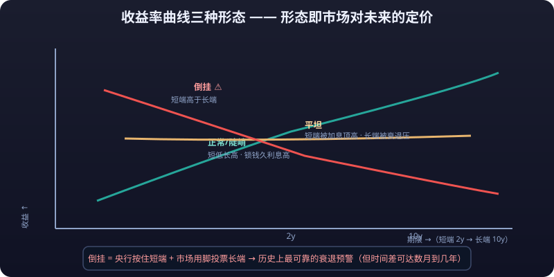

# 03 · Yield Curve Trading

> The yield curve isn't a "chart for bond investors" — it's **the thermometer of the entire macro world**: central bank policy, inflation expectations, recession odds, and equity valuations are all written on this one line.
>
> The concepts chapter covered the intuition that "inversion = recession warning." This chapter dives deeper: **what each of the curve's three shapes means, the signal value and time lag of inversion, how institutions trade the curve, and how ordinary investors can use the curve to guide their **positions**.**

---

## I. What the Yield Curve Is: Three Shapes



Connect the yields to maturity of the **same issuer** (usually Treasuries) across **different maturities** and you get the **<mark>yield curve</mark>**.

| Shape | Form | Driving logic | Market meaning |
|---|---|---|---|
| **Normal/steep** | Low short end, high long end | Term compensation: locking money longer demands more interest; in expansions, easy policy plus rising inflation expectations | Economy running normally, risk appetite firm |
| **Flat** | Short and long ends converge | In hiking cycles, policy rates prop up the short end while recession fears cap the long end | Late stage of tightening; growth momentum in doubt |
| **<mark>Inverted</mark>** | **Short end above long end** | Markets heavily bet on "future rate cuts" (recession), preferring to lock 10 years over 2 years | Historically the strongest recession warning |

### Key Intuitions

- **Short-end yields shadow the central bank's policy rate**: when the Fed hikes, yields under 2 years follow.
- **Long-end yields price the market's view of "future growth + inflation"**: they're set by market trading, not directly controlled by the central bank.
- So inversion is essentially **<mark>"the central bank pinning the short end while the market votes with its feet on the long end"</mark>** — two forces fighting, and that's when the most fragile signal appears.

---

## II. Inversion: History's Most Reliable Recession Warning

### Historical Statistics (teaching citations, not a forecasting tool)

- **Statistical common knowledge**: since the 1980s, 6 of 7 US recessions saw the 10Y-2Y spread turn negative 1–2 years before the recession began (public research/common-knowledge figures); research on the 10Y-3M spread also shows a strong warning record.
- Statistically it's a "strong signal, low false-negative rate" (few cases of recession without inversion), but **the lead time is unstable**: from a few months to well over 1–2 years.
- Exceptions and noise: the 2022–2023 inversion was not followed by a recession on the "standard script" within the expected window (the economy proved more resilient than expected through 2024–2025), showing **inversion is a statistical correlation of the necessary-condition kind, not causation**.

::: info 📖 A Note on Statistical Basis
**"Inversion → recession" is a historical statistical pattern, not a physical law.** Whenever you cite "X of Y recessions were preceded by inversion," add the caveat: sample windows and definitions differ, conclusions vary slightly, and none of it predicts timing.
:::

::: warning ⚠️ Counterintuitive: "Inversion → Recession" Is a Historical Pattern, Not a Physical Law
**"Inversion → recession" is a historical statistical pattern, not a physical law.** Whenever citing data like "6 of 7 recessions preceded by inversion," note that windows and definitions differ and conclusions vary. The 2022–2023 inversion did not produce a recession on the standard script within the expected window — so treat inversion as an "allocation cue," not a "short signal": use it to reduce risk appetite and build cash, not to open shorts.
:::

### Why Inversion Precedes Recessions (Mechanism)

```text
Central banks hike aggressively (short end pinned high)
   → high rates squeeze credit and investment
   → markets expect slowdowns and forced cuts
   → long-end yields (pricing future growth + inflation) get bought down
   → inverted curve = "tightening now" and "recession ahead" in one frame
```

---

## III. Why Inversion Doesn't Mean an Immediate Fall

### The Time Lag: "Inversion → Recession → Equity Top"

- Historically, inversions have led recessions by **1–2 years on average** (measurably different by spread definition; 10Y-3M usually tracks actual timing more closely).
- **Equity tops often precede confirmed recessions** — but a "top" doesn't mean an "immediate crash": after inversion, stocks can keep making new highs (momentum plus the fact that cut expectations themselves support risk assets).
- Typical sequence (statistical common knowledge): **curve inversion → recession confirmation (~1–2 years later) → policy pivot → risk assets take their final leg down → new easing cycle begins**.

### Three Disciplines for Traders

1. **Inversion is an "allocation cue," not a "short signal"**: use it to reduce risk appetite and build cash, not to open shorts.
2. **Wait for confirmation, don't front-run**: real declines are ignited by "confirmed recession data" or "crisis events"; inversion is only the overture.
3. **Don't use inversion to dismiss "rate-cut trades"**: quite the opposite — the deeper the inversion, the earlier markets start trading "cuts → bond bull → rebound in rate-sensitive assets."

::: danger 💀 Iron Rule: Inversion Is an "Allocation Cue," Not a "Short Signal"
**Inversion is an allocation cue, not a short signal.** Use it to reduce risk appetite and build cash, not to open shorts — because the "inversion → recession" lag runs 1–2 years, and you won't outlast the wait for "the market finally admitting its error." So wait for confirmation instead of front-running: real declines are triggered by confirmed recession data or crisis events; inversion is only the overture.
:::

### 2.3 Common Spread Definitions: 2s10s vs 10s30s vs 10Y-3M

| Definition | Meaning | Historical warning character (statistical common knowledge) |
|---|---|---|
| **10Y-2Y (2s10s)** | Most cited by media | Highest public attention; signals "early" but with more false alarms |
| **10Y-3M (long minus very short)** | Favored by researchers | Often considered better aligned with actual recession timing (the New York Fed's recession-probability model uses 10Y-3M) |
| **10Y-30Y** | Slope within the long end | Reflects "long-term inflation/growth" pricing; weakly tied to policy cycles |

::: tip 💡 Watch Two Definitions Together
Different spreads give **multiple angles on the same story**: 2s10s inverts first (policy expectations lead), while 10Y-3M tracks actual recession timing better. Don't read just one number — two together are steadier.
:::

---

## IV. Instruments for Curve Trading

### 4.1 US Treasury Futures (Institutions and Advanced Traders)

| Contract (reference) | Underlying | Duration magnitude | Use |
|---|---|---|---|
| 2Y Note futures | 2-year Treasuries | ~2 | Short-end rate **<mark>hedging</mark>**/speculation |
| 5Y Note futures | 5-year | ~4–5 | Mid-curve |
| 10Y Note futures | 10-year | ~8–9 | Most active, best **liquidity** |
| 30Y Bond futures | 30-year | ~17–18 | Long end, largest swings |

- Futures carry **<mark>margin</mark>** leverage (initial margin typically 2%–5% of contract value), and **wrong-way bets face forced liquidation too** — retail participants need full futures literacy first (see Chapter 03-Futures).

### 4.2 Curve Spread Trades: Steepeners / Flatteners

```text
Steepener: long the short end (or short the long end) → bet on short-end rates falling / long-end rising
Flattener: short the short end (or long the long end) → bet on short-end rising / long-end falling
```

- The institutional standard: **paired long-short positions** (e.g., buy 2Y futures + sell 10Y futures), stripping out absolute rate direction and betting purely on "slope" — profit as the curve steepens, lose as it flattens (and vice versa).
- Worked example (teaching approximation): Fed hiking cycle → short end surges while the long end dulls → curve flattens → flatteners profit; easing cycle begins → short end plunges → curve re-steepens → steepeners profit.
- Retail traders without futures access can approximate with **ETF combinations of different durations** (e.g., long TLT + short SHY to mimic a steepener's exposure), though this isn't true curve trading — directional exposure remains cruder.

### 4.3 China's "Stock-Bond See-Saw"

- **Logic**: the 10-year government bond yield is the domestic risk-free rate. **Falling yields → bond bull → do funds leave equities? No — historically bonds and stocks form a "see-saw": when equity returns look good, money drains from bonds (yields rise); when stocks sour, money flows back into bonds (yields fall)**.
- More precisely: **the bond market is the reservoir of stock-market liquidity**. Falling wealth-product/bond-fund yields push "yield-seeking" money into equities (the "deposits migrating," "bond bulls lifting equities" narrative since 2024); a rapid rise in bond yields (a bond crash) triggers redemption feedback loops that drain equity liquidity instead (the November 2022 case).
- Use: **late in a rapid decline of the 10Y government bond yield, bond value-for-money falls — often the window when equities receive incremental funds**; conversely, violent bond corrections raise short-term liquidity risk for equities.

### 4.4 An Important Translation: From "Curve" to "Cycle Phase"

What institutions really trade via the curve is the **four-phase monetary-policy script** (historical statistical pattern, not inevitability):

```text
Phase 1: mid-hiking → short end rises, long end dulls → curve flattens (flattener)
Phase 2: late hiking → inversion appears → bet on cuts (long the long end / curve normalization)
Phase 3: easing begins → short end plunges → curve steepens (steepener)
Phase 4: recovery confirmed → whole curve shifts up, slope normalizes → rotation from bonds to stocks (risk assets lead)
```

For ordinary investors, the value of this script is **knowing which phase you're in**, deciding whether to tilt toward stocks or bonds — rather than betting on the slope itself.

---

## V. What Curve Changes Mean for Ordinary Investors

| Curve state | Historical statistical meaning (not a forecast) | Reference for personal portfolios |
|---|---|---|
| Normal-steep | Expansion underway, risk appetite recovering | Equity positions can lean constructive; keep bonds short-duration |
| Flat + rate-cut expectations | End of tightening; **a bond bull is typically starting or near** | Gradually rotate short bonds into intermediate/long-duration bond funds to lock yields |
| Inverted + equities at highs | Recession warning + crowded valuations | **Reduce risk appetite**: hold ample cash/short bonds, trim exposure to richly valued growth stocks |
| Curve re-steepening | Recession confirmed, easing taking effect | Equities often show the "final leg down then reversal" — a hallmark of historical bottom zones |

### The Mechanism Behind "Flat Curve + Cut Expectations → Bond Bull"

- Once the central bank starts cutting, short-end yields fall fast, dragging the whole curve down → outstanding bond prices rise → bond fund NAVs rise.
- **<mark>The sweetest stretch of a bond bull usually falls between "expected cuts" and "delivered cuts"</mark>** (China's 2024 bond narrative being exactly this); once cuts actually land, the long end may already be "sell-the-news."
- For ordinary investors: **adding intermediate/long-duration bond funds when the curve is flat and cuts are expected offers better value than chasing after delivery** (historical experience, not a promise).

---

## VI. US Rates Are the Anchor of Global Risk Assets

### Transmission Chain (numeric example, teaching approximation)

The US 10Y Treasury yield is **the discount-rate denominator for global dollar assets**:

```text
Suppose a growth stock earns $100 next year; fair value = 100 ÷ (risk-free rate + risk premium)
Risk-free rate moves from 4% to 4.5% (+50bp)
   → denominator grows → the "fair P/E" for identical earnings drops roughly 10%–15% (depending on duration and growth assumptions)
   → high-multiple growth names (tech/biotech/crypto-linked) get hit first
```

- In reality, earnings growth partially offsets the valuation compression from a 50bp rise, but **the direction holds: +50bp on the 10Y puts clear valuation pressure on growth stocks** (quantification varies by model; this is teaching intuition).
- Global transmission: 10Y up → dollar strengthens → gold pressured → capital leaves emerging markets → risk appetite for crypto and other risky assets declines. **<mark>It is the first domino in all asset pricing</mark>.**

### Use the "Marginal Change," Not the "Absolute Level"

- **Whether the 10Y is at 4% or 5% matters less than which way it's heading and how fast**: steep rises = liquidity-tightening trade; rapid falls = easing trade beginning.
- Checking the 10Y's weekly direction once a week beats staring at intraday charts daily.

---

## VII. Practical Workflow: 30 Minutes a Week

```text
Run at a fixed weekly time (suggest Friday after close):
① Check curve shape: US 2Y/10Y/30Y spreads (steep, flat, or inverted?)
② Check direction of change: did spreads widen or narrow this week; is the 10Y trending up or down?
③ Check Fed expectations: CME FedWatch tool (real-time market pricing of hike/cut odds for the next meeting)
④ Cross-check economic data: did NFP/CPI revise the "rate path" up or down?
⑤ Derive a positioning action (example, not advice):
   - Curve steepening + no cuts priced → stay neutral equities, short-duration bonds
   - Curve flattening + cut odds rising → start extending bond fund duration, consider rate-sensitive assets
   - Inverted curve + equity highs + overheated risk appetite → deleverage, raise cash and short bonds
   - Re-steepening + easing delivered → watch left-side reversal signals after equities' "final leg down"
```

### Tool List (subject to current availability)

| Tool | What to watch |
|---|---|
| CME FedWatch | Market-implied odds of a hike/cut at the next FOMC |
| FRED (St. Louis Fed) | Official charts of 10Y-2Y and 10Y-3M spreads |
| China Money Network / ChinaBond data | Domestic 10Y government bond yield trend |
| Brokers' weekly "rates strategy" reports | Curve shape changes and funding conditions |

::: tip 💡 The Point of the Workflow: Be a Background Reader, Not a Gambler
This workflow exists not to "forecast recessions" but to **make the rate cycle the backdrop of your position decisions** — fewer directional gambles, more "curve state × asset class" allocation switches.
:::

---

## Risk Warning

::: warning ⚠️ Risk Warning
Statistical patterns around the yield curve (the inversion-recession link, the stock-bond see-saw, valuation transmission) are **historical statistics and teaching approximations, not forecasts**: inversions can persist without delivering recessions, and curve shapes whipsaw over short horizons. Treasury futures and curve spread trades carry **leverage**; wrong-way bets mean losses and even **forced liquidation**. All spreads, yields, and transmission ratios here are teaching references — **defer to the latest market data and the latest regulations/policy**. This article is not investment advice.
:::
