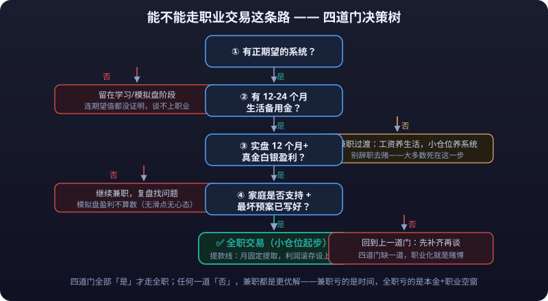

# 05 · Professional Trader Path

> The previous four articles covered "selling skills to institutions / turning them into products"; this one covers the last lifestyle: **<mark>no employer, no startup — living full-time off your own trading system</mark>**. It is also the road with the heaviest survivorship bias, the most emotionally charged narrative, and the cruelest reality.
>
> This article is not "how to trade full-time" but "**<mark>the questions you must answer on paper before going full-time</mark>**": a prerequisite checklist, financial math, income volatility, a day's schedule, psychology and social life, failure-rate reality, and part-time transition.


---

## Prerequisite Checklist Before Going Full-Time



Before quitting to trade full-time, check each item (**<mark>if even one is missing, don't quit yet</mark>**):

| # | Prerequisite | Notes |
|---|---|---|
| ① | Verifiable 2-year continuous live track record | Complete statements/equity curve, not screenshots; includes a full trading journal and reviews that others can audit |
| ② | Family emergency fund ≥ 3 years of living expenses | Full-time trading income is uncertain; size the emergency fund for the "worst case", not the "average case" |
| ③ | Spouse/family consensus | Family support is scarcer than capital; forcing full-time trading against family opposition makes trading pressure and family relations detonate each other |
| ④ | Explicit exit criteria | "X consecutive losing months / <mark>drawdown</mark> hits X% → start job hunting again" — written down, executed on schedule, not left to willpower |
| ⑤ | Cash flow independent of trading income | At least in year one, household expenses don't rely on trading income; trading income is a "bonus", not a "salary" |
| ⑥ | Healthy physical and mental baseline | Chronic insomnia, emotional volatility, and addictive tendencies amplify every full-time trading failure |

> The brutal part of this checklist: **item ① is a hard gate, and most people quit before they even have a verifiable live record.** Achieve ① on small capital first; everything else is just a matter of time.

::: danger The First Gate of Full-Time Trading
**Item ① is a hard gate, and most people quit before they even have a verifiable live record.** "Full-time trading" without two consecutive years of complete statements and review records is essentially substituting courage for mathematics — and the market only accepts mathematics.
:::

### How to Use the Checklist

- Every item needs **presentable evidence**: ① is records your broker/exchange can verify, ② is a bank balance, ③ is a formal family meeting, ④ is a written piece of paper.
- "I'm ready" must survive three follow-up questions: **"Where are the records? How many years does the money cover? After a loss, how long until recovery?"** If you can't answer, you're not ready.
- The checklist isn't one-and-done: re-review it every six months; items ②③④ can silently expire as life changes (buying a home, having a child, losing a job).

---

## The Financial Math of "Full-Time Trading vs Full-Time Employment"

### Basic Formula

```text
Monthly living expenses × 12 = Annual living expenses
Annual living expenses ÷ expected annualized return = Required capital (static)
```

### Worked Example (actual market conditions prevail)

| Monthly expenses | Target annualized | Static required capital | Suggested capital with 20% drawdown buffer |
|---|---|---|---|
| ¥10k | 15% | ¥800k | ~¥1M+ |
| ¥20k | 20% | ¥1.2M | ~¥1.5M+ |
| ¥30k | 20% | ¥1.8M | ~¥2.2M+ |

- **Interpretation**: at ¥20k monthly expenses targeting 20% annualized, the static requirement is ¥1.2M; but sustaining 20% annualized is already a demanding long-run return (very few individual traders exceed it over the long term), and **<mark>equity curves inevitably draw down</mark>** — under the standard "still covers one year of expenses after a 20% drawdown", suggested capital rises above ¥1.5M.
- If the target drops to 10% annualized (a more realistic long-term level), ¥20k monthly expenses need roughly ¥2.4M — **<mark>this is why the math fails for most people who want to trade full-time</mark>**.

### Also Count These Hidden Costs

- Data feeds, market-data licenses, software and hardware costs.
- Trading costs (commissions/**<mark>slippage</mark>**) eroding **<mark>returns</mark>**, especially high-frequency small-capital setups.
- Self-paid social insurance/health insurance, opportunity cost (forgone salary and career development) — the latter is the biggest loss and the easiest to ignore.

### Dynamic Version: Why "Static Math" Isn't Enough

- The static formula assumes "stable annualized returns", but real equity curves are "**profitable months clustered together, unprofitable months stretching long**" — budgeting life around 20% annualized breaks the moment you hit a 0% year.
- Dynamic approach: **<mark>budget using your "worst consecutive 12 months of income" instead of "expected annualized return"</mark>**, and hold an emergency fund sized for the "worst 3 years", not the "worst 1".
- The **<mark>compound-interest</mark>** trap: full-time trading is withdraw-only — you take out living expenses every year, so principal stops compounding; **<mark>"returns must cover living expenses + inflation + trading costs" is the real bar</mark>**, typically requiring noticeably more capital than intuition suggests.
- Quitting before the math checks out is essentially **<mark>substituting courage for mathematics</mark>** — and the market only accepts mathematics.

---

## Income Volatility

- With trading income, **<mark>budgeting by the "average" is the classic mistake</mark>**: a strategy averaging ¥10k/month might deliver "8 unprofitable months + 2 months making ¥60k" — budget on the average and you're broke before month nine.
- Reference basis: plan expenses on the **worst consecutive 12 months** of income, not the mean; assuming "zero trading income" for year one of full-time trading is the safest financial assumption.
- Year-to-year swings are equally huge: bull-market years and choppy years can differ by an order of magnitude; dependence on market conditions exceeds what most traders admit to themselves.
- High income variance → psychological pressure → distorted decisions → even higher variance: **<mark>the downward spiral of full-time trading usually starts with financial anxiety</mark>**.

---

## A Day in the Life of a Professional Trader

::: tip 💡 The First Line of Defense Against Emotional Decisions
This template is reference only — regularity matters more than exact times: **<mark>a fixed schedule, a fixed process, and a fixed review ritual are the professional trader's first line of defense against emotional decision-making.</mark>**
:::

| Time slot | Activity |
|---|---|
| Pre-open (30-60 min early) | Read overnight overseas markets and news, confirm today's plan (what to trade, what conditions trigger it, where **<mark>stop-losses</mark>** sit), check positions and pending orders |
| Trading session | Execute only planned actions; **most of the time is spent waiting** — don't watch for opportunities that aren't there; log the reason behind every action |
| Mid-session gaps | Handle messages; don't leave the screen too long; avoid emotionally doom-scrolling |
| Post-close | Daily review: right/wrong on every trade, whether rules were followed, emotional state log |
| Evening | Research and learning: validating new strategies, backtesting, reading (see [Reading List](../reading-list/)) |
| Weekly | Weekly review: tally **<mark>win rate</mark>**/<mark>risk-reward ratio</mark>/drawdown against the weekly plan; check if the system needs adjusting |
| Monthly | Monthly review + archive equity curve + health/sleep self-check |

::: tip 💡 The Most Important Hour of the Day
The most important hour is **<mark>writing the plan before the open</mark>**: watching the market without a plan is gambling; executing with a plan is trading.
:::

### Schedule Variants for Around-the-Clock/Multi-Market Trading

| Market | Schedule traits | Watch out |
|---|---|---|
| China A-shares/domestic futures | 4-hour session; closest to an office-worker schedule | Regular hours; good for starting out |
| US stocks/overseas markets | Mostly Beijing-time nights | Circadian disruption harms health; design a fixed sleep schedule deliberately |
| Crypto (7×24) | Never closes; easiest to lose control of | Strongly recommend "sessionizing": trade only inside set windows |
| Multi-market portfolio | Three shifts across morning/afternoon/night | The profile with highest rates of sudden health events and insomnia among full-time traders; be cautious |

> The more a market "never closes", the more you need to close it yourself — **what separates the professional from the gambler isn't P&L, it's schedule and process.**

::: danger The Boundary Between Profession and Gambling
**What separates the professional trader from the gambler isn't P&L, it's schedule and process.** Given identical P&L records, some earned theirs through discipline and some won theirs through luck — stretch the timeline and only the disciplined ones remain at the table.
:::

---

## Psychology & Social Life

### Loneliness

- Full-time trading is a one-person office: no colleagues, no meetings, no social structure. Most full-time traders underestimate this.
- Countermeasures: stay active in trading communities/small peer circles, keep a fixed offline sport, and make research/content creation (see [Content Creation](content-creation.md)) a bridge to the outside world.

### Comparing Yourself to "Friends Who Make Money"

- In months you earn, friends earn more; in months you lose, friends post their gains — **comparison is the everyday source of a trader's mental collapse**.
- Countermeasures: compare only with your own equity curve; mute P&L-flaunting feeds (behavioral-finance angle, see [Behavioral Finance](../behavioral-finance/)).

### Facing Your Family When Things Fail

- Full-time trading's greatest debt isn't monetary — it's **letting down the family who supported you**.
- Countermeasures: share your "exit criteria" with family in advance (the contingency should exist before failure); communicate proactively during losing months instead of hiding behind screens; accept that "full-time trading is one way of living, not the measure of your life".

---

## The Reality of "Full-Time Trading Failure Rates"

- Public common-knowledge range (actual market conditions prevail): **<mark>the overwhelming majority of those who quit to trade full-time return to employment within two years</mark>** — usually not because they "lost everything", but because of the compounding of "unstable income + psychological drain + opportunity cost".
- "Someone I know made big money trading full-time" is pure survivorship bias: quitters don't post about it, failures don't launch courses.
- The common profile of survivors (checklist): multi-year validated after-hours track record, sufficient capital (mathematically sound), family support, and a **<mark>clear exit plan</mark>** — success at full-time trading belongs precisely to those who could stop being full-time at any moment.
- A clear-eyed view of the "full-time trading = financial freedom" narrative: **<mark>full-time trading is a career choice, not a wealth destination; for most people the right order is financial freedom first, then full-time trading — not the reverse.</mark>**

### Personal Admin Checklist for Full-Time Traders (Easily Overlooked Traps)

| Item | Notes |
|---|---|
| Social/health insurance | How to keep contributing after quitting, and in which city — directly affects medical reimbursement and future pension |
| Tax | Reporting basis for trading/investment income, thresholds and filing method — clarify in advance (subject to local rules) |
| Residence & household registration | Impact of leaving employment on settlement eligibility, home-purchase qualification, etc. |
| Insurance | Reassess critical illness/medical/life coverage after your income structure changes |
| Agreements | Income arrangements with your spouse, independence of the emergency-fund account — agree upfront to avoid later disputes |

::: tip 💡 The Professional Trader's "Desk"
Most people never consider these items before quitting — then they all erupt at once afterwards. **<mark>The professional trader's "desk" holds more than market software; it holds a personal-admin checklist.</mark>**
:::

### Exit and Return: Act Two After Full-Time Trading Fails

- **<mark>Returning to employment isn't failure — it's executing the contingency plan</mark>**: item ④ "exit criteria" exists precisely so that "going back to work" becomes a planned move rather than flight after psychological collapse.
- Re-entry leverage: trading experience (especially complete statements and reviews) is an asset in the job market — quant roles, broker branches, and risk desks all value "real-world experience" (see [Trading Careers Overview](trading-careers.md)).
- The more common form of return: **partial return** — find a flexible-hours job (consulting, remote, freelance), keep trading and researching after hours, and downgrade "full-time" back to "serious side pursuit".
- Making peace with yourself: failure rates are industry reality, not personal stain; **<mark>the most valuable asset a departing full-time trader takes away is "a trading system genuinely educated by the market"</mark>** — it retains its worth in any new role.

---

## Part-Time Transition Plans

If you've read this far and the conditions aren't met, this is the most rational route:

| Plan | Approach | Suited to |
|---|---|---|
| Keep the job + after-hours trading | Daytime work, evening/weekend reviews and research; validate with spare money in small **<mark>positions</mark>** | The vast majority of people |
| Quant automation | Turn strategies semi-/fully automatic (see [Quant Practice](../quant-practice/)); programs watch the market, human verifies | People who can code |
| Semi-auto + parallel job | Conditional orders/alerts replace watching during workdays; process everything after close | People whose jobs forbid slacking |
| Job → flexible side income → transition | First get content creation/indie development (articles 03/04) generating income, then decide on full-time | Those wanting a gradual exit from employment |
| Partner with institutions | Approach prop/asset managers with results (see [Trading Careers Overview](trading-careers.md)); validate yourself with other people's money | People with strong track records but insufficient capital |

::: tip 💡 The Hidden Advantage of Transitioning Part-Time
The hidden advantage of transitioning part-time: **<mark>with a salary floor, trading decisions stay calmer, reviews get deeper, and failure costs stay contained</mark>** — "taking it slow" is almost always the optimal strategy on this path.
:::

### Time Budget for Part-Time Traders (Per Week)

| Activity | Hours | Notes |
|---|---|---|
| Trade execution & review | 5-8 | Concentrated in pre-open planning + post-close review; intraday delegated to conditional orders/alerts |
| Research & strategy iteration | 3-5 | Weekend blocks for backtesting and research |
| Learning (books/courses) | 2-3 | See [Reading List](../reading-list/) |
| Journaling & data upkeep | 1-2 | Trading journal, equity-curve updates |

- 12-18 hours per week is a reasonable budget for "keep job + after-hours trading"; **more than that starts harming your job; less means you haven't yet matured into a full-time candidate** (common-knowledge reference).
- Advancement signals for part-timers: **"conditional orders replace screen-watching" plus "two consecutive years of uninterrupted weekly reviews"** — only when both hold is it worth reopening the checklist to discuss going full-time.

### Common FAQ

| Question | Answer |
|---|---|
| Can I go full-time with small capital? | The math usually doesn't hold (see Financial Math); validate ability on small capital first, accumulate capital second — order cannot be reversed |
| Does simulated trading count as a live record? | No. Simulated accounts lack real psychological pressure and real slippage; use them only to practice process |
| Must full-time trading mean giving up all spending? | The goal is "controlled spending", not asceticism; checklist item ② 's 3-year emergency fund is already sized at your current standard of living |
| Can I trade until I break even, then quit? | No — "quit after breaking even" is the most common excuse that overrides exit criteria; standards written on paper don't bend to emotion |
| What if my family doesn't support it? | Don't go full-time yet. Show them the records and the plan; prove it with time, not with resignation |

---

## Risk Warning

::: warning ⚠️ Risk Warning
Full-time trading stacks the heaviest triple risk of all career routes: capital risk, psychological risk, and family risk. Financially, most people's capital simply cannot satisfy both demands of "covering living expenses + absorbing drawdowns"; in reality, **the overwhelming majority of those who quit to trade full-time return to employment within two years** (public common-knowledge range; actual market conditions prevail). "Verifiable 2-year live record + 3-year emergency fund + family consensus + exit criteria" — all four are mandatory; miss any one and keep your job. Treat full-time trading as the outcome of being financially and psychologically ready, never as the starting point of changing your fate.
:::
