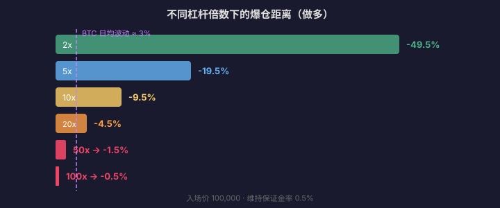

# The Math of Leverage: Why 10x Is Not "10x Profit"

> Most people assume "10x leverage = 10x profit". In reality, once fees, funding rates, slippage, and liquidation mechanics are counted, the **effective return of 10x leverage is far below 10x**, while losses run at nearly full speed. This article exposes leverage for what it really is, with numbers.
>
> **Disclaimer**: All content on this site is for learning and research only and does not constitute investment advice. Markets carry risk; invest with caution.

---

## 1. The Essence of Leverage: A Borrowed Position

::: info 📖 One-Sentence Definition
Leverage is controlling a larger position with a small amount of **<mark>margin</mark>** (collateral). 10x leverage = controlling a 10-unit position with 1 unit.
:::

### What You Assume vs What Actually Happens

| Dimension | Intuition | Reality |
|---|---|---|
| Gain amplification | "Earn 10% when it moves 1%" | True, but fees scale × 10 too |
| Loss amplification | "Lose 10% when it moves 1% against" | True, and you may be liquidated before you can react |
| Fees | "About the same as spot" | Taker fees are charged on the **total position**, not the margin |
| Funding rate | "Negligible" | Settled every 8 hours; significant for long holds |
| Liquidation risk | "A stop-loss handles it" | Wicks/flash crashes can blow past your liquidation price before the stop triggers |

---

## 2. Exact Liquidation Price Calculation

### 2.1 Basic Formulas

```text
Long liquidation price  = Entry price × (1 - 1/Leverage + Maintenance margin rate)
Short liquidation price = Entry price × (1 + 1/Leverage - Maintenance margin rate)
```

### 2.2 Worked Example

```text
BTC entry price: 100,000 USDT
Leverage: 10x
Maintenance margin rate: 0.5%

Long liquidation price  = 100,000 × (1 - 0.10 + 0.005) = 90,500 USDT
Short liquidation price = 100,000 × (1 + 0.10 - 0.005) = 109,500 USDT

→ A mere 9.5% adverse move and you are out
```

### 2.3 Liquidation Distance by Leverage



| Leverage | Long liquidation drawdown | Short liquidation rally |
|---|---|---|
| 2x | −49.5% | +50.5% |
| 5x | −19.5% | +20.5% |
| **<mark>10x</mark>** | **−9.5%** | +9.5% |
| 20x | **−4.5%** | +4.5% |
| 50x | **−1.5%** | +1.5% |
| 100x | **−0.5%** | +0.5% |

::: danger ⚠️ BTC's Average Daily Volatility Is About 3%
At 100x leverage, a normal half-hour BTC swing can liquidate you. Above 50x you are gambling on luck, not trading.
:::

<MarginCalc />

---

## 3. The Amplification of Fees

### 3.1 Taker Fees

Assume a 0.05% taker fee (Binance USDT-margined contracts, for example):

```text
You open a 10,000 USDT position with 1,000 USDT margin (10x leverage)

Entry fee = 10,000 × 0.05% = 5 USDT
Exit fee  = 10,000 × 0.05% = 5 USDT
Total fees = 10 USDT

Share of margin = 10 / 1,000 = 1%
→ A 0.1% adverse move and fees have already eaten 1% of the margin
```

### 3.2 Funding Rate Accumulation

```text
Funding rate: 0.01% per 8 hours (standard value)
Holding 24 hours = 3 settlements
Daily cost ≈ 10,000 × 0.03% × 3 = 9 USDT

Holding one week = 63 USDT = 6.3% of the margin
→ Even if price never moves, you are already down 6.3%
```

### 3.3 Total Holding Cost Estimate

```text
10x leveraged BTC long:
- Entry + exit fees: 1% (of margin)
- Daily funding rate: 0.9% (of margin)
- Estimated slippage: 0.2% (of margin)
- Total day-one cost ≈ 2.1% of margin

→ Price must rise > 2.1% just to break even (0.21% on the underlying at 10x)
→ But a 9.5% drop liquidates you — a severely asymmetric risk-reward
```

---

## 4. Isolated vs Cross: Quarantined Risk or Shared Ammo

| Dimension | Isolated | Cross |
|---|---|---|
| Margin source | Only that position's margin | The account's entire available balance |
| Liquidation consequence | Only that position's margin is lost | Can drag down the whole account |
| Suited for | Exploratory entries; high-risk altcoin contracts | Mature traders with explicit risk control |
| Strength | Risk isolation — "one blast doesn't hurt the main account" | High margin efficiency; harder to hit with a wick |
| Weakness | Easier to liquidate (small margin pool) | One mistake can zero everything |

::: warning ⚠️ Beginner Advice: Always Start with Isolated Margin
The biggest benefit of isolated margin is "the most you lose is this position's margin" — it cannot drag down other positions. Only consider cross margin after you fully understand the liquidation mechanics and can compute liquidation prices precisely.
:::

---

## 5. Effective Leverage: What You Think vs What You Get

```text
Nominal leverage = Position value ÷ Margin

Effective leverage = Nominal leverage × (1 + Holding cost ratio)

Example:
Nominal leverage 10x, holding cost 2.1% of margin
Effective leverage ≈ 10 × (1 + 0.021) = 10.21x

Looks like a small difference?
But at 50x leverage:
Effective leverage ≈ 50 × (1 + 0.021) = 51.05x
Liquidation distance narrows from −1.5% to −1.46%
```

The real killer is not leverage itself, but the combination of **high leverage + high holding cost + crypto's high volatility**.

---

## 6. Practical Recommendations

| Recommendation | Reason |
|---|---|
| Beginners: no more than 3x leverage | Liquidation distance ~33%; plenty of room for error |
| Intermediate: no more than 5–10x | Requires fairly accurate market judgment |
| Always set a stop-loss | The stop is the only line of defense you actively control |
| Use isolated margin | Cap the maximum loss at an amount you are willing to bear |
| Do not hold high-leverage positions overnight | Funding rate + late-night wicks = double risk |
| Compute the liquidation price before ordering | Those who don't know where they exit are already on their way out |

::: warning ⚠️ Risk Warning
Everything in this article is for learning and research only and does not constitute investment advice. Leveraged trading can result in the loss of your entire principal and even debt to the exchange. Fully understand the risks before participating.
:::
