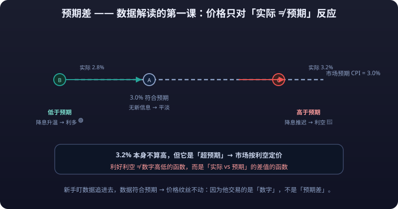

# 01 · Macro Data Reading: Expectation Gaps, Structure Breakdown, and a Complete Interpretation Template

> The same "CPI 3.2%" — why do some shout bearish while others shout bullish? Because **the number itself means nothing; the gap between the number and expectations is what matters**. This article builds the "**<mark>expectation gap</mark>**" mindset, then unpacks reading details for **<mark>CPI</mark>**, **<mark>PMI</mark>**, **<mark>nonfarm payrolls</mark>**, and the **<mark>unemployment rate</mark>** one by one, closing with a replicable complete template for interpreting macro data.

---

## 1. Expectations and Expectation Gaps: Lesson One of Data Reading



Markets are arenas of **<mark>trading against expectations</mark>**: asset prices already embed the market's shared expectations of the future; on release, price reacts only to the part where "actual ≠ forecast". That gap is the **expectation gap**.

### Numeric Example: Is CPI 3.2% Bullish or Bearish?

Suppose the Fed is in a "rate-cut debate" phase and the market expects this month's **<mark>CPI YoY</mark>** at **3.0%**:

| Scenario | Actual release | Expectation gap | Market reading | Equity reaction (reference) |
|---|---|---|---|---|
| A | 3.0% | 0 (in line) | Business as usual, no new information | Muted |
| B | 2.8% | 0.2pp below forecast | Inflation falling faster than expected → rate-cut hopes rise | Bullish for stocks |
| C | 3.2% | 0.2pp above forecast | The "prices returning to 3.0%" expectation **fails** → cuts delayed | Bearish for stocks |

**Key conclusion**: in scenario C, 3.2% isn't high in itself, but it is "above expectations" — the easing path the market had bet on is interrupted, and assets get priced as bearish. **Bullish and bearish are never a function of the number's level but of the gap between "actual vs forecast".**

::: tip Lesson One of Data Reading
**Bullish and bearish are never a function of the number's level but of the gap between "actual vs forecast".** 3.2% isn't high in itself, yet "0.2pp above expectations" makes assets price as bearish — trade the expectation gap, not the number.
:::

### Where Do Expectations Come From?

- Median of Bloomberg/Reuters economist surveys (consensus forecast)
- Institutional nowcasting models (Atlanta Fed GDPNow, New York Fed Nowcasting, etc.)
- Rate market pricing (hike/cut probabilities implied by fed funds futures)

::: tip 💡 In-Line Data Almost Never Moves Markets
**Data matching forecasts almost never produces a move**; big deviations from forecasts are the source of volatility. Many beginners chase right at the release only to watch price barely twitch because the data matched forecasts — they were trading the "number", not the "expectation gap".
:::

---

## 2. Breaking Down the CPI Structure

### Core CPI vs Headline CPI

| Indicator | Definition | Use |
|---|---|---|
| Headline CPI | Full basket of goods and services prices | News headlines; shapes public perception |
| Core CPI | Excludes **food and energy** | Policy reference; less volatile, better reflects inflation trend |

Food and energy prices are heavily influenced by weather, geopolitics, hog cycles and other external factors, swing violently monthly, and easily mask trends. Central banks watch trends, which is why **<mark>core CPI</mark> is the number with the strongest policy implications**.

### How to Read the Components: Shelter, Energy, Food

- **Shelter**: about 1/3 of US CPI weight, the largest single component. Rent is extremely sticky — **only when the shelter component peaks and turns down is US inflation's substantive decline confirmed**.
- **Energy**: transmits directly from oil prices with large monthly swings — **MoM beats YoY for reading it**; oil surges/slumps often distort headline CPI beyond recognition.
- **Food**: same logic — driven by weather and supply events; single-month swings say nothing about trend.

### The "Hog Cycle": A Distortion Common Knowledge in China's CPI

Pork carries a **significant weight** in China's CPI; the hog cycle (breeding-sow inventory → slaughter supply 10-14 months later → pork price) periodically pulls/drags CPI:

- During pork upcycles, CPI may be pushed higher even if other prices are stable;
- During pork downcycles, CPI can be pressed to extremely low or even negative readings — **a low CPI then does not mean deflation pressure; it's just the hogs helping**.

So when reading China's CPI, always **pull the pork component out separately**: CPI excluding pork is the reading that reflects real demand.

### Why the Fed Watches PCE Instead of CPI

The Fed's preferred inflation gauge is the **<mark>core PCE</mark> price index** (the Fed's 2% target definition), not CPI. Differences:

| Difference | CPI | PCE |
|---|---|---|
| Compiled by | Bureau of Labor Statistics (BLS) | Bureau of Economic Analysis (BEA) |
| Data sources | Consumer expenditure survey (small sample) | Business sales data (broad coverage) |
| Weighting | Fixed basket | Dynamic weights (auto-reflects shifting consumption structure) |
| Healthcare | Mostly consumer out-of-pocket | Includes employer-paid medical spending |
| Level tendency | Usually ~0.3-0.5pp above PCE | Milder; the policy target gauge |

::: tip 💡 CPI Is the Dress Rehearsal; PCE Grades the Final Exam
After every CPI surprise, markets turn to the same month's PCE released two to three weeks later — **CPI is the rehearsal; PCE is the Fed's official grading**.
:::

---

## 3. Reading the PMI

### Boom-Bust Line 50: The Passing-Mark Logic

PMI uses 50 as its **<mark>boom-bust line</mark>**:

| PMI | Meaning |
|---|---|
| Above 50 | Manufacturing **<mark>expanding MoM</mark>** |
| Equal to 50 | Flat vs previous month |
| Below 50 | Manufacturing contracting MoM |

::: tip 💡 The 50 Line Is Not a Good/Bad Boundary
50 only divides "expanding vs contracting MoM"; **it is not a good/bad boundary**. 50.5 counts as lackluster-but-stable, 49.5 as slight contraction. What truly matters is **trend and components**, not any single month's print.
:::

### New Orders − Finished-Goods Inventory: The "Inventory Cycle" Signal

PMI is a survey-based forward-looking indicator; its most valuable part is component combinations. Watch the relationship between two core components:

| New orders | Finished-goods inventory | Signal |
|---|---|---|
| Rising | Falling | Demand improving, inventory being digested → precursor to active restocking, bullish |
| Rising | Rising | Demand warming but firms restocking cautiously, or demand overheating superficially |
| Falling | Rising | Demand weakening, inventory piling up → likely future discounting to destock, bearish |
| Falling | Falling | Firms actively destocking and cutting output → digestion phase before a bottom |

The "new orders − finished-goods inventory" spread works as a simple **<mark>leading index</mark>**: when the spread bottoms and turns up, it often leads industrial profits and equity turning points by several quarters (see [Industry Data Reading](industry-data.md) for the full inventory cycle).

### Caixin vs Official PMI: Sample Differences

China has two manufacturing PMIs:

| Aspect | Official (CFLP/NBS) PMI | Caixin PMI |
|---|---|---|
| Compiled by | China Federation of Logistics & Purchasing + National Bureau of Statistics | Caixin + S&P Global |
| Sample | Large/medium/small firms, weighted toward **large-medium/SOE** names | Weighted toward **small-medium/private/export-oriented** firms |
| Release | Last day of each month (9:30) | First business day of each month (9:45) |
| Use as reference | Aggregate, policy orientation | SME and foreign-trade health |

::: tip 💡 The Two PMIs Are Convincing Only When They Agree
The two datasets are **convincing only when directionally consistent**; divergence (official weak, Caixin strong) usually signals "big firms weak, small firms strong" or vice versa — structural differentiation rather than an aggregate signal.
:::

---

## 4. Reading Nonfarm Payrolls

The NFP report (US Department of Labor, first Friday of each month, 20:30/21:30 Beijing time) contains a trio: **nonfarm job additions**, the **unemployment rate**, and **<mark>average hourly earnings growth</mark>**. The three numbers often contradict each other.

### How to Weigh the Three Signals

| Signal | Meaning | Market impact (reference) |
|---|---|---|
| Job additions beat | Economy resilient | Bullish dollar and stocks; but if it delays cuts, good news turns bad |
| Unemployment rate unexpectedly rises | Labor market weakening | Bearish dollar, bullish cut expectations |
| Hourly earnings rise YoY | Inflation pressure persists | Bearish for cut expectations |

### Weighing Three Contradictory Signals in One NFP Report

Numeric example: one month's NFP report —

- Job additions 250k (forecast 180k, **a large beat**)
- Unemployment 4.3% (previous 4.0%, **unexpectedly up 0.3pp**)
- Hourly earnings +3.9% YoY (forecast 4.1%, **below expectations**)

Surface contradictions: jobs strong → yet unemployment rose; wage growth slowing → wage-price pressure easing. How does the market weigh them?

- **First look at the driver**: if the unemployment uptick is driven by "rising labor force participation" (more people entering to look for work), that's supply-side improvement and actually benign; only if driven by falling employment does demand weaken.
- **Then look at wages**: below-expectation earnings mean the wage-price spiral is cooling, relieving the "strong jobs → sticky inflation → no cuts" transmission chain.
- **Reference conclusion**: such a combination is often read as "resilient economy but easing inflation pressure" — neutral-to-positive for risk assets.

> Common knowledge: the first wave after NFP often takes direction from **whichever number looks most extreme**, but the **30-60 minute post-open direction** is professional money's true verdict after weighing. Don't chase the first wave.

::: warning The First Wave After NFP Is a Trap
**The 30-60 minute post-open direction is professional money's true verdict after weighing.** The first wave after release is usually just an emotional reaction to "whichever number looked most extreme"; chasing it means using retail money to fill institutional orders.
:::

### The "Revisions" Trap in Employment Data

- The NFP **<mark>initial print</mark>** gets **heavily revised up or down over the following two months** as samples are supplemented; revisions exceeding 100k are routine — e.g., the March 2024 initial print was later cumulatively revised down by hundreds of thousands.
- Common knowledge: **the initial value is a provisional number treating "probable" as "certain"**. Heavy betting on initial prints means building decisions on numbers that will be rewritten.
- Right approach: follow the **three-month moving average** and cumulative revision trend; don't fixate on a single month's initial print.

---

## 5. Details of the Unemployment Rate

### U3 vs U6

| Measure | Definition | Numerical relation |
|---|---|---|
| U3 | Official unemployment: unemployed and actively seeking / labor force | The headline rate, most quoted |
| U6 | Broadest measure: U3 + marginally attached workers + involuntarily part-time for economic reasons | Usually ~1.5-3pp above U3 |

**U3 falling while U6 rises** says the surface unemployment rate looks fine, but "hidden unemployment" (people giving up the search, those forced into part-time) is growing — labor-market quality deteriorating.

### Labor Force Participation

**<mark>Labor force participation rate</mark>** = labor force / working-age population; it explains the unemployment rate's "illusions":

- **Falling participation** (people exiting the labor force) passively lowers the unemployment rate — the denominator shrinks, the number improves, but employment hasn't.
- Post-pandemic US participation has stayed persistently below pre-pandemic levels, so read claims of "historically low unemployment" with a discount.

---

## 6. The "Time-Lag" Awareness of Data

Nearly all macro data passes through a **initial → revised → final** revision chain:

| Stage | Traits | Trading implication |
|---|---|---|
| Initial (preliminary) | Incomplete sample, released fastest | Biggest market reaction, least reliable |
| Revised | Amended after supplementary samples | Often ignored but closer to truth |
| Final | Fully revised | Only affects historical series, not current trading |

::: warning ⚠️ Don't Build Long-Term Conclusions on Initial Prints
GDP, NFP, and CPI all undergo systematic revision. **Don't build long-term conclusions on initial prints**; even in short-term data trades remember — you're trading "market sentiment about the initial print", not "economic truth".
:::

---

## 7. The Complete Macro Data Interpretation Template

For any macro data release, walk six steps (also fixable as your own notes template):

```text
① What is the data      → name, definition, coverage period (CPI YoY? core? seasonally adjusted?)
② What was expected     → what was consensus? what was the market betting on?
③ What was actual       → how far off the forecast? how many standard deviations?
④ What's the structure  → who drove the gap? break down by component/region/industry
⑤ First market reaction → which assets moved at release? direction and magnitude? consistent with intuition?
⑥ Sustainability        → single-month noise or trend turning point? which follow-ups (PCE/PMI/minutes) will verify?
```

**Template quick-fill (CPI example)**:

| Step | Entry |
|---|---|
| ① Data | US CPI YoY (headline + core) |
| ② Expected | Core CPI forecast 3.2%; market pricing a 70% chance of a September cut |
| ③ Actual | Core 3.0%, 0.2pp below forecast |
| ④ Structure | Slowing shelter was the main driver; energy dragged |
| ⑤ First reaction | Treasury **<mark>yields</mark>** fell, gold jumped, Nasdaq gapped up |
| ⑥ Sustainability | Wait for PCE in two weeks; if PCE falls in the same direction, the cutting logic is confirmed |

---

## Risk Warning

::: warning ⚠️ Risk Warning
Macro data releases are often accompanied by violent gaps, widened bid-ask **<mark>spreads</mark>**, and vanishing **<mark>liquidity</mark>**; heavy positions or **<mark>market orders</mark>** can fill at terrible prices. The "market expectations" underlying expectation-gap judgments shift dynamically, and initial prints are frequently revised substantially — **decisions based on initial data carry extra uncertainty**. All indicator definitions, release arrangements, and numeric examples here are teaching references only; **defer to the latest official definitions and latest market conditions**. This article is not investment advice.
:::
