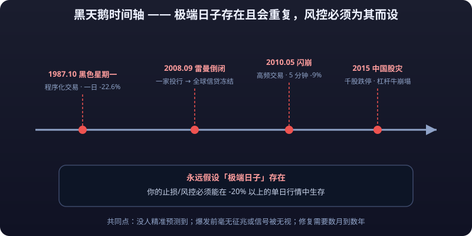

# 02 · Famous Crashes and Black Swans

> The previous article covered how bubbles **rise slowly**; this one covers how crashes **come down in an instant**. A single-day -22.6% in 1987, -9% in five minutes in 2010, a 30% Swiss-franc gap in 2015, negative oil prices in 2020 — these extreme moves that "textbooks barely dare to describe" are the final exam for your risk-control system. Each section gives what happened, how markets reacted, and the lessons, closing with a checklist of what black swans teach ordinary traders.
>
> **Disclaimer**: Everything on this site is for learning and research only and does not constitute investment advice. Markets carry risk; invest with caution.

---

## I. 1987 Black Monday: Programmed Trading and -22.6%

### 1.1 What Happened

On Monday, October 19, 1987, U.S. stocks plunged from the open: the Dow Jones Industrial Average fell **508 points in a single day, -22.6%** — still the largest single-day percentage drop in Dow history. The decline traced back to no single piece of bad news; instead, "**portfolio insurance**" programmed strategies failed collectively.

### 1.2 How Markets Reacted

- Portfolio insurance worked like this: when the market fell, automatically sell index futures to **hedge** — the deeper the fall, the more you sold. That day, institutions triggered the strategy simultaneously and futures selling poured down like a flood.
- The futures crash dragged down the cash index, which triggered more hedge selling — a self-reinforcing "**sell-fall-sell**" spiral.
- When U.S. stocks finished falling, the world followed: London, Tokyo, and Hong Kong plunged over the following days; on October 20 global equity markets fell 20%-40% broadly.
- The Dow needed about two years to recover its October 1987 losses. But unlike 1929, **this time there was no Great Depression** — the Fed publicly promised **<mark>liquidity</mark>** that very day, and central-bank rescue became a "standard move" for the first time.

### 1.3 Lessons

- **Homogeneity of a single strategy is systemic risk**: when everyone runs the same hedging logic, hedging itself becomes a stampede.
- In 1988, the U.S. introduced **<mark>circuit breakers</mark>**: index declines of 7%/13%/20% trigger graduated halts, giving the market a "cooling-off period" — Black Monday's institutional legacy to the world.
- A 22.6% drop means: **anyone fully invested with no protection and no <mark>stop-loss</mark> lost a quarter of their wealth in one day**.

### Takeaways

- Always assume an "extreme day" exists: your stops and risk controls must survive single-day moves beyond -20%.
- Central bank rescues stop the bleeding but don't change long-term trends; mistaking the "policy bottom" for the "market bottom" is a common misjudgment.

---

## II. The 2008 Fall of Lehman: From One Investment Bank to a Global Credit Freeze

### 2.1 What Happened

On September 15, 2008, Lehman Brothers — 158 years old, 26,000 employees, America's fourth-largest investment bank — declared **<mark>bankruptcy</mark>**, the largest bankruptcy in U.S. history (liabilities exceeding $600 billion). Lehman held massive subprime-related MBS/CDO exposure at **<mark>leverage</mark>** above 30x at its peak; when counterparties stopped trading and funding channels closed, liquidity evaporated within a week.

### 2.2 How Markets Reacted

- The transmission chain unfolded step by step:
  - **Lehman defaults → counterparty risk repriced across the board**: who owed Lehman money? Who held Lehman CDS? The market discovered it "couldn't even count them," and trust collapsed.
  - **AIG neared collapse**: AIG had underwritten hundreds of billions in subprime CDS. After Lehman fell, on September 16 the U.S. government was forced to take over AIG with $85 billion — **an insurance company so big the government couldn't watch it die**.
  - **Money market funds broke the buck**: on September 16 the Reserve Primary Fund fell below $1 net asset value due to Lehman commercial paper, triggering a market-wide **<mark>run</mark>**.
  - **Global credit froze**: banks stopped lending to each other, LIBOR spiked, real-economy financing seized; within two weeks, the world's central banks coordinated rate cuts and liquidity injections unprecedented in history.
  - In October, global equities crashed in succession, with many national indexes down over 20% in a week; China's A-shares, sliding from their 6124-point peak of 2007, were hit by collapsing external demand compounded by violent swings around the four-trillion stimulus.

### 2.3 Lessons

- **30x leverage means a 3% move on assets exhausts all equity** — Lehman's fall wasn't "one bad decision"; it was the arithmetic inevitability of a leverage chain.
- The financial system's fragility lies not in any single point but in **the way everything is connected**: one institution's default spreads through claims, CDS, repo, and money funds, link by link.
- "**<mark>Too big to fail</mark>**" becomes "too big to be allowed to fail" mid-crisis (AIG and Citigroup were rescued; Lehman wasn't) — **whether you get saved depends on politics and system-wide calculations, not on how unfair your fate is**.

### Takeaways

- A borrower's risk isn't "he looks fine" — it's "who is he connected to, and who is connected to him." **You only understand the risk when you understand your counterparty's counterparty.**
- The personal version of Lehman = high leverage + dependence on a single funding channel (one salary, one fund, one exchange). Keeping a cash buffer is your own "refinancing window."

---

## III. The 2010 Flash Crash: High-Frequency Trading and -9% in Five Minutes

### 3.1 What Happened

On the afternoon of May 6, 2010, the Dow plunged nearly 9% in about five minutes (at one point down roughly 1,000 points to 9,869), then recovered almost all of it within twenty minutes. U.S. volume set a record of $1.85 trillion that day; individual stocks printed absurd quotes — "$0.01 trades", "$100,000 sell orders" — and the market lost its price-discovery function within minutes.

### 3.2 How Markets Reacted

- The post-mortem found that a mutual fund (Waddell & Reed) had placed an algorithmic sell order of about $4.1 billion in E-mini S&P 500 futures at 2:32 p.m. (an execution algorithm spreading the sale over time, ignoring prevailing liquidity).
- High-frequency trading (HFT) programs, after absorbing the initial flow, rushed to "**sell first, think later**", pulling quotes or selling in reverse; market liquidity vanished within seconds — **order books went hollow and prices fell freely**.
- Slower exchanges paradoxically became anchors: venues with slower matching kept executing at stale prices, creating cross-exchange arbitrage and price chaos.
- In 2015, British trader Navinder Singh Sarao was charged by U.S. prosecutors for years of "spoofing" (placing large fake orders to lure buyers or sellers, then canceling) — whether his tactics directly caused the flash crash remains debated, but the case became a milestone in regulators' crackdowns on spoofing.

### 3.3 Lessons

- **Liquidity does not exist by default**: order books that look thick in normal times can go **<mark>to zero</mark>** within seconds under panic plus automation — "20% **<mark>slippage</mark>**" genuinely exists in extreme markets.
- Algorithms don't cooperate; they compete. When every program runs for the exits first, the market loses its only buyer.
- After the **<mark>flash crash</mark>**, the U.S. rolled out cross-market circuit breakers and **Limit Up-Limit Down bands**: any stock moving too far within five minutes is halted to cool off.

### Takeaways

- An order being placed ≠ an order being filled: **market orders in extreme markets can fill at catastrophic prices**; for large orders always use **<mark>limit orders</mark>**, batch them, and split them.
- "The price fell 9% in five minutes and came back" means: **if you were <mark>liquidated</mark> during the flash crash, you forfeited the right to see it come back** — that is leverage's one-sided cruelty in extreme markets.

---

## IV. The 2015 A-share Crash: Off-Exchange Margin Financing, Thousands of Limit-downs, and a Failed Circuit-Breaker Pilot

### 4.1 What Happened

From mid-2014 to June 2015, driven by the "reform bull" narrative and enormous leveraged money, the Shanghai Composite soared from about 2,000 points to **5178 points on June 12, 2015**, while the ChiNext more than tripled in just over a year. The bull market's core fuel was **<mark>off-exchange margin financing</mark>**: informal lenders extended funds to retail investors at 1:4, 1:5, even 1:10 ratios, monitored the accounts themselves, and force-closed positions once losses hit warning lines.

### 4.2 How Markets Reacted

- **In mid-June 2015, the securities regulator moved to clean up off-exchange financing**, forcing leveraged positions to unwind and stopping the bull cold.
- From June 15 to early July, the Shanghai Composite fell about 30% in two weeks, with **thousands of stocks limit-down** (hundreds to over a thousand hitting the daily limit unable to trade); intraday on July 8 over a thousand stocks sat limit-down as liquidity dried up — "wanting to sell, unable to."
- Rescue measures rolled out one after another: RRR and rate cuts, 21 brokerages contributing stabilization funds, the China Securities Finance Corporation buying directly, public security organs investigating malicious short-selling — the market briefly stabilized, then fell again in late August (the "second crash").
- **On January 1, 2016, the circuit-breaker pilot took effect** (CSI 300 falling 5% halts trading 15 minutes, 7% closes the market). The result:
  - It triggered on January 4, the very first trading day; on January 7 the second halt came just 29 minutes after open.
  - **Suspended after only four trading days** — the A-share circuit breaker gave no "cooling-off period"; in a panic it became a "panic amplifier" (retail investors rushed to liquidate before each halt, accelerating the fall).
- For the full year 2015 the Shanghai Composite swung 72%; countless accounts levered 5-10x were wiped out in one or two waves of thousand-stock limit-downs, and those who blew through their margin **owed the financing companies large debts**.

### 4.3 Lessons

- The essence of off-exchange financing was "**stock trading on **<mark>margin</mark>** of 10%-20%**": it wasn't a rerun of 1929 — it *was* 1929. Thousand-stock limit-downs = the whole market force-liquidating simultaneously, with liquidity failing completely at the limit-down board.
- The "national team" can prop up the index but **cannot prop up individual names and leveraged accounts**: forced liquidations don't check policy before executing.
- Circuit breakers work in the U.S. and failed in the A-share market because **institutional transplants must respect microstructure** (a market with daily price limits and heavy retail participation turns breakers into accelerants).

### Takeaways

- Stay away from every form of "non-standard leverage" (informal financing, black platforms, borrowing to trade crypto) — **liquidation rules and fund safety enjoy no legal protection**.
- The A-share "thousand-stock limit-down" and crypto's "wick crashes" are the same animal: **when trading halts or liquidity dies, even stop-loss orders may not fill** — control risk with **position sizing**, not faith in stops getting filled.

---

## V. The 2015 Swiss Franc Black Swan: A Central Bank Abandons Its Peg and Forex Brokers Implode

### 5.1 What Happened

During the 2011 eurozone debt crisis, safe-haven money flooded into the Swiss franc. To protect exporters, the Swiss National Bank (SNB) set a **floor of EUR/CHF 1.20** in September 2011 and pledged "unlimited intervention". On January 15, 2015, without warning, the SNB abandoned the floor; the franc appreciated against the euro about **30%** instantly (nearly 40% intraday).

### 5.2 How Markets Reacted

- Forex is heaven for **margin** trading: 100-500x leverage, razor-thin **spreads**; EUR/CHF trades hugging the intervention line looked "risk-free" and became a popular retail and institutional "arbitrage" position.
- The announcement came at 9:30 a.m. Swiss time; **the market gapped 30% within tens of seconds** — virtually no stop-loss or limit orders could fill, and accounts closed at "first price after the gap" or worse, blowing past zero.
- Retail and brokers both got killed:
  - **Several forex brokers, including Alpari UK and Excel Markets, went straight into insolvency** (client **<mark>negative balances</mark>** unrecoverable; company funding chains snapped).
  - FXCM lost $225 million and survived only via emergency funding (a $300 million Leucadia loan); its shares fell 88% in a day.
  - Deutsche Bank lost €150 million in a day; major banks' combined losses ran into billions.
- "An extreme market where even stops can't execute" became this event's textbook footnote: **a stop-loss order is not a guarantee of execution — it is merely an instruction to sell at market**.

### 5.3 Lessons

- Central bank policy is **sovereign discretion**: however "firm" a commitment, it can reverse overnight; reliability of a promise cannot be a basis for positioning.
- High leverage + low-volatility instruments (forex, stablecoins, index scalping) are **where gap risk concentrates**: 0.1% moves on ordinary days, 30% on extreme ones — liquidation and negative balance lie milliseconds apart.
- Behind "unlimited intervention" stands "unlimited printing costs" — **the heavier the promise, the costlier to honor, the likelier the reversal**.

### Takeaways

- Before using any broker or exchange, verify that **negative balance protection, segregated accounts, and compensation funds actually exist**; "platform runs away" tends to coincide with "market goes extreme".
- Never bet heavily on "certainty trades pinned to a policy line" — the higher the certainty, the fiercer the backlash when it's falsified.

---

## VI. 2020 Negative Oil Prices: A Storage Squeeze and the Cruelty of Futures Contracts

### 6.1 What Happened

In March-April 2020, COVID froze global travel and oil demand collapsed; after OPEC+ talks broke down, Saudi Arabia launched a price war and supply rose rather than fell. Global tank farms (especially the Cushing delivery hub in the U.S.) neared capacity. On April 20, 2020, **the WTI May contract (the day before its last trading day) settled at -$37.63 per barrel** — the first negative price in oil history.

### 6.2 How Markets Reacted

- Futures price = spot price + storage/financing costs. With Cushing full, **longs' "right to take delivery" became an "obligation to pay someone to take it"**: holders of the May contract who didn't close out would take physical oil at month-end, with storage costs exceeding the oil's value.
- Longs stampeded in the final two hours: the May contract fell from about $18 to near -$40 in a day on record volume, **liquidity vanishing entirely in negative territory**.
- Retail holders of WTI May longs (that year's "paper oil" products, dip-buyers) suffered account blow-throughs: losing not just margin but owing the difference at negative prices — ICBC's "Crude Oil Treasure" product blew up on exactly this, leaving many investors owing the bank large sums.
- June and deferred contracts stayed positive (markets expected recovery), producing a rare calendar structure with the front-back spread exceeding $60.

### 6.3 Lessons

- **A futures contract is a delivery obligation, not a bottom-fishing tool**: contracts approaching delivery are dragged back by physical reality — a future nobody wants to take delivery of can go to zero, or below.
- "It can't fall below zero" is retail fantasy: **prices have no floor — only your margin does**.
- Retail participation in oil/commodity products is an information-asymmetric game against counterparts who own tanks, ships, and delivery channels.

### Takeaways

- For retail commodity futures: **trade only the most active contract, roll ahead of expiry, never hold into delivery month**. For products like "paper oil", first learn exactly which contract they track and what the delivery and settlement rules are.
- "All-time lows" are not a reason to buy — **negative prices proved there are new lows beneath new lows, while margin has only one line**.

---

## VII. The 2022 Luna/UST Death Spiral and the Collapse of FTX

### 7.1 What Happened

- **Luna/UST (May 2022)**: UST was Terra's algorithmic stablecoin, maintaining a 1:1 peg through the promise that one UST could always be exchanged for $1 worth of LUNA; Anchor Protocol added a 20% yield on deposits. From May 8, 2022, huge UST sales hit the market, transmitting redemption pressure onto LUNA (the mechanism sold LUNA to defend UST). LUNA began collapsing from about $80, forming **a <mark>death spiral</mark>: UST depegs → LUNA gets dumped → LUNA crashes → UST becomes even harder to redeem**. Around May 13, LUNA traded at four decimal places out; its market cap fell from over $40 billion toward zero.
- **FTX (November 2022)**: On November 2, CoinDesk revealed that Alameda Research's (the market maker affiliated with FTX founder SBF) balance sheet leaned heavily on FTX's own FTT token. Rival Binance announced it would dump FTT, sparking a run; from November 6-9 users attempted over $6 billion in withdrawals and FTX froze withdrawals. **On November 11, FTX filed for bankruptcy** — an industry leader once valued at $32 billion went from run to bankruptcy in under a week. Subsequent proceedings showed FTX had routed customer deposits to Alameda for leveraged trading, with a shortfall estimated at $8-10 billion.

### 7.2 How Markets Reacted

- During the Luna spiral, BTC slid from $40,000 toward $26,000 within days; Terra stakers and Korean retail investors were devastated, and those who bought LUNA high were almost entirely wiped out.
- FTX's collapse triggered "contagion of trust": users withdrew from exchanges en masse (the self-custody wave), crypto lenders (BlockFi among others) froze and failed in sequence, and Bitcoin fell to about $15,500 in November 2022.
- Regulation tightened across the board: in 2023 SBF was convicted on multiple fraud counts; the U.S., EU, Hong Kong, and others accelerated crypto legislation, clarifying segregation requirements for exchange client assets.

### 7.3 Lessons

- **A death spiral needs only one trigger: shaken confidence**: the algorithm's math was correct, but the math assumed "someone will buy" — in a panic, nobody does.
- An exchange's "customer assets" were never an accounting fact, only a **promise backed by trust**: misappropriation, rehypothecation, and reinvestment are default behavior inside unaudited black boxes (see [Chapter 08 - Pitfalls](../pitfalls/) on scam detection).
- Once a run begins with "everyone else is withdrawing", **whoever moves slowest determines how big the loss is** — cash liquidity is your only weapon when trust collapses.

### Takeaways

- Keep large crypto holdings only in cold wallets; leave on exchanges the minimum balance needed to trade.
- "20% APY stablecoin deposits" and "exchanges that leverage customer funds" are two faces of the same coin: **behind every high-yield promise, someone is running naked**.

---

## VIII. What Black Swans Teach Ordinary Traders

Put the eight extreme events side by side and the lessons condense into one table:

| Extreme event | Core mechanism | Who got burned | Institutional legacy |
|---|---|---|---|
| 1987 Black Monday | Homogeneous programmatic hedging | Unprotected fully-invested holders | Circuit breakers |
| 2008 Lehman | 30x leverage + counterparty contagion | Highly leveraged institutions | Dodd-Frank, stress tests |
| 2010 Flash Crash | Algorithmic liquidity vanishing instantly | **Market order** users | Limit Up-Limit Down, spoofing bans |
| 2015 A-share crash | Market-wide forced liquidation of informal margin | Financed retail | Cleanup of shadow financing, leverage regulation |
| 2015 Swiss franc | Central bank pledge reversed overnight | Forex retail and brokers | Negative balance protection requirements |
| 2020 Negative oil | Delivery obligations + storage squeeze | Front-month bottom fishers | Revised negative-price trading rules |
| 2022 Luna/FTX | Algorithmic depeg + platform misappropriation | Stakers and exchange users | Client asset segregation legislation |

::: danger 💀 Position Size Is the First Stop-Loss
**In extreme markets stop-loss orders may not fill and slippage can be measured in whole percentages — position size is the true first stop-loss: small positions keep you alive when stops fail.** Thousand-stock limit-downs, gaps, flash crashes, and negative prices all repeat this iron law.
:::

**What black swans teach ordinary traders**:

1. **Never overweight a single asset**: one stock in 1929, one asset class (property) in 1989, one concept stock in 2000, one coin in 2022 — concentrated bets have only one profile: best feeling on the way up, fastest path to zero on the way down.
2. **Never play with money you can't afford to lose**: living expenses, house down payments, children's tuition, borrowed money. Black swans don't choose victims — but they socially ruin only those who couldn't afford the loss.
3. **Stop-losses assume liquidity exists**: thousand-stock limit-downs, gaps, flash crashes, and negative prices all prove stops may not fill and slippage can run to double digits. **Position size is the first stop-loss**: small positions keep you alive when stops fail.
4. **A black swan's consequences have nothing to do with its probability**: the franc gap's probability was 0.001%; when it happened, it was 30%. **Evaluate low-probability, huge-consequence events by "can I survive it?", not "will it happen?"**
5. **Central bank/government pledges ≠ guarantees**: currency floors, bailout rhetoric, unlimited easing — all can reverse overnight. Policy is human decision, and humans change their minds.
6. **Liquidity is your last weapon**: hold cash or near-cash at all times and you can choose "not to sell" when others are forced to — simply avoiding liquidation is itself a return.
7. **After every crash comes "this time is different"**: new rules and new mechanisms make markets look more mature — then the next black swan arrives in a way nobody imagined. **Reverence for history is reverence for human nature.**

---

::: warning ⚠️ Risk Warning
Every extreme event described here is historical fact presented for teaching purposes; nothing here constitutes investment advice. Extreme markets are unpredictable, unstoppable, and inescapable — betting on a black swan's direction (shorting panics, catching crashing knives) is itself highly speculative. Every case above converges on one conclusion: **against extreme markets, position management and capital planning are the only reliable protection**. Leveraged trading can wipe out your principal and even leave you in debt (negative balance); participate only with money you can afford to lose.
:::
