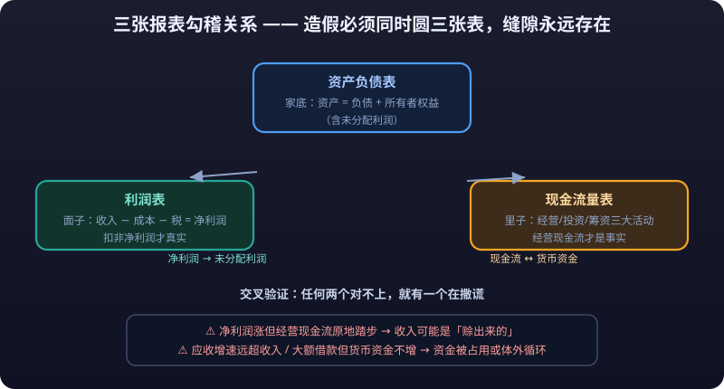

# 01 · Reading the Three Statements Closely

> Financial reports are letters companies write to their shareholders: the balance sheet describes the "net worth", the income statement the "face", and the cash flow statement the "substance". This article reads each of the three statements line by line, explains how they tie together, provides a 10-item "earnings quality" checklist, and finishes by walking through a full analysis with the simplified statements of a fictional company.

---

## 1. The Balance Sheet: Net Worth and Holdings

**Core identity: Assets = Liabilities + Owners' Equity**

- **Assets**: resources the company owns or controls (cash, inventory, plants, receivables, intangibles).
- **Liabilities**: money owed to others (bank loans, accounts payable, advances from customers).
- **Owners' Equity**: the portion that truly belongs to shareholders (paid-in capital, capital reserve, retained earnings).

This statement always balances: borrow 1 million, shareholders contribute 1 million, and total assets on the books are 2 million. The essence of fraud is making this balance look plausible while stuffing water into some line item.

### Key Line Items One by One

| Item | Normal | Red Flags |
|---|---|---|
| Cash | Matches scale of operations | "**<mark>High cash and high debt</mark>**": large deposits sitting idle while borrowing heavily at high rates |
| **<mark>Accounts Receivable</mark>** | Grows in line with revenue | Growth far outpacing revenue, aging receivables, heavy concentration among a few big customers |
| Inventory | Matches production and sales pace | Sudden surge with slowing turnover (unsold goods or hidden costs), inventory mix inconsistent with cost structure |
| Prepayments | Normal stockpiling | Large prepayments to related parties or newly formed small companies |
| Fixed Assets / Construction in Progress | Matches capacity expansion | CIP stays "in progress" for years without being capitalized, abnormally large amounts |
| **<mark>Goodwill</mark>** | Result of acquisition premiums | Frequent premium acquisitions, goodwill as an outsized share of net assets (**<mark>impairment</mark>** can detonate at any time) |
| Intangible Assets | Technology / land / licenses | A sudden large unexplained intangible (often used to park profits) |
| Short-term Borrowings | Working-capital financing | Far exceeding operating needs, constantly "borrowing new to repay old" |
| Long-term Borrowings / Bonds | Long-term funding source | Maturity mismatch: short-term debt funding long-term assets |

::: tip 💡 Reading Tip: Totals and Structure First, Then Anomalies
**Look at totals and structure first, then hunt for anomalous items.** The point of reading a balance sheet is not understanding every line — it is finding the items that "do not match the business model".
:::

### Solvency Ratios

| Ratio | Formula | Meaning | Rule of Thumb |
|---|---|---|---|
| Current ratio | Current assets ÷ Current liabilities | Ability to cover debts due within one year with current assets | Generally > 1.5 is prudent |
| Quick ratio | (Current assets − Inventory) ÷ Current liabilities | A stricter test after stripping out the least liquid asset, inventory | Generally > 1 is prudent |
| Debt-to-assets ratio | Total liabilities ÷ Total assets | Overall **<mark>leverage</mark>** level | For manufacturers < 60% is preferable; financials/real estate are naturally higher |

::: warning ⚠️ A High Current Ratio Is Not Safety
A high current ratio does not mean safety — if current assets are all receivables and inventory, it may just be "numerically healthy". The quick ratio closes that gap. Subject to the latest accounting standards.
:::

---

## 2. The Income Statement: The "Face" of Making Money

**Revenue − Costs − Expenses − Tax = Net Profit**

The income statement runs on the **<mark>accrual basis</mark>**: revenue is recognized when goods are sold, regardless of whether cash has been received. This leaves the income statement its biggest room for manipulation — **<mark>profit can be arranged; cash is hard to forge</mark>**.

### Line-by-Line Interpretation

| Item | What to Watch |
|---|---|
| Operating Revenue | Does growth come from volume, price, or consolidation? Any one-off mega orders propping it up? |
| Cost of Sales | Whether it moves in step with revenue growth; whether gross margin is stable |
| **<mark>Gross Margin</mark>** | (Revenue − Cost) ÷ Revenue. The most direct expression of product competitiveness |
| Selling / Admin / R&D Expenses | Expense-ratio trends: rising ratios squeeze profit; abnormal contraction may be "window dressing" |
| Finance Costs | A mirror of interest-bearing debt levels; question any unusual interest expense |
| Investment Income / Fair-Value Changes | Profits from trading stocks, wealth products, or associates — not sustainable |
| Non-operating Items | Government subsidies, asset disposals, fines — one-off items |
| Net Profit | The final report card — but read the version excluding non-recurring items |

### Adjusted Net Profit: Why It Is More Honest Than Net Profit

**<mark>Adjusted net profit</mark> = Net profit − Non-recurring gains/losses** (asset disposals, government subsidies, debt restructuring, fair-value changes — one-off or occasional items).

- If a company books 1 billion in net profit but 800 million came from selling a building, adjusted net profit is only 200 million — real operating capability is far weaker.
- **Net profit alone overstates quality; adjusted net profit tells you "how much the core business really earns per year".**

::: danger 💀 Iron Law: Net Profit Alone Overstates Quality
**Net profit alone overstates quality; adjusted net profit tells you "how much the core business really earns per year".** Companies that show "positive net profit, negative adjusted profit" year after year are essentially bleeding continuously and surviving by selling assets — the reported profitability is cosmetic.
:::
- Companies showing positive net profit but negative adjusted profit for years are essentially bleeding and surviving by selling assets.

### Net Profit Attributable to Parent vs Minority Interests

Subsidiaries are not always 100% owned. Consolidated net profit splits into:

- **Net profit attributable to owners of the parent**: what ultimately belongs to listed-company shareholders (used to compute EPS).
- **Minority interests**: the share belonging to other shareholders of subsidiaries.

| Situation | Explanation |
|---|---|
| Abnormally rising minority-interest share | Profit pools up in controlled subsidiaries; the parent actually keeps less |
| Listed company consolidates without control | De facto control triggers consolidation, but low ownership means most profit goes to minorities |
| Another cause of "growing revenue, shrinking profit" | Revenue gets consolidated, yet most profit is carved off by minority shareholders |

---

## 3. The Cash Flow Statement: The Real-Money "Substance"

The cash flow statement runs on the **<mark>cash basis</mark>**: only actual money in and out counts. It is the hardest statement to fake — forging cash requires actually depositing money in a bank.

::: danger 💀 Iron Law: Forging Cash Requires Actually Depositing Money in a Bank
**It is the hardest statement to fake — forging cash requires actually depositing money in a bank.** That is why the cash flow statement is the "substance", the final court judging whether profit is real; however beautiful the income statement looks, any long divergence from cash flow deserves suspicion.
:::

### Three Activities

| Activity | Content | What to Watch |
|---|---|---|
| Operating cash flow | Cash collected from sales − cash paid for purchases/wages/taxes | **The touchstone of profit authenticity**; should be positive every year and track net profit |
| Investing cash flow | Buying equipment/acquisitions/wealth products (outflow), disposing of assets/dividends received (inflow) | Is capex rational? Any frequent cross-industry M&A? |
| Financing cash flow | Borrowing/issuing bonds/placements (inflow), repaying debt/dividends/buybacks (outflow) | Whether operations depend on continuous financing infusions |

### Operating Cash Flow vs Net Profit: Profit Is Opinion, Cash Is Fact

Net profit of 500 million and operating cash flow of 500 million — the ideal state. But in reality the two diverge persistently, for three reasons:

1. **Inventory and receivables**: goods sold and profit booked, but cash still sits with customers (receivables up) or in warehouses (inventory up).
2. **Non-cash charges**: depreciation, amortization, and impairments reduce profit but not cash (profit 500 million, depreciation 200 million, cash flow could be 700 million).
3. **Working-capital changes**: paying suppliers earlier (prepayments up), collecting from customers later (receivables up) — cash shrinks.

| Scenario | Interpretation |
|---|---|
| Net profit > 0, operating cash flow ≈ net profit | High-quality profit; collections are healthy |
| Net profit > 0, operating cash flow persistently well below net profit | Profit may be mere IOUs; revenue piled up on credit |
| Net profit > 0, operating cash flow negative | Highly dangerous: profits exist only on paper while the company bleeds |
| Net profit < 0, operating cash flow > 0 | Possibly a genuine cash business plus large non-cash charges — not necessarily bad |

---

## 4. How the Three Statements Tie Together

The three statements are not isolated documents; they interlock through accounting items. **Fraud must simultaneously reconcile all three statements, and gaps always remain** — this is the meaning of the **<mark>three-statement cross-checks</mark>**.

::: warning ⚠️ Counterintuitive: Fraud Must Reconcile All Three Statements
**Fraud must reconcile all three statements at once, and gaps always remain.** So the right way to read reports closely is not staring at a single number on one statement, but checking whether the statements reconcile with each other — if any two fail to tie out, one of them is lying.
:::

| Cross-check | Normal relationship | Abnormal signs |
|---|---|---|
| Net profit → operating cash flow | Trends should broadly move together with a stable ratio | Net profit grows while operating cash flow stagnates or falls |
| Accounts receivable ↔ revenue | Receivable growth ≈ revenue growth | Receivables persistently far outgrow revenue: revenue may be "sold on credit" |
| Inventory ↔ cost of sales | Stable inventory turnover | Inventory growth far outpacing cost growth: unsold goods or costs parked in inventory |
| Net profit → retained earnings | Retained earnings rise after dividends | Profit soars but retained earnings do not follow |
| Financing cash flow ↔ cash | Borrowed money should show up in the bank | Large borrowings booked but cash unchanged: funds diverted or circulating off-books |
| Capex ↔ fixed assets / construction in progress | Investing outflows correspond to asset increases | Money spent but no asset increase: where did the funds go? |

::: tip 💡 One-Line Principle: Cross-Validate All Three
**<mark>Cross-validate cash flow, profit, and the balance sheet — if any two fail to tie out, one is lying.</mark>**
:::

---

## 5. The "Earnings Quality" Checklist (10 Items)

For any company, tick through these ten items:

1. **Does revenue convert to cash**: when revenue grows, do cash receipts from sales grow in step?
2. **Is profit backed by operating cash flow**: has operating cash flow / net profit stayed above 0.8?
3. **Are receivables reasonable**: have receivables grown persistently faster than revenue?
4. **Is inventory healthy**: does inventory growth track cost growth, with stable turnover?
5. **Is gross margin suspiciously stable**: competitors fluctuate while this one doesn't move (too-stable margins are themselves suspicious)?
6. **Is adjusted net profit positive and sustainable**: earning from the core business, or surviving on asset sales/subsidies?
7. **Is investment income's share too high**: how much of profit comes from trading and wealth products outside the core business?
8. **Does capex match revenue**: did large spending bring corresponding revenue growth?
9. **Are expense ratios normal**: selling expenses plunge while revenue soars — does that promotion logic hold up?
10. **Is cash flow persistently positive and covering interest**: can internal generation support debt and dividends?

::: warning ⚠️ Three or More Red Flags: Rule Out First
If 3 or more of the 10 items flash red, this company's "**<mark>earnings quality</mark>**" deserves a question mark — rule it out first, talk valuation later.
:::

---

## 6. Worked Example: Walking Through the Statements of Fictional Company "Shanchuan Tech"

All figures below are fictional and demonstrate method only.

### Simplified Balance Sheet (unit: 100 million)

| Item | This Year | Last Year |
|---|---|---|
| Cash | 18 | 22 |
| Accounts receivable | 30 | 14 |
| Inventory | 16 | 12 |
| Fixed assets (net) | 40 | 38 |
| Goodwill | 15 | 15 |
| **Total assets** | **119** | **101** |
| Short-term borrowings | 25 | 12 |
| Accounts payable | 10 | 8 |
| **Total liabilities** | **45** | **30** |
| Owners' equity | 74 | 71 |

### Simplified Income Statement

| Item | This Year | Last Year |
|---|---|---|
| Operating revenue | 60 | 42 |
| Cost of sales | 38 | 27 |
| Gross profit (gross margin 37%/36%) | 22 | 15 |
| Selling + admin expenses | 9 | 7 |
| Finance costs | 2 | 1 |
| Net profit | 8 | 5 |
| Adjusted net profit | 7.5 | 4.6 |

### Simplified Cash Flow Statement

| Item | This Year | Last Year |
|---|---|---|
| Net operating cash flow | **3** | 4.5 |
| Net investing cash flow | −6 | −5 |
| Net financing cash flow | +1 | +2 |

### Walkthrough (1-minute version)

1. **Revenue vs receivables**: revenue +43%, accounts receivable +114% (14 → 30). **Red flag 1: receivables growing far faster than revenue** — sales may rely heavily on credit, or be inflated.
2. **Net profit vs operating cash flow**: net profit 8, operating cash flow 3, ratio 0.375 — and **last year 5 of profit matched 4.5 of cash; this year it deteriorated**. **Red flag 2: the cash content of profit plunged.**
3. **Debt vs cash**: short-term borrowings doubled to 25 while cash fell from 22 to 18. Where did the borrowed money go? **Red flag 3: suspected high-cash-high-debt / diverted funds.**
4. **Goodwill**: 15 of goodwill is 20% of net assets, unimpaired, but if the acquired businesses miss targets, **<mark>a blow-up</mark>** could come anytime. **Watch item.**
5. **Preliminary conclusion**: profit is growing, but the growth has turned into neither cash nor verifiable assets — instead piling up in receivables and being propped up by borrowings. **Earnings quality is questionable; verify against industry and peer data before concluding — never judge on profit growth alone.**

### Full Walkthrough (see the 10-step method in earnings-analysis.md)

This example demonstrated the core three steps: **profit vs cash flow (verify authenticity) → receivables vs revenue (verify quality) → borrowings vs cash (verify risk)**. The complete 10-step framework is in [earnings-analysis.md](earnings-analysis.md).

---

## ⚠️ Risk Warning

::: warning ⚠️ Risk Warning
The three statements are **historical data** — they show the past, not the future; statements **can be manipulated**, and close reading only lowers the odds of being fooled, never guarantees safety; all example companies here are fictional, numbers only illustrate methods, and nothing constitutes investment advice. **Never place a heavy bet on any company whose statements you've read but whose industry and competitive landscape you haven't.**
:::
