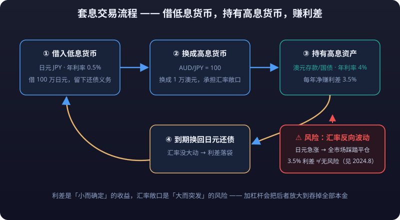

# 02 · Carry Trade and Interest Rate Differentials: The Primary Driver of Exchange Rates

> The forex market's most classic, most profitable, and most dangerous strategy has only one name: **the carry trade** — borrow a low-yield currency, buy a high-yield currency, and earn the rate differential while you sleep. But it was also the detonator of the August 2024 global equity crash. This chapter dissects its principle, math, risks, and that famous "unwind crisis", ending with compliant variants ordinary people can access.

---

## 1. How the Carry Trade Works: Earning the Differential While You Sleep

### The Core Logic

Currencies are "rentable assets", and interest rates are the rent. That creates an opportunity that looks risk-free:

> **Borrow a low-rate currency (e.g., yen), convert it into a high-rate currency (e.g., AUD/USD), hold it, and pocket the interest rate differential between the two countries.**

With zero **<mark>leverage</mark>**, as long as the exchange rate doesn't move sharply, this is a "**position** with positive expected income". The yen historically held ultra-low rates of 0%–0.5% (near 0% for most of 2016–2024), making it the classic "funding currency" of global carry trades.

### A Numeric Example: Borrow Yen, Buy AUD

Assume: borrow **1,000,000 JPY** at **0.5%** per year; convert into AUD (assume AUD/JPY = 100, i.e., 10,000 AUD), where the AUD rate is **4%** per year.

| Item | Calculation | Result |
|---|---|---|
| Annual interest on borrowed yen | 1,000,000 × 0.5% | 5,000 JPY |
| Annual yield on AUD deposit/asset | 1,000,000 × 4% (on the market value of converted AUD) | 40,000 JPY |
| **Annual carry profit** | 40,000 - 5,000 | **35,000 JPY (35k JPY/year)** |

More fundamentally: **a 3.5% differential (4% - 0.5%) × 1,000,000 JPY principal = 35,000 JPY earned per year**, and the process can be leveraged (in forex **<mark>margin</mark>** trading this shows up as "interest income" or positive swap).

### Why Institutions Love It

- The carry is a **deterministic cash flow**; if the direction holds, you can even ignore the exchange rate (the risk exposure is another matter);
- With leverage, the annualized carry gets compressed into monthly/daily returns;
- Global **hedge** funds and sovereign funds have run large yen/franc carry books year-round, on the scale of hundreds of billions of dollars.

> Rate figures: the 0%–0.5% yen and 4% AUD are teaching references (historical ranges) — **always defer to each central bank's latest policy rate**.

---

## 2. Exchange Rate Risk: The Carry Is No Match for the Numbers

Carry income accumulates "slowly"; exchange rate moves happen "all at once". Continuing the example above:

| Scenario | Rate Move | Impact on 1,000,000 JPY Principal |
|---|---|---|
| AUD falls **5%** vs JPY | AUD/JPY from 100 → 95 | 5% loss = **50,000 JPY** |
| AUD falls 3.5% vs JPY | AUD/JPY from 100 → 96.5 | Loss of 35,000 JPY = **exactly one year of carry** |
| AUD falls 10% vs JPY | AUD/JPY from 100 → 90 | 10% loss = 100,000 JPY ≈ three years of carry |

**One-sentence conclusion: the carry trade earns a 3%–5% annual differential but can lose to a 5%–10% exchange rate move that can strike at any time.** So the carry trader's real bet isn't the differential — it's "the exchange rate won't reverse sharply". That's why it's called a "**volatility selling**" trade.

::: danger 💀 Iron Rule: Carry Earns the Differential but Pays the Exchange Rate
**The carry trade earns a 3%–5% annual differential but pays for 5%–10% exchange rate swings that can hit at any time.** So the real bet isn't the carry — it's "rates won't reverse sharply", which is why it's called "selling volatility". Leverage makes it deadlier: at 1:100 leverage the carry stays the same, but the rate swing is magnified 100× — a single 1% adverse move is enough to **<mark>blow up</mark>** the account.
:::

**Leverage makes it deadlier**: in margin trading at 1:100 leverage, the carry is unchanged but the rate swing is magnified 100× — **one 1% adverse move is enough to blow up the account**. Institutional carry is leveraged too, so when the rate starts reversing, everyone runs for the exit at once, creating a stampede.

---

## 3. The Carry Unwind Crisis: An August 2024 Retrospective

The biggest risk in carry trading isn't a slow slide in the exchange rate — it's the **unwind spiral**: once triggered, holders of carry positions dump the high-yield currency and buy back the funding currency at any cost, which pushes the rate further against them and triggers even more unwinding.

### Timeline of the August 2024 Global Equity Crash (public events)

| Time | Event | Market Reaction |
|---|---|---|
| Late July 2024 | US tech pullback (profit-taking after AI giants' earnings missed expectations) | Risk assets weakened; deleveraging began |
| **July 31, 2024** | **BOJ surprised with a rate hike** to 0.25% (markets widely expected no hike or a delay) | Yen began appreciating; carry traders went on alert |
| Early August 2024 | USD/JPY plunged rapidly from ~152 into the **141–142 range** (~7%+ yen appreciation within days) | Carry unwind wave began: dumping USD/AUD assets, buying back yen |
| **August 5, 2024** | **Peak of the crash**: Nikkei 225 fell ~**12.4%** in one day (largest since Black Monday 1987); Korea, Europe, and US equities tumbled; VIX spiked near 65 | Global risk assets sold indiscriminately |
| After August 5, 2024 | BOJ Deputy Governor urgently stated rates wouldn't be hiked amid instability; yen pulled back | Markets stabilized, but volatility stayed elevated |

### Why a Yen Surge Could Ignite a Global Crash

1. **Carry positions were enormous**: global institutions had borrowed massive amounts of yen ("yen carry" estimated in the hundreds of billions of dollars) invested in USD, AUD assets, and global equities;
2. **Yen appreciation → floating losses on carry positions → forced or voluntary unwinding**: institutions had to sell USD/AUD/stocks and buy back yen to repay loans;
3. **Unwinding itself pushed the yen higher** (persistent yen buying) → more positions hit risk limits → **unwind spiral**;
4. **US tech weakness provided the spark**: deteriorating risk appetite amplified the deleveraging — the two factors reinforced each other until it became a global crash.

### Lessons for Ordinary People

- Carry trading is not "risk-free interest": **it is mild most of the time and lethal in rare moments**;
- **Sudden appreciation** of funding currencies (yen/franc) is the cancer of carry trades, and such events (surprise central bank pivots) are nearly impossible to predict;
- The lesson of August 2024: **"deterministic income" and "tail risk" coexist — retail sees the carry, institutions see the stampede when everyone unwinds**.

::: danger 💀 Iron Rule: "Deterministic Income" and "Tail Risk" Coexist
**"Deterministic income" and "tail risk" coexist.** Retail sees the carry (3%–5% a year); institutions see the stampede when unwinds begin — in August 2024 a single surprise BOJ hike ignited a global crash in one day, as carry positions unwound en masse. The stampede across hundreds of billions in yen carry proved that a position that looks like "steady interest collection" can wipe out all capital in days.
:::

> Note: the timeline above summarizes public reporting; specific price moves and rate figures **defer to official data and news**. This section exists to explain the carry trade mechanism, not as a complete analysis of any market event.

---

## 4. Vehicles for Carry Trading

| Vehicle | Method | Barrier | Characteristics |
|---|---|---|---|
| **Forex margin trading** | Sell low-yield / buy high-yield currency (e.g., long AUD/JPY), collecting positive swap daily | Low, from $100 | Most flexible, but leverage magnifies unwind risk |
| **Currency ETFs / money market funds** | Hold dollar money market funds, dollar deposits, etc. | Medium | No leverage, no blow-ups — pure carry without two-way FX exposure (though holding is itself an exposure) |
| **Yen ETF-type products** | Short/long a specific currency via certain ETFs | Medium | Structures and fees vary widely; check each product individually |
| **Offshore deposits/time deposits** | Deposit the high-yield currency directly at an overseas bank (e.g., USD time deposit) | Bank-dependent | Simplest, no leverage, but subject to capital outflow and compliance limits |
| **FX structured deposits** | Bank wealth products linked to exchange rates | Medium | The "high yield" often comes from selling options (FX-linked); losses can eat the interest — read terms carefully |

> Reminder: **for any "stable high-yield" vehicle, ask three questions first**: Where does the interest come from? What are the loss conditions? Is the platform/bank licensed? — High yield and high risk are usually two sides of the same coin.

---

## 5. The Global Rate-Differential Map

The "rate map" is the steering wheel of carry trading: **borrow the lowest-yielding currency, buy the highest-yielding one**. Below are policy rates as teaching references (**always defer to the latest central bank decisions**):

| Currency | Policy Rate (teaching reference, historical ranges) | Recent Character | Carry Role |
|---|---|---|---|
| **USD** | Fell from highs (peaked 5.25%–5.50% in 2023, easing cycle began 2024–2025) | The anchor of global rates, deepest **liquidity** | Common "interest leg" |
| **EUR** | Around 2% (after consecutive ECB cuts through 2025) | ECB followed with cuts | Neutral |
| **JPY** | Around 0.25%–0.5% (exited negative rates July 2024; hiked toward 0.5% in 2025) | Decades of low rates; the main carry "funding currency" | **The classic interest leg** |
| **AUD** | Roughly 3.1%–3.6% | Commodity cycle + inflation driven; long above US/EU levels | Common "yield leg" |
| **CNY** | Policy rate around 2.0%–3.0% (1Y LPR near 3.0%, cut repeatedly through 2025) | Domestic easing cycle | Low-rate side (cross-border flows restricted) |
| **CHF** | Near 0% | Safe haven + long-term low rates; candidate funding currency | Low-rate side |

**How to read the map:**

1. Find "the pair with the widest differential": the classic combo is **borrow JPY/CHF → buy USD/AUD**;
2. Watch the **direction** of differential changes, not absolute levels: central banks' hike/cut paths determine whether carry pays over the long run;
3. Beware "differential inflection points": a sudden hawkish turn by a low-rate central bank (like the BOJ in July 2024) is the signal of an unwind crisis.

> Rate data moves frequently; the table shows historical teaching ranges — **defer to the latest policy rates published by each central bank**.

---

## 6. Why the Rate Differential Is the Primary Driver of Exchange Rates

Economics has the famous theory of **interest rate parity**: the differential between two countries' rates must be offset by exchange rate changes, otherwise an **arbitrage** opportunity exists. In plain terms:

- **Capital chases returns**: when USD rates are 5% and JPY rates 0%, global money tends to "sell yen, buy dollars" to capture the spread;
- That sustained buying itself pushes **the dollar up and the yen down**;
- As long as the differential persists and expectations are stable, the directional pressure doesn't disappear — **so "direction of the differential = medium-term direction of the exchange rate"**;
- The converse also holds: after July 2024, yen hike expectations reversed, and the expectation of a narrowing differential ignited the unwind wave described earlier.

**Why call it the "primary driver"?** Because every other factor (economic data, geopolitics, risk sentiment) ultimately influences exchange rates through "central bank rate expectations". Whether NFP is good or bad matters less than how it **changes the market's pricing of Fed hikes**. Once you internalize the chain "data → rate expectations → exchange rate", you understand half of forex.

---

## 7. Variants Ordinary People Can Access

You don't need FX margin trading to "earn the differential" — the essence is **holding high-yield currency assets while avoiding high leverage**:

### 1. Dollar Money Market Funds vs Local-Currency Deposits

- In recent years, dollar money market funds (short-end Treasuries) yielded 4%–5% annualized versus roughly 1.5%–2% on RMB deposits — **a sizable gap** (it narrowed as the Fed cut after 2025; **defer to latest yields**);
- But note: **the exchange rate eats the carry**. During RMB appreciation phases in 2024–2025, FX losses on dollar assets could exceed the interest earned — the carry is "rent", the exchange rate is "house price"; rent never covers a falling house.

### 2. Offshore USD Time Deposits

- Open an account at a licensed overseas bank and deposit USD at fixed terms, with yields tied to dollar rates;
- No leverage, no blow-up risk — but three considerations: **capital outflow compliance, exchange rate, and bank risk**.

### 3. Compliance Boundaries of "Reverse Repo Arbitrage"

- The quarter/year-end yield spikes in domestic money market funds reflect seasonal institutional funding tightness, not a stable carry;
- Any scheme of "borrowing to re-deposit", "bridge-funding arbitrage", or informal repo intermediation carries **compliance risk**: usury caps, the line into illegal fundraising, and platform blow-up risk — **defer to the latest laws and regulations; first confirm each step is legal**;
- Principle: **participate in funding businesses only within licensed financial institutions, and refuse any "middleman will walk you through arbitrage" offer.**

### 4. Summary for Ordinary People

| Method | Risk Level | Suitable For |
|---|---|---|
| Dollar money market fund | Low (rate + FX risk) | Those holding USD assets or FX quota |
| Offshore USD time deposit | Medium-low | Those with compliant offshore channels |
| FX margin carry | Very high | Professional traders (unsuitable for almost everyone) |
| Unlicensed "arbitrage" platforms | Very high (principal can go to **<mark>zero</mark>**) | Suitable for no one |

---

## 8. Danger-Signal Checklist for Carry Trades

The fatal moment in a carry trade cannot be predicted, but **danger signals can be identified early**. When these appear together, carry risk rises sharply:

| Signal | Meaning | Response |
|---|---|---|
| Funding-currency central bank turns hawkish | e.g., BOJ officials discussing hikes or scrapping yield curve control | Carry positions enter an "exit countdown"; reduce or exit |
| Funding currency appreciates rapidly and persistently | e.g., JPY up 5%+ within weeks | The unwind spiral may have begun; do not "buy the dip" against it |
| High-yield asset pullback | e.g., US tech selloff, commodity-driven AUD slump | Floating losses widen; risk limits approach |
| Volatility index (VIX) spikes | Market enters deleveraging mode | Avoid all leveraged trades |
| Your **stop-loss** becomes meaningless | Position so big you "don't want a stop" | The position is too heavy — cut it first |

**The greatest danger is stacked signals**: July–August 2024 saw exactly "BOJ surprise hike + US tech pullback + VIX spike" all at once — a textbook unwind spiral. **Advice for retail traders: once the funding currency's central bank turns, get out first and ask questions later, no matter how wide the carry still is.**

::: tip ✅ Conclusion: If the Funding Currency's Central Bank Turns, Exit First — Whatever the Carry
**Once the funding currency's central bank turns, exit first and ask questions later, whatever the carry still pays.** A hawkish pivot (e.g., BOJ hikes), rapid sustained appreciation of the funding currency, a VIX spike — any two of these three signals stacking is the precursor of an unwind spiral. So the iron rule of carry trading: don't wait for the central bank to announce a "big hike" — start your exit countdown the moment officials begin discussing hikes.
:::

---

## Risk Warning

::: warning ⚠️ Risk Warning
The core risks of carry trading are **adverse FX moves plus unwind spirals**: carry accrues by the year while FX losses land by the day. The August 2024 global crash triggered by the yen carry unwind proved that a position that looks like "steady interest" can wipe out all capital in days. Leverage multiplies the risk, and surprise turns by funding-currency central banks (like the BOJ's 2024 hike) are entirely unpredictable. All rate, FX, and event data here are teaching references and historical retrospectives — **defer to the latest markets, central bank rates, and regulations**. Any platform invitation promising "stable high yields" or "risk-free arbitrage" should be treated as fraud. This article is not investment advice.
:::
