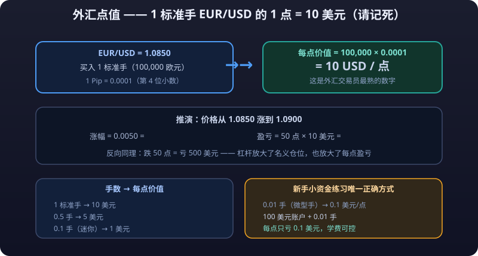

# Forex Trading Practice: Pair Personalities, Pip Value & P&L, and a Beginner Workflow

> The concepts chapter already covered: forex as the world's largest market, how to read quotes, how to compute pip value, and how dangerous **<mark>leverage</mark>** is. This chapter goes hands-on: **every major pair has its own "personality"** — some steady, some explosive, some tracking commodities; then it works through lot size, pip value, and P&L with complete numeric examples; then the activity patterns of three sessions, forex-specific uses of technicals and fundamentals — ending in an executable beginner workflow.

---

## 1. The "Personalities" of Major Pairs

The classic beginner mistake: treating forex as one uniform instrument with one method for all pairs. In reality **each pair is a combination of two economies**, with vastly different volatility profiles. Picking the pair whose personality matches you matters more than picking direction.

### USD Majors

| Pair | Nickname | Personality | Key Logic |
|---|---|---|---|
| **EUR/USD** | Fiber | Steadiest, most standard | World's deepest **liquidity**, **tightest spread** (~0.1–0.5 pips at mainstream brokers), textbook volatility rhythm — the only pair recommended for beginners |
| **USD/JPY** | Gopher | Tracks Japanese bond yields | Watch US–Japan rate spreads; BOJ policy (YCC/hikes) is the biggest source of surprise events |
| **GBP/USD** | Cable | More volatile, hot-tempered | Slightly wider **<mark>spread</mark>**, many intraday false breakouts; BoE speeches and Brexit-type politics often trigger impulses |
| **AUD/USD** | Aussie | Commodity-linked, rate-sensitive | Watch iron ore/copper and Chinese demand; RBA decisions bring sharp moves |
| **USD/CAD** | Loonie | Oil market bellwether | Highly correlated with WTI/Brent crude; CAD strengthens when oil rallies |
| **NZD/USD** | Kiwi | Mild commodity currency | Watches dairy prices and AUD's mood; usually less volatile than AUD |
| **USD/CHF** | Swissy | Safe-haven currency | The franc is a traditional haven; CHF tends to strengthen on geopolitical risk / equity crashes |

### The Numeric Logic of Commodity Currencies

**AUD / NZD / CAD are called commodity currencies** because their economies depend heavily on resource exports, creating observable linkages between exchange rates and commodity prices. The point isn't "guessing direction from headlines" but knowing **which layer of numbers drives what**:

- **Australian dollar (AUD)**: watch **iron ore and copper**. Australia is the world's top iron ore exporter, so ore prices anchor AUD/USD; copper (a proxy for Chinese demand) strength also lifts AUD.
  - Rough chain: China is the biggest iron ore buyer → China manufacturing momentum (PMI, property starts) → ore demand → ore price → AUD direction.
- **Canadian dollar (CAD)**: watch **crude oil**. Canada is a major producer, and oil is its largest export.
  - Rough chain: each leg up in WTI raises export revenue → CAD strengthens → USD/CAD falls (mind the quoting direction: stronger CAD = smaller USD/CAD number).
- **New Zealand dollar (NZD)**: watch **dairy**. NZD often moves with AUD (linked economies) but usually swings less.

> Data note: these "linkages" are long-run statistical correlations, not causal laws — they can decouple short-term (e.g., in 2022 CAD still weakened despite high oil because the dollar was too strong). Specific correlation ranges defer **to the latest data**.

### Cross Pairs

Pairs without USD are called **cross pairs**, e.g., EUR/JPY, GBP/JPY, AUD/NZD, EUR/GBP:

- Cross pairs are typically **more volatile than majors** (two legs stacked), and **GBP/JPY is famous for violent swings — a retail **<mark>blow-up</mark>** epicenter**;
- A cross pair expresses "the relative strength of two countries" and suits experienced traders with clear views; beginners should start with EUR/USD;
- Cross spreads are wider than majors', raising short-term trading costs.

### One-Line Summary

| Trader Type | Recommended Pairs | Why |
|---|---|---|
| Beginner | EUR/USD | Tightest spread, tidiest trends, most information |
| Trading commodities | AUD/USD, USD/CAD | Clear linkage to iron ore/copper/oil |
| Hedging risk | USD/CHF, USD/JPY | Driven by geopolitics and risk sentiment |
| Chasing volatility | GBP/USD, GBP/JPY | Big moves — and fast losses |

---

## 2. Pip Value and P&L (Complete Numeric Derivation)

Pip value math is forex's "multiplication table". The concepts chapter gave the formula; here we do the **full derivation**: from dollars-per-pip per standard lot to complete P&L under lot size, price, and leverage.



### Basic Definitions

- **1 standard lot = 100,000 units of the base currency** (1 lot EUR/USD = €100,000; 1 lot USD/JPY = $100,000)
- **1 pip**: most pairs = 4th decimal place (0.0001); JPY pairs like USD/JPY = 2nd decimal place (0.01)
- **Value of 1 pip on EUR/USD = 100,000 × 0.0001 = $10** — the most familiar number in forex; memorize it

### Derivation 1: Price Change → Pips → P&L (EUR/USD)

Buy 1 standard lot at EUR/USD = 1.0850:

| Step | Calculation | Result |
|---|---|---|
| Price rises to 1.0900 | Up 0.0050 | = 50 pips |
| Value per pip | 100,000 × 0.0001 | $10 |
| Profit | 50 pips × $10 | **$500** |

Symmetrically: down 50 pips = a $500 loss.

### Derivation 2: Lot Size vs Per-Pip Value

| Lot Size | Notional Value | Value per Pip (EUR/USD) |
|---|---|---|
| 1 standard lot | 100,000 | $10 |
| 0.5 lots | 50,000 | $5 |
| 0.1 lots (mini) | 10,000 | $1 |
| 0.01 lots (micro) | 1,000 | $0.10 |

> Why mini/micro lots matter: **the only correct way for beginners to practice with small capital**. $100 account + 0.01 lots = only $0.10 per pip — tuition stays affordable.

<details>
<summary>📖 Click to expand: Derivations 3–4 (USD/JPY's special pip value + full P&L with leverage)</summary>

### Derivation 3: USD/JPY's Special Pip Value

USD/JPY = 150.00, 1 standard lot:

- 1 pip = 0.01; P&L accrues in yen: 100,000 × 0.01 = ¥1,000
- Converted back: 1,000 ÷ 150.00 ≈ **$6.67/pip**

> Note: **USD/JPY's per-pip value changes with the rate** — the more the yen depreciates (bigger number), the less each pip is worth in dollars. For pairs like EUR/USD (USD as quote currency), the per-pip value is fixed at $10/standard lot regardless of price.

### Derivation 4: Full P&L with Leverage

Account $1,000, leverage 1:100, 0.1 lots (mini) EUR/USD:

| Item | Calculation | Value |
|---|---|---|
| Notional value | 0.1 lots × 100,000 | $10,000 |
| Used **<mark>margin</mark>** | 10,000 ÷ 100 | $100 |
| P&L per pip | 0.1 lots × $10 | $1/pip |
| Market moves 80 pips | 80 × $1 | +$80 / -$80 |
| Market moves 300 pips | 300 × $1 | +$300 / -$300 |

</details>

**Key insight**: leverage doesn't change P&L itself (how much 0.1 lots gains or loses is leverage-independent); leverage determines **how much money you have available to survive the swing**. With $100 margin used from a $1,000 account, a 1,000-pip move against you zeroes you out — and triple-digit daily ranges in EUR/USD are normal.

::: danger 💀 Iron Rule: Fully Leveraged at 1:100, Your Blow-Up Distance Is Measured in Hours
**Trading full size at 1:100 leverage puts your blow-up distance on a scale of hours.** A $1,000 account holding 1 lot of EUR/USD blows up 100 pips against you; triple-digit daily moves in EUR/USD are normal. So the core question of margin trading isn't "how to profit" but "how not to blow up" — use mini/micro lots, low leverage, wide **stops**, and stretch your blow-up distance past an entire overnight hold.
:::

### Derivation 5: Blow-Up Distance (The Math)

| Account | Lots | Per Pip | Margin (1:100) | Adverse Pips to Blow-Up |
|---|---|---|---|---|
| $1,000 | 1 lot | $10 | $1,000 | **~100 pips** |
| $1,000 | 0.1 lots | $1 | $100 | ~1,000 pips |
| $5,000 | 0.5 lots | $5 | $500 | ~900 pips |

> Simplified teaching figures (excludes spread, **<mark>slippage</mark>**, and floating P&L effects on margin). But the conclusion stands: **fully leveraged at 1:100, your blow-up distance is measured in hours**.

---

## 3. Sessions and Volatility Patterns

Forex trades 24 hours Monday–Friday, but **each session has completely different "lead actors"**. Beijing-time view (DST basis; add 1 hour in winter):

| Session | Beijing Time | Lead Pairs | Traits |
|---|---|---|---|
| Asian session | ~08:00–15:30 (Tokyo-led) | **AUD/JPY, NZD/USD, USD/JPY**, AUD/USD | AUD/NZD/JPY most active; generally quiet, wider spreads, few trends |
| European session (London) | ~15:30–00:30 | **EUR/USD, GBP/USD, EUR/JPY** | Largest global session, **EUR/USD most active**, volatility builds from 15:30 |
| US session (New York) | ~20:00–05:00 next day | **USD/JPY, USD/CAD, USD/CHF** | US data (NFP/CPI) lands here; **the London-overlap 20:00–00:30 window is the day's most volatile** |
| Overlap window | ~20:00–00:30 | All pairs | Best liquidity, tightest spreads, but biggest moves |

**Three session disciplines for beginners:**

1. **Trade EUR/USD during London hours (after 15:30)** — that's when it has any "personality"; touching it in Asia is rowing a boat in freshwater and paying tax for it.
2. **Crosses like AUD/JPY are active only in Asia** — if you want Asian-session action, pick AUD/JPY crosses; don't wait for euro moves in Tokyo hours.
3. **At 8:30 ET (20:30/21:30 Beijing), NFP/CPI releases jolt every pair** — beginners should simply be flat and enter only after the move plays out.

> Timing note: DST basis (Mar–Oct) Beijing time; winter shifts everything 1 hour later; each broker's close/rollover times defer to platform announcements.

::: tip ✅ Conclusion: Trade EUR/USD in London Hours, Not Asia
**Trade EUR/USD in the London session (after 15:30) — that's the only time it has "personality"; touching it in Asia is rowing in freshwater while paying tax.** So lesson one of forex is "pick the session": different pairs trend in different sessions, and choosing wrong means donating to spreads and fake moves.
:::

---

## 4. Applying Technical Analysis to Forex

Candlesticks, moving averages, and trendlines work the same as in stocks, but several **forex-specific technical rules** are essential:

### 1. 24-Hour Continuity vs Daily Close

- Forex trades around the clock with **no natural gap-based separation** (markets close only on weekends).
- Brokers' daily candles typically close at **5:00 PM ET (5:00 AM next day Beijing time, DST)** — one daily bar runs from 17:00 ET to 17:00 ET the next day.
- Implication: **where and how the daily candle closes matters far more than intraday extremes**; for daily-level analysis use bars divided by broker close time, never midnight cuts (which misread an "intraday breakout" as a "daily breakout").

### 2. Support/Resistance Meaning: Round Numbers as Psychological Levels

Forex has a unique "**big figure**" phenomenon: prices repeatedly stall or find support near **round-number levels** (e.g., EUR/USD's 1.1000, 1.2000; USD/JPY's 150.00, 155.00). Why:

- Institutional orders and option barrier levels cluster at round numbers;
- Retail traders treat round prices as "reasonable targets", concentrating buying and selling there;
- Breakouts through big figures often accelerate on volume — **and false breakouts abound**, with stop-entry clusters frequently swept.

**Practical use**: treat big figures like 1.1000 as default support/resistance references, combined with order-flow logic — when price approaches a round number, **reduce size or wait for confirmation** rather than gambling on one breakout.

### 3. Strong Trends, Long Consolidations

- Forex trends at higher timeframes (daily/4H) **more persistently than most stocks** — rates are driven by macro rate differentials, so once established, directions can run for months (like the Fed's 2022–2024 hiking cycle);
- But below 15 minutes, **false breakouts multiply** and ultra-short trading becomes a meat grinder of spreads and slippage;
- Conclusion: **forex rewards "trend-following at higher timeframes"**, not beginner-style 5-minute churn.

### 4. Fundamentals Lead, Technicals Follow

Forex is **the most directly fundamental-driven market**: technical setups can invalidate instantly at data releases. The correct usage: "**trend-follow outside data windows; stay flat around them**".

---

## 5. Fundamental Trading: Central Banks, Data, and Rate Expectations

### Central Bank Policy: The Most Important Fundamental

| Central Bank | Decision Cadence | What to Watch |
|---|---|---|
| Federal Reserve (FOMC) | 8/year | Rate decision + dot plot + Powell presser |
| ECB | ~8/year | Rate decision + Lagarde remarks |
| BOJ | 8/year | Rate decision + bond purchases (yield targets during YCC era) |

**You trade the surprise**: a hike that markets already priced isn't bullish — **only the part exceeding or missing expectations moves the market**. Volatility spikes around decisions, and direction flips fast.

::: warning ⚠️ Counterintuitive: You Trade the Surprise, Not the Data Itself
**You trade the surprise: an already-priced hike isn't bullish — the beat or miss versus expectations is the trade.** So the core skill of FX fundamentals isn't "predicting data" but "knowing the consensus forecast beforehand" — from the economic calendar's forecast column; checking forecasts before events is step one. Good or bad data matters less than the deviation from expectations.
:::

### NFP and CPI: The Biggest Move-Makers

- **Nonfarm payrolls (NFP)**: first Friday monthly at 8:30 ET. Strong jobs → hike expectations rise → dollar strengthens. EUR/USD can jump 50+ pips within seconds of release.
- **CPI**: mid-month. Hotter inflation → hike expectations rise → dollar up; softer → dollar down.
- **PCE**: the Fed's preferred inflation gauge, rising in importance recently.

### Rate Expectations: Buy Strength in Hiking Cycles

A currency's medium-term direction = **the gap between two countries' rate expectations**:

- A country entering a **hiking cycle** → its currency tends to strengthen (capital chases yield);
- A country entering a **cutting cycle** → its currency tends to weaken.

Classic example: the Fed's aggressive hikes in 2022–2023 drove the dollar index from 95 to 114; as cut expectations built in 2024, the dollar retreated. **Watching central banks' "direction + pace" beats fixating on single data points.**

> Data note: historical prices are teaching references; latest rates and decision schedules defer **to official announcements**.

---

## 6. A Beginner Workflow for Forex

Everything above compressed into one executable beginner workflow:

```text
① Pick one pair: trade only EUR/USD (tightest spread, most information, tidiest behavior)
   ↓
② Check the session: act only in the London/NY overlap (~20:00–00:30) or early London
   ↓
③ Set direction: read the daily first (rate expectations + MA/trendline); within the daily bias, find entries on 1H/4H
   ↓
④ Small size: start at 0.01–0.1 lots; account must survive at least 500 adverse pips
   ↓
⑤ Stop discipline: stop before entry, always; ≤2% risk per trade; flat before data windows
```

**Each rule maps to a common death:**

| Workflow Step | Consequence of Skipping It |
|---|---|
| Ignoring EUR/USD, randomly trading GBP/JPY | Volatility beyond tolerance; stops become meaningless |
| Ignoring sessions, heavy EUR/USD in Asia | Wide spreads, no trend — pure donation |
| No daily bias, chasing every rise | Fighting the higher timeframe, swept repeatedly |
| Position too heavy | Blown up in 100 pips (see Derivation 5) |
| No stops / holding through data | NFP's instant 50-pip slippage punches straight through |

---

## Risk Warning

::: warning ⚠️ Risk Warning
FX margin trading carries **extreme leverage risk**: above 1:100, an ordinary 1% market move produces a 100% equity swing; blow-ups can occur within hours, and extreme markets can even produce **negative balances**. Consistently profitable retail FX traders are vanishingly rare; unregulated platforms carry fraud risks like manipulated quotes and blocked withdrawals. All figures here (pip values, P&L, margin, volatility magnitudes) are teaching references — **defer to the latest market data, broker terms, and regulations**. This article is not investment advice.
:::
