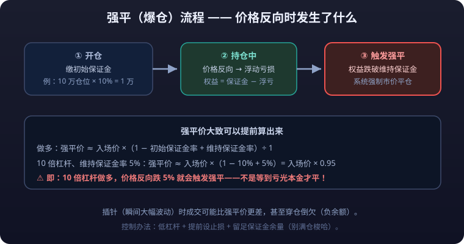

# 02 · Margin, Leverage, and Forced Liquidation: A Trader's Lifeline

> This is the **most important article** of the entire futures chapter. The margin system is the engine of futures — and the meat grinder that devours accounts. Forced liquidation / blow-up is the first paid lesson for most futures beginners — except the tuition is usually your entire principal.
>
> Read this as "the safety manual before operating dangerous machinery": work through every formula and every numerical example by hand.

---

## 1. The Margin System: The Foundation of Futures

Margin is the **collateral frozen in your account** to guarantee performance in futures trading. It is not "a down payment"; it is a **performance bond** — you do not pay the full value, you only prove you can perform.

### 1.1 Initial Margin

- The minimum funds posted at opening, typically **5%–15%** of contract value (varies by product; see the product encyclopedia).
- The **exchange** sets the baseline rate; the **futures firm** adds a buffer on top (usually another 2–5 percentage points); the firm's published rate prevails in practice.

### 1.2 Maintenance Margin

- The minimum equity level that must be maintained while holding, typically **75%–85%** of initial margin (for many domestic products, maintenance margin ≈ the exchange baseline).
- As long as equity stays **above** maintenance margin you can keep the position; once it **falls below**, the margin-call or forced-liquidation process begins.

### 1.3 How the Two Margins Relate

```text
Initial margin  ≥  Maintenance margin
Posted at opening     Must be kept while holding
```

> Note: domestic exchanges routinely adjust the "margin rate" dynamically with market conditions and risk (raising it when volatility rises — e.g. overheated markets, before long holidays, near delivery months). When the exchange raises the margin rate, **those already holding positions may need to deposit more money immediately**.

---

## 2. Leverage Multiple: 10% Margin = 10x Leverage

<LeverageCalc />

The leverage formula:

```text
Leverage multiple = Contract value ÷ Margin = 1 ÷ Margin rate
```

| Margin rate | Leverage multiple | Adverse price move | Principal lost |
|---|---|---|---|
| 20% | 5x | 20% | 100% (forced liquidation) |
| 10% | 10x | 10% | 100% (forced liquidation) |
| 7% | ≈14.3x | 7% | 100% (forced liquidation) |
| 5% | 20x | 5% | 100% (forced liquidation) |

### Example: 10x Leverage on Rebar

- Rebar price: 3500 CNY/ton, one lot = 10 tons → contract value = 3500 × 10 = **35000 CNY**.
- Margin rate 10% → margin at opening = 35000 × 10% = **3500 CNY**.
- Leverage multiple = 35000 ÷ 3500 = **10x**.

> With 3500 CNY you control 35000 CNY worth of goods. Every 1% price move swings your margin account by 10%. **This is the mathematical essence of leverage: gains and losses are amplified by the same multiple.**

---

## 3. Mark-to-Market and Floating P&L

Futures use the **mark-to-market (MTM)** system: after each trading day's close, the exchange settles P&L on all positions at the **daily settlement price** (not the close), and gains/losses are credited or debited to the account directly.

```text
Account equity = Available funds + Margin occupied (position value portion)
Daily P&L = (Today's settlement − Open price / yesterday's settlement) × Contract multiplier × Lots held
```

### Example: Three Days Holding One Lot of Rebar Long

Setup: deposit 10000 CNY, go long 1 lot at 3500 CNY/ton, margin 3500 CNY.

| Trading day | Settlement | Daily P&L | Equity | Margin occupied | Available funds |
|---|---|---|---|---|---|
| Opening day | 3500 | 0 | 10000 | 3500 | 6500 |
| Day 1 | 3600 | +1000 | 11000 | 3500 | 7500 |
| Day 2 | 3450 | -1500 | 9500 | 3500 | 6000 |
| Day 3 | 3400 | -500 | 9000 | 3500 | 5500 |

Key points:

- Profits **land the same day** (available funds increase) and can be withdrawn or used to open new positions — the mechanical basis of "adding on floating profits" in futures.
- Losses **are debited the same day**; floating losses become real losses immediately, unlike stocks where it is "just on paper".
- As long as equity stays above maintenance margin the system lets you hold; below it, the margin-call/forced-liquidation process begins.

> **The fundamental difference from stocks**: a stock's floating loss exists only on paper — as long as you do not sell, you can still come back; a futures floating loss is "realized" daily, and once equity breaks the margin floor, **you lose the right to wait for a rebound**.

::: danger 💀 Futures Losses Are Realized Daily — No Right to Wait for a Rebound
**A futures floating loss is "realized" day by day; once account equity breaks the margin floor, you lose the right to wait for a rebound.** The fundamental difference from stocks: a stock's floating loss stays on paper, while a futures loss debits your account and becomes a real outflow immediately.
:::

---

## 4. Forced Liquidation (Blow-Up) Mechanics in Detail



### 4.1 What Is Forced Liquidation

Forced liquidation (Liquidation / Force Close), colloquially **blowing up**, means that when account equity is insufficient to maintain position margin, the futures firm (or exchange) **forcibly closes part or all of your positions without your authorization**, to reclaim the "credit line" extended to you.

### 4.2 Trigger Conditions and Equity Calculation

```text
Account equity = Available funds + Position margin (at current price)

Margin call triggered: Account equity < Maintenance margin × Lots held
Forced liquidation triggered: Available funds < 0 (equity below current margin requirement)
```

<MarginCalc />

Typical process (common domestic futures-firm rules):

1. **Warning line**: Available funds turn negative or equity breaks maintenance margin → the firm sends a **margin-call notice** requiring a top-up within a deadline (usually before today's close or before 9:00 next day).
2. **Liquidation line**: Deadline missed → the firm has the right to **liquidate on its own**, starting with profitable positions and non-dominant-contract positions, until available funds turn positive again.
3. **Blow-up line (negative balance)**: A market gap or drained **<mark>liquidity</mark>** leaves losses exceeding equity even after liquidation → the account goes negative — a negative-balance blow-through (see Section 5).

### 4.3 Liquidation Order

The usual sequence futures firms follow when liquidating (varies by firm; the contract governs):

| Order | Closed first | Reason |
|---|---|---|
| 1 | The most losing positions | Stop the bleeding fast, cut risk exposure |
| 2 | Non-dominant / near-delivery contract positions | Poor liquidity, special rules, high risk |
| 3 | Positions with the highest margin occupation | Free the most margin space |
| 4 | Profitable positions (last resort) | Protect floating profits, but winners may get closed too |

### 4.4 The Brutality of the Process

::: danger 💀 Liquidation Is Not a Negotiation — Do Not Expect a Clean Escape in Extreme Markets
- Once the notice is issued, the futures firm has the right to **execute immediately**, whether or not you have time to react.
- In extreme markets (consecutive limit boards, liquidity evaporation), **you cannot close the position yourself even if you try** — you can only queue for liquidation.
- When the whole market is blowing up, sell orders stack up and prices punch through multiple levels instantly; **the final fill is often far worse than your** <mark>stop-loss</mark> **price**.
:::

### Example: A Full Forced-Liquidation Walk-Through

- Account equity: 10000 CNY, margin rate 10% (maintenance margin 8%).
- One lot of rebar (10 tons/lot) at 3500 CNY → initial margin 3500 CNY, maintenance margin 2800 CNY.
- Margin occupied at opening 3500 CNY, available funds 6500 CNY.

When price falls 650 CNY/ton (−18.6%):

<details>
<summary>📖 Click to expand: the full three-step derivation of the liquidation price</summary>

```text
Loss = 650 × 10 = 6500 CNY
Account equity = 10000 − 6500 = 3500 CNY < Maintenance margin 2800 CNY? → Not yet

Price keeps falling to 2820 CNY/ton (cumulative drop 680):
Loss = 680 × 10 = 6800 CNY
Account equity = 10000 − 6800 = 3200 CNY
Maintenance margin = 2820 × 10 × 8% = 2256 CNY → Equity still above maintenance margin

Price falls to 2750 CNY/ton (cumulative drop 750):
Loss = 750 × 10 = 7500 CNY
Account equity = 2500 CNY
Current margin requirement = 2750 × 10 × 10% = 2750 CNY
Available funds = 2500 − 2750 = −250 CNY → Available funds negative → Forced liquidation triggered!
```

</details>

> With price down from 3500 to 2750 (−21.4%), your loss has reached 75% of principal and the account shows **negative available funds** — the futures firm will liquidate here. You cannot hold on for a rebound, because the system "stopped you out" first.

---

## 5. Margin Calls and Negative Balances

### 5.1 Margin Call

Trigger: account equity falls below maintenance margin, or available funds turn negative.

- After receiving the **margin-call notice**, you must top up to the maintenance/initial margin level within the stated time.
- **Do not pay** → the firm liquidates directly (see Section 4).
- **Pay but the market keeps moving against you** → repeated margin calls; the hole grows with every top-up.

> ⚠️ A margin call is the "warning"; forced liquidation is the "execution". Many beginners assume the notice can be ignored for a while — and receive the liquidation statement while hesitating.

### 5.2 Negative Balance (Blowing Through the Account)

A negative balance means that after liquidation is complete, losses still exceed all account equity — **the account is in the red**.

```text
Negative-balance amount = Total loss − Account equity (including the liquidated portion)
```

Example:

- Equity 10000 CNY, 10% margin rate, long one lot of soybean meal (10 tons/lot, price 3000 CNY → notional 30000 CNY, margin occupied 3000 CNY).
- Next day a surprise event gaps the price down **5%** to 2850 CNY/ton (limit down).
- Loss = 150 × 10 = 1500 CNY → equity 8500. Only 30% of your capital is tied up as margin on a single lot, so a 5% price move is far from liquidation — **this is what "not fully margined" buys you**.

Try a more extreme case — **full margin + consecutive gaps**:

- Account 10000 CNY, 10% margin, fully margined into one lot worth 100000 CNY (e.g. crude SC: 1000 barrels/lot, price 100 CNY/barrel, margin 10%).
- Price plunges 15% intraday (from 100 to 85):
  - Loss = 15 × 1000 = **15000 CNY**
  - Account equity = 10000 − 15000 = **−5000 CNY**
  - Liquidation fills at 85 → loss 15000 CNY, account owes **5000 CNY**.
- That 5000 CNY is **a debt you owe the futures firm** and must be repaid; otherwise your credit record suffers and you may be sued.

> **A negative balance = you owe the futures firm money.** This is the most terrifying difference between futures and stocks: a stock can at worst go to 0; futures can go negative.

::: danger 💀 Negative Balance = Owing the Futures Firm Money; Futures Can Lose More Than You Deposited
**A negative balance = you owe the futures firm money.** This is the most terrifying difference between futures and stocks: a stock can at worst go to 0, futures can go negative — the amount lost beyond your principal is a debt to the futures firm; fail to repay and your credit record suffers, possibly with a lawsuit.
:::

---

## 6. Margin Call Calculation Examples

### Example 1: Falling Below Maintenance Margin

- Account equity: 80000 CNY
- Position: 2 lots of SHFE copper (5 tons/lot), opened at 70000 CNY/ton
- Margin rate 10%, maintenance margin rate 8%

At opening:

```text
Contract value = 70000 × 5 × 2 = 700000 CNY
Initial margin = 700000 × 10% = 70000 CNY
Available funds = 80000 − 70000 = 10000 CNY
```

Copper falls to 68000 CNY/ton:

```text
Position P&L = (68000 − 70000) × 5 × 2 = −20000 CNY
Account equity = 80000 − 20000 = 60000 CNY
Maintenance margin requirement = 68000 × 5 × 2 × 8% = 54400 CNY
```

Equity 60000 > maintenance margin 54400 → **position can still be held**, but available funds = 60000 − 68000×5×2×10% = 60000 − 68000 = **−8000 CNY**. Many futures firms set their liquidation line at "available funds negative" — a margin call is already triggered here.

```text
Top-up required = Current margin requirement − Account equity = 68000 − 60000 = 8000 CNY
```

### Example 2: The Exchange Temporarily Raises Margin

- Before the National Day holiday, the exchange raises a product's margin from 10% to **14%**.
- You hold 1 lot worth 100000 CNY, previously occupying 10000 CNY of margin.
- After the raise it needs 14000 CNY → even with price unchanged, you must **add 4000 CNY**.

> Long holidays, extreme markets, and approaching delivery months are the high-frequency windows for margin hikes. **Fully margined traders are the most easily force-liquidated at such nodes.**

---

## 7. Position Size and Margin

### 7.1 The Key Formula

```text
Available funds = Account equity − Σ(current margin of each position)
```

### 7.2 Position Size and Volatility Tolerance

Take a 10x-leverage product (price moves X% → equity moves 10X%):

| Margin used as % of account | Effective leverage | Equity change on X% adverse move | Adverse move needed to blow up |
|---|---|---|---|
| 100% (full margin) | 10x | 10X% | ~10% (+ maintenance-margin buffer) |
| 50% | 5x | 5X% | ~20% |
| 25% | 2.5x | 2.5X% | ~40% |
| 10% | 1x | X% | ~100% (forced liquidation nearly impossible) |

### Example: Same 10x Product, Different Position Sizes

Account 100000 CNY, rebar 3500 CNY/ton (10 tons/lot, margin 10%), margin per lot 3500 CNY.

- **Full margin, 28 lots**: occupies 98000 CNY, only 2000 available. A 0.5% adverse move loses 4900 CNY → available funds negative, liquidatable at any moment. **One small red candle ejects you.**
- **Half position, 14 lots**: occupies 49000 CNY, 51000 available. A 10% adverse move loses 49000, equity 51000 — barely survives.
- **One-tenth position, 3 lots**: occupies 10500 CNY. A 10% adverse move loses 10500, equity 89500 — no stress at all.

> The essence of position sizing is **deciding how much volatility you can survive**. The smaller the position, the larger the error budget; full margin = handing life and death to the next tick.

---

## 8. Why Higher Leverage Kills Faster

### 8.1 The Math: 10x Leverage, 10% Adverse Move = Liquidation

- Account 100000 CNY, 10% margin, fully margined into 1000000 CNY of contracts.
- Price moves **10%** against you: loss = 1000000 × 10% = **100000 CNY** = the entire principal.
- Adding maintenance margin and the margin-call process, in practice the liquidation warning hits at **7%–9%** adverse.

**Conclusion: at full margin and 10x leverage, a single 10% adverse move is enough to zero the account.** Commodity futures routinely post 4%–7% daily limits — two consecutive limit-downs can put a fully margined trader into a negative balance.

### 8.2 Survival Odds by Leverage

Assume a maximum adverse move of 15% (common in extreme markets):

| Leverage | Loss at full margin on a 15% adverse move | Outcome |
|---|---|---|
| 2x | 30% of principal | Survives, still in the game |
| 5x | 75% of principal | Gravely hurt, near the margin-call line |
| 10x | 150% of principal | **Negative balance, owes money** |
| 20x | 300% of principal | Deep negative balance |

### 8.3 High-Frequency Small Bleeds: Leverage's Slow Death

Even without a blow-up, high leverage dies slowly from "compounding frictions":

- **Commissions and <mark>slippage</mark>**: With frequent trading, each round trip costs 0.1%–0.3% both ways — at 10x leverage that burns 1%–3% of principal per round trip.
- **Margin volatility**: When markets turn wild, margin requirements rise, squeezing available funds and forcing position cuts or panic exits.
- **Psychological attrition**: At high leverage, a ±5% price swing equals ±50% of principal; fear and greed amplify, execution degrades (constant stop-outs, chasing tops and bottoms).

> Leverage is an amplifier: it amplifies gains, but also commissions, fear, and the frequency and cost of your mistakes. **Most blow-ups do not die in one big market move — they die from the combination of full margin + no stop-loss + repeatedly holding losers.**

### 8.4 Why "Holding and Hoping" Is a Death Sentence in Futures

Holding a losing stock = waiting to break even; holding a losing futures position = waiting for liquidation.

- Buy 1 million of stock, it falls 50%, 500k left — a 100% rally is needed to break even.
- Fully margined into 1 million of futures contracts (100k principal), a 10% fall = principal **<mark>wiped to zero</mark>** — **"waiting to break even" is not an option**.

In futures, a stop-loss is not about "reducing losses" — it is about "keeping the right to keep playing".

---

## 9. Beginner Risk-Control Checklist

1. **First position in any product ≤ 10%–20% of account equity** (i.e. keep effective leverage within 1–3x).
2. **Set the stop-loss before placing the order**: the exit level must be fixed before entry; 2%–3% adverse triggers the exit.
3. **Per-trade loss cap ≤ 2% of total funds**: lose twice and you still have 96% of capital to fight on.
4. **Full margin is forbidden**: always keep available funds for margin calls and volatility.
5. **The product's leverage multiple ≠ the leverage you must use**: on a 10%-margin product, you can open with only 10% of your funds, cutting yourself to 1x leverage.
6. **Stay away from margin calls**: receiving one means you are already on the back foot — the most rational move is usually to cut the position, not to add money.
7. **Reduce positions ahead of margin-hike windows**: before long holidays, before delivery months, and during extreme markets.
8. **Only use money you can afford to lose**: leverage-trading capital is "risk capital" by nature — not living expenses, not mortgage money.

---

## Risk Warning

::: warning ⚠️ Risk Warning
- Margin trading carries high leverage; **losses may exceed your principal** (after a negative balance, the shortfall must be repaid to the futures firm).
- Forced liquidation is executed by the system/futures firm — **it does not wait for your instruction and does not care about your cost basis**; in extreme markets the **<mark>liquidation price</mark>** may be far worse than your mental level.
- The margin rates and liquidation rules in this article are generic teaching conventions; each firm's execution details (margin-call deadlines, liquidation trigger lines) are governed by your account contract and the latest exchange rules.
- **If after reading this you still cannot compute the blow-up price of a trade by yourself, do not open the position.** Learn the mechanics on small size and low leverage first.
:::


---

## Summary

- Margin = a performance bond, split into initial and maintenance tiers; the exchange can raise the rate at any time.
- Leverage multiple = 1 ÷ margin rate; 10% margin = 10x leverage.
- Mark-to-market: P&L transfers daily; floating losses become real immediately.
- Forced liquidation = mandatory closing when equity is insufficient, starting with losing positions, until available funds turn positive.
- Negative balance = still owing the futures firm after liquidation — a debt, not merely "losing everything".
- Position size decides survival odds: **full margin at 10x, wiped out by a 10% adverse move**; at one-tenth position it takes a 100% move to hurt you.
- Higher leverage kills faster: not a curse, just math.
