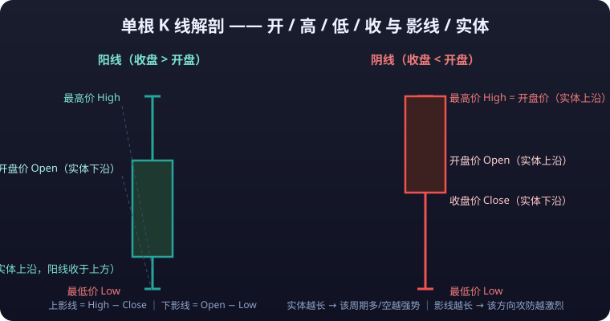
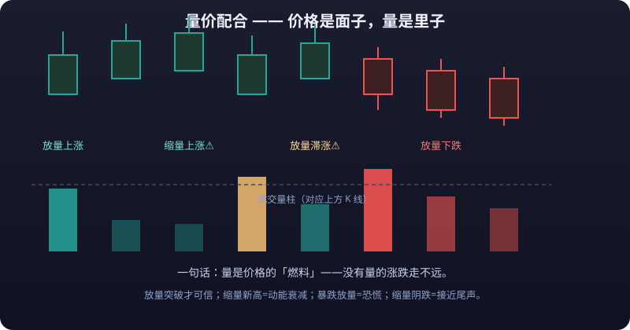

# 03 · Candlestick & Chart Basics

> This article solves one problem: **reading charts**. What each candlestick says, how to pick timeframes, how to use moving averages, how volume confirms price, and how chart types differ. Finish it and you can read markets hands-on in Kline Buty.
>
> **Disclaimer**: All content on this site is for learning and research only and does not constitute investment advice. Markets carry risk; invest with caution.

---

## 1. A Single Candlestick: The Four Prices

One candlestick records the price action of one period and is built from **four prices**:

| Element | English | Meaning |
|---|---|---|
| Open | Open | The first traded price of the period |
| High | High | The highest traded price of the period |
| Low | Low | The lowest traded price of the period |
| Close | Close | The last traded price of the period |

### 1.1 Anatomy of a Candlestick



- **Body**: the rectangle between open and close, the final range of the bull-bear fight in that period.
- **Wicks (shadows)**: the thin lines above and below the body (upper/lower shadow), marking the extremes the price touched intraday.
- **Upper wick** = High − max(Open, Close); **lower wick** = min(Open, Close) − Low.

### 1.2 Bullish and Bearish Candles

| Type | Condition | Appearance | Meaning |
|---|---|---|---|
| Bullish candle | Close > Open | Hollow/red body (conventions differ by region) | Bulls won the period |
| Bearish candle | Close < Open | Filled/green body | Bears won the period |

> Chinese terminals conventionally use **red-up, green-down**; international software (TradingView etc.) uses **green-up, red-down**. Neither is wrong — it is pure convention. Kline Buty follows the theme you pick.

### 1.3 What One Candlestick Tells You

- **Longer body**: one side dominated the period more decisively.
- **Longer upper wick**: heavy selling above; the rally was knocked back down.
- **Longer lower wick**: strong buying below; the selloff was caught.
- **Doji (Open ≈ Close)**: bulls and bears in a tug-of-war, direction unclear, often a reversal warning.

**One-line example**: a small bearish candle with a long lower wick = a deep intraday drop bought back up by the close — evidence of support at the lows, and a possible turn to strength.

---

## 2. Timeframes and Time Structure

### 2.1 What Is a Timeframe (Interval)

A timeframe = the length of time each candlestick represents. 1m means each candle packs 1 minute of data; 1d means each packs one day.

| Timeframe | Name | Typical use |
|---|---|---|
| 1m / 5m | Minutes | Scalping, bounce trades, moment-by-moment trading |
| 15m / 30m | Short | Intraday swings |
| 1h / 4h | Hours | Short-term to swing trading; the crypto workhorse |
| 1d (daily) | Daily | Swings and trend calls; the mainstream default |
| 1w (weekly) | Weekly | Medium-term trend filter |

> 💡 **Kline Buty tip**: on mobile, the timeframe bar **wraps to show all 14 timeframes** (1s to monthly) with no horizontal scrolling — every timeframe is one tap away, even on narrow screens. Desktop keeps a single compact row, with low-frequency options tucked into the "More" panel.

### 2.2 How Timeframes Relate

- One 1h candle = the **aggregate** of sixty 1m candles (open = first 1m open, close = last 1m close, high/low are the extremes of the range).
::: tip 🧭 Multi-timeframe iron rule: higher timeframe sets direction, lower timeframe finds entries
**Higher timeframe sets direction, lower timeframe finds entries — when the daily trend is up, hunting pullback entries on 1h/15m gives a far better **<mark>win rate</mark>** than fighting the daily trend for bounces.** Fighting the higher timeframe for counter-trend bounces is the most common way retail traders lose money.
:::

- **Higher timeframe for direction, lower timeframe for entries**: with the daily trend up, pullback entries on 1h/15m beat counter-trend bounce trades against the daily.
- **Smaller timeframe, more noise**: most "breakouts" on a 1m chart are fake; daily/weekly signals are more reliable but slower.

### 2.3 Combining Timeframes (Nested Frames)

The standard approach is the "**three-timeframe read**", for example:

```text
Weekly: set the major trend (filter; trade only with it)
  ↓
Daily: define the trading range and key levels
  ↓
1h/15m: pinpoint entries and **<mark>stop-loss</mark>** placement
```

**One-line example**: weekly uptrend, daily pullback into support, 1h prints a stabilizing bullish candle → both win rate and **<mark>risk-reward</mark>** are favorable; if the weekly is a downtrend, treat every daily bounce as watch-only.

---

## 3. Moving Averages: MA and EMA

### 3.1 What a Moving Average Is

A moving average = **a line connecting the average close over a chosen window**, used to smooth noise and reveal trend direction.

### 3.2 MA (Simple Moving Average, SMA)

```text
MA(n) = (sum of closes of the last n candles) ÷ n
```

**Worked example**: the last 5 daily closes are 10, 11, 12, 13, 14 → MA(5) = (10+11+12+13+14) ÷ 5 = **12**

### 3.3 EMA (Exponential Moving Average)

- Gives **recent prices a heavier weight**, reacts faster than MA, and turns earlier at inflection points.
- The formula recurses daily (with a smoothing factor) — you never compute it by hand. Just know: **most default indicators on terminals are EMAs; the larger the parameter, the smoother and the slower.**

### 3.4 Common Ways to Use Moving Averages

| Usage | Description |
|---|---|
| Direction filter | Price above a rising MA → bullish trend; the reverse → bearish |
| Support / resistance | Pullbacks into a rising MA often find support; rallies into a falling MA often stall |
| Golden cross / death cross | Fast MA crossing above slow = golden cross (bullish bias); below = death cross (bearish bias) |
| Common sets | MA(5,10,20), MA(50,200), and the crypto favorite EMA(20,50) |

::: warning ⏱ Moving averages are lagging indicators
Moving averages **describe the past; they do not predict the future**. A golden cross forms only after a chunk of the rally has happened, and chasing crosses often buys short-term tops. Treat MAs as a "trend filter", not a "signal generator".
:::

---

## 4. The Volume Sub-Panel

### 4.1 What Volume Is



Volume = the **total quantity traded** in the period (shares for stocks, coins for crypto). In the sub-panel each candle gets a bar beneath it, and **bar height = trading activity**.

### 4.2 Reading Volume-Price Combinations

| Pattern | Meaning |
|---|---|
| Up move + expanding volume | Genuine bullish force; the trend is more trustworthy |
| Up move + shrinking volume | Weak follow-through buying; the bounce may stall |
| Down move + expanding volume | Panic selling; there may be lower lows |
| Down move + shrinking volume | Selling pressure exhausting; near a bottom |
| Heavy volume, flat price | Huge disagreement between bulls and bears; watch for a top |

### 4.3 Advanced Clues

- **Volume-price divergence**: price makes a new high but volume does not → upward momentum is fading.
- **Volume at key levels**: breakouts/breakdowns on expanding volume are more reliable; low-volume breakouts are often fake.
- **High-volume lower wick**: huge buying into a crash is a classic panic-bottom signature.

::: tip ⛽ Volume is the "fuel" of price
**Volume is the "fuel" of price** — moves without volume do not travel far. For the full volume-price framework see [Technical Analysis](../technical-analysis/volume-price.md).
:::

---

## 5. How to Choose a Timeframe

The choice depends on **trading style and holding period**, not on "which is better":

| Your style | Main timeframe | Auxiliary | Holding period |
|---|---|---|---|
| Scalping / bounce trades | 1m / 5m | 15m | Minutes to hours |
| Intraday swings | 15m / 1h | 4h | Several hours to 1 day |
| Short-term swings | 1h / 4h | 1d | 1–5 days |
| Medium to long term | 1d / 1w | 4h | Weeks to months |

**Selection principles:**

1. Match the timeframe to your **daily rhythm** — someone who cannot watch screens at work should not trade off 1m charts.
2. Enter on the smaller timeframe, but **always ask the bigger one for direction first**.
3. A signal on one timeframe deserves confirmation from at least one higher timeframe before you act.
4. Do not timeframe-hop: bouncing between charts at the same moment only feeds you contradictory signals.

---

## 6. Common Chart Types

| Type | Construction | Strengths | Weaknesses | Best for |
|---|---|---|---|---|
| Candlestick | Body + wicks | Most complete info (OHLC) | Dense; can overwhelm beginners | **The default; most scenarios** |
| Line chart | Close prices connected | Minimal; clean trend view | Loses high/low info | Quick long-term trend checks |
| Area chart | Line + fill below | Visually intuitive | Same as line | Presentations |
| Bar chart (OHLC) | Horizontal ticks for open/close, vertical for high/low | Same info as candles | Less intuitive than candles | Classic Western platforms |
| Renko | Fixed-size bricks | Filters noise, draws only trend | No time axis; no session view | Trend-following specialists |
| Point & Figure | X/O marking reversals | Pure price action | Steep learning curve | Dedicated price-action analysis |
| Mountain/valley charts | Close with high/low stitched | Good for ranges | Less detail | Range assessment support |

> Beginner advice: **use candlesticks 90% of the time** and just know the rest exist. Advanced types like Renko are covered in [Technical Analysis](../technical-analysis/).

---

## 7. Quick Recap

- One candlestick = open, high, low, close; the body shows the bull-bear verdict, the wicks show the intraday battle.
- A timeframe is "time granularity": **higher timeframe sets direction, lower timeframe finds entries**.
- MA is a simple average; EMA weights recent prices more. Both lag — use them as filters.
- Volume-price: expanding-volume rallies are trustworthy, shrinking-volume rallies are suspect, expanding-volume declines are panic, shrinking-volume declines are near their end.
- Timeframe choice follows trading style: pick the direction timeframe first, then the entry timeframe.
- Candlesticks are the default chart; the other types each have their niche — switch as needed.

> Next step: after this article you can practice in Kline Buty right away; for candlestick patterns, combinations, and the full indicator system, see [Technical Analysis](../technical-analysis/).

::: warning ⚠️ Risk Warning
**Candlesticks and indicators are descriptive tools, not forecasting tools. Reading charts does not equal profiting — chart-watching without stop-losses and position management just gives your losses a technical gloss.**
:::
