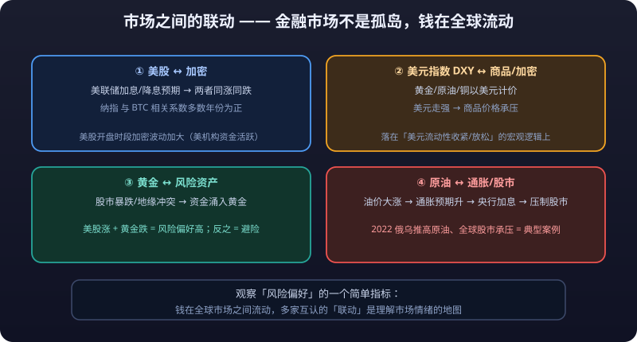

# 01 · Financial Market Overview

> Before looking at any candlestick, get clear about the market you are facing. This article lays out the four major segments of the financial markets: what each one is, who trades there, how the rules differ, and how they influence one another.
>
> **Disclaimer**: All content on this site is for learning and research only and does not constitute investment advice. Markets carry risk; invest with caution.

---

## 1. The Four Markets at a Glance

| Market | What Is Traded | Core Characteristics | Entry Barrier | Who Trades |
|---|---|---|---|---|
| Stock market | Equity in listed companies | Ownership of businesses, long-term value logic | Medium (account needed, share prices can be high) | Retail + institutions + funds |
| Spot commodity market | Physical goods: gold, crude oil, copper, agricultural products | Physical delivery, supply-and-demand driven | Low (buy by gram/barrel/lot) | Consumers, producers, traders |
| Futures market | **Contracts** on commodities, stock indexes, rates, etc. | Prices agreed for future dates, **<mark>leverage</mark>** trading | Medium (**<mark>margin</mark>** required) | Hedging firms + speculators |
| Crypto market | Digital assets such as Bitcoin and Ethereum | 24/7, global, never closes, extremely volatile | Low (a few dollars is enough) | Retail + quant funds + miners |

The four markets trade fundamentally different objects: **stocks buy you "a piece of a company", commodities buy "the thing itself", futures buy "a forward contract", and crypto buys "an asset on a distributed ledger"**. The trading logic follows accordingly.

---

## 2. The Stock Market

### 2.1 What It Is

A stock represents an **ownership share** in a company. Hold 0.001% of a company and you are entitled to that share of its profit distributions (dividends) and voting rights. The long-term driver of a stock's price is the **company's earning power**.

### 2.2 Participants

| Participant | Role |
|---|---|
| Listed companies | The sellers issuing shares, raising capital |
| Retail investors | Individual buyers and sellers; a large share of A-share volume |
| Institutional investors | Mutual funds, insurers, foreign capital, pension funds; their share keeps rising |
| **<mark>Market makers</mark>** / **<mark>liquidity</mark>** providers | Quote both sides of the market and earn the **<mark>spread</mark>** |
| Regulators | Securities commissions and exchanges; set rules and disclosure requirements |

### 2.3 Major Markets and Trading Mechanics

| Market | Ticker | Trading Hours (Beijing Time) | Settlement | Price Limits |
|---|---|---|---|---|
| A-shares (Shanghai/Shenzhen) | 000001.SZ / 600000.SH | 9:30–11:30, 13:00–15:00 | T+1 (shares bought today can only be sold tomorrow) | Main board ±10%, ChiNext/STAR ±20% |
| Hong Kong stocks | 00700.HK | 9:30–12:00, 13:00–16:00 | T+0 (buy and sell same day) | No price limits, but a "market volatility mechanism" exists |
| US stocks | AAPL | 21:30–4:00 next day during DST | T+0 | No price limits; circuit breakers (-7%/-13%/-20%) |

> Example: buy 100 A-shares today and you **cannot** sell today — the earliest is tomorrow (T+1). Hong Kong and US stocks can be bought and sold the same day (T+0).

---

## 3. The Spot Commodity Market

### 3.1 What It Is

Spot commodities are a **physical delivery** market: buying gold means buying physical gold; buying oil means buying actual barrels. Prices are set by **supply and demand** — production, inventories, consumption, and geopolitics all move them.

### 3.2 Participants

| Participant | Role |
|---|---|
| Producers | Mines, oil fields, farms; sell the output |
| Consumers | Smelters, refineries, food processors; buy raw materials |
| Traders / intermediaries | Capture geographic and time spreads |
| Investors | Buy gold, silver, etc. as store-of-value / safe-haven assets |
| Exchanges | Shanghai Gold Exchange (SGE), Shanghai Futures Exchange, London Metal Exchange (LME) |

### 3.3 Characteristics of Spot Commodities

- **Pricing anchor**: spot prices are a key reference for global commodity futures prices, and the two influence each other.
- **Spot gold/silver** is what retail investors touch most often (bars, gold ETFs, paper gold).
- Physical commodity spots (crude, copper, soybeans) see little direct retail participation; most exposure comes through futures or ETFs.

---

## 4. The Futures Market

### 4.1 What It Is

A future is a **standardized contract**: an agreement to buy or sell something at a set price on a set future date. It was invented for **hedging** — a farmer locks in the price of grain to be sold three months later and sidesteps falling prices; speculators later flooded in, making futures one of the most active speculative markets.

### 4.2 Participants

| Participant | Role |
|---|---|
| Hedgers | Real-economy firms (miners, oil companies, airlines, grain merchants) locking in costs or sale prices |
| Speculators | Use **<mark>margin</mark>** to control large **<mark>positions</mark>** and bet on price swings |
| **<mark>Arbitrage</mark>** desks | Capture spreads across expiries, products, and markets |
| Exchanges and clearing houses | Provide matching and **central clearing**, guarantee contract performance |

### 4.3 Futures Mechanics (Key Differences from Spot)

| Feature | Description |
|---|---|
| Margin trading | Pay only a fraction of contract value (e.g. 10%) — that is 10x **<mark>leverage</mark>** |
| Daily mark-to-market | P&L is settled daily at the close; losses beyond the margin trigger margin calls or **<mark>forced liquidation</mark>** |
| Delivery at expiry | Contracts expire; settle physically or in cash — retail traders usually close before expiry |
| T+0 | Open and close within the same day |
| Short selling | Sell first, buy back later — falling prices pay too (routine outside A-share margin trading) |

> Futures are a "small lever moves big weight" market: 100,000 of margin controls a 1,000,000 contract. Right direction, fast gains; wrong direction, equally fast losses. That is why this knowledge base gives [Futures](../futures/) its own chapter and tags it "**Know the risks**".

::: danger 💀 Futures leverage moves big weight — the wrong direction loses just as fast
**100,000 of margin controls a 1,000,000 contract. Right direction, fast gains; wrong direction, equally fast losses.** Leverage cuts both ways — build your risk literacy before touching futures.
:::

---

## 5. The Crypto Market

### 5.1 What It Is

Cryptocurrencies are digital assets issued on blockchain ledgers. Bitcoin (BTC) positions itself as "digital gold"; Ethereum (ETH) hosts an on-chain ecosystem of DeFi, NFTs, and more. The crypto market has **no central exchange for matching** (decentralized in design, though most trading routes through centralized exchanges such as Binance/OKX) and trades 24/7, 365 days a year.

### 5.2 Participants

| Participant | Role |
|---|---|
| Retail traders | Global individuals; extremely low entry barrier |
| Quant / HFT firms | Take the bulk of spot and derivatives volume |
| Miners / validators | Maintain the network and earn new-coin rewards |
| Market makers | Provide liquidity and earn the spread |
| Exchanges | Centralized matching and custody (CEX), or on-chain automated market making (DEX) |

### 5.3 What Makes Crypto Different

- **24/7, no close**: there is no closing price; extreme moves can hit at 3 a.m.
- **Extreme volatility**: ±10% days are routine; bull markets breed 100x coins, bear markets **<mark>zero</mark>** them out just as often.
- **Global linkage**: crypto spans every time zone; US equity open/close windows often bring the sharpest moves.
- **Derivatives dominate**: perpetuals offer 100x+ **<mark>leverage</mark>**, and **<mark>liquidation</mark>** news breaks almost daily.

---

## 6. Side-by-Side Comparison of the Four Markets

| Dimension | Stocks (A-shares) | Spot Commodities | Futures | Crypto |
|---|---|---|---|---|
| Trading hours | 4 hours on weekdays | Varies by venue (gold T+D runs ~23 hours) | Day + night sessions (~23 hours/day for most products) | **24/7** |
| T+0 / T+1 | T+1 | T+0 | T+0 | T+0 |
| Leverage | Essentially none (margin trading aside) | None | **Yes (margin system, typically 5–15x)** | Spot no; derivatives yes (100x and above) |
| Price limits | Main board ±10%, ChiNext/STAR ±20% | Mostly none | Most products ±4% to ±10% | **No price limits** |
| Minimum trade unit | 100 shares (one lot) | By product (gram/tonne/barrel) | 1 lot (e.g. 10 tonnes/lot) | Fractions like 0.00001 BTC |
| Short selling | Restricted (margin trading) | Hard in spot; possible via gold deferred | Free | Free |
| Delivery / settlement | No delivery concept | Physical spot | Delivery at expiry | Spot none; perpetuals can **<mark>roll</mark>** forever |

---

## 7. How Markets Influence Each Other



Financial markets are not islands; money flows between them worldwide. The most common linkages worth memorizing:

### 7.1 US Equities ↔ Crypto

- Crypto volatility usually rises during US equity hours (after 21:30 Beijing time), because **US institutional money and quant strategies are most active**.
- Fed rate hike/cut expectations → risk assets (US equities, crypto) move together: easing expectations lift both, tightening expectations weigh on both.
- The Nasdaq (tech-heavy) and BTC have shown positive correlation in most years, and are often cross-checked as a gauge of risk appetite.

### 7.2 US Dollar Index (DXY) ↔ Commodities / Crypto

- Gold, crude, and copper are **priced in dollars**: a stronger dollar → each dollar buys more commodity → prices under pressure; a weaker dollar → commodity prices benefit.
- Crypto is not fully driven by the same forces, but it moves closely with the macro logic of "dollar liquidity tightening / easing".

### 7.3 Gold ↔ Risk Assets

- Gold is the classic **safe-haven asset**: when equities crash or geopolitical conflict escalates, money pours into gold and its price rises.
- A simple risk-appetite gauge: **US equities up + gold down** = high risk appetite; the reverse = risk-off mode.

### 7.4 Crude Oil ↔ Inflation / Equities

- Oil is the blood of industry: a big oil rally → rising inflation expectations → central banks more likely to hike → equity valuations pressured.
- The 2022 Russia-Ukraine conflict pushing up crude while global equities sagged is a textbook case of this chain.

### 7.5 Futures ↔ Spot

- Spot and futures prices of the same product (e.g. gold) **anchor each other**; the futures price is the market's "forward expectation" of spot.
- Futures premium/discount (the **<mark>basis</mark>**) reflects the market's view of what comes next and is the arbitrage desks' main battlefield.

---

## 8. Recommended Learning Order in This Knowledge Base

```text
Getting Started (markets and vocabulary)   ← you are here
        ↓
Spot (simplest, lowest risk)               ← learn trade flow and position sizing first
        ↓
Stocks (rules and fundamental analysis)
        ↓
Futures (leverage, margin, forced liquidation)  ← must-read before using leverage
        ↓
Crypto Perpetuals (perpetuals, **<mark>funding rate</mark>**)
        ↓
Technical Analysis (candlestick patterns, indicators, volume-price)
        ↓
Trading System (plan, risk control, psychology)
        ↓
Pitfalls (traps, compliance, exit)
```

**Why this order:**

1. **Start with spot** — no leverage, no **<mark>liquidation</mark>**; build the right instincts for "buying/selling" and "position size" first.
2. **Step up to stocks** — clear rules and open data make stocks ideal for practicing a fundamentals + technicals framework.
3. **Leave futures/perpetuals for later** — leverage cuts both ways; build risk literacy first. **The margin and **<mark>forced liquidation</mark>** sections of [Futures](../futures/) are required reading in this knowledge base.**
4. **Technical analysis runs throughout** — whatever the market, candlesticks and indicators speak the same language; learn once, use everywhere.

> Remember one line: **learn not to lose before learning to earn.** Every article that follows moves you toward that goal.

::: tip 🎯 Iron rule #1 for beginners: learn not to lose before learning to earn
**Learn not to lose before learning to earn.** That principle runs through every later chapter — build position instincts with spot, learn fundamental analysis with stocks, master forced liquidation and margin in futures, and only then talk about returns.
:::

::: warning ⚠️ Risk Warning
**Risk levels differ enormously across markets: spot stocks and spot crypto, futures contracts, and margin forex are not in the same league. Before entering any market, make sure you understand its trading rules and its worst-case scenario.**
:::
