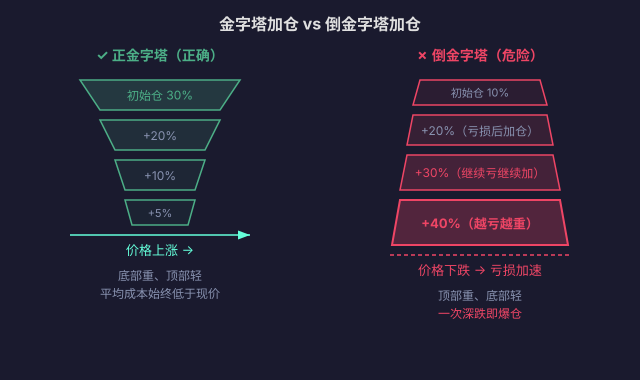

# 06 · Position Sizing and Money Management

> Traders blow up not because they "called the direction wrong", but because they "were too heavy when they were wrong". You can be wrong on direction many times; be wrong on position sizing a few times and you're out. This article is the math that **keeps you alive**.
>
> **Disclaimer**: all content on this site is for learning and research only and does not constitute investment advice. Markets carry risk; invest with caution.

---

## 1. Why Position Sizing Matters More Than Direction

::: danger ⚠️ One Overweighted Trade Can End You
Suppose you have 100,000 yuan and go all in every time:
- Gain 50%, then lose 50% → 75,000 left (−25%)
- Gain 50% again, lose 50% again → 56,250 left (−44%)
- Four rounds in a row → 32,000 left (−68%)

You were "right half the time", yet the account is down nearly 70%. That is the mathematical penalty of oversized positions.
:::

### 1.1 The Asymmetry Between Drawdown and Recovery

| Loss | Gain needed to break even |
|---|---|
| 10% | 11% |
| 20% | 25% |
| 30% | 43% |
| 50% | **<mark>100%</mark>** |
| 70% | 233% |
| 90% | **<mark>900%</mark>** |

The deeper the loss, the harder recovery gets — exponentially. **Prime directive of position sizing: never put yourself in a position where you need a double just to get back to even.**

---

## 2. Per-Trade Risk Exposure

### 2.1 The Core Formula

```text
Max loss per trade = total account equity × risk percentage
Position size = max loss per trade ÷ stop-loss distance percentage
```

### 2.2 Worked Example

```text
Account equity: 100,000 yuan
Risk percentage: 1% (max 1,000 yuan loss per trade)
Entry price: 100,000 (BTC)
Stop-loss price: 95,000 (5% stop distance)

Position size = 1,000 ÷ 5% = 20,000 yuan (BTC position)

Even if the stop-loss triggers, you lose only 1,000 yuan = 1% of total equity
```

### 2.3 Consequences of Different Risk Percentages

| Risk per trade | After 5 straight losses | After 10 straight losses |
|---|---|---|
| 0.5% | −2.5% | −4.9% |
| 1% | −4.9% | −9.6% |
| 2% | −9.6% | −18.3% |
| 5% | −22.6% | −40.1% |
| 10% | −41.0% | **<mark>−65.1%</mark>** |

::: tip 💡 Industry Consensus
Professional traders and funds usually cap per-trade risk at 0.5%–2%. Above 5% is already aggressive; above 10% is gambling with your life.
:::

---

## 3. The Kelly Formula

### 3.1 Formula

```text
f* = (bp - q) / b

f* = optimal fraction of capital
b  = payoff ratio (average win ÷ average loss)
p  = win rate
q  = 1 - p (loss rate)
```

### 3.2 Example

```text
Win rate p = 55%, payoff ratio b = 1.5

f* = (1.5 × 0.55 - 0.45) / 1.5
   = (0.825 - 0.45) / 1.5
   = 0.375 / 1.5
   = 0.25 → 25%
```

::: warning ⚠️ The Kelly Trap
Kelly assumes you know your win rate and payoff ratio **exactly** — in reality both are estimates that drift as markets change. Full Kelly (25%) with misestimated parameters can cause severe drawdowns. In practice, traders use **half Kelly** (f*/2 = 12.5%) or even **quarter Kelly**.
:::

---

## 4. Position Allocation Strategies

### 4.1 Fixed-Fraction Method

Use a fixed percentage of the account on every trade (say 10% or 20%). Simple and highly disciplined.

### 4.2 Volatility-Adjusted Method

Smaller positions for high-volatility instruments, larger positions for low-volatility ones. The goal: equal **expected dollar volatility** per trade.

```text
BTC averages 3% daily moves, ETH 5%
If the BTC position is 30,000 yuan → ETH position = 30,000 × 3/5 = 18,000 yuan
Both trades then carry the same average daily dollar swing (~900 yuan)
```

### 4.3 Pyramiding



```text
Initial position: 30% of capital (the largest, at the base)
First add: +20% (after the uptrend is confirmed)
Second add: +10% (trend continues)
Third add: +5% (only in extremely strong trends)

Average cost always stays below the current price; each add gets smaller
```

::: warning ⚠️ Never Build an Inverted Pyramid
Adding to a loser (buying more as it falls) is an inverted pyramid — the biggest position sits at the bottom, and it gets heavier the more you lose. It is one of the most common retail self-destruction patterns. If you catch yourself "adding to a losing position", stop and ask: if I were flat right now, would I still buy at this price?
:::

---

## 5. The Equity Curve and Maximum Drawdown

### 5.1 Maximum Drawdown

```text
Max drawdown = (peak equity - trough equity) / peak equity

Example: the account rises from 120,000 to 150,000, then falls to 105,000
Max drawdown = (150,000 - 105,000) / 150,000 = 30%
```

### 5.2 Drawdown Control Rules

| Drawdown threshold | Action |
|---|---|
| 5% | Halve position size, review the strategy |
| 10% | Cut position size to 25%, stop adding |
| 15% | Cut position size to 10%, observe only, no trading |
| 20% | Stop trading entirely, do a full strategy review |

::: danger ⚠️ Don't "Take a Shot" in a Deep Drawdown
After a 20% drawdown, the instinct is to "size up and win it back fast" — which almost always guarantees a deeper drawdown. The right sequence: shrink position → cut risk → find the problem → start again.
:::

---

## 6. Pre-Trade Checklist

Run through this before every order:

- [ ] What is my maximum loss on this trade? (amount + percentage)
- [ ] Where is my stop-loss? Is the stop distance reasonable?
- [ ] What share of the account does this position take? Does it fit my risk rules?
- [ ] If I lose 3 trades in a row, what is my total drawdown?
- [ ] Am I executing a plan, or chasing rallies and dumping on dips?

::: warning ⚠️ Risk Warning
Everything in this article is for learning and research only and does not constitute investment advice. Crypto trading carries high risk; leveraged trading can result in the loss of your entire principal. Decide carefully based on your own risk tolerance.
:::
