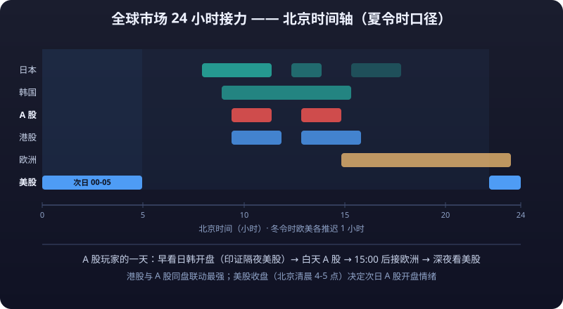

# Global Markets Comparison Overview

> The previous three articles looked at Japan/Korea, Europe, and emerging markets respectively; this one puts them on the same table for comparison: each index's "personality", its correlation with A-shares, how time zones line up, and which channels you can use to actually get exposure. It ends by answering a practical question: for a pure A-share or crypto player, what is the real value of understanding these "global markets".

---

## 1. "Personality" Comparison Table of Major Global Indices

| Index | Market represented | Weighted-stock profile | **<mark>Volatility</mark>** common knowledge | Correlation with A-shares |
|---|---|---|---|---|
| CSI 300 | A-shares | Heavy in financials, baijiu (liquor), new energy | Annualized roughly 20%-25% (historical range, subject to the latest data) | Benchmark (=1) |
| Hang Seng Index | Hong Kong stocks | Internet (Tencent/Meituan), financials, property | Higher than the A-share broad market (historical range) | **High**: fundamentals overlap heavily, but **<mark>liquidity</mark>** and valuation regimes are independent |
| Nikkei 225 | Japan | Toyota, Fast Retailing, SoftBank; price-weighted | Close to A-shares (historical range) | **Low**: historically weak statistical correlation (subject to the latest data) |
| Nasdaq 100 | US tech | Apple, Microsoft, Nvidia, Meta; extremely high tech weight | Higher than the S&P 500 | **Medium**: clear linkage with A-share growth names (ChiNext / STAR Market) |
| S&P 500 | US stocks | Tech + financials + healthcare, balanced sectors | Annualized roughly 15%-18% (historical range) | Low-to-medium: affects A-shares indirectly via foreign sentiment and FX |
| DAX / Euro Stoxx 50 | Eurozone | Luxury, semiconductors, autos, pharma | Mean-reversion traits more visible than US equities, below them (historical range) | Low-to-medium: indirect impact through the euro → dollar index chain |
| Nifty 50 | India | Financials, IT services, energy | Significantly higher than developed markets globally (historical range) | Low-to-medium: fellow Asian EM, but a relatively independent capital pool |
| KOSPI | Korea | Samsung, SK Hynix; chaebol concentration | Above the developed-market average | Low-to-medium: partial linkage with A-share semiconductor/display chains |

> **Correlation common knowledge**: correlations are not fixed. In extreme conditions (a global crisis) all markets converge toward 1 — "global allocation diversifies risk" failed just the same in a liquidity crisis like March 2020 (historical fact). The value of correlation shows up in **diversification during normal years**, not at the moment of crisis.

::: warning ⚠️ The Limits of Diversification
**The value of correlation lies in diversification during normal years, not at the moment of crisis.** In a liquidity crisis like March 2020, correlations across all markets converge toward 1 and global allocation fails just the same — diversification reduces damage in ordinary times; it is not a lifeboat in a storm.
:::

## 1.5 More Indices: Supplementary "Personality" Notes

| Index | Market represented | Weighted-stock profile | Common knowledge on correlation with A-shares |
|---|---|---|---|
| Dow Jones Industrial Average | US stocks | Price-weighted, 30 blue chips, traditional sectors (UnitedHealth, Goldman Sachs, Boeing, etc.) | Low |
| Russell 2000 | US small caps | Small-cap companies; thermometer of US domestic demand | Very low (occasional resonance with small-cap A-share style) |
| SSE 50 / FTSE China A50 | A-share large caps | Extremely heavy in banks, insurance, baijiu | Highly co-sourced with the CSI 300 |
| ChiNext Index | A-share growth | New energy, pharma, electronics | Medium-high correlation with Nasdaq (growth-style resonance) |
| Hang Seng TECH | Hong Kong tech | Tencent, Alibaba, Meituan, Xiaomi | Double linkage with A-share growth + US-listed Chinese stocks |
| Taiwan Weighted Index | Taiwan region, China | TSMC alone carries an extremely high weight (historically over 30%) | Low-to-medium (partial linkage with the A-share semiconductor chain) |
| Vietnam VN Index | Vietnam | Banks, property, consumer | Low (its own story) |

**Common knowledge**: three sources of "personality" differences: ① sector structure (tech vs financials vs resources); ② investor structure (institutional vs retail); ③ FX and policy environment. When studying a new market, asking these three questions first is more effective than any technical indicator.

---

## 2. Why "Global Allocation" Matters

### 2.1 Diversification Through Correlation: A Numerical Example (illustrative, not investment advice)

Assume historical annualized returns and volatility (numbers only for grasping magnitudes; defer to actual data):

| Portfolio | Composition | Annualized volatility (illustrative) | Notes |
|---|---|---|---|
| All-in A-shares | 100% CSI 300 | About 22% | Bears single-market risk entirely |
| Global allocation | US 40% + Japan 20% + gold 15% + crypto 5% + cash 20% | About 13%-15% (illustrative) | Low-correlation assets offset part of each other's swings |
| All-in crypto | 100% BTC | About 60%+ | Extreme volatility; managed with **<mark>position sizing</mark>**, not diversification |

- **Key point**: when two assets have low correlation (Nikkei vs A-shares) or negative correlation (gold vs risk assets), portfolio volatility falls below the weighted average of the parts — this is the only "free lunch" of **<mark>global allocation</mark>**.
- **Counter-example**: putting A-shares, H shares, and US-listed Chinese stocks together does not count as "global allocation" — their correlations are very high; they are three expressions of the same China risk.

::: warning Pseudo Global Allocation
**A-shares + H shares + US-listed Chinese stocks is not "global allocation"** — all three are highly correlated, three expressions of the same China risk, with near-zero diversification benefit. True global allocation must include assets with low or even negative correlation to your holdings.
:::
- **Common-knowledge reminder**: diversification cannot eliminate volatility, only "smooth" it; and after diversifying, your portfolio will always underperform whichever market rallies hardest in a bull run — anyone chasing "picking the right market every year" is not suited to global allocation.

### 2.2 Currency Risk: The Hidden Variable

Lesson one of global allocation: **<mark>a foreign asset's report card must be restated in RMB terms</mark>**.

| Scenario | Numerical example (illustrative) | Result |
|---|---|---|
| Yen assets gain 20%, but the yen depreciates 15% vs RMB | 20% − 15% (approx.) | Only about 2-5% gain after conversion back to RMB |
| US stocks gain 10%, USD appreciates 8% vs RMB | 10% + 8% (approx.) | Roughly an 18% gain in RMB terms |

- **Common knowledge**: during the sharp yen depreciation of 2021-2024, even as the Nikkei set new highs, RMB investors' "real return" from holding Japanese stocks via QDII was far below the index gain (historical market action) — **<mark>a large share of the Nikkei rally was "depreciated into existence"</mark>**.
- Conversely, in RMB appreciation cycles, overseas allocation systematically underperforms domestic assets — "currency diversification" has a cost, and the cost is "you lose when the RMB appreciates".

### 2.3 Time Zones and Trading Convenience (Review of Each Market's Session Hours)

| Market | Beijing time (approximate; subject to the latest trading sessions) | Traits |
|---|---|---|
| A-shares | 09:30-11:30 / 13:00-15:00 | Midday break; overlaps with the Asia-Pacific session |
| Japan | 08:00-14:00 (lunch break) / 15:30-18:00 evening session | Overlaps with the A-share morning; the world's first major open |
| Korea | 09:00-15:30 | Nearly synchronous with A-shares; reflects the prior night's US session before A-shares do |
| Hong Kong | 09:30-12:00 / 13:00-16:00 | Same session as A-shares, closes half an hour later |
| Europe | 15:00-23:30 (DST) / 16:00-00:30 (winter time) | Bridges into the A-share late session |
| US | 22:30-05:00 (DST) / 23:30-06:00 (winter time) | Trades while A-shares sleep; sets next-day A-share opening sentiment |

- **Practical common knowledge**: an A-share player's day = watch Japan/Korea opens in the morning (to confirm the overnight US session) + trade A-shares by day + watch the US close at night; Hong Kong links most strongly with A-shares, and European energy prices affect next-day domestic commodity futures.



## 2.5 Proportion Frameworks and Rebalancing for Global Allocation (Common Knowledge)

| Framework | Composition | Traits (common knowledge) |
|---|---|---|
| Global 60/40 | 60% global equities + 40% global bonds | Classic benchmark; suits conservative investors |
| Permanent Portfolio | 25% each: stocks/bonds/gold/cash | Four-quadrant **<mark>hedging</mark>**; low volatility but lags in bull markets |
| All Weather (Bridgewater) | Allocates by economic regime (growth/inflation) | Principle is "allocate across all environments"; hard for individuals to copy directly |
| Simple global mix | A-shares + HK stocks + US stocks + Japanese stocks + gold + bond funds | The realistic choice for most people; discipline over proportions is the point |

- **<mark>Rebalancing</mark> common knowledge**: after setting target weights, once or twice a year "sell high, buy low" to pull deviations back in line — the only reliably effective source of excess return in global allocation (discipline premium).
- **Misconception**: treating "whichever market rallied recently" as a reason to add weight is chasing highs by nature — returns from global allocation come from "holding + rebalancing", not from "timing switches between markets".

---

## 3. Comparing Access Channels for Global Allocation

| Channel | Barrier | Coverage | Getting money offshore | Main issues |
|---|---|---|---|---|
| QDII funds | None (from ~1,000 yuan) | Funds covering US/Japan/Europe/emerging markets | Fund company handles FX centrally, **no offshore transfer needed by individuals** | Quota-based purchase limits, on-exchange premiums (common on Nikkei ETFs), slow redemptions (T+7 common) |
| Stock Connect | 500k yuan in securities account assets (historical threshold, subject to the latest rules) | Hong Kong stocks within Stock Connect eligibility | **No FX conversion needed**, settled in RMB | Restricted eligible universe; excludes US/Europe/Japan |
| Overseas brokers (IBKR/Futu/Tiger etc.) | No barrier to opening; funding in the thousands of USD | Full global coverage (US stocks/ETFs/options) | Must move funds out compliantly yourself (**subject to the latest FX regulations**) | Offshore-transfer compliance, channel-closure risk, tax filing obligations |

::: tip 💡 How to Choose a Channel
**Selection logic (common knowledge, not advice)**: just want "some overseas index exposure" → QDII is enough; just want "Hong Kong stocks" → Stock Connect is the simplest; want "full global freedom across products" → only then evaluate overseas brokers, and only if funds can go offshore compliantly. See [Cross-Border Investing in Practice](cross-border-investing.md) and [Wealth Allocation / Overseas Asset Allocation](../wealth-allocation/overseas-allocation.md) for compliance details.
:::

---

## 4. The Value of a "Global Lens" for Pure A-Share/Crypto Players

### 4.1 Understanding Global Liquidity Transmission: One Chain

```text
Federal Reserve (policy and Treasury yields)
   ↓
Dollar index (euro carries the largest weight → European data also feed pricing)
   ↓
Emerging markets (capital inflows/outflows) → RMB exchange rate
   ↓
Northbound flows → A-shares (especially pricing of core assets and HK stocks)
```

- **How A-share players use it**: watching just three indicators — "Fed rate-cut expectations", "dollar index", "RMB exchange rate" — gives a rough read on northbound flows' warmth, closer to the essence of pricing than staring at dozens of technical indicators.
- **Common knowledge**: northbound flows and the RMB exchange rate move in strong sync (historical statistics); "weak dollar + rising RMB" is the classic friendly setup for foreign money in A-shares.

### 4.2 US Tech Stocks → Crypto

- Crypto and US tech (especially Nasdaq) share highly linked risk appetite: loose liquidity + rising risk appetite lifts Nasdaq and BTC together; in 2022, when the Fed hiked aggressively, both fell together (historical market action).
- **Common knowledge**: for crypto players, watching "overnight Nasdaq + dollar index + Treasury **<mark>yields</mark>**" gives far more global context than any single indicator; crypto's boom-bust cycles are usually the "amplifier" of global risk appetite, not an "independent variable".

### 4.3 European Energy → Domestic Commodity Futures

- European natural gas and crude volatility → transmission into the costs and sentiment of domestic energy/chemical futures (LPG, PTA, methanol, oil shipping) (cross-market common knowledge; see [Commodities Overview](../markets-instruments/commodities-overview.md)).
- Example: during Europe's 2022 energy crisis, surging international oil prices and European gas drove sharp swings in domestic energy/chemical futures (historical market action).

### 4.4 One Table Summarizing "Global Variables → Your Holdings"

| Your holdings | Global variables to watch (common knowledge) |
|---|---|
| A-share core assets (baijiu/financials/HK via Stock Connect) | Dollar index, RMB exchange rate, northbound flows, overnight US session |
| A-share growth (ChiNext / STAR) | Nasdaq, Treasury yields (growth stocks are most rate-sensitive) |
| Crypto | Nasdaq, dollar index, Fed policy expectations, safe-haven events |
| Domestic commodity futures | European energy, dollar index, the Fed and real rates (for gold) |

## 4.5 The Global Macro Calendar: What to Watch for Each Market

| Data/event | Release time (Beijing time, subject to the latest calendar) | Who it moves (common knowledge) |
|---|---|---|
| US nonfarm payrolls (first Friday evening monthly) | 21:30 (DST) | USD, Treasuries → global risk assets |
| US CPI | Mid-month evenings | Fed hike expectations → global pricing |
| FOMC decision | 8 times yearly, 02:00 AM | Master switch of global liquidity |
| BoJ decision | Usually around Friday 11:00 AM | Yen → Japanese stocks + carry trades |
| ECB decision | One week after alternate FOMCs | Euro → dollar index → everything |
| China official PMI | Month-end 09:30 | A-share + northbound-flow sentiment |
| Korea export data (1st of each month) | Around 08:00 | Leading indicator of global semiconductors/electronics |

**Common knowledge**: Korea's monthly exports are the "canary" of global trade; Japanese and European central bank policy are shadow variables of the dollar — **<mark>A-share and crypto players don't need to track every data point, but must recognize these few "master switches"</mark>**.

## 4.6 Rapid-Fire FAQ

| Question | Answer (common knowledge, subject to the latest data) |
|---|---|
| Can global allocation really dodge an A-share bear market? | Not "dodge", but "soften": when A-shares fall 30%, portfolios including US/Japan/gold typically see significantly smaller **<mark>drawdowns</mark>** (historical statistical common knowledge) |
| Why not just go all-in on Nasdaq? | A single market still carries systemic risk (the 2000 dot-com bubble, Nasdaq -33% in 2022 are historical cases); missing A-share rallies is also a real cost |
| Does gold count as global allocation? | Yes: low or negative correlation with stocks; a shock absorber for the portfolio in crises (historical statistical common knowledge) |
| Does crypto count as global allocation? | Highly correlated with Nasdaq; diversification benefit far below intuition; keep position size tiny (risk common knowledge, not investment advice) |
| Should currency risk be hedged? | Not recommended for individuals (costly, complex instruments); accept FX swings and evaluate in RMB terms |
| When should you rebalance? | Check every six months or year; act only when deviation exceeds 5 percentage points from target (discipline common knowledge) |
| Should you add emerging markets? | Depends on volatility tolerance; EMs are volatile and not that uncorrelated with A-shares — beginners should start with mature markets (common knowledge, not investment advice) |

## 4.7 From "Understanding" to "Acting": Three Steps of Global Allocation (Common Knowledge)

**Step one: fix your domestic foundation first.** Until equity/bond ratios, DCA discipline, and emergency funds are sorted, any "going global" is building on sand — global allocation solves "diversification", not "my domestic portfolio was already broken".

**Step two: budget in RMB terms.** Before deciding how much goes offshore, calculate three accounts: one-off costs (FX/wire fees), annual management fees plus premium erosion, and worst-case FX drawdown upon conversion back (see the numerical example in 2.2) — commit only if acceptable.

**Step three: start with the simplest channel.** Order of common knowledge: broad QDII funds (US/Japan/Europe) → Stock Connect (if you meet the threshold) → overseas brokers (only with genuine need and compliant funds). **Get one channel working end-to-end before talking multi-market allocation** — for most people, year one of global allocation requires exactly two things: "open one compliant window + buy one broad fund".

::: tip 💡 The Value of the Map
**Closing common knowledge**: the value of global markets, for A-share and crypto players, starts with "knowing yourself" — seeing clearly where your own market sits in the global liquidity chain matters more than memorizing any index level. A map's value lies not in the map itself, but in where you stand on it.
:::

---

## 5. Cheat Sheet

| Question | Answer (common knowledge, subject to the latest data) |
|---|---|
| Which overseas indices correlate most/least with A-shares? | Hang Seng highest (overlapping fundamentals); Nikkei historically low correlation with A-shares |
| Why does global allocation reduce volatility? | Low-correlation assets offset each other's swings (works in normal years; fails in crises) |
| How does FX affect offshore assets? | Returns must be restated in RMB; yen depreciation can eat up an entire Japanese stock rally |
| How to remember global time zones? | Japan/Korea before A-shares, Europe bridges into the A-share late session, US prices next day's sentiment while A-shares sleep |
| Access channels for regular people? | QDII (no threshold), Stock Connect (500k threshold, RMB settlement), overseas brokers (compliant offshore transfer required) |
| How does the Fed reach A-shares? | Fed → dollar index → RMB exchange rate/emerging markets → northbound flows → A-shares |
| What should crypto players watch? | Nasdaq + dollar index + Treasury yields (the global variables of risk appetite) |
| First step of global allocation? | Fix the domestic portfolio foundation, then budget in RMB terms, then start with the simplest channel (broad QDII funds) |
| When to rebalance? | Every six months or year; act only past 5 percentage points of deviation (discipline common knowledge) |
| Do correlations stay constant? | No: in crises global asset correlations converge toward 1, and "diversification" fails temporarily in extreme conditions (2008/2020 are historical facts) |
| Is "global allocation" diversifying risk or diluting returns? | Both: it smooths volatility, and makes the portfolio look conservative whenever a single market rips — accepting this is what makes it sustainable |

::: info 📖 Adjacent Chapters Navigation
**Relation to adjacent chapters**: participation-channel details per market are in [Japan and Korea Markets](japan-korea-markets.md), [European Markets](european-markets.md), and [Emerging Markets](emerging-markets.md); compliance and funding paths in [Cross-Border Investing in Practice](cross-border-investing.md); the full framework of overseas allocation is in [Wealth Allocation / Asset Allocation Basics](../wealth-allocation/asset-allocation.md).
:::

---

::: warning ⚠️ Risk Warning
Global allocation is not a formula for "guaranteed gains": correlations fail in crises (the synchronized 2008 and 2020 global selloffs are historical facts), currency risk can consume all offshore gains, QDII suffers premiums and purchase limits, and cross-border money movement carries compliance risk. Volatility, correlations, and weights cited here follow historical and public common knowledge; defer to the latest data. This article is not investment advice — make independent decisions based on your own risk tolerance, and consult licensed professionals for cross-border money matters.
:::
