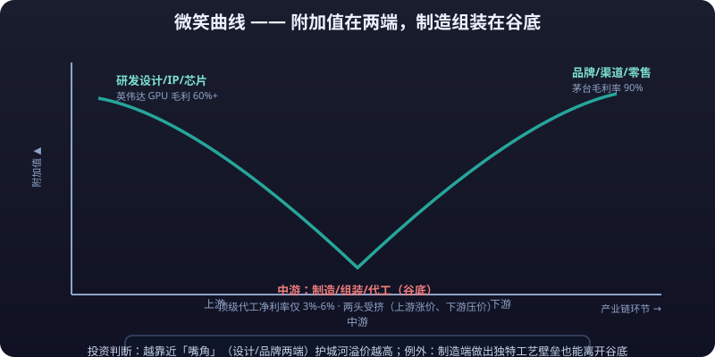

# Value Chain Analysis

> An industry is not a monolith but a value chain divided among upstream, midstream, and downstream: raw materials at the top, manufacturing in the middle, brands and channels at the bottom.
> Profit is not evenly distributed — within the same industry, different segments differ wildly in their ability to earn.
> This article covers industry chain structure, the smile curve of profit distribution, the investment logic for each segment,
> the "sell shovels" logic, and industry chain research methods, closing with a full hands-on walkthrough of the AI compute chain.

---

## 1. What Is an Industry Chain

### The upstream–midstream–downstream value chain structure

| Segment | What It Does | Typical Traits | Source of Profit |
|---|---|---|---|
| Upstream | Resources, raw materials, basic components | Capital-heavy, strongly cyclical, supply sets price | Resource endowment, supply-demand gaps |
| Midstream | Manufacturing, processing, assembly, contract production | Capital-heavy, fierce competition, utilization-dependent | Scale and cost, process barriers |
| Downstream | Brands, channels, end products, services | Asset-light, close to consumers | Brand premium, channel capability, demand insight |

**Three questions to locate a company in the chain:**

- How many steps from your product to the final consumer? (The farther away, the more upstream)
- Who holds pricing power? (Who decides what the end product sells for and what the raw material sells for)
- Where does added value occur? (Which segment earns above-average returns)

### Profit flows along the value chain

Industry chain research has one core proposition: **<mark>where does money come from, who holds it now, and where will it flow next.</mark>** In an upswing, profit usually lands first on the segment with the tightest capacity; in a downturn it stays with whoever has the strongest bargaining power (closest to demand or holding a quasi-monopoly). Researching an industry chain means tracking where profit flows.

---

## 2. Three Classic Industry Chains Dissected

### The smartphone chain

| Segment | Representative Activities | Profit Level | Landscape Traits |
|---|---|---|---|
| Upstream | Chips (SoC/memory/displays), optical lenses, CMOS sensors | High | Highly monopolized; head players take the lion's share |
| Midstream | Mainboards, batteries, structural parts, whole-device assembly | Low-to-mid | Fierce competition; assembly net margins in single digits |
| Downstream | Brands (Apple/Huawei/Xiaomi), channels, operating systems | High | Brand concentration; top brands capture most industry profit |

::: info 📖 The classic phenomenon of the Apple supply chain
In the Apple supply chain, whole-device assemblers (e.g., Foxconn) earn hard-earned money, while suppliers of core components — lenses, chips, displays — enjoy far higher margins than assembly: **the added value sits not in assembly but in design and core components**.
:::

### The EV chain

| Segment | Representative Player Types | Current Profit Traits |
|---|---|---|
| Upstream | Lithium mines, cobalt/nickel, cathode/anode/electrolyte/separator | Violent price cycles: windfall profits in 2021-2022, then retreat after **<mark>overcapacity</mark>** set in |
| Midstream | Battery makers, motors & controls, vehicle manufacturing | Batteries highly concentrated (CATL/BYD duopoly); vehicle assembly fiercely competitive |
| Downstream | Brand automakers, charging networks, mobility services | Brand divergence; intelligence, channels, and after-sales are the new profit battlegrounds |

### The semiconductor chain

| Segment | Content | Barrier Traits |
|---|---|---|
| Upstream | EDA software, semiconductor equipment, photoresist/wafers and other materials | Highest barriers; chokepoint segments; long qualification cycles |
| Midstream | Wafer fabrication, packaging & testing | Massive capex; advanced nodes run by a duopoly |
| Downstream | Chip design (Fabless), end applications | Design firms are asset-light with high gross margins, but depend on foundries and IP licensing |

::: tip 💡 One rule common to all three chains
The shared pattern: **the further upstream, the more monopolized; the further downstream, the more fragmented (except consumer-facing terminal brands)**. For any industry chain, draw this structure first, then map profit onto it — get the structure right and half the analysis is done.
:::

---

## 3. Profit Distribution Along the Chain: The Smile Curve

### What the smile curve is

Acer founder Stan Shih proposed that value-added along an industry chain traces a "smile"-shaped curve — **both ends (R&D/design, branding/marketing) are high-value; the middle (manufacturing/assembly) is lowest.**



### Why design, brand, and chips earn more

| Segment | Why It Earns More | Case Traits |
|---|---|---|
| Chips / IP / design | Patents form quasi-monopolies with near-zero marginal cost — selling one unit costs about the same as selling 100 million | NVIDIA GPU gross margins consistently above 60% |
| Brands | A brand premium is the trust cost consumers willingly pay extra — and it's nearly impossible to copy | Moutai's gross margin hovers around 90% |
| Channels / retail | They own the consumer entry point and extract payment terms and rebates from upstream | Top retailers' bargaining power over suppliers |

### Why assembly earns less

- **Low technical barrier**: differences in assembly craftsmanship are hard to sustain; substitutability is high.
- **Fully contested**: anyone can do it, so **<mark>price wars</mark>** inevitably compress margins.
- **Squeezed from both ends**: upstream core components raise prices while downstream brands push them down; assembly passively absorbs both.
- Real-world picture: top contract manufacturers' net margins sit around 3%-6%, while brand and core-component players often earn several times that.

> Using the **<mark>smile curve</mark>** for investment judgment: **at comparable quality, companies closer to the "corners" of the curve (design/brand ends) carry economic moat premiums; those closer to the "chin" (manufacturing/assembly) depend on scale and efficiency.** Exceptions exist — if the manufacturing side builds unique process barriers (precision manufacturing, proprietary materials), it can climb off the bottom of the curve.

::: danger 💀 Iron rule: contract manufacturing earns hard-won money, not an economic moat
**At comparable quality, companies nearer the "corners" (design/brand) carry moat premiums; those near the "chin" (assembly) rely on scale and efficiency.** Top contract manufacturers net 3%-6% while brands and component makers often earn multiples of that — so "big scale" ≠ "big profits." In any value chain, first ask which segment captures the profit.
:::

---

## 4. Investment Logic for Each Segment

### Upstream: watch price and supply

| Watch Point | Content |
|---|---|
| Core variable | Product prices (spot/futures/contract prices) |
| Supply side | Timing of new capacity, mine/line build-out cycles, inventories |
| Demand side | Downstream operating rates, demand growth |
| Typical logic | Supply contraction (shutdowns, output curbs, mine accidents) + demand recovery = upward price elasticity |
| Risk | Price cuts both ways: windfall profits in an upcycle, but once supply is released, price and profit collapse together |

> The essence of upstream investing is **betting on the price cycle** (see Article 04): buy when losses force capacity out, sell when windfall profits trigger expansion. For upstream companies, PE is a trap — product prices and **<mark>spreads</mark>** are the anchor.

### Midstream: watch capacity and cost

| Watch Point | Content |
|---|---|
| Core variable | Capacity utilization, unit costs, expansion plans |
| Key question | Is industry capacity excessive? Are many new entrants coming? |
| Competitive strategy | Vertical integration to cut costs, economies of scale, process leadership |
| Typical logic | High utilization + stable landscape = volume and price rise together; overcapacity + price war = margins shaved |
| Risk | The midstream most easily shows "revenue growth without profit growth" — rising revenue cannot mask falling gross margins |

### Downstream: watch demand and brand

| Watch Point | Content |
|---|---|
| Core variable | End sales volumes, penetration rate, brand share, channel inventory |
| Key question | Is demand a real breakout or short-term stimulus from subsidies/discounting? |
| Competitive strategy | Brand premium, channel density, repurchase rates and user stickiness |
| Typical logic | Rising demand + brand concentration = volume-price double gain, share and profit rising together |
| Risk | Sales data distorts easily under promotions and channel stuffing; "sell-through" is truer than "shipments" |

**Quick-reference table across the three segments:**

| Segment | Logic in One Line | Key Data | Key Risk |
|---|---|---|---|
| Upstream | Price and supply | Price, inventory, output | Price reversal |
| Midstream | Capacity and cost | Utilization, spreads, expansions | Overcapacity |
| Downstream | Demand and brand | Sales, penetration, share | Demand falsified |

---

## 5. The "Sell Shovels" Logic

### What selling shovels means

In a gold rush, the steadiest money is not made by prospectors but by those selling shovels, water, and jeans — no matter who strikes gold, the toolmaker gets paid first.

| Mapping | Gold Rush | Modern Industries |
|---|---|---|
| Prospectors | Miners | Application/device makers (AI apps, carmakers, game studios) |
| Shovel sellers | Toolmakers | Compute equipment, semiconductor equipment, battery equipment, test instruments, materials suppliers |
| Trait | Winner takes all | Winners still take all, but toolmakers don't bet on any single player |

**Three essentials of the shovel-seller logic:**

1. **Don't bet on winners**: you don't need to pick which AI application wins — as long as "everyone needs compute," compute-equipment and materials sellers benefit.
2. **Prosperity transmits early**: when an industry takes off, capex hits equipment and materials first, so shovel sellers book orders earliest.
3. **But shovels also become oversupplied**: after every capex frenzy, equipment and materials face overcapacity too — the shovel seller merely *defers* risk rather than eliminating it.

::: tip ✅ Takeaway: the shovel seller defers risk rather than eliminating it
**Shovel sellers only postpone risk; they don't remove it.** After every capital-spending frenzy, equipment and materials face the same overcapacity — so "sell shovels" is not a sure-win grail but deferred gains ("earn first, give back later"). When prosperity ebbs, toolmakers get crushed by overcapacity just like everyone else.
:::

### Typical "shovel" segments

| Industry | Shovels |
|---|---|
| Semiconductors | Lithography/etching equipment, photoresist/wafer materials |
| New energy | Battery-manufacturing equipment, solar PV equipment (expansion phase), inverters |
| AI compute | GPU/AI chips, HBM memory, optical modules, liquid cooling, servers, data-center power and infrastructure |
| Innovative drugs | CXO (R&D outsourcing), lab instruments, consumables |

---

## 6. Industry Chain Research Methods

### Method 1: Find the bottleneck

Every industry chain has a segment that acts as the "bottleneck" — everyone else waits for its capacity while it sets prices. **<mark>Bottleneck = highest-margin segment = strongest bargaining power.</mark>**

Criteria for identifying a bottleneck:

- A persistent supply-demand gap (utilization stays elevated);
- High technology/certification barriers (qualification cycles start at 2-3 years);
- Long expansion cycles (building plus ramp-up takes 2+ years);
- Customers cannot route around it (no substitute exists).

::: tip ✅ Takeaway: bottleneck = highest margin = strongest bargaining power
**The bottleneck is the highest-margin, most powerful segment.** Every chain has a link others wait on — find the bottleneck first, then see which companies occupy it. That is step one, more important than looking at market caps.
:::

### Method 2: Track price transmission

- **PPI and the cost-transmission chain**: upstream input prices rise → midstream costs climb → midstream raises its prices → downstream end prices rise. Tracking the "spread" (product price − input cost) beats tracking single prices.
- **Watch how smoothly transmission flows**: stable midstream gross margins = smooth pass-through; compressed margins = blocked transmission, hurting midstream profits.
- **Transmission lags**: upstream hikes typically reach downstream pricing 1-3 quarters later — the "profit vacuum" during transmission is precisely the forecasting opportunity in industry chain research.

### Method 3: Reverse-engineer the landscape from related-party transactions

- Check leaders' purchasing/sales counterparties: concentration of top customers and suppliers reveals concentration and bargaining relations up and down the chain.
- Check related-party transactions and receivables: segments with ballooning receivables are usually the ones whose customers occupy their funds (weak bargaining power).
- Watch cross-shareholdings and strategic alliances among heads: chain alliances hint at technology routes and lock-in structures.

### Method 4: Draw the industry chain map (template)

```text
Upstream materials/components ──▶ Midstream manufacturing/integration ──▶ Downstream brands/end products ──▶ End demand
   ▲                    ▲                    ▲
Supply concentration   Capacity utilization   Channel inventory
Price & inventory      Spread & gross margin   Sales & penetration
```

Annotate each segment: representative companies, concentration, current prosperity, profit trend. **One map plus four rows of notes is an updatable working draft of the chain.**

---

## 7. Hands-on Exercise: The AI Compute Industry Chain

Walk through the full method from Sections 1-6 (illustrative/fictional data):

### Step 1: Draw the map

| Layer | Segment | Representative Participants | Concentration | Bargaining Power |
|---|---|---|---|---|
| Upstream | AI chips (GPU/ASIC), HBM memory, advanced-node foundry services | Leading chip designers, memory makers, wafer fabs | Very high (oligopoly) | Very strong |
| Upstream | Optical modules, servers, liquid cooling, power equipment | Leading telecom/server vendors | Medium | Medium |
| Midstream | IDC/AI data center construction & operations | Telecom operators, third-party IDCs, cloud providers | Fragmented | Weak-to-mid |
| Downstream | LLM training, inference applications, agents | Cloud providers, AI application companies | Fragmented | Weak (unsettled) |

### Step 2: Find the bottleneck

- **Bottleneck 1: advanced AI chips and HBM memory** — supply far below demand, long expansion cycles, strongest bargaining power.
- **Bottleneck 2: advanced-node capacity** — only a handful of foundries worldwide can produce it; a physical bottleneck.
- Conclusion: the fattest, most certain profits sit in chips/memory/advanced nodes, not in the application layer.

### Step 3: Judge transmission and prosperity

- Cloud providers' capex is the key leading indicator: raised capex guidance → optical module/server orders → data center construction → power and cooling infrastructure, transmitting down the chain stage by stage.
- Assumed current position: compute demand is still exploding, but watch for **capex peaking signals** — once big-tech capex guidance turns, shovel sellers' order growth slows first.

### Step 4: Reach an actionable conclusion (example)

- Main thesis ranking: bottleneck segments (chips/memory) > elastic segments (optical modules/liquid cooling) > lagging segments (power infrastructure).
- Risk list: technology-route switches (in-house ASIC displacing GPU), concentrated capacity releases, capex cycle peaking.
- Update cadence: track big-tech capex guidance, GPU delivery lead times, and memory spot prices monthly.

::: tip 💡 Exercise requirement: draw a complete industry chain yourself
**Requirement**: apply the same four-step method to another chain of your choice (humanoid robots, innovative drugs, low-altitude economy). If you can't draw the map, you haven't gathered enough material; if you can draw it but can't explain where the money flows, your analysis isn't there yet.
:::

---

## ⚠️ Risk Warning

::: warning ⚠️ Risk Warning
Industry chain analysis delivers a "structural verdict," but structure gets broken dynamically — technology-route switches (e.g., in-house chips replacing purchased ones), geopolitics and export controls, and capacity-release timing can instantly redistribute profit. The fattest bottleneck segments also tend to carry the richest valuations: picking the right segment but buying at the top still loses money. And "selling shovels" is not "guaranteed profit" — shovels suffer overcapacity too. This is educational methodology content, not investment advice; every chain conclusion must be dynamically verified against high-frequency data such as prices and orders.
:::
