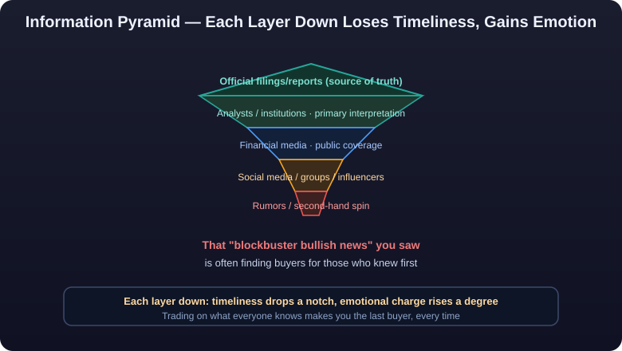

# 04 · The Information Ecosystem

> Trading is fundamentally about **<mark>information gaps</mark>**: for the same event, you learn about it 10 days later while someone else learned 10 seconds before — and price has long since reacted. Nine out of ten "tips" circulating in the market are meant for the last person in line; their purpose isn't to convey truth but to manufacture bag holders.
>
> This article dissects every layer from information creation to propagation — **who makes information, who processes it, who consumes it** — and ends with a checklist of primary information sources that can build real advantage.

> **⚠️ Risk Warning**
>
> Descriptions of inside information, stock-tipping operations, and misinformation here are ecosystem observation and risk education only — not guidance to obtain, spread, or exploit non-public information, which is a crime in most jurisdictions. Online information is hard to verify; defer to official disclosures. Markets carry risk; invest with caution; nothing here constitutes investment advice.

---

## The Layers of Information: From Truth to Rumor



::: warning 🛑 Core Pattern
**Every layer the information travels down, it loses timeliness and gains emotional charge.** That "breaking bullish news" you just saw has often already been used to find buyers for those who knew first.
:::

---

## ① How to Read Sell-Side Research

### Who Writes Research Reports, and for Whom

- **The writers**: analysts at broker research institutes, paid by brokers, reviewed on commission allocation ("vote points") and industry rankings.
- **The audience**: institutions' institutional clients (funds, insurers, private funds). Retail sees it only incidentally.
- **<mark>In one sentence: research reports are products brokers sell to buy-side institutions — not guides for making you money.</mark>**

### Why Bullish Research Doesn't Move Prices

| Reason | Explanation |
|---|---|
| Reports lag | Deep-dive reports take weeks from fieldwork to publication; institutions bought long before release |
| Targets already priced in | Price targets are "12 months out" forecasts; by publication day the move is often mid-to-late stage |
| Rating inflation | "Buy" ratings dominate the whole market's output while "sell" ratings are nearly extinct; informational content is low |
| Contrarian signal | When the sell side turns uniformly bullish, retail sentiment is often topping (contrarian indicator) |

### The "Rating Trap"

- **A rating is an "attitude," not a forecast**: maintaining "Buy" may reflect issuer relationships (commissions, investment-banking business); brokers rarely say "Sell" in public.
- Frequent initiations and "strong buys" are often attention-grabbing or cover for institutional distribution.
- **Read correctly**: extract the report's **logic and data** (earnings-model breakdowns, industry data, channel checks) and ignore the rating conclusion — treat research as a "free research tool," never as an "order instruction."

---

## ② How Financial Media Works

### What Keeps Media Alive

| Business Model | Explanation |
|---|---|
| Traffic advertising | Pageviews = ad revenue; the more inflammatory the headline, the better |
| Paid subscriptions | A few top outlets (Bloomberg, parts of WSJ) |
| Sponsored content | "Brand content" paid for by listed companies, exchanges, token projects |
| Tipping/community funnels | Content funnels readers into tipping groups and paid courses (a gray zone) |

### The Logic of Clickbait

- **Headlines must shock**: "up 10x," "trillions flooding in," "urgent" — because clicks equal money.
- Quality isn't the first priority; **emotional arousal is**. Consume enough of it and you'll mistake "being aroused" for "being informed."
- One bland announcement can be spun into "blockbuster news" in either direction — shooting the arrow first, painting the target after.

### The Stock-Tipping Supply Chain

```text
Tipping influencer → trading group → expensive courses → partnered "operators" distribute → retail holds bags
```

- Some "finance influencers" aren't in the investing business at all — they're in the **traffic-monetization business**: free content funnels → paid communities → revenue shares with pool operators (some are literally part of manipulation chains; see [03-Recognizing Market Manipulation](manipulation-detection.md) and [08-Pitfalls](../pitfalls/)).
- Key tell: **<mark>a person with genuine informational edge doesn't need to drag you into a group; if someone pulls you into a group, the group IS their product.</mark>**

---

## ③ Influencers and the KOL Ecosystem

### The Truth Behind "Let Me Make You Money"

| Public Persona | Actual Business | Your Role |
|---|---|---|
| "Hedge-fund guru" | Selling courses, indicators, memberships | Paying customer |
| "Trading champion" | Flexing P&L to attract clients; managing money for others (illegal) | Potential principal |
| "Project advisor" | Shilling token projects, paid by the projects | **Liquidity** provider |
| "Signal caller" | Revenue-sharing with operators | Bag holder |

### Red Flags Checklist

- Only wins posted, never losses (loss screenshots exist only on a "profit simulator").
- Recommendations concentrate in **small-cap, illiquid** instruments — easy to "operate."
- Multiple accounts asking-and-answering within the group; feverish atmosphere; dissent forbidden.
- Private messages pitching paid services, money management, or a specific app download.
- Claims of "guaranteed profits" — **<mark>every "sure thing" points at your wallet, not your account</mark>**.

### Using KOLs Rationally

- Treat KOLs as "one source among many," never as decision-makers: read the **raw data they cite**, ignore their conclusions.
- A viral take ≈ retail consensus ≈ crowded trade — more valuable as a contrarian reference than as a follow.
- Prefer transparency: creators who can state plainly "how I make money" beat those who won't say.

---

## ④ Reading Earnings Reports and Filings

### The Timing Gaps in China's Three-Stage Disclosure

| Type | Timing | Traits |
|---|---|---|
| Earnings preannouncement | By Jan 31 (annual), Apr 15 (Q1), etc. | Direction and ranges only; earliest signal |
| Earnings express report | Before formal annual/interim disclosure | Concrete figures, unaudited |
| Formal financials | By Apr 30 (annual), Aug 31 (interim), etc. | Complete, audited — and latest |

**Trading the time gap**: preannouncement → express report → formal filing — the same information gets "rehearsed" three times. Real information is priced at the preannouncement stage; by formal release, "good news lands as bad news" is the norm.

### Post-Announcement Gaps

```text
Good-news announcement → next-day gap-up open (already priced in)
           ├─ Gap up and extend: results beat expectations + fresh buying
           └─ Gap up then fade / sell-the-news: fully priced; insiders use the pop to exit
```

### Key Principles for Reading Financials

- Focus on three core tensions across the statements: **revenue vs profit growth, cash flow (operating cash flow / net profit), receivables and inventory**.
- Beware "paper profits": rising earnings with negative operating cash flow usually means piling receivables or subsidy window dressing.
- Watch **non-recurring items**: profits from asset sales or government subsidies don't last (China's "net profit excluding non-recurring items" exists precisely to reveal true earning power).
- HK/US filings differ in format, same principle: **<mark>read operating substance, not headline numbers</mark>**.

---

## ⑤ Rumors and Denials

### The Market Rhythm of Rumor → Confirmation/Denial

```text
Rumor emerges (veracity unknown) → price stirs → denial/clarification/confirmation
        ①                        ②            ③

 ① Informed capital sneaks in; volume up, price flat (accumulation)
 ② Media amplifies; retail chases (the main advance/decline)
 ③ Confirmed → news exhausted, likely fade
    Denied → back to square one; chasers buried
```

- **<mark>"Buy the rumor, sell the confirmation" is iron law</mark>**: rumor-driven moves are usually ending precisely when confirmed.
- Three outcomes of denials: pure fabrication (quick fade), "denial = veiled confirmation" (evasive wording strengthens expectations), or genuine denial the market ignores (emotional momentum).

### Countermeasures

- Don't hold heavy positions through the rumor phase — veracity unknown, price already reacting.
- Wait for official confirmation and accept "leaving money on the table"; or bind yourself with a "exit on confirmation" rule.
- Stay skeptical of denials themselves: does the wording "categorically deny" or merely "decline to comment"?

---

## ⑥ Information Timeliness: The "Last Baton" Principle

```text
Information chain: company insiders → informed parties → institutions → media → influencers → you → later arrivals
                          ↑peak information value                  ↑where you receive it

By the time you get the news, price usually contains it;
you "feel" informed only because you now know what others knew earlier.
```

**<mark>The "last baton" principle</mark>**: any message you can easily see is almost always already priced. Genuine informational edge cannot come from "reading tips" — the propagation order determines your position in line.

- That doesn't make news useless; it means **<mark>a message's value lies in "others don't know yet"</mark>** — and messages others don't know yet will never appear on your front page.
- Build discipline accordingly: when you see "everyone knows" good news, ask "how much is already priced?" The usual answer: all of it.

::: tip 💡 Value Lies in What Others Don't Yet Know — And You'll Never See It on the Front Page
**A message's value lies in "others don't know yet" — and such messages never reach your front page.** By the time you receive information, price usually contains it; you "feel" informed only because you know what others knew earlier.
:::

---

## ⑦ How Individual Investors Build Information Edge

You can't outrun insiders, but you can beat most retail investors: **<mark>go back to the source. Read raw data, not second-hand interpretation.</mark>**

### Primary Source Checklist

| Category | Specific Sources | Coverage |
|---|---|---|
| Official filings | SSE/SZSE/HKEX disclosures, SEC EDGAR | Equities |
| Regulator sites | CSRC, NFRA, Federal Reserve websites | Equities/Macro |
| Company IR | Investor-relations pages, earnings-call transcripts | Equities |
| Earnings calls | Management's live Q&A answers (tone reveals more than numbers) | Equities (US/HK) |
| Macro data | National Bureau of Statistics, BLS, central bank primary releases | Macro |
| On-chain data | Block explorers, on-chain analytics platforms (exchange netflows, whale transfers, holder distribution) | Crypto |
| Exchange data | Order-book depth, **<mark>funding rates</mark>**, open interest, **<mark>liquidation</mark>** data | Crypto/Futures |
| Industry data | Industry associations/third-party statistics (AUM, installations, sales figures) | Equities/Commodities |

### How to "Read Raw Data"

1. **Original text before commentary**: when a filing/report drops, read the original three times yourself before reading anyone's interpretation — avoid being led by second-hand conclusions.
2. **Track "changes," not "levels"**: year-over-year growth, surprise versus consensus — deltas are what get priced.
3. **Build timelines**: sort one company's announcements, reports, and calls chronologically; train yourself to spot which link hasn't been priced yet.
4. **Cross-validate sources**: one thesis needs at least two independent sources — ideally raw-data sources.

### The Final Form of Informational Edge

```text
Real edge = seeing raw data earlier + interpreting it more accurately + executing more calmly
All three are available to individuals who "consume fewer second-hand takes and more raw data."
```

---

## Summary

```text
Truths of the information ecosystem:
  ├─ Information decays in value and amplifies in emotion as it spreads downward
  ├─ Research/media/influencers each run a business — and you are part of it
  ├─ Triple disclosure (preannounce → express → final) creates "sell-the-news"
  ├─ Rumor rhythm (emerge → amplify → confirm) creates "sell on confirmation"
  └─ Your edge: return to the source, read raw data, never take the last baton
```

**<mark>"The market always knows first" is not a curse but a mirror: it reminds you that every order must rest on judgment the price hasn't reflected yet — not on the tip you just saw.</mark>**

::: danger 💀 Any Message You Can Easily See Is Almost Always Already Priced
**Any message easily visible to you is almost always priced in already.** Each layer downward loses timeliness and gains emotion — that "blockbuster bullish news" you saw was often already finding buyers for those who knew first. Value lies in "others don't know yet," and such messages never appear on your front page.
:::

---

::: warning ⚠️ Risk Warning
Trading securities or crypto assets on material non-public information (insider trading) is a criminal offense in most jurisdictions — do not touch it. Online information is a minefield; tipping groups, paid communities, and so-called "insider info" are mostly harvesting tools. Defer to official disclosures and distrust any "guaranteed profit" promise. Information timeliness means the good news you see may be fully priced; chasing highs is at your own risk. Markets carry risk; invest with caution; nothing here constitutes investment advice.
:::
