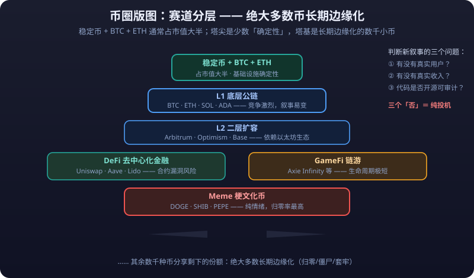

# 07 · Crypto Landscape: From Digital Gold to the Map of Crypto

> Crypto is the youngest, most volatile, and most contested market of chapter 09. It has no exchange annual reports, no PE valuation, no central-bank backing — only code, consensus, and sentiment.
>
> This article does not teach you to "trade coins"; it helps you **build the full map**: what each major coin is positioned as, how the crypto landscape is divided, the exchange landscape and compliance differences, how to read on-chain data and market sentiment (echoing [05 - Crypto Perpetuals](../crypto-perpetuals/)), the risks of DeFi/NFT/Meme, and the first checklist for beginners entering the market.

---

> **⚠️ Risk Warning**
>
> This article is for learning and research only and does not constitute investment advice. Crypto is **not legal tender in any country**; prices can fall 50% or go to **<mark>zero</mark>** in short order; exchanges can collapse, get hacked, or be frozen by regulators; projects can "run away" (rug pull). Prices, market-cap shares, fee rates, and other figures here are generic teaching descriptions — **defer to each platform's latest announcements**. Use only regulated mainstream platforms, and only money you can afford to lose.

---

## Major Coin Positioning

### Tier 1: BTC and ETH

| Coin | Positioning | One-line reading |
|---|---|---|
| **BTC (Bitcoin)** | **Digital gold / store of value** | Hard cap of 21 million coins (per the latest code rules), the "honest money" narrative, the "market anchor" of crypto |
| **ETH (Ethereum)** | **Smart contract platform** | Runs arbitrary programs (contracts) on-chain; the foundation of DeFi/NFT/GameFi, the "operating system" of the crypto world |

- **BTC is crypto's "Nasdaq"**: 90% of the market's rhythm is set by BTC, and the vast majority of altcoins correlate highly with it.
- **ETH's differentiated logic**: BTC is about "haven and store of value", ETH about "on-chain activity and ecosystem growth" (Gas fees, on-chain TVL, L2 prosperity).
- The "exchange rate" between the two (ETH/BTC) is a style indicator: ratio rising = risk appetite recovering (capital rotating from pure store-of-value into ecosystems); ratio falling = bear-market haven money returning to BTC.

### Stablecoins: USDT / USDC / DAI

| Coin | Issuer | Collateral model | Core risk |
|---|---|---|---|
| **USDT** | Tether | Claims 1:1 asset reserves (composition per latest audit) | Reserve transparency doubts, run risk |
| **USDC** | Circle | 1:1 USD reserves (higher compliance transparency) | Banking-partner risk |
| **DAI** | MakerDAO ecosystem | Overcollateralized on-chain (minted against crypto collateral) | Depeg if collateral prices crash |

- **Depeg risk**: a stablecoin's "1 USDT = 1 USD" holds on credit and reserves; once the market doubts the reserves or a run starts, the price drifts off the dollar — historically USDC (2023 Silicon Valley Bank affair) briefly depegged to near $0.87 (per that day's market).
- **Practical insight**: stablecoins are the crypto market's "reservoir and unit of account". **Rising total stablecoin market cap = expanding crypto **<mark>liquidity</mark>**; shrinking cap = capital leaving.** USDT pairs dominate exchange trading.

### Other major coins (1-2 line positioning)

| Coin | Positioning |
|---|---|
| **BNB** | Binance ecosystem token: trading-fee discounts + gas on the BSC chain, bound to the Binance platform |
| **SOL (Solana)** | High-performance L1, low fees and fast transactions; the active home of Meme coins and on-chain apps |
| **XRP (Ripple)** | Cross-border settlement narrative; years of litigation with the SEC (per latest regulatory developments) |
| **DOGE (Dogecoin)** | The original Meme coin, driven by community and Musk "calls"; no fundamental support |
| **ADA / AVAX / DOT** | The established "runner-up" L1s, each with its thesis (academic rigor/subnet multichain/cross-chain interoperability) |

- Principle: **don't treat "anything that sounds like a coin" as an investment target**. Outside BTC/ETH/stablecoins, the long-term value of the vast majority of coins is doubtful; however good the whitepaper reads, they can still go to zero.

---

## Market-Cap Distribution and the Crypto Map

### Market-cap distribution (per latest data; trend-level insight)

- Long-run pattern: **BTC's share (dominance) oscillates roughly between 40% and 60%**. BTC.D falling = altcoin season (money spilling into small caps); rising = bear-market haven flows.
- "Stablecoins + BTC + ETH" usually account for the bulk of total cap, with thousands of other coins sharing the remainder — **the overwhelming majority of coins are permanently marginalized**.

### The crypto map: track layering

| Track | What it is | Representatives | Risk profile |
|---|---|---|---|
| **Layer1 (L1)** | Base-layer chains | BTC, ETH, SOL, ADA | Fierce competition; shifting narratives |
| **Layer2 (L2)** | Ethereum second-layer scaling | Arbitrum, Optimism, Base | Dependent on the Ethereum ecosystem |
| **DeFi** | Decentralized finance | Uniswap, Aave, Lido | Contract bug risk |
| **GameFi** | Blockchain games | Axie Infinity etc. | Extremely short lifecycles |
| **Meme** | Joke-culture coins | DOGE, SHIB, PEPE | Pure sentiment; high zero-out rate |

- To judge whether a "new narrative" is worth studying, ask three questions first: **Are there real users? Is there real revenue? Is the code open-source and auditable?** Fail all three and it is pure speculation.

---

## The Exchange Landscape: CEX vs DEX

| Comparison | CEX (centralized exchange) | DEX (decentralized exchange) |
|---|---|---|
| Representatives | Binance, OKX, Coinbase, Bybit | Uniswap, PancakeSwap, Curve |
| Custody | User assets sit in exchange accounts | Assets in the user's own wallet; settled on-chain |
| Experience | Fast, deep, full-featured (futures/yield/lending) | Slow, expensive gas, thin depth |
| KYC compliance | Identity verification required; Coinbase is US-regulated, Binance/OKX hold licenses in various countries (per latest) | No KYC; connect a wallet and go |
| Risks | Platform exit/hacks/regulatory freezes | Smart-contract bugs, **<mark>slippage</mark>**, impermanent loss |

- **Compliance differences are key**: Coinbase is a US-listed company regulated by the SEC; Binance and OKX operate globally but face restrictions in some countries (US users cannot use Binance, per latest regulation); mainland Chinese residents trading on offshore exchanges face **legal and cross-border capital risks** — be sure to understand local rules yourself.
- **"Not your keys, not your coins"**: assets on a CEX are "the exchange's IOU to you"; they truly belong to you only once withdrawn to a wallet whose private keys you control. Self-custody is recommended for large amounts.

::: danger 💀 A leaked seed phrase means assets gone forever
**"Not your keys, not your coins"** — assets on a CEX are "the exchange's IOU to you"; they truly belong to you only once withdrawn to a wallet whose private keys you control. A leaked seed phrase means the assets are gone forever; anyone — person, website, or "customer service" — asking for your seed phrase is a scammer.
:::
- Iron rule for beginners: **use only top CEXes + enable two-factor authentication (2FA)**, and check regulatory licenses and past scandals before registering on any platform.

---

## How to Read On-Chain Data

On-chain data is crypto's unique "charting tool" — every transfer is publicly inspectable, as if the whole world shared one master ledger.

| Indicator | How it's read | Meaning |
|---|---|---|
| **Active addresses** | Unique addresses interacting on-chain daily | Real usage; sustained rise = healthy ecosystem, sharp drop = users leaving |
| **On-chain transfer volume** | Coins/amount moved on-chain | Split "exchange-to-exchange" vs "on-chain settlement": large transfers into an exchange = possible selling |
| **Exchange net inflow/outflow** | Coins flowing in minus out | **Net inflow = selling-pressure signal (coins moved to the exchange to sell)**; net outflow = accumulation signal (withdrawals to self-custody) |
| **Stablecoin minting** | New USDT/USDC issuance | New issuance = incremental capital entering; large-scale burning = capital leaving |
| **Exchange BTC balance** | Total BTC on exchange addresses | Multi-year lows = scarce supply (long-term bullish); rebounding = selling pressure returning |

- **Practical trick**: watch the "whales" (addresses holding large amounts) — a whale moving coins into an exchange often precedes distribution; withdrawals to cold wallets usually signal long-term holding.
- Tools: Etherscan (ETH), Mempool/Blockchain.com (BTC), on-chain analytics platforms (Glassnode, CryptoQuant, etc., per currently available tools).

---

## Market Sentiment Indicators

These three indicators are the "sentiment dashboard" of crypto contract trading, mapping directly to the mechanics of [05 - Crypto Perpetuals / 02 - **<mark>Funding Rate</mark>**](../crypto-perpetuals/funding-rate.md):

| Indicator | What it is | How to read |
|---|---|---|
| **Fear & Greed Index** | A composite sentiment score from 0 (extreme fear) to 100 (extreme greed) | Extreme fear (<25) often marks phase bottoms; extreme greed (>75) warns of a pullback |
| **Funding rate** | The fee exchanged between longs and shorts on perpetuals; positive = longs pay shorts | Persistently high positive rates (e.g., above 0.05%/8h) = longs overcrowded, watch a long squeeze; negative = shorts overcrowded |
| **Long/short ratio** | The retail long-vs-short account ratio | Extremes (e.g., >2 or <0.8, per platform basis) are often contrarian signals: when retail piles to one side, the market loves to embarrass them |

- **Using the three together**: Fear & Greed at 90 + funding extremely positive + the ratio one-sided → the classic "overheated triple", a signal to reduce, not to chase.
- Distinguish "retail long/short ratio" from "professional funding rate": in the contract market **the average retail **<mark>position</mark>** is often right (and the opposite side gets burned)** — one reason many veterans use retail indicators as contrarian references.

---

## DeFi Plays and Risks

| Play | What it is | Risk |
|---|---|---|
| **Staking** | Lock tokens for on-chain yield (e.g., ETH staking, liquid staking via Lido) | Cannot sell during lock-up, validator risk, protocol risk |
| **Lending** | Post collateral to borrow stablecoins (e.g., Aave, Compound) | **Liquidation risk**: collateral falling to the threshold triggers auto-liquidation and direct principal loss |
| **Liquidity mining (LP)** | Provide two-token liquidity to a DEX for fees + token rewards | **Impermanent loss**: when the two prices diverge, LP returns can lag simply holding |
| **Yield aggregators** | Automatically route funds to the highest-yielding protocols | Contracts stacked on contracts; when it breaks, no one is accountable |

- **DeFi's biggest risk is smart-contract risk**: code is law, and hackers simply follow the code. Top protocols have been exploited plenty of times historically (per the latest incidents), and **there is no central bank and no insurance**.
- "Absurdly high APY" = absurdly high risk: 100%+ annualized risk-free returns do not exist in the real world, and even less so in DeFi.

::: danger 💀 Absurdly high APY means absurdly high risk
**100%+ annualized risk-free returns do not exist in the real world, and even less so in DeFi.** High APY is bought with contract risk, depeg risk, and liquidity risk — when the underlying layer breaks, there is no central bank and no insurance; the principal goes to zero with no recourse.
:::

---

## NFT and Meme Coin Risk Warning

| Category | Essence | Risks |
|---|---|---|
| **NFT** | On-chain digital certificates (images/tickets/membership cards) | Dreadful liquidity, highly emotional pricing; most projects peak "at mint" then die |
| **Meme coins** | Useless coins driven purely by community sentiment | Violent pumps and dumps, short lifespans, concentrated whale dumps, rug-pull hotbeds |

- One sentence: **NFTs and Meme coins are a "lottery market", not an "investment market"**. Their value is in understanding sentiment and virality; ordinary people should not hold them as asset allocation.

::: danger 💀 NFTs and Meme coins are a lottery market
**NFTs and Meme coins are a "lottery market", not an "investment market".** Their value is in understanding sentiment and virality, not as asset allocation for ordinary people; anything that pumps at launch then dumps, or whose contract keeps admin privileges, treat as a scam first.
:::
- Red flags: a new coin "pumping at listing" then dumping, anonymous founders, contracts retaining admin privileges (rule changes/minting), social-media influencers "calling" it — when these combine, treat it as a scam first.

---

## Crypto's Macro Linkage

Crypto is not "a separate planet"; its linkage with macro capital keeps tightening (correlations per latest data):

| Linked variable | Transmission path | What to watch |
|---|---|---|
| **Nasdaq** | Funds treat crypto as a "high-beta tech asset"; Nasdaq moves often lead or coincide with BTC | Correlation of BTC with the Nasdaq/Philadelphia Semiconductor Index |
| **Dollar index** | Strong dollar → risk assets broadly pressured; weak dollar → easing-liquidity expectations favor crypto | Windows of DXY-BTC negative correlation |
| **Fed rates** | High rates → high risk-free returns, money exits risk assets; **cut expectations → liquidity easing, crypto's biggest macro tailwind** | CME FedWatch probabilities, FOMC meetings |
| **Risk appetite (risk-on/off)** | When global risk appetite revives, money flows into crypto; in crises it is sold first ("king of risk assets" is also "king of declines") | VIX, S&P 500 trend |

- Practical conclusion: **in dollar-liquidity tightening cycles (hikes/QT), every crypto bounce is more likely to be crushed by the macro backdrop; in cutting/liquidity-injection cycles, trend rallies are far more likely.**
- Versus gold: both are anti-"dollar credit" proxies, but crypto's **<mark>volatility</mark>** and speculative character are far stronger, and its haven property much weaker than gold's (showing up only in isolated sovereign-currency crises).

---

## Beginner Entry Checklist

If you still decide to participate, finish this checklist in order before touching anything:

1. **Use only legitimate CEXes**: mainstream platforms whose sign-up includes KYC (Binance, OKX, Coinbase, etc., as local rules permit), **never links from "stock-tip groups" or niche platforms**.
2. **Learn wallets first**: before acting, understand that "seed phrase = your entire assets" — the seed phrase must be written out and stored offline; **anyone/any site/any "support" asking for it is a scammer**.
3. **Beware airdrop phishing**: never click "free tokens", "wallet verification", or "confirm wallet" links; approvals (Approve) are hackers' favorite theft method; touch no unfamiliar links.
4. **Start small**: the first deposit is only "an amount whose total loss changes nothing"; walk the full loop of deposit, withdrawal, buying, selling, and fees first.
5. **Spot only, at first**: contracts, **<mark>leverage</mark>**, and DeFi wait at least six months; first learn to "hold the winners and sleep through the losers".
6. **Withdraw regularly**: once the position reaches a meaningful size, withdraw from the CEX to a self-custody wallet (cold storage is better).
7. **Know local regulations**: mainland China has explicit regulatory limits on virtual-currency trading and related activities; verify for yourself and bear the consequences before participating.

---

## Risk Warning

::: warning ⚠️ Risk Warning
1. Crypto has no credit backing and no valuation anchor; price swings are extreme (±20% in a day is not rare), and **zero-out risk is real**.
2. Exchanges, wallets, cross-chain bridges, and DeFi protocols all carry security and operational risk; history has seen top-exchange collapses (FTX etc.) and protocol exploits.
3. Contract trading and the funding-rate mechanism (see [05 - Crypto Perpetuals](../crypto-perpetuals/)) amplify losses with leverage; after a **<mark>blow-up</mark>** the principal is simply gone.
4. Stablecoins are not "risk-free dollars": depegging, opaque reserves, and regulatory limits can all break the 1-dollar peg.
5. Market-cap shares, fee rates, and index values in this article are teaching-basis — **defer to the latest market data**; this article does not constitute investment advice.
:::
