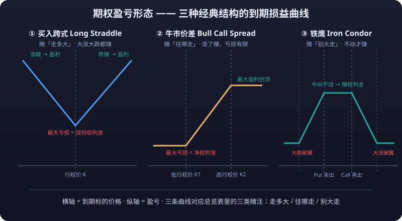

# 03 · The Complete Catalog of Option Combinations: Classified by Risk-Return Type

> There are thousands of option strategies, but **fewer than 20 are truly worth mastering**. This article sorts them into four classes by "what money you're earning": directional strategies, **volatility** strategies, income strategies, and **hedging** strategies.
>
> Each strategy comes with [Construction], [Payoff shape (ASCII chart)], [Expiration P/L formula], [Breakeven numeric example], [Suitable conditions], and [Risks]. How to read: **study the payoff diagram first, then ask what kind of person would buy that shape.**

---

## Strategy Overview

| Class | What It Earns | Representative Strategies | Payoff Shape | Biggest Risk |
|---|---|---|---|---|
| **① Directional** | Price moving somewhere | Long Call/Put, bull/bear **<mark>spreads</mark>**, ratio spreads | Win if direction lands | Lose if direction fails (capped for spread types) |
| **② Volatility** | Movement expanding or shrinking | **<mark>Straddle</mark>**, strangle, **<mark>iron condor</mark>**, iron butterfly, calendar, diagonal | Volatility decides P/L | Buyers bleed Theta; sellers bleed Gamma |
| **③ Income** | Selling time/**<mark>premium</mark>** | **<mark>Covered call</mark>**, cash-secured put, collar, synthetic stock | Premium-capped/enhanced | Missed rallies or forced stock purchases |
| **④ Hedging** | Insuring existing positions | Protective put, index put hedge, tail hedge | Losses floored | Insurance too costly or failing |

> One-line summary: **directional strategies bet "which way," volatility strategies bet "how far," income strategies bet "not far," and hedging strategies fear "far."**

::: tip One Line for the Four Classes
**Directional strategies bet on which way; volatility strategies bet on how far; income strategies bet it won't go far; hedging strategies fear it will.** Before picking any strategy, be clear about which class of money you're chasing — pick the wrong class, and even the most elegant payoff curve is just catching falling knives.
:::



---

## 1. Directional Strategies: Betting Where Price Goes

### 1.1 Long Call / Long Put (Naked Buy)

[Construction] Buy one call or put.
[Payoff shape]

```text
Long Call (cost C)
Profit
 │              ╱
 │            ╱
 │          ╱
 0 ────────╱──────────────
 │   ╱──────────────────▶ Underlying price
 │ ─────────────────────    loss zone (shifted down by C)
Loss
```

[Expiration P/L formula] `P/L = max(S − K, 0) − C` (Call); `P/L = max(K − S, 0) − P` (Put)
[Breakeven point] Call: `K + C`; Put: `K − P`
[Numeric example] Spot 100; buy the **<mark>strike price</mark>**-100 Call for premium 4: breakeven = 104; at expiry S=105 → profit 1; at expiry S=102 → lose 2 (right direction, but not past breakeven)
[Suitable conditions] Strong conviction bullish/bearish AND large expected movement (otherwise Theta grinds you down)
[Risks] **Lose the entire premium**; right direction but too slow still loses

### 1.2 Bull Spread (Bull Call Spread Example)

[Construction] Buy the lower-strike Call + sell the higher-strike Call (same expiry).
[Payoff shape]

```text
Profit
   M │              ┌──────────────
     │            ╱
     │          ╱
   0 ─────────╱──────────────────
     │   ╱──────────
     │ ╱             loss zone (shifted down by net cost)
  Loss
```

[Expiration P/L formula] `P/L = max(S−K1,0) − max(S−K2,0) − net cost` (K1<K2, net cost = C1−C2)
[Breakeven point] `K1 + net cost`
[Numeric example] Buy 100 Call @6, sell 110 Call @2 → net cost 4: breakeven 104; max profit = (110−100) − 4 = **6**; max loss = **4**; at expiry S=115 → profit 6 (capped)
[Suitable conditions] Moderately bullish; want to cut cost and cap downside
[Risks] No extra gain once price exceeds the upper bound (**profit capped**)

### 1.3 Bear Spread (Bear Put Spread Example)

[Construction] Buy the higher-strike Put + sell the lower-strike Put (same expiry).
[Payoff shape]

```text
Profit
   M │  ┌────────────────
     │    ╲
     │      ╲
   0 ────────╲────────────────────
     │       ────────
  Loss        ╲(shifted down by net cost)
```

[Expiration P/L formula] `P/L = max(K2−S,0) − max(K1−S,0) − net cost` (K1<K2, net cost = P2−P1)
[Breakeven point] `K2 − net cost`
[Numeric example] Buy 100 Put @6, sell 90 Put @2 → net cost 4: breakeven 96; max profit = (100−90) − 4 = **6**; max loss = **4**
[Suitable conditions] Moderately bearish
[Risks] No extra gain once price falls below the lower bound

### 1.4 Ratio Spread (Call Ratio Example)

[Construction] Buy 1 lower-strike Call + **sell 2** higher-strike Calls.
[Payoff shape]

```text
Profit
   8 │               ┌───────────
     │             ╱ │
     │           ╱   │
   0 ──────────╱─────│───────────────
     │     ╱─────────│────────╱
     │   ╱           │       ╱      ← unlimited losses to the right
  Loss ╱             │     ╱
```

[Expiration P/L formula] `P/L = max(S−K1,0) − 2×max(S−K2,0) − net cost` (buy 1, sell 2)
[Breakeven points] Two: near `K1 + net cost`, and on the right near `K2 + (K2 − K1) − net cost` (verify with the numbers below)
[Numeric example] Buy 100 Call @6, sell two 110 Calls @2×2=4 → net cost 2: at expiry S=110 → max profit = (110−100) − 2 = **8**; at expiry S=120 → P/L = 20 − 20 − 2 = **−2** (right side turns into losses)
[Suitable conditions] Expect moderate gains but **firmly do NOT believe in a blow-off top** (strong conviction about an upper range)
[Risks] **The second sold Call creates unlimited risk on the upside** — a big rally means uncapped losses; beginners beware

---

## 2. Volatility Strategies: Betting on Movement Size

### 2.1 Long Straddle

[Construction] Buy a Call and a Put at the **same strike**.
[Payoff shape]

```text
Profit
     │              ╱╲
     │            ╱  ╲
   0 ───────────╱────╲──────────────
     │        ╱      ╲
     │      ╱          ╲
  Loss │    ──────────────         ← max loss = total premium
      └───────────────────────────▶
          K−C−P   K   K+C+P
```

[Expiration P/L formula] `P/L = |S − K| − (C + P)`
[Breakeven points] `K − (C+P)` and `K + (C+P)`
[Numeric example] Buy 100 Call @6 + buy 100 Put @4 → total cost 10: breakevens 90 / 110; at expiry S=115 → profit 5; at expiry S=100 (no move at all) → **lose all 10**
[Suitable conditions] **Big movement expected but direction unknown** (before earnings, major events)
[Risks] ① Movement too small — both legs bleed premium; ② post-event IV Crush — "right on direction yet underpaid"

### 2.2 Short Straddle

[Construction] Sell a Call and a Put at the **same strike**.
[Payoff shape]

```text
Profit
     │     ┌─────────────┐
     │   ╱               ╲
   0 ──╱──────────────────╲──────────
     │ ╱                    ╲
  Loss ╱                      ╲      ← unlimited losses at both ends
      └───────────────────────────▶
          K−C−P   K   K+C+P
```

[Expiration P/L formula] `P/L = (C + P) − |S − K|`
[Breakeven points] `K − (C+P)` and `K + (C+P)`
[Numeric example] Sell 100 Call collecting 6 + sell 100 Put collecting 4 → income 10: max profit **10** (at expiry S=100); breakevens 90 / 110; at expiry S=115 → lose 5
[Suitable conditions] **High IV but expecting calm to return** (after events land, after panics)
[Risks] **Unlimited risk at both ends**: one black swan (up or down) can blow through it all — the iron condor/butterfly exist precisely to add guardrails on those ends

### 2.3 Long Strangle

[Construction] Buy an **OTM** Call + an **OTM** Put (different strikes).
[Payoff shape] Same silhouette as the long straddle but wider-bottomed and cheaper.

```text
Profit
     │                 ╱╲
     │               ╱  ╲
   0 ───────────────╱────╲────────────
     │             ╱      ╲
  Loss │         ────────────
      └───────────────────────────▶
         K1−(C+P) K1    K2  K2+(C+P)
```

[Expiration P/L formula] `P/L = max(K1−S,0) + max(S−K2,0) − (C+P)`
[Breakeven points] `K1 − (C+P)` and `K2 + (C+P)`
[Numeric example] Buy 95 Put @2 + buy 105 Call @3 → cost 5: breakevens 90 / 110; at expiry S=100 → **lose 5**; at expiry S=112 → profit 7 − 5 = 2
[Suitable conditions] Expecting **enormous** movement (even more extreme than the straddle); cheaper cost to bet on a huge breakout
[Risks] Requires even more movement than a straddle to break even (further OTM, harder to recoup)

### 2.4 Iron Condor

[Construction] Sell an OTM Put + buy a further-OTM Put (lower guardrail); sell an OTM Call + buy a further-OTM Call (upper guardrail). Four legs, same expiry.
[Payoff shape]

```text
Profit
  C │        ┌────────────┐
    │      ╱                ╲
  0 ─────╱────────────────────╲────────
    │   ╱                      ╲
 Loss │╱                        ╲      ← capped losses at both ends
    └─────────────────────────────────▶
      K1  K2     range     K3   K4
```

[Expiration P/L formula] `P/L = net premium collected − shortfall paid if breached` (losses capped on each end)
[Breakeven points] Lower: `K2 + net income`; upper: `K3 − net income`
[Numeric example] Sell 90 Put @2 / buy 85 Put @1; sell 110 Call @2 / buy 115 Call @1 → net income = 1 + 1 = **2**: max profit **2** (expiry between 90–110); max loss = (90−85) − 1 + (115−110) − 1 = **3**; breakevens 92 / 108
[Suitable conditions] **High IV with an expected range-bound market** (**<mark>implied volatility</mark>** is expensive while the underlying has no direction)
[Risks] Breaching either wing's guardrail → losses (capped, but potentially several times the net income); **four legs mean heavy commissions**

### 2.5 Iron Butterfly

[Construction] Sell ATM Call + buy further-OTM Call; sell ATM Put + buy further-OTM Put. Four legs, same expiry.
[Payoff shape]

```text
Profit
  C │            ┌────┐
    │          ╱        ╲
  0 ─────────╱────────────╲───────────
    │       ╱              ╲
 Loss │     ╱                ╲        ← capped losses at both ends
    └───────────────────────────────▶
      K−W   K        K      K+W
```

[Expiration P/L formula] Same as iron condor: `P/L = net income − losses beyond the range` (each side capped separately)
[Breakeven points] `K − net income` and `K + net income`
[Numeric example] Sell 100 Call @4 / buy 110 Call @1; sell 100 Put @4 / buy 90 Put @1 → net income = 3 + 3 = **6**: max profit **6** (at expiry S=100); max loss = 10 − 6 = **4**; breakevens 94 / 106
[Suitable conditions] A tighter range view than the condor; **high IV + expectation of strict sideways drift**
[Risks] Same as the condor: losses beyond the range are capped; but the profitable zone is narrower than the condor's

### 2.6 Calendar Spread

[Construction] Buy the **back-month** Call + sell the **front-month** Call at the same strike.
[Payoff shape] (illustrative: horizontal axis = underlying price at front-month expiry, vertical axis = P/L)

```text
Profit
     │             ╱╲
     │           ╱    ╲
   0 ──────────╱───────╲──────────────
     │        ╱         ╲
     │      ╱             ╲
  Loss │    ──────────────────       ← loses if S is far from K when the front month expires
      └───────────────────────────▶
```

[Expiration P/L formula] (at front-month expiry) `P/L = back-month residual value − (front-month premium − back-month premium)` — approximately maximal near K
[Breakeven points] Approximately near both sides of K; must be computed from the live chain
[Numeric example] Spot 100: sell the 7-day 100 Call @3, buy the 30-day 100 Call @6 → net cost 3: after 7 days the stock is still near 100 → front month **expires worthless**, back month retains ≈ 4 → profit ≈ 1; if after 7 days the stock has surged to 115 → front month loses and the back month can't make up for it → loss
[Suitable conditions] **Short-term calm, longer-term rise expected** (sell front-month **time value**, betting the back month won't blow out early)
[Risks] If the underlying moves big too soon → the front month bleeds hard before the back month catches up; **requires the relative volatility relationship to hold**

### 2.7 Diagonal Spread

[Construction] Buy the **back-month** lower-strike Call + sell the **front-month** higher-strike Call (differing in both strike and time).
[Payoff shape] Between calendar and bull spreads — mildly bullish with income.

```text
Profit
     │             ╱────
     │           ╱
   0 ──────────╱───────────────
     │        ╱
     │      ╱
  Loss │    ╱
      └────────────────────────▶
```

[Expiration P/L formula] No single closed form; compute from the back-month residual value at front-month expiry
[Numeric example] Spot 100: buy the 30-day 95 Call @8, sell the 7-day 105 Call @2 → net cost 6: after 7 days the stock is at 100 → front month worthless, back month retains ≈ 6 → about break-even; stock at 103 → front month worthless, back month worth more → small gain
[Suitable conditions] Moderately bullish + selling short-term time value (a diagonal call = income-oriented bullishness)
[Risks] Similar to calendar spreads plus a directional bet; **computationally complex — better suited to advanced traders**

---

## 3. Income Strategies: Earning Premium From Holdings

### 3.1 Covered Call

[Construction] Hold 100 shares + sell 1 Call.
[Payoff shape]

```text
Profit
   8 │               ┌──────────
     │             ╱
     │           ╱
   0 ──────────╱────────────────────
     │       ╱          ← profit capped
  Loss │     ╱
     │   ╱
      └───────────────────────────▶
         97   100     105
```

[Expiration P/L formula] `P/L = (S − 100) + C income`, but once S exceeds K it caps at `(K − 100) + C`
[Breakeven point] `100 − C` (premium 3 → 97)
[Numeric example] Buy 100 shares at 100, sell the 105 Call @3: breakeven 97; at expiry S=110 → assigned, profit capped = (105−100) + 3 = **8**; at expiry S=95 → P/L = (95−100) + 3 = **−2**
[Suitable conditions] Already holding the stock + judging it will **drift sideways or inch up** (enhance returns with premium)
[Risks] **Missing the rally**: gains capped in a surge, missing the main leg; no downside protection (the premium only cushions slightly)

### 3.2 Cash-Secured Put

[Construction] Reserve cash in the account + sell 1 Put (cash ready below the strike to take delivery).
[Payoff shape]

```text
Profit
   3 │   ┌───────────────────
     │ ╱
   0 ─╱───────────────────────────
     │╱
  Loss│╱
      └─────────────────────────▶
        92   95    100
```

[Expiration P/L formula] `P/L = P income − max(K − S, 0)`
[Breakeven point] `K − P` (e.g., 95 − 3 = 92)
[Numeric example] Spot 100; sell the 95 Put @3 (cash of 95×100 reserved): at expiry S ≥ 95 → earn **3**; at expiry S=90 → forced to take shares at 95, effective cost 92 (a further slide means losing more)
[Suitable conditions] **Wanting to buy the stock below current price** (a paid-to-wait substitute for limit orders)
[Risks] A crash far below the strike → **forced to catch a falling knife at a high effective price**; without cash backing you'd need **<mark>margin</mark>**, upgrading the risk

### 3.3 Collar

[Construction] Hold the stock + buy a protective Put + sell a covered Call (premiums roughly cancel).
[Payoff shape]

```text
Profit
  +5 │            ┌───────────
     │          ╱
   0 ─────────╱────────────────────
     │        ╱
  −5 │      ╱
     │    ╱
      └───────────────────────────▶
        95      100     105
```

[Expiration P/L formula] `P/L = (S − 100) + (P income − C expense)`, sandwiched within `[−max loss, +max profit]`
[Breakeven point] `100 + (C income − P expense)` (100 if they cancel)
[Numeric example] Spot 100: buy the 95 Put @2 + sell the 105 Call @2 → zero-cost collar: max loss = 100 − 95 = **5** (floored); max profit = 105 − 100 = **5** (capped); breakeven = 100
[Suitable conditions] Holding stock but **worried about a sharp drop**, unwilling to pay net insurance cost (use the sold Call's premium to offset the bought Put's)
[Risks] Profit capped (forgoing surges); if Puts are pricier than Calls, net insurance cost remains

### 3.4 Synthetic Long Stock

[Construction] Buy a Call + sell a Put at the same strike and expiry (net cost ≈ spot − strike present value).
[Payoff shape] Nearly identical to holding the stock:

```text
Profit
     │           ╱
     │         ╱
   0 ────────╱─────────────────
     │     ╱
     │   ╱
  Loss │ ╱                    ← unlimited losses below (short-Put risk)
      └────────────────────────▶
```

[Expiration P/L formula] `P/L ≈ S − strike cost` (linear, uncapped both ways)
[Breakeven point] `K + (C − P)` (approximately equal to the **purchase price**)
[Numeric example] Spot 100: buy 100 Call @6 + sell 100 Put @4 → net cost 2, effective basis 102: at expiry S=110 → profit 8; at expiry S=90 → lose 12
[Suitable conditions] Wanting "stock-like P/L" without tying up equivalent capital, or optimizing taxes/**leverage** via option structures
[Risks] **Downside is as bottomless as owning the stock**, plus margin usage from the short Put — **this is not "free stock"; it's leveraged ownership**

---

## 4. Hedging Strategies: Paying for Insurance

### 4.1 Protective Put

[Construction] Hold the stock + buy a slightly lower-strike (or ATM) Put.
[Payoff shape]

```text
Profit
     │            ╱
     │          ╱
   0 ─────────╱────────────────────
     │        ╱
  −7 │      ╱                     ← floored below
     │    ╱
      └───────────────────────────▶
        93  95       102
```

[Expiration P/L formula] `P/L = (S − 100) + max(K − S, 0) − P cost`
[Breakeven point] `100 + P` (e.g., 100 + 2 = 102)
[Numeric example] Spot 100; buy the 95 Put @2: max loss = (100 − 95) + 2 = **7** (floored); at expiry S=115 → profit 15 − 2 = 13; at expiry S=90 → lose 7 (instead of 10)
[Suitable conditions] Holding stock + **clear worry about a major decline** (before events, before trend breaks)
[Risks] Insurance costs money — **repeated buying over time significantly erodes returns**; if no decline materializes, premium is wasted

### 4.2 Index Put Portfolio Hedge

[Construction] Hold a stock/fund portfolio + buy **index** Puts (hedge the whole book with SPY/CSI 300 etc. index options).
[Payoff shape] Same as the protective put, but on the index, covering the entire portfolio.

| Point | Notes |
|---|---|
| What is hedged | The portfolio's systematic risk (broad-market declines) — not single-stock risk |
| Strike selection | Often OTM 5–10% (cheap-ish but covers "medium disasters") |
| Dynamic adjustment | Market up → index IV low, Puts cheap, add insurance; market down → Puts dear, consider partial **profit-taking** |
| Cost management | Offset insurance cost with covered-call income (i.e., the collar structure) |

[Numeric example] Holding a $1M US-stock portfolio, buying SPY puts 5% OTM costing $15k/year: a 20% market drop yields roughly $150k of Put gains, **compressing the portfolio drawdown from −20% to about −6%**
[Suitable conditions] Long-term holdings + periodic defense (stretched valuations, choppy highs)
[Risks] Hedge cost drains continuously; **if the crash is only single-stock level (your portfolio doesn't follow), the insurance is wasted**

### 4.3 Tail-Risk Hedge

[Construction] Persistently buy **deep-OTM, long-dated** index Puts (e.g., 15–30% OTM, 6–12 months to expiry) as "catastrophe insurance" for the portfolio.
[Payoff shape]

```text
Profit
     │                              ╱
     │                            ╱
   0 ──────────────────────────╱──────
     │                     ╱
  Loss │ ────────────────────          ← steady small losses in normal times
      └───────────────────────────▶
        (huge payoff erupts here if disaster strikes)
```

[Expiration P/L formula] `P/L = deep-OTM long-dated Put expiration value − cumulative purchase cost` (small steady losses normally; windfall in catastrophe)
[Breakeven point] Reached only in a true crash (index −25% or worse); almost guaranteed losses otherwise
[Numeric example] Spend 0.5–1% of the portfolio per year on SPX puts 20% OTM, several months out: in a March-2020-style −34% plunge, such insurance can **cover several years' worth of premiums in one stroke**
[Suitable conditions] **Fully invested long-term holders** bracing for black swans (2020/2008 grade)
[Risks] ① Constant bleeding in normal times (0.5–1%/year drag); ② the crash may be a slow grind rather than a sudden plunge, leaving deep-OTM Puts still worthless; ③ **you must afford it and hold it**

---

## 5. Strategy-to-Market-Environment Matching Table

::: tip 💡 How to Use the Matching Table
**First diagnose your current market environment, then pick the strategy.** Misread the environment and even the best strategy becomes knife-catching.
:::

| Environment | Traits | Matching Strategies | Avoid |
|---|---|---|---|
| **Clear trend** (one-way up/down) | Moving averages aligned, IV lifting | Long Call/Put, bull/bear spreads, diagonal spreads | Selling strategies (short straddles/condors get run over by trends) |
| **Range-bound** | Clear boundaries, no direction | Iron condor, iron butterfly, calendars, covered calls, short straddle | Naked buys (Theta grinds daily) |
| **Low volatility** (IV at historical lows) | Calm market, cheap options | **Buying strategies**: long straddles/strangles, long Call/Put, ratio spreads | Selling options (premium too thin to matter) |
| **High volatility** (post-panic/post-event) | High IV, extreme sentiment | **Selling strategies**: short straddles/condors/short Puts, covered calls (fat premium) | Buying (buying at IV peaks invites the Crush double kill) |
| **Pre-event** (earnings/FOMC/data) | Options pricing imminent moves | Long straddles/strangles (betting on unknown-direction movement) | Naked short straddles (unknown event direction, Gamma hits both ways) |
| **Holding positions, fearing a crash** | Long-term holdings | Protective put, collar, index put hedge | Naked short Calls (worst case: assignment into a surge) |

::: tip 💡 Environment–Strategy Mnemonic
**Trend: trade direction. Range: trade the seller's side. Low vol: trade the buyer's side. High vol: trade the seller's side. Pre-event: buy straddles. Holding: wear a collar.** Each rule's enemy is its opposite environment — **environment diagnosis comes first.**
:::

::: warning The Iron Rule of Strategy Selection
**Environment diagnosis comes first.** Trend: direction. Range: sell. Low vol: buy. High vol: sell — each strategy's enemy is its opposite environment; misdiagnose, and even the best strategy is catching knives.
:::

---

## Risk Warning

::: warning ⚠️ Risk Warning
Every strategy in this article has a "pretty payoff picture" — but always remember:

**① Sellers carry tail risk**: short straddles, naked short Calls/Puts, condors, butterflies, covered calls, cash-secured puts — **all seller strategies cap their gains, yet a single black swan can wipe out months of premiums**. In March 2020, the GameStop squeeze of 2021, and the VIX spike of 2018, countless naked-short and short-straddle books **blew up within days**. **Selling options = selling insurance; whoever sells insurance pays catastrophe claims.**
**② The win-rate asymmetry trap**: seller strategies show "**high win rate**, small wins each time"; buyer strategies show "low win rate, occasional big wins." Don't stare only at win rates — **look at expectancy** — and never scale up beyond tolerance because "20 sells have all worked."
**③ Execution risk of complex strategies**: calendars/diagonals/ratio spreads demand precise reads on IV and time; **half-understanding them just donates commissions to brokers**. Four-leg strategies stack fees, spreads, and slippage — real results usually lag paper ones.
**④ All premiums and breakevens here are fictional teaching numbers**. Real quotes, margins, fees, and contract specs **always defer to each exchange's and broker's live data**.

This article is not investment advice. **Beginners should start with "directional spreads + protective puts"; leave selling and multi-leg complexity until systematic trade review is in place.**
:::


---

## Summary

- Directional strategies (naked buys/spreads/ratios) bet on "which way"; spreads cap profits in exchange for lower cost and risk
- Volatility strategies (straddles/condors/calendars etc.) bet on "how far"; buyers own Vega+Gamma and pay Theta, sellers sell Vega+Gamma and collect Theta
- Income strategies (covered calls/cash-secured puts/collars) earn premium from holdings; collars use sold Calls to subsidize bought Puts' insurance cost
- Hedging strategies (protective puts/index hedges/tail hedges) insure the portfolio; insurance always costs, but saves lives in catastrophes
- Diagnose environment before choosing strategy: **trend → direction; range → sell; low vol → buy; high vol → sell; pre-event → straddles; holding → collar**
