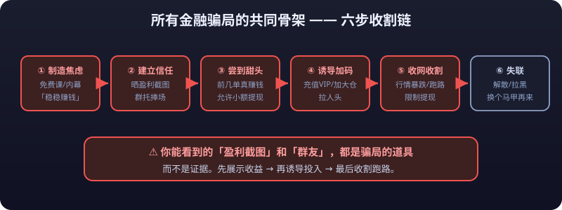

# 02 · Scam Detection

> In the trading world, the biggest risk is often not the market but **people**. You think you are betting against the market; in reality you are betting against a gang of fraudsters who study human nature professionally — they have scripts, a division of labor, and patience, while all you have is a heart that wants to make money.

::: warning ⚠️ Risk Warning
This article summarizes publicly known scam patterns and is intended for anti-fraud education only. All cases are objective descriptions of typical playbooks and do not represent any real events. **If you have been scammed or lost funds, call the police immediately (110) and report to the relevant platform, and preserve evidence such as transfer records and chat logs.** This article does not constitute legal advice.
:::


---

## Before We Start: The Shared Skeleton of All Scams

However varied the disguises, strip away the shell and **all financial scams share the same skeleton**:

```text
Manufacture anxiety/greed → build trust → let you taste a small win →
push you to commit more → harvest and disappear
```

| Stage | Playbook | How you feel |
|---|---|---|
| Hook | "Free course", "guaranteed insider info", "guru trade calls" | Curious, tempted |
| Trust | Profit screenshots, group shills cheering, forged credentials | "He seems to be a professional" |
| Sweetener | The first few trades really pay small money; small withdrawals are allowed | "This platform is real!" |
| Escalation | Push VIP recharges, bigger **<mark>positions</mark>**, recruit more people | "Now or never" |
| Harvest | Price crash / platform runs off / withdrawals blocked | Despair |
| Vanish | Group disbanded, everyone blocked, reopens under a new skin | "I never thought it was fake" |



::: danger 💀 Remember one line
The "profit screenshots" and "group members" you get to see are props of the scam, **not evidence**.
:::

::: danger 💀 Anything that makes you pay to withdraw is a scam
**Anything that makes you pay extra money in order to withdraw is a scam.** <mark>Margin</mark> deposits, taxes, unfreezing fees — a platform that asks for more money before letting you withdraw will never actually let you take out your principal. This trick recurs in pig-butchering scams, money-pool schemes, and fake exchanges; it is the final gate of the harvest.
:::

Below, eight common scams are dissected one by one.

---

## ① Pig-Butchering Scams (Stock-Tip Groups)

### The full playbook, step by step

"Pig-butchering" is the umbrella term for stock/coin tip scams; the core idea is **fattening retail traders like pigs before the slaughter**. The full flow:

```text
Step 1: Build the group
   → Pull people in via short videos, SMS, dating and social platforms;
     group names are usually along the lines of "XXX Live Trading Club" or "XXX Insider Group"
Step 2: Post the screenshots
   → The group owner posts "profit screenshots" every day while multiple sock-puppet
     accounts (shills) echo and cheer, creating a "follow the guru and you'll profit" vibe
Step 3: Free course
   → Free live/voice lessons on technical analysis; the occasional small-cap pick
     really does rise, making you believe the guru has real skill
Step 4: Push the deposit
   → When the time is ripe, the "guru" contacts you privately:
     join a high-yield program / derivatives / a new coin / an insider pick,
     luring you to transfer in large amounts, or to deposit via a "dedicated app"
Step 5: Harvest
   → Once the large funds land, the market is rigged into a crash, withdrawals
     break down, the guru disappears, and the group dissolves
```

### Signal checklist

- The group **bans private chat and bans members adding each other as friends** — precisely so the shills can't be exposed.
- Profit screenshots **only ever show wins, never losses**, and the amounts in them keep growing (to manufacture anxiety).
- Recommended tickers are obscure, small-cap, and easy to manipulate; the rationale is always "insider information" or "the main force is pumping it".
- You are required to **install an app from unofficial channels** or **transfer money to a personal account / private wallet**.
- Constant pressure such as "limited slots" or "closes tonight" manufactures scarcity and urgency.

### A real loss case

Ms. Wang is pulled into a "stock trading group". The owner, "Teacher Chen", gives free picks for two straight weeks with a high hit rate. Chen then claims a partnership with a large institution and recommends downloading the "X Tai Fortune" app to participate in "primary-market new listings". Ms. Wang deposits 180,000 yuan in stages; the in-app account at one point shows a profit of 50,000 yuan. When she requests a withdrawal, customer service says she must "pay a 30% **<mark>margin</mark>** deposit to unfreeze the funds"; after she pays another 50,000, the app stops opening, the group dissolves, and Teacher Chen vanishes. **Of the 230,000 yuan she lost, more than half was added after the "failed withdrawal" — the cruelest cut of the scam: using the money you already put in to force you to keep paying.**

---

## ② Money-Pool / Ponzi Schemes

### Feature checklist

A money pool is essentially **paying earlier participants with the money of later ones** — no real source of profit, kept alive by pass-the-parcel, and doomed to collapse. Core features:

| Feature | What it looks like |
|---|---|
| High-yield promises | 1%~3% daily, 30%+ monthly, hundreds of percent a year — far beyond any legitimate wealth product |
| Recruiting downlines | "Invite friends for rebates", "team bonuses" — returns tied to headcount |
| Withdrawal friction | Small amounts go through early on; large withdrawals start queuing, get time-limited, then frozen |
| Glamorous packaging | Blockchain, metaverse, AI, overseas licenses, celebrity endorsements rotate through the pitch |
| Payouts rely on new money | Before collapse there are often "top-up events" and "lock-up events" to keep old users in |
| Short lifespan | Most last no more than 1~2 years; the fast ones collapse within months |

### Signal checklist

- The yield is so high it needs a dedicated explanation of "why it's legal" — **whatever needs that explanation is basically illegal.**
- No filing or license can be found through official channels (search engines, regulator websites).
- A dual-track "static income + dynamic income (recruiting)" model — the higher the dynamic share, the more dangerous.
- Regulator inquiries are refused, financial statements are never public, and the destination of the funds is unclear.
- Pre-collapse omens: withdrawal reviews suddenly slow down, customer service stonewalls, rules keep changing.

### A real loss case

The "XX Mutual Aid Fund" promises 20% monthly returns in the name of "blockchain charity wealth management". Early participants do receive monthly payouts, so word of mouth spreads and the scheme balloons. As recruiting slows, the platform suddenly announces a "system upgrade" and halts withdrawals; a month later the app is gone. **Late entrants lose their entire principal, while many early participants give their profits back through "topping up" — every leg of the pass-the-parcel is a bet that they are not holding the last parcel.**

---

## ③ MLM Coins / Vaporware Tokens

### What they are

A vaporware token is a coin issued out of thin air by a project with no real use, no technology, and no ecosystem, its price sustained by **packaging + recruiting + manipulation**. MLM coins layer an explicit multi-level referral commission on top of that.

### Feature checklist

- **Template whitepaper**: grandiose tech talk ("cross-chain", "consensus mechanism", "trillion-dollar ecosystem") but no verifiable product whatsoever.
- **Not listed on major exchanges**: it trades only on the project's own app or tiny venues, where the price is fully controllable.
- **Recruiting from day one**: "direct-referral three-generation rewards", "minor-leg volume", "static + dynamic" — the scheme design is a carbon copy of MLM.
- **High-price lock-ups / DCA plans**: luring you to lock your coins in the project's own wallet, unsellable during the lock period.
- **Hyped-up community**: daily calls of "100x incoming", trash-talking regulated exchanges and major coins.
- **Founders can't be found**: anonymous teams; the whitepaper's "advisors" turn out not to exist.

### Signal checklist

- Ask three questions: **What problem does this coin solve? Where is the code (on GitHub)? Which major exchange lists it spot?** Three blanks means it's vaporware.
- Not listed on major market-data sites (CoinMarketCap etc.), or the listing data is wildly abnormal.
- The marketing copy contains "capital-protected", "guaranteed profit", "100x" — **legitimate projects never promise returns.**
- You are asked to transfer coins into the project's wallet for "locked yield" — **if the private keys are not in your hands, the coins are not yours.**

### A real loss case

The "XX Mining Coin" claims "mine on your phone, 50% monthly returns". Users register via invite codes and "buy miners" that produce the coin. Early users do profit by withdrawing and selling, so they recruit friends and family. Half a year later the platform announces a "mining difficulty adjustment" and output collapses; it then shuts the withdrawal channel and disappears after moving its servers overseas. **Masses of victims put in real money and got back a <mark>zeroed-out</mark> symbol sitting in a wallet.**

---

## ④ Fake Exchanges (Black Platforms)

### What they are

Black platforms are **scam websites/apps that mimic the look of legitimate exchanges**, common in derivatives, forex, and metals, and lately masquerading heavily as crypto exchanges. They are not connected to any real market; prices and trade outcomes are manipulated from a back end.

| Feature | What it looks like |
|---|---|
| Lookalike domains | Typosquats like `binancee.com`, `okx.network`, or cheap domains like xxx.biz / xxx.top |
| Forged credentials | "Regulatory licenses" in the page footer that are photoshopped and unverifiable on the regulator's site |
| Withdrawals impossible | Refused on grounds of "risk control", "taxes", or "unfreezing fees", or gated behind further deposits |
| Support vanishes | Once problems start, support disappears; the site/app shuts down and reopens under a new skin |
| Price anomalies | Quotes clearly diverge from real exchanges; wick spikes and instant **<mark>liquidations</mark>** are frequent |

### Signal checklist

- **One extra letter or one missing hyphen in the domain**: check the official domain character by character; legitimate exchanges confirm their URLs through official announcement channels.
- Not findable in app stores (App Store / official Android markets), installable only via QR codes or links from web pages — **an app that bypasses the official stores is the single most frequent black-platform trait.**
- Account opening requires no identity verification, or only a phone number, before you can "deposit".
- Deposits and withdrawals go through personal accounts, private wallets, or OTC USDT groups — **a legitimate exchange will never have you send money to an individual.**
- Withdrawal refusals always come with a "new reason": system upgrade, tax review, you need to "activate the account"...

### A real loss case

Mr. Liu enters a self-styled "internationally renowned" crypto exchange through a short-video ad; the interface is nearly identical to a genuine platform. He first deposits a small 10,000 yuan and withdraws it successfully, then scales up to 300,000 yuan to trade derivatives. A sudden "wick spike" **<mark>liquidates</mark>** him to zero, and customer service calls it "market volatility". Only afterward does Liu search online and discover the platform had long been exposed as a counterfeit — **his 300,000 yuan never entered any real market; what he was trading was a back-end program.**

---

## ⑤ Derivatives Copy-Trading Group Scams

### What they are

Sold as "a guru runs your derivatives trades", "copy-trading community", or "signal source", this is at heart **harvesting your unwillingness to do your own research**. Most are tied to black platforms: copy-trading group + fake exchange = a perfectly closed loop (the fake platform's back end manipulates your P&L directly).

### Feature checklist

- Claims like "**<mark>win rate</mark>** 90%+" or "doubles your money monthly" — **anyone who could truly double money consistently would be quietly getting rich on their own.**
- The screenshot records show only wins and **never display <mark>stop-loss</mark> orders**.
- You must copy trades in a designated app, or hand your api keys to a "custodian" — **handing over api keys is handing over control of your funds.**
- The in-group "customer service" pushes "deposit bonuses" and "copy-trading events" in sync, egging you on to add funds.
- Reverse signals: when the market goes against you, the guru "always **<mark>stopped out</mark>** right before the reversal".

### Signal checklist

- Block anything that involves a **win-rate guarantee** (legitimate asset managers are strictly forbidden from promising returns).
- "Copy trades only on our designated platform" — that platform is most likely a black platform.
- Any demand for your account password / api keys / seed phrase — **no legitimate copy-trading could ever need these; they are control of your funds.**
- Refusal to provide a verifiable real-money track record (third-party verifiable), offering only screenshots.

### A real loss case

Zhao joins a "derivatives copy-trading VIP group" and pays an 8,888 yuan membership fee; the "guru" trades on his behalf inside a designated app. The first three days show a 15% gain; after Zhao adds funds up to 200,000 yuan, the account blows up to **<mark>zero</mark>** in consecutive liquidations within two days. The guru explains it away as a "black swan" and then removes him from the group. **Investigation later shows the app was never connected to any real market and the "market" was entirely back-end controlled — Zhao's 200,000 yuan plus the 8,888 yuan fee went straight into the scammers' pockets.**

---

## ⑥ Phishing Sites and Wallet Scams

### What they are

These don't scam you into "entering a trade" — they go straight for your **identity or assets**: phishing sites imitating official sites, fake airdrops, fake extensions, fake customer support, all targeting your password, seed phrase, or private keys.

| Scam type | How it works |
|---|---|
| Fake official site | Buys the top ad slot above the genuine site; one typo in the URL and you're in |
| Fake airdrops | "Claim the airdrop by connecting your wallet and approving" — once approved, assets are drained in bulk |
| Fake extensions | Masquerade as wallet/market extensions and hijack transfer addresses |
| Fake support | Impersonates support in official communities: "wallet abnormal, please verify with your seed phrase" |
| Fake transfer prompts | Pop up "transaction failed, please retry", tricking you into repeated signed approvals |

### Signal checklist

- **Seed phrases, private keys, and passwords are things you should never hand to anyone under any circumstances** — real customer support will never ask for them.
- Any "free airdrop" or "free tokens" that requires you to transfer, approve, or pay gas first is phishing.
- Check the receiving address character by character before signing a transaction; refuse all authorization requests from unfamiliar dApps.
- Access exchange/wallet sites only via the official domain saved in your browser bookmarks — **do not search-and-click from the search box**.
- Any "support" asking you to "verify assets" or "unfreeze your account" while demanding private keys: block and report immediately.

### A real loss case

A user receives a "wallet upgrade notice" email, clicks the link into a counterfeit official site, and is asked to "re-import your seed phrase to complete the migration". After he types it in, every asset in the wallet (worth about 150,000 yuan) is swept out automatically. **Throughout the whole process the scammers used no technical exploit — they only needed you to hand over the key yourself.** Whoever holds the private keys owns the assets.

---

## ⑦ Borrowed-Money Trading / Fund-Allocation Scams

### What they are

These exploit the "turn my life around with other people's money" mentality: first, luring you to **trade with borrowed money or credit-card cash**, magnifying the risk without limit; second, **unlicensed fund allocation** — dangling fake "5x / 10x <mark>leverage</mark>" at you while the platform can confiscate your principal at any moment on grounds of a "<mark>negative balance</mark>" or "violations".

### Feature checklist

- Advertises "unsecured, money in seconds" **allocation / <mark>leverage</mark> funds** at abnormally low interest rates.
- Pushes you into consumer loans and online loans to feed the market, promising "you'll win it back and repay in no time".
- The allocation platform's account is **fully segregated from any real brokerage account**; P&L and orders are just numbers in the platform's back end.
- After an adverse market triggers the platform's "forced liquidation", it also demands you cover the "**<mark>negative-balance</mark>** loss".
- Stock fund allocation is itself illegal in mainland China; legitimate brokerages **do not** offer retail allocation channels.

### Signal checklist

- **Borrowing money to trade should itself be a red line**: once borrowed money enters the market, repayment pressure distorts your decisions and errors become nearly certain.
- Any "platform account" that does not match your real-name brokerage account is a fake book.
- Behind pitches like "interest settled daily" and "leverage borrowed and repaid anytime" sits a funding chain that can blow up at any moment.
- Remember: **the allocation company collects your interest and bets on your blow-up — they don't fear you losing; they fear you not losing.**

### A real loss case

Li believes an ad for "5x allocation, double your money in a month" and transfers a 100,000 yuan deposit to the platform, which allocates 500,000 yuan for stock trading. An 8% pullback triggers the forced liquidation; the platform claims a "40,000 yuan negative-balance loss" and demands Li cover it within a deadline or be sued. **Li is baffled: the money in the account was force-liquidated by the platform, "penetrated" into loss — and he still has to pay out of pocket. This is the most common harvest of allocation platforms: a razor-thin liquidation line, sky-high fees, and after the principal is gone, a "negative-balance debt" owed back to the platform.**

---

## ⑧ The "Guaranteed Profit" Script Catalog

If **any one** of the following lines appears, **leave immediately** — legitimate financial professionals are bound by law and would never say such things:

| Script | The truth |
|---|---|
| "Follow me, guaranteed no losses" | No one can promise returns; a promise is fraud |
| "Insider info, only a few people have it" | You are the last link of the information chain (the bagholder) |
| "Buy today or the window closes tomorrow" | Manufactured scarcity is the horn sounding before the harvest |
| "Platform promo: 20% rebate" | The rebate money comes out of your own future principal |
| "Users from earlier rounds all withdrew fine" | That was the bait to fatten you up |
| "Withdrawals require a deposit / tax / unfreezing fee" | **Anything that makes you pay to withdraw is a scam** |
| "Guaranteed returns — the platform covers losses" | If the platform runs off, who covers you? |
| "We hold a financial license from country XX" | Verify licenses on the regulator's official website |
| "The guru guides you, just one trade's commission" | The commission is only layer one; a whole script follows |
| "Get in now or you'll never be able to afford it later" | The market always has opportunities; scams don't |

---

## The 10 Iron Rules of Scam Prevention

1. **A promised return is fraud**: treat any claim of "guaranteed", "capital-protected", or "X% monthly" as coming from a scammer.
2. **Never download apps outside official channels**: installation packages that bypass the app stores are black platforms nine times out of ten.
3. **Never transfer money or crypto to strangers**: legitimate institutions will never have you send funds to a personal account or private wallet.
4. **Never give up private keys / seed phrases / passwords / api keys**: giving them up is giving up control of your assets.
5. **Never pay anything before withdrawing**: margin, taxes, unfreezing fees — only scammers charge you to withdraw.
6. **Never borrow money or pile on leverage to chase an "opportunity"**: scams love to harvest "the last desperate sum of money".
7. **Profit screenshots are not evidence**: any screenshot can be faked; verification goes through official channels.
8. **Keep a 24-hour cooling-off period**: anything pushing you to "decide right now" should be treated as a scam by default.
9. **Trust only what can be verified**: licenses on the regulator's official site, domains against official announcements, products in their code, track records via third parties.
10. **Being scammed is not shameful — silence is what's scary**: if you discover you've been scammed, call 110 immediately, freeze the payment channels, and preserve evidence; the earlier you act, the better the odds of recovery.

---

## Further Reading

- Why do scams work? Because they all hit the psychological weaknesses covered in [01-Why Traders Lose](why-traders-lose.md): FOMO, overconfidence, trusting tips.
- For legitimate trading channels and compliance boundaries: [03-Compliance and Taxes](compliance-taxes.md).
- To learn independent judgment instead of depending on a "guru": [07-Trading Systems](../trading-system/).
