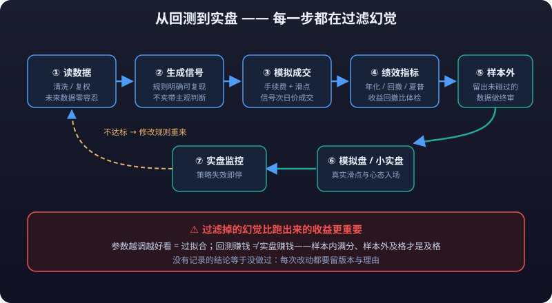
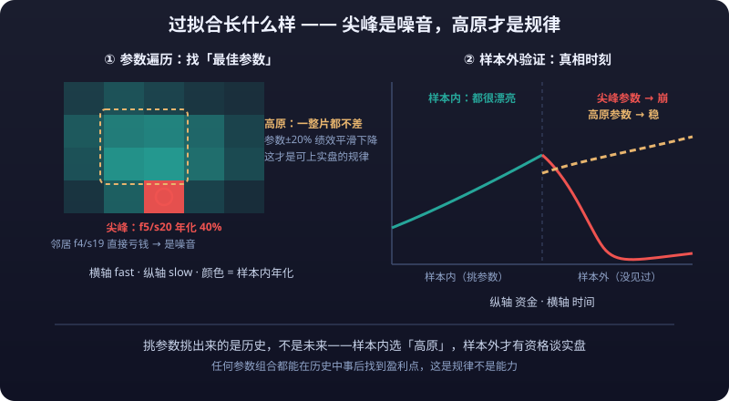

# Your First Backtest

> The step from "having data" to "having conclusions". This article walks you through the minimal backtest loop — load data → generate signals → simulate fills → compute performance — with one complete runnable Python script, teaches you to read backtest results, and gives you your first real grasp of overfitting.
>
> **Disclaimer**: All content on this site is for learning and research only and does not constitute investment advice. Markets are risky; invest with caution.

---

## 1. The Minimal Backtest Loop

The essence of a backtest: **replay your rules on historical data, pretending you were there**. Four stages, none optional:

```text
Load data → Generate signals → Simulate fills (fees/slippage) → Compute performance
```



### 1.1 Complete Runnable Example: Dual Moving Average Backtest

Prerequisite: you've already fetched `data/600519_daily_hfq.csv` (backward adjusted, Chinese column names) per [02-Data Acquisition in Practice](data-acquisition.md).

Example code is for teaching only; live-trading risk is yours:

```python
import numpy as np
import pandas as pd

FEE_RATE = 0.001        # one-way fee (fraction of traded value; example value)
SLIPPAGE = 0.0002       # one-way slippage (fraction of traded value; example value)

def load_data(path):
    df = pd.read_csv(path)
    df.columns = [c.strip() for c in df.columns]
    rename = {"日期": "date", "开盘": "open", "收盘": "close",
              "最高": "high", "最低": "low", "成交量": "volume"}
    df = df.rename(columns=rename)
    df["date"] = pd.to_datetime(df["date"])
    return df.set_index("date").sort_index()

def backtest_double_ma(df, fast=5, slow=20, fee=FEE_RATE, slip=SLIPPAGE):
    df = df.copy()
    # 1. Generate signals
    df["ma_fast"] = df["close"].rolling(fast).mean()
    df["ma_slow"] = df["close"].rolling(slow).mean()
    df["signal"] = (df["ma_fast"] > df["ma_slow"]).astype(int)

    # 2. Simulate fills: signal effective next day (avoids look-ahead), fully in/out
    df["position"] = df["signal"].shift(1).fillna(0)
    df["ret"] = df["close"].pct_change().fillna(0)
    df["strat_ret"] = df["position"] * df["ret"]

    # 3. Trading costs: deduct fee + slippage on days when position changes
    changed = df["position"] != df["position"].shift(1)
    df.loc[changed, "strat_ret"] -= (fee + slip)
    df["equity"] = (1 + df["strat_ret"]).cumprod()
    return df

def report(df, benchmark=None):
    equity = df["equity"]
    total = equity.iloc[-1] / equity.iloc[0] - 1
    ann = (1 + total) ** (252 / len(df)) - 1
    dd = equity / equity.cummax() - 1
    r = {
        "total return": f"{total:.2%}",
        "annualized return": f"{ann:.2%}",
        "max drawdown": f"{dd.min():.2%}",
        "Sharpe ratio": f"{df['strat_ret'].mean() / df['strat_ret'].std() * np.sqrt(252):.2f}",
        "daily win rate": f"{(df['strat_ret'] > 0).mean():.2%}",
        "number of trades": f"{int((df['position'] != df['position'].shift(1)).sum())}",
    }
    if benchmark is not None:
        r["benchmark return (same period)"] = f"{benchmark.iloc[-1] / benchmark.iloc[0] - 1:.2%}"
    return r

df = load_data("data/600519_daily_hfq.csv")
result = backtest_double_ma(df, fast=5, slow=20)
print(report(result))
print(result[["close", "ma_fast", "ma_slow", "position", "equity"]].tail())
```

When it runs you get a report with total return, annualized return, max <mark>drawdown</mark>, Sharpe ratio, and <mark>win rate</mark> — your first "real" backtest.

---

## 2. Signal Generation and Position

Two design decisions in the example above matter most:

### 2.1 Signal → Target Position

A signal says "do I want to be long"; a position says "am I actually holding". There is one bar between them:

```text
Day t close: ma_fast > ma_slow computed → signal = 1 (want to buy)
Day t+1 open: execute → position = 1 (holding)
```

`signal.shift(1)` implements that one-bar delay — **signals and fills must be offset by one bar, otherwise it is <mark>look-ahead bias</mark>** (see 01-Quant Toolchain §7.3).

### 2.2 Fill Price Assumptions

Where on which candle your backtest assumes fills directly determines how believable the result is:

| Assumption | Simple | Realistic |
|---|---|---|
| Fill at signal bar's close | Easy to implement | The signal itself derives from that close — peeking at the future ❌ |
| **Fill at next day's open** | Recommended starting point for individuals | Reality check: the open is a tradable reference price, still somewhat idealized ⭐ |
| Next day's open + **<mark>slippage</mark>** | Closer to reality | Bad slippage estimates introduce their own error |
| Intraday highs/lows or volume-weighted fills | Complex | More complexity, harder to verify — start simple |

::: tip 💡 Starting Advice for Fill Assumptions
**<mark>Next day's open + proportional slippage</mark>**, then run sensitivity tests by varying the slippage (how much does doubling slippage change returns?) — this beats agonizing over model precision.
:::

---

## 3. Backtest Engine Choice: DIY vs backtrader vs vn.py

| Option | Learning Cost | Capability | Best For |
|---|---|---|---|
| **Write it yourself** (like Section 1) | Low, a few dozen lines | Daily bars, single instrument, simple rules | Early research, understanding fundamentals — **strongly do this once first** |
| backtrader | Medium | Multi-instrument multi-timeframe, slippage/commission models, built-in analyzers | The mature event-driven framework to upgrade into |
| vectorbt | Medium | Vectorized, extremely fast parameter sweeps | Research with heavy parameter grids |
| vn.py | High | Backtest + live in one, broker/exchange connectivity | Heavyweight path straight toward production live trading |

**Boundary advice**:

- Daily-bar signals, single instrument, fixed rules → write it yourself; 20 lines, full understanding of every detail;
- Sweeping hundreds of parameter combos, complex equity curves → switch to backtrader or vectorbt; it saves grunt work;
- Multi-instrument portfolios, event-driven, tick-level → go vn.py, but its complexity will eat large chunks of research time.

::: tip 💡 Key Insight
**<mark>The engine is just a vehicle; the rule is the strategy</mark>**. Swapping engines should produce nearly identical results for the same strategy on the same data — that's the touchstone for verifying you understood things correctly.
:::

---

## 4. Performance Metric Computation

Four must-compute metrics, all derived from the equity series (teaching example only; live-trading risk is yours):

```python
ret = df["strat_ret"]          # strategy daily return series
equity = df["equity"]          # equity curve

total = equity.iloc[-1] / equity.iloc[0] - 1
n_years = len(df) / 252
ann = (1 + total) ** (1 / n_years) - 1                    # annualized (geometric)
dd = equity / equity.cummax() - 1                          # drawdown series
max_dd = dd.min()                                          # max drawdown
sharpe = ret.mean() / ret.std() * np.sqrt(252)             # annualized Sharpe
win_rate = (ret > 0).mean()                                # daily win rate
```

| Metric | Meaning | How to Read It |
|---|---|---|
| **<mark>Annualized return</mark>** | What you'd earn in a year | Below money-market funds/Treasuries means the strategy creates no value |
| **<mark>Max drawdown</mark>** | Worst historical peak-to-trough loss | Determines whether you can hold on — **more important than returns** |
| **<mark>Sharpe ratio</mark>** | Return per unit of volatility | >1 acceptable, >2 excellent; >3 in a backtest — suspect look-ahead bias first |
| Win rate | Share of profitable days | Trend strategies naturally sit at 30-40%; never read it alone |

::: tip 💡 The Most Intuitive Health Metric for Individual Traders
The **<mark>return/drawdown ratio (annualized return ÷ max drawdown)</mark>**: below 1 is barely worth doing; above 2 is the passing line.
:::

---

## 5. How to Read Backtest Results

### 5.1 Equity Curve vs Benchmark

Plot strategy equity against a benchmark (CSI 300 index over the same period) and look at **relative** performance:

```python
import matplotlib.pyplot as plt

bench = pd.read_csv("data/csi300_index.csv", parse_dates=["date"])  # fetch yourself
bench["equity"] = (1 + bench["close"].pct_change().fillna(0)).cumprod()
ax = result["equity"].plot(label="Strategy", figsize=(12, 6))
bench.set_index("date")["equity"].plot(ax=ax, label="CSI 300")
plt.legend(); plt.title("Strategy vs Benchmark")
plt.show()
```

- Beats the benchmark with controlled drawdowns → worth researching further;
- Never beats the benchmark → an index fund is simply less hassle;
- Beats it hugely but the curve goes vertical only at the end → suspect a data or code bug before crediting brilliance.

### 5.2 Drawdown Interval Distribution

Max drawdown is only the worst single day; what matters more is **where drawdowns cluster**:

```python
# List start/end and depth of each drawdown episode
dd = result["equity"] / result["equity"].cummax() - 1
peak = 0; draws = []
for i, v in enumerate(dd):
    if v == 0:
        peak = i
    else:
        draws.append((peak, i, v))
d = min(draws, key=lambda x: x[2])
print(f"Deepest drawdown: {result.index[d[0]]} ~ {result.index[d[1]]}, depth {d[2]:.2%}")
```

If drawdowns concentrate in one year (e.g., the 2022 bear market — fictional example figures aside), the strategy is essentially a "bull-market amplifier"; if they spread evenly, the strategy struggles in low-correlation regimes — either way, that dictates your next improvement direction.

---

::: warning 🛑 Parameter-Insensitive Plateaus Are Where Strategies Actually Work
**Any parameter combination can find a profitable point in history "after the fact" — that's arithmetic, not skill. What actually works is the parameter-insensitive region: a plateau, not a spike.** Neighboring parameter sets should transition smoothly; if 5/20 shines alone while 4/19 collapses, it's probably overfitting.
:::

## 6. First Encounter with Backtest Overfitting

Change `fast/slow` in Section 1's code to 3/17 — maybe higher returns. Change it to 8/32 — maybe smaller max drawdown. And then?

```python
# Parameter sweep: scan a grid of moving average params
for fast in [3, 5, 10, 15]:
    for slow in [20, 30, 40, 60]:
        if fast >= slow:
            continue
        r = backtest_double_ma(df, fast=fast, slow=slow)
        ann = (1 + r["equity"].iloc[-1] / r["equity"].iloc[0]) ** (252 / len(r)) - 1
        print(f"f{fast}/s{slow}: annualized {ann:.2%}")
```

You'll get a "best parameter set" — but that best was **selected on this stretch of history**, not predicted from it. **More parameters, shorter history, more exquisitely tuned the winner — the more surely you're fitting noise instead of pattern**. That is **<mark>overfitting</mark>**: MA 5/20 beating 3/17 says nothing about whether it will tomorrow.

Judgment points:

- Neighboring parameter sets should show **smooth transitions** (if 5/20 is good, 6/22 shouldn't be bad); if 5/20 shines alone while 4/19 collapses, it's probably overfitting;
- Any parameter combination can find a profitable point in history after the fact — that's arithmetic, not skill;
- What actually works is the **parameter-insensitive region** — a plateau, not a spike.



---

## 7. Turn Backtesting into a "Research Process"

A single backtest = one observation, not a conclusion. The minimal research process is **<mark>parameter domain design + in-sample/out-of-sample split</mark>**.

### 7.1 In-Sample / Out-of-Sample Split

```python
split = int(len(df) * 0.7)
train, test = df.iloc[:split], df.iloc[split:]

# In-sample: pick parameters here (light optimization allowed)
best = None
for fast in [3, 5, 10]:
    for slow in [20, 30, 40]:
        if fast >= slow:
            continue
        r = backtest_double_ma(train, fast=fast, slow=slow)
        score = (r["equity"].iloc[-1] / r["equity"].iloc[0]) ** (252 / len(r)) - 1
        if best is None or score > best[2]:
            best = (fast, slow, score)
print("in-sample best:", best)

# Out-of-sample: run the in-sample winner exactly once on unseen data
r_test = backtest_double_ma(test, fast=best[0], slow=best[1])
print("out-of-sample annualized:", f"{(r_test['equity'].iloc[-1]/r_test['equity'].iloc[0]) ** (252/len(r_test)) - 1:.2%}")
```

Rules:

1. Parameters may only be picked **in-sample**;
2. Out-of-sample runs **exactly once**; no going back to tune afterward (that ruins it);
3. A huge gap between out-of-sample and in-sample performance (decay > 50%) → the in-sample result is most likely overfit;
4. Advanced: rolling walk-forward windows track live conditions better than a one-shot split.

### 7.2 Experiment Records

Record every backtest: data range, parameters, fee/slippage assumptions, commit hash, result numbers (template in 01-Quant Toolchain §6.2). **<mark>An unrecorded conclusion is no conclusion</mark>** — three months later you'll have zero idea why you ran it that way.

---

## 8. Next Step

Your backtest works — don't rush to live trading. First visit [05-Strategy Coding in Practice](strategy-coding.md) for more strategy shapes, then read [04-Live Automation](live-automation.md) for compliance boundaries and automation realities before deciding whether to push toward real capital.

---

::: warning ⚠️ Risk Warning
**Backtest returns ≠ live returns.** Backtests systematically underestimate slippage, overestimate fills, and omit real-world constraints (price limits blocking entries, insufficient <mark>liquidity</mark>, suspensions making trades impossible); parameter-optimized strategies add overfitting risk on top. Neither a single backtest nor high returns from parameter sweeps justify investing; always follow "pick in-sample, validate out-of-sample, record for reproducibility", verify long-term on paper trading, then consider small capital. Historical data, backtest results do not guarantee future performance. Code and conclusions here are for learning and research only and do not constitute investment advice.
:::
