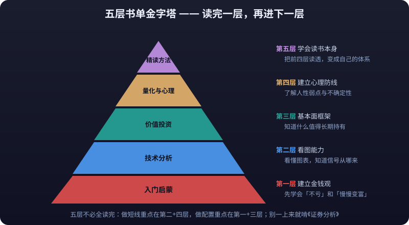

# 20 · Classic Reading List (Reading Guide)

> The first 19 chapters of this knowledge base have already explained the "methods" thoroughly: how to read candlesticks, how to define a trading system, how to manage risk, how to read financial statements. But behind every method is a framework, and a framework cannot be reverse-engineered from documentation alone — it needs good books underneath, one after another.
>
> This chapter does not recommend a "100 must-reads" list. It only recommends books **worth reading repeatedly**, and tells you **why to read them and how**. The list advances through five tiers — Beginner → Technical → Value → Quant & Psychology → Close-Reading Method — finishing one tier before moving to the next.
>
> **Disclaimer**: Everything in this chapter is for learning and research only and does not constitute investment advice. The views in these books represent their authors' positions; please read critically. Markets carry risk — invest with caution.

---

## Positioning: The Knowledge Base Covers Methods, Books Help You Build a Framework

```text
19 knowledge base chapters        →   One book
  "What it is, how to use it"         "Why, what's behind it, when it stops working"
```

- **The knowledge base solves the "tools"**: terminology, rules, formulas, checklists — searchable and directly usable.
- **Books solve the "philosophy"**: they stitch scattered knowledge into a worldview — why stop-losses are so hard to execute, why you avoid crowded trades, why the market is a weighing machine in the long run.
- **Neither works without the other**: only reading without practicing turns books into "I understand the theory"; only grinding docs without reading leaves knowledge scattered — it collapses the moment the market changes.

---

## Five-Tier Reading Roadmap



| Tier | Document | Core Goal | Typical Reader |
|---|---|---|---|
| 1 | [01-Beginner Books](beginner-books.md) | Money mindset, asset mindset, indexing thinking | Complete beginners, new to markets |
| 2 | [02-Technical Analysis Classics](ta-classics.md) | Trends, patterns, rule-based trading | Traders and chart watchers |
| 3 | [03-Value Investing Classics](value-investing-classics.md) | Margin of safety, moats, cycles | Aspiring investors, stock/fund buyers |
| 4 | [04-Quant & Trading Psychology](quant-psychology-books.md) | Human biases, probabilistic thinking, uncertainty | Experienced traders looking to level up |
| 5 | [05-How to Read a Book Closely](how-to-read.md) | Close-reading method, note systems, personal knowledge base | Anyone who wants books to actually stick |

> Suggested order: **do not start by grinding through The Intelligent Investor or Security Analysis.** Finish chapters 01 and 05 first (learn how to read), then pick from 02/03/04 as needed. You don't have to finish all five tiers — short-term traders should focus on 02+04, allocators on 01+03.

---

## How This Chapter Pairs With the Rest of the Knowledge Base

| Reading Chapter | Paired Knowledge Base Chapters |
|---|---|
| 01-Beginner Books | [01-Getting Started](../getting-started/), [14-Wealth Allocation](../wealth-allocation/) |
| 02-Technical Analysis Classics | [06-Technical Analysis](../technical-analysis/), [07-Trading System](../trading-system/) |
| 03-Value Investing Classics | [18-Financial Statements Deep Dive](../financial-statements/), [19-Industry Research](../industry-research/) |
| 04-Quant & Trading Psychology | [07-Trading System](../trading-system/), [15-Quant Practice](../quant-practice/) |
| 05-How to Read a Book Closely | All chapters (use whichever pairs with the book at hand) |

> **How to pair them**: read a chapter of a book → compare it against the matching knowledge base chapter → open Kline Buty and verify the book's claims against live market data. However classic a book's example is, nothing beats finding one yourself on a chart. For the detailed method see [05-How to Read a Book Closely](how-to-read.md).

---

## Conventions

- Book information (titles, authors, core ideas) reflects real published works; reviews aim to be objective — neither hype nor hatchet jobs.
- Every article includes a "⚠️ Risk Warning" — the reading list itself carries no risk; **the risk lies in assuming that having read means being able**.
- What this series recommends is a starting point for reading lists, not an endpoint. After each article, keep expanding along the authors and references cited.
- Titles differ across simplified Chinese, traditional Chinese, and English editions; this doesn't affect reading — go with whichever edition you can actually get.

---

## Risk Warning

> ⚠️ **Risk Warning**: Reading won't make you money directly — if anything, it makes you more careful about money, which is a good thing. **The real risks are "reading without doing" — plenty of books consumed, orders still placed on gut feeling, so the reading was wasted — and "reading into obsession," treating one book's conclusions as a universal holy grail.** Any book is just one person's summary of experience in one era, in one market; Chinese markets, crypto markets, and leveraged trading can all invalidate a book's conclusions. Treat books as a toolbox, not an instruction manual.

---

## Chapter Contents

<DocCards dir="reading-list" />
