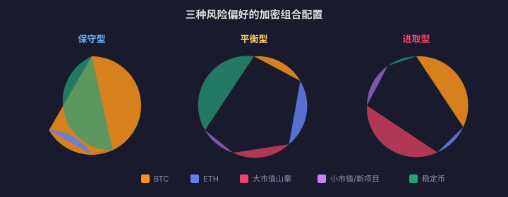

# 06 · Portfolio Management & Rebalancing

> Buying coins is easy; the hard part is **holding without panic, not running when down, not floating when up**. Portfolio management does not answer "what to buy" but "how much to buy and when to adjust". This article is the method that turns crypto assets from gambling into a system.
>
> **Disclaimer**: All content on this site is for learning and research only and does not constitute investment advice. Markets carry risk; invest with caution.

---

## 1. Why a Portfolio Instead of a Single All-in Bet

::: danger ⚠️ The risk of going all-in on one altcoin
Suppose you went all-in on a certain Layer 2 altcoin:
- Team exit scam → zero
- Displaced by a competitor → −90%
- Regulatory strike → −70%
- Hacker attack → −80%
- Broad market decline → falls along, but bounces weaker than BTC

You have handed your fate to a single project's team, technology, and luck. The core of portfolio management: **hedge unknowable risks with diversification.**
:::

### Correlation Matrix

| | BTC | ETH | Large-cap alts | Small-cap alts |
|---|---|---|---|---|
| **BTC** | 1.00 | 0.85 | 0.80 | 0.75 |
| **ETH** | 0.85 | 1.00 | 0.85 | 0.80 |
| **Large-cap alts** | 0.80 | 0.85 | 1.00 | 0.90 |
| **Small-cap alts** | 0.75 | 0.80 | 0.90 | 1.00 |

Correlations within crypto are generally high (0.75–0.90); genuine diversification requires crossing asset classes (stocks, bonds, gold). But within crypto, BTC's volatility and drawdown depth remain significantly lower than altcoins'.

**How to read the matrix**: the closer a pair's correlation is to 1, the more they move together — a portfolio of BTC plus large-cap altcoins offers far less diversification than the coin count suggests; genuine variance reduction comes from pairings whose correlation is clearly below 1 (e.g. BTC / stablecoin yield, crypto plus stocks and bonds). Re-estimate the matrix every six months: in a crisis every correlation briefly converges toward 1, so judge by long-run averages rather than the crisis week.

---

## 2. Classic Allocation Models

### 2.1 Tiered by Risk Preference



| Risk preference | BTC | ETH | Large-cap alts | Small-caps/new projects | Stablecoins |
|---|---|---|---|---|---|
| Conservative | 60% | 20% | 10% | 0% | 10% |
| Balanced | 40% | 25% | 20% | 5% | 10% |
| Aggressive | 30% | 25% | 25% | 15% | 5% |

### 2.2 Allocation Logic

- **BTC as the ballast**: lowest (relative) volatility, largest market cap, widest institutional adoption, historically shallowest drawdowns.
- **ETH as the growth engine**: the core of the smart contract ecosystem; DeFi/NFT/Layer 2 all depend on it, with more upside elasticity than BTC.
- **Altcoins as the lottery sleeve**: high payout, low win rate — no single coin above 5% of total holdings, all of them combined capped at 20%.
- **Stablecoins as the bullets**: waiting to buy the big dip, or serving as the portfolio's "cash" for rebalancing.

---

## 3. The Rebalancing Mechanism

### 3.1 Why Rebalancing Works

```text
Initial allocation: BTC 50% / alts 50%
Six months later: BTC up 50%, alts down 30%
  → BTC becomes 65%, alts become 35% (passive drift)

Rebalancing action:
sell part of the BTC → buy part of the alts
restore 50/50

Effect: automatic "sell the riser, buy the faller" — harvest profits while others are greedy, add while they are fearful
```

### 3.2 Trigger Conditions

| Method | Rule | Use case |
|---|---|---|
| Time-triggered | Fixed date every month/quarter | Simple and effortless; fits DCA investors |
| Threshold-triggered | Any asset deviates ±5%/±10% from target | Cuts unnecessary trades |
| Hybrid | Quarterly check + execute early when the threshold breaches | Balances frequency and precision |

### 3.3 A Rebalancing Example

```text
Target allocation: BTC 40% / ETH 30% / alts 20% / USDT 10%

Current market-value drift:
BTC actually 52% (+12%) → sell 12%
ETH actually 26% (−4%) → do nothing (below threshold)
Alts actually 12% (−8%) → buy 8%
USDT actually 10% → do nothing

Proceeds from selling BTC → buy altcoins → restore target ratios
```

---

## 4. Execution: From "Should Rebalance" to "Actually Done"

Section 3.3 computed "sell 12%, buy 8%" — but executing it raises four practical questions: how to place the orders, whether the trade is worth the cost, how far to restore, and what taxes do.

### 4.1 Limit or Market Orders

| Scenario | Recommendation | Why |
|---|---|---|
| BTC/ETH and other majors, amount < 5% of the portfolio | Market order, done | Depth is sufficient; slippage negligible |
| Small-cap altcoins | Limit orders or split market orders | Thin books — a single market order can eat 1%+ |
| Very large rebalance (> 10% of the portfolio) | Split into 2–3 tranches over time | Reduces impact cost and leaves room to reconsider mid-way |

### 4.2 The Minimum Effective Rebalance Size

Rebalancing is not free: every operation costs **fees on both legs (roughly 0.05%–0.15% × 2) plus slippage**, and may also realize a taxable event. The expected "sell high, buy low" benefit must clearly exceed that cost, or you are working for the exchange.

- **Rule of thumb**: when a single adjustment is below **1%–2% of the total portfolio**, the cost likely eats the benefit — don't bother;
- **Don't set thresholds too tight**: ±5% is the common floor — the tighter the threshold, the more often it triggers and the faster costs accumulate;
- For small portfolios (say, under $1,000), prefer **time-based rebalancing** (quarterly) and minimize operation frequency.

### 4.3 Restore to Target, or Pull Back Half

- **Restore fully to target**: simple rules, strong discipline; fits ranging markets and most beginners;
- **Pull back half (Band Rebalancing)**: a 12% deviation gets a 6% adjustment, leaving the rest to the trend — in a strong trend, fully rebalancing at once is a leveraged bet on reversal; pulling back half harvests some profit while keeping trend exposure.

Rule of choice: **restore fully in ranging markets; pull back half in strong trends**. The key is writing the rule into your plan (see [Chapter 7 · Trading System](../trading-system/)) so you don't debate with yourself at execution time.

### 4.4 Tax Cost: The Overlooked Friction

In most jurisdictions a **crypto-to-crypto swap is a taxable event** — every "sell BTC, buy altcoin" is a disposal that may realize taxable gains. That means:

- Frequent threshold rebalancing shatters the tax advantage of long-term holding; the tax bill alone can exceed the rebalancing benefit;
- Record **cost basis and dates for every adjustment** — at filing season, missing records are a disaster (see [Chapter 26 · Pitfalls](../pitfalls/) on compliance and [Chapter 14 · Wealth Allocation](../wealth-allocation/) on tax planning);
- Rates and rules differ drastically by jurisdiction — follow local law and consult a professional.

### 4.5 Tracking Your Allocations

Rebalancing presupposes knowing how far you've drifted. Three tracking methods, light to heavy:

1. **By hand**: `weight of a coin = its market value ÷ total portfolio value`. Prices move every second — compute from a single-time snapshot; never mix prices from different moments;
2. **A simple sheet**: `Coin | Target % | Actual % | Drift | Action` — fill it in at each quarterly review; five minutes (copy the table below);
3. **Portfolio trackers**: an exchange portfolio page or a third-party tracker computes weights automatically — sensible once you hold many coins.

| Coin | Target % | Actual % | Drift | Action |
|---|---|---|---|---|
| BTC | 40 | 52 | +12 | Sell 12% |
| ETH | 30 | 26 | −4 | Hold |
| Altcoins | 20 | 12 | −8 | Buy 8% |
| USDT | 10 | 10 | 0 | Hold |

### 4.6 Combining with DCA: Tax-Free "Natural Rebalancing"

**Cash-flow rebalancing**: instead of spreading new DCA money at target weights, **buy only whatever is under target** — the more underweight, the more it gets. Three advantages:

- Buying only (no selling) means **no taxable event**;
- You never sell what is strong, reducing counter-trend friction;
- It complements time-triggered rebalancing: if the quarterly review shows drift still inside the threshold, do nothing — next month's DCA money pulls weights back on its own.

Example rule: "Each month invest 1,000 USDT entirely into the asset furthest below target; when everything is on target, allocate at target weights."

---

## 5. Drawdown Control and Stop-Losses

### 4.1 Portfolio-Level Drawdown Rules

| Portfolio drawdown | Response |
|---|---|
| < 10% | Normal volatility; do nothing |
| 10%–20% | Stop new contributions; review holdings |
| 20%–30% | Cut the altcoin sleeve to below 10% |
| > 30% | Keep only BTC + ETH + stablecoins; full retreat |

### 4.2 Per-Coin Stop vs Portfolio Stop

| Dimension | Per-coin stop | Portfolio stop |
|---|---|---|
| What it controls | A single coin's loss | The whole account's loss |
| Use case | Short-term trades with a clear plan | The last line of defense for long-term holders |
| Drawback | May get shaken out right before a rebound | By the time it triggers, a lot may already be lost |

::: tip 💡 A long-term holder's stop-loss strategy
If you are a long-term holder (holding period > 1 year), you do not need a tight stop on every coin, but you should have a **portfolio-level circuit breaker** — e.g. when total assets draw down 30%, force a cut back to the conservative allocation, to prevent emotionally "holding all the way down".
:::

---

## 6. Periodic Review Checklist

Run through this every quarter:

- [ ] Has any coin's weight drifted far from target? (beyond ±10%)
- [ ] Has any altcoin's fundamentals changed fundamentally? (team dissolved / development stalled / community bleeding away)
- [ ] Is my stablecoin ratio enough for the next big drop?
- [ ] Over the past quarter, were my moves emotion-driven or plan-executed?
- [ ] If I liquidated everything and started over today, would I still buy every coin I now hold?

---

## 7. Common Mistakes

| Mistake | Consequence |
|---|---|
| Chasing and panic-selling instead of rebalancing | Buy high, sell low, repeatedly carved up |
| Altcoin sleeve too large | One black swan drags down the whole portfolio |
| Never rebalancing | Altcoin share balloons at the bull top; fully invested to catch the knife when the bear arrives |
| No stablecoin reserve | No money to buy the dip, no heart to cut the loss |
| Constantly switching strategies | Every switch lands at the worst moment |
| Thresholds set too tight, many tiny rebalances | Fees and tax costs swallow the entire rebalancing benefit |
| Forgetting crypto-to-crypto swaps are taxable events | Filing season reveals taxes larger than the rebalancing benefit |

::: warning ⚠️ Risk Warning
All content in this article is for learning and research only and does not constitute investment advice. Cryptocurrency trading carries high risk; build an investment plan suited to your own situation and execute it strictly.
:::
