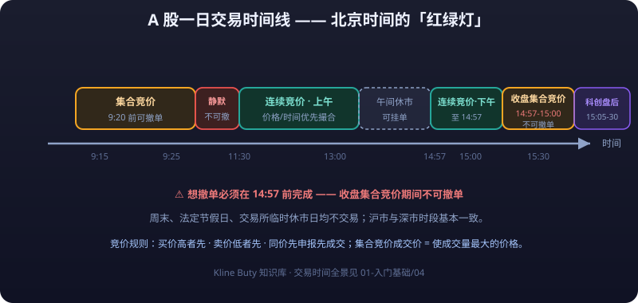

# 02 · A-Share Trading Rules

> This article is a hands-on A-share manual: when you can trade, how much you can buy, how far prices can move, how to work around T+1, exactly what the fees are, how to subscribe to IPOs, how to open a margin account, which account types exist, and what northbound funds are. Rules change constantly — **always defer to the latest announcements of the SSE/SZSE/BSE and the CSRC**; figures here follow the 2025-2026 rules as closely as possible.

---

## Trading Hours

### A Day's Timeline



| Session | Time (Beijing) | What happens |
|---|---|---|
| Opening call auction | 9:15 - 9:25 | 9:15-9:20 orders can be placed **and cancelled**; 9:20-9:25 orders can be placed but **cannot be cancelled** |
| Pre-open pause | 9:25 - 9:30 | Opening price matched; no cancellation (SZSE accepts orders) |
| Continuous auction (morning) | 9:30 - 11:30 | Continuous matching by price priority, then time priority |
| Lunch break | 11:30 - 13:00 | Market closed; orders accepted but not matched |
| Continuous auction (afternoon) | 13:00 - 14:57 | Same as above |
| Closing call auction | 14:57 - 15:00 | No cancellation; closing price matched |
| STAR after-hours fixed price | 15:05 - 15:30 | Trades at the closing price (STAR Market) |

> SSE and SZSE sessions are nearly identical; **orders in the 14:57-15:00 closing call auction cannot be cancelled** — finish cancelling before 14:57. No trading on weekends, public holidays, or ad-hoc exchange closures.

### Key Matching Rules

| Rule | Description |
|---|---|
| Price priority | Higher buy prices and lower sell prices fill first |
| Time priority | At the same price, the order placed first fills first |
| Call-auction price | The price that maximizes traded volume — never above a **<mark>buy order price</mark>**, never below a **<mark>sell order price</mark>** |
| **<mark>Market order</mark>** | Types such as **<mark>five-level</mark>** immediate-or-cancel / best-of-five fill at the opposing side's price; **<mark>slippage</mark>** is possible |

---

## T+1 and the Pseudo-T+0

### What T+1 Is

| Item | A-share rule (T+1) |
|---|---|
| Shares | **Bought today, sellable only the next trading day** |
| Funds | Sale proceeds are usable the same day (can buy shares again), but **withdrawable to the bank card only the next trading day** |
| HK / US stocks | Both allow T+0 round trips (buy and sell the same day) |

### Base-Position Rotation = a Legal "Pseudo-T+0"

Hold some shares of a stock first (a base position), then during the day:

```text
① At the open, sell the base position first (lock in profit / dodge risk)
② After an intraday dip, buy the same number of shares back
```

Effect: sold high and bought low within the day — **the share count is unchanged, the cash has grown** — with no effect on your holding cost or the T+1 restriction. Known as "base-position rotation" or "doing T", it is the only legal intraday trading method for retail investors under A-shares' T+1.

> "Doing T" presumes you call the base position's direction correctly; get it wrong (sell too early, or buy back dearer) and you have raised your cost instead. **This is an expert's game — beginners, handle with care.**

::: warning ⚠️ Doing T is an expert's game; beginners beware
**"Doing T" presumes you call the base position's direction correctly; get it wrong (sell too early, or buy back dearer) and you have raised your cost instead.** It is the only legal intraday trading method for retail investors under A-shares' T+1, but if the direction is misjudged the round trip works against you — an expert's game; beginners beware.
:::

---

## Price Limits

### Limits by Board (2025 figures)

| Board | Limit | Notes |
|---|---|---|
| SSE/SZSE Main Board | ±10% | Still ±10% after full registration reform |
| ChiNext / STAR | ±20% | Registration-reform boards, wider swings |
| BSE | ±30% | The widest |
| Main-board ST/*ST | ±5% | Risk-warning stocks, capped flexibility |
| STAR/ChiNext ST | ±20% | Same as the board, no step-down |
| Delisting consolidation period (main board) | ±10% | The final trading phase before delisting |

### First-Day Rules for New Listings

| Board | First-day limit | Temporary halt mechanism |
|---|---|---|
| Main board (registration-based) | No price limit for the first 5 trading days | ±30% from the opening price halts until 10:00; ±60% halts until 14:57 |
| ChiNext / STAR | No price limit for the first 5 trading days | ±30%/±60% from the open each triggers a 10-minute halt |
| BSE | No limit on day one, ±30% thereafter | ±30%/±60% from the open each triggers a 10-minute halt |
| 5 days after listing | Normal board limits resume | — |

> A limit-up is not "trading suspended": hitting the limit-up means **buyers queue up and cannot get filled**, and the limit-down means **sellers cannot get out**. Consecutive limit-ups usually come with elevated risk at the top — never chase boards blindly.

---

## Minimum Trading Unit

| Rule | Description |
|---|---|
| Buying | Multiples of **100 shares (1 lot)** minimum; STAR Market: 200 shares minimum with 1-share increments; BSE: 100 shares minimum with 1-share increments |
| Selling | If your holding is under 100 shares (an odd lot), you must **sell it all at once** — it cannot be split |
| Selling on STAR | Sell in one go when the balance falls below 200 shares |

> Example: holding 150 shares, you must sell all 150 at once — you cannot sell 50 and keep 100. Odd lots mostly come from bonus/capitalization shares creating non-round holdings.

---

## Fees

### Cost Structure of One Round Trip (2025 figures)

| Fee | Charged by | Rate | Direction |
|---|---|---|---|
| Commission | Broker | Typically 0.02%-0.03%, capped at 3‰, minimum 5 CNY per trade | Both buy and sell |
| Stamp duty | State | 0.025% (sell side only) | Sell only |
| Transfer fee | CSDC | 0.001% | Both sides |
| Regulatory fees (handling + CSRC fee) | Exchange + CSRC | About 0.00541% (handling 0.00341% + CSRC fee 0.002%) | Both sides, usually included in the commission |

> Stamp duty history (for reference): cut from 0.1% to 0.05% on August 28, 2023, and further to 0.025% from July 1, 2025, **charged on sells only**. **Defer to the Ministry of Finance's latest announcement.**

### Worked Example on a 100,000 CNY Trade (commission at 0.025%)

| Item | Buy | Sell |
|---|---|---|
| Commission | 25 CNY | 25 CNY |
| Stamp duty | 0 | 25 CNY (100,000 × 0.025%) |
| Transfer fee | 1 CNY | 1 CNY |
| One-side total | 26 CNY | 51 CNY |

A 100,000 CNY round trip costs about **77 CNY** (≈0.077%) — money already lost even if the price never moves. **Commissions and taxes are the invisible killer of high-frequency trading**; you can negotiate your commission down with the broker.

---

## IPO Subscription (Market-Value Allocation)

### Allocation Rules

| Item | Shanghai (main board + STAR) | Shenzhen (main board + ChiNext) |
|---|---|---|
| Market-value threshold | 10,000 CNY = 1 subscription unit | 5,000 CNY = 1 subscription unit |
| Per unit | 1,000 shares | 500 shares |
| Market value measured | Daily average over the 20 trading days before T-2 | Same as left |
| Market value portability | SSE market value can only subscribe to SSE IPOs | SZSE market value can only subscribe to SZSE IPOs |

### Key Rules

- Eligibility requires the **daily average market value over the 20 trading days before T-2**; retail investors qualify simply by holding shares (A-share retail subscription requires no upfront payment).
- Market value is combined across multiple accounts under the same person; SSE and SZSE values are **not interchangeable**.
- After winning an allocation, the account must hold sufficient funds **before 16:00 on T+2**.
- **Three unpaid wins within any 12 months bans you from IPO subscription for 6 months**.
- Under full registration reform, IPOs are priced by market inquiry and **breaking the issue price is the new normal** (2022-2024 saw many STAR/ChiNext listings open below issue on debut), so IPO subscription is no longer "free money picked up mindlessly".

---

## Margin Trading and Shorting

### What It Is

| Service | Operation | Essence |
|---|---|---|
| Margin buying | Borrow cash from the broker to buy shares | **<mark>Leveraged</mark>** long |
| Margin short | Borrow shares from the broker to sell, buy back later to return | Shorting |

### Eligibility (individuals)

| Condition | Requirement |
|---|---|
| Trading experience | At least 6 months of securities trading |
| Asset threshold | Daily average securities assets of **≥ 500,000 CNY** over the last 20 trading days |
| Risk assessment | Level C4/C5, plus signing the risk disclosure |

### Key Parameters (2025 figures)

| Parameter | Value |
|---|---|
| Margin-buying **<mark>margin</mark>** ratio | Minimum 80% (lowered from 100% in September 2023) |
| Margin-short margin ratio | 100% (raised from 50% in July 2024) |
| Maintenance guarantee ratio | Below 130% triggers a margin call; breaching the warning line (about 115%-130%, broker-defined) may trigger forced liquidation |
| Margin financing rate | About 5%-8% annualized, negotiable |
| Securities relending | Suspended from July 2024 (existing contracts wound down on deadline) — the supply of borrowable shares has shrunk sharply |

> ⚠️ Risk Warning: margin trading and shorting are **leveraged borrowing of cash or shares**; when prices fall, losses are amplified just the same, and breaching the maintenance guarantee ratio triggers **forced liquidation** (the **<mark>forced close-out</mark>** can land exactly where you least want to sell). The 500,000 CNY threshold itself says this is not for beginners — **losing 10% in a margin account equals losing 20% of your principal.**

::: danger 💀 Losing 10% in a margin account = losing 20% of your principal
**Losing 10% in a margin account equals losing 20% of your principal — the 500,000 CNY threshold itself says this is not for beginners.** Margin trading and shorting are leveraged borrowing of cash or shares; breaching the maintenance guarantee ratio triggers forced liquidation, and the forced close-out can land exactly where you least want to sell.
:::

---

## Account Types

| Account | Opening threshold | Use |
|---|---|---|
| Standard cash account | None (fully online) | Trade A-shares, funds, convertible bonds |
| STAR Market access | 500,000 CNY + 24 months' experience | Stocks starting with 688 |
| ChiNext access | 100,000 CNY + 24 months' experience | Stocks starting with 300 |
| BSE access | 500,000 CNY + 24 months' experience | Stocks starting with 8 |
| Margin account | 500,000 CNY + 6 months' experience | Margin trading and shorting |
| Stock Connect access | 500,000 CNY + risk assessment | Buy Stock Connect-eligible HK stocks |

> Thresholds **may change**; follow the broker's and the exchange's latest rules. STAR/ChiNext/BSE access is "enabled separately per account"; legacy access on old accounts is generally retained.

---

## Northbound Funds

| Concept | Description |
|---|---|
| Northbound funds | Money flowing north from Hong Kong (including foreign capital) into A-shares via the Shanghai/Shenzhen-HK Stock Connect |
| Southbound funds | Mainland money flowing south into HK stocks via Stock Connect |
| Historical role | Once watched as the "smart money" bellwether |
| Disclosure changes | Real-time disclosure ended in May 2024; holding details became **quarterly** from August 2024 — the real-time "northbound net inflow" tape is history |

> Bottom line: since 2024, **real-time northbound data is no longer available**; be wary of the timeliness of "northbound is fleeing" stories still built on old numbers. The reference value of foreign flows has also dropped sharply.

---

## ⚠️ Risk Warning

::: warning ⚠️ Risk Warning
A-share rules are many and fast-changing: price limits, stamp duty, margin ratios, and the IPO mechanism can all be adjusted by regulators. Chasing limit-ups, going all-in on boards, and leveraging up with margin financing are the three big sources of retail **<mark>blow-ups</mark>**. Figures in this article follow the 2025-2026 rules as closely as possible; **before any trade, defer to the latest announcements of the SSE/SZSE/BSE, the CSRC, and the Ministry of Finance, and to your broker app's prompts.** This article is educational only and does not constitute investment advice.
:::
