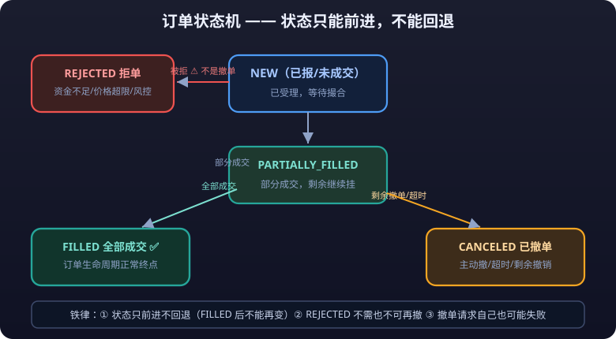

# 04 · Trading Interfaces and Order Lifecycle: The Heart of the System

> Mistakes in the market data module cost data quality; mistakes in the trading module cost real money. The trading interface is the part of the whole integration system that **least tolerates trial and error**: duplicate orders, un-cancellable orders, corrupted state, out-of-order reports — every one of them burns cash directly.
>
> This article starts with interface shapes and works through order types, the state machine, matching principles, lifecycle management, trade reports, reconciliation, and rate limits, ending with a bug list distilled from years of integration scars.

---

## 1. Interface Shapes

| Shape | Characteristics | Fits | Representative |
|---|---|---|---|
| REST | Request-response, naturally idempotent for queries; order submission needs "client order ID" idempotency | Low-frequency order submission, queries, reconciliation, admin operations | Binance REST, OKX REST, ordinary brokerage interfaces |
| WebSocket | Long-lived, full-duplex, callback-style push; fits order reports and account updates | Crypto report subscriptions, real-time frontend state | Binance WS user data stream, OKX WS |
| FIX | The financial industry's standard text protocol, fixed field dictionary, widely used between institutions | Overseas markets (CME etc.), institutional connectivity | CME FIX/FAST |
| CTP proprietary binary | C++ DLL, struct messages, callback model; the domestic OMS de facto standard | The mainstream domestic futures path | CTP (see [02-exchanges-oms.md](exchanges-oms.md)) |

**Selection advice**:

- Submit orders via REST (crypto) / OMS API (domestic) — queries, amendments, and cancels all have clean request-response semantics, which makes timeout-retry and idempotency tractable.
- Reports must arrive over a push channel (WS/callbacks); **never poll for reports** — polling's latency and missed-order risk are unacceptable in trading.
- FIX appears only in overseas institutional settings; teams touching it for the first time should simulate the protocol before going live.

---

## 2. Order Types at a Glance

| Order type | Definition | Fits |
|---|---|---|
| **<mark>Limit order</mark>** (Limit) | Fill at the specified price (or better); fill not guaranteed | The default choice for most strategies; T+1 / price amendment supported |
| Market order (Market) | Fill immediately at the current best price; price not guaranteed | Fast exits, instruments with good **liquidity**; **domestic futures have no standard market order** (some OMSs implement "market converted to limit"; per OMS rules) |
| **<mark>Stop-loss</mark>** order (Stop) | Converts to market/limit once the trigger price is hit | Breakout entries, risk exits |
| Stop-limit order (Stop-Limit) | Converts to limit after trigger; the **spread** is protected but may not fill | Want a stop but fear **<mark>slippage</mark>** |
| IOC (Immediate-or-Cancel) | Partial fill allowed, remainder canceled immediately | Sniping entries, **arbitrage** legs |
| FOK (Fill-or-Kill) | Either fill entirely or cancel entirely | Baskets / combination orders, hard constraint on arbitrage legs |
| Iceberg order (Iceberg) | Expose only part of the quantity, hide the rest | Splitting large orders, avoiding impact |
| Conditional order (Conditional / OCO) | A group of conditional orders: when one triggers, the rest auto-cancel | **<mark>Take-profit</mark>** + stop-loss both resting; automated exits |
| Best-level order (counterparty's best level) | Submit at the counterparty's best level; unfilled remainder canceled or kept | Common A-share market order types (e.g., "counterparty's best five levels, fill-and-kill the rest"; per exchange rules) |

> Two notes: ① Crypto exchange order type names and behaviors (e.g., Binance `STOP_LOSS_LIMIT`, `TAKE_PROFIT_MARKET`) differ greatly from domestic futures — **define the mapping per the exchange documentation one by one**; ② whether the OMS supports stop-loss orders at all, and what they convert into after trigger, **follows the OMS implementation** — many domestic OMSs do not support exchange-level stop orders and the client must watch prices and trigger by itself (one of the risk module's duties).

::: danger 💀 Domestic OMSs don't support exchange-level stop orders — the client must watch them itself
**Many domestic OMSs do not support exchange-level stop orders; the client must watch the price and trigger them itself.** Relying on the OMS to provide stop orders is handing your life to the other side — the moment the OMS risk layer fails, your stop is just "a line of code". Implement it inside your own system's risk gate.
:::

---

## 3. Order State Machine

Regardless of exchange/OMS, the underlying order states reduce to this diagram (state names follow common exchange enums; each exchange's documentation prevails):



**Key states and failure paths**:

| State | Meaning | Typical trigger |
|---|---|---|
| NEW | Order accepted, awaiting matching | Normal submission |
| PARTIALLY_FILLED | Partially filled; remainder still resting | Large orders filling in slices |
| FILLED | Fully filled | Normal |
| CANCELED | Canceled | Manual cancel, timeout auto-cancel, remainder canceled after partial fill |
| REJECTED | Rejected — **never became an order** | Insufficient funds, price out of range, instrument suspended, invalid parameters, rate limit exceeded |
| EXPIRED (common on crypto) | Canceled at expiry without filling | timeInForce was set |

**Engineering iron rules**:

1. **States only move forward, never backward**: NEW → FILLED is legal; after FILLED an order can never become anything else. Treat any "state rollback" report as an anomaly (alert + freeze the order).
2. **REJECTED is not a cancellation**: a rejected order needs no cancel and **cannot** be canceled; many bugs come from "running the cancel flow after receiving REJECTED".

::: danger 💀 Duplicate orders come from blind resends after timeout
**Timeout-retry strategy: order request times out → query first, then decide (query-first).** "Resend directly on timeout" is forbidden — it is the number one source of duplicate orders. One team's retry logic had no idempotency, and a single network hiccup filled the same order 30 times.
:::
3. **Cancels have states too**: a cancel request can likewise fail (the order just filled) or be rejected; cancel reports (`OrderCancelRejected` / cancel failed) must be handled the same way.

---

## 4. Matching Principles

### 4.1 Price priority, time priority

The core rule of continuous trading: **price priority (higher bids / lower asks fill first); at equal prices, first come first served (time priority)**. This determines:

- A limit order's fill certainty depends on your position in the queue — at the same price, whoever rested first fills first.
- A **<mark>market order</mark>**/stop order fills at the counterparty's best price in the queue, which can be far worse than your mental price.

### 4.2 Call auction vs continuous trading

- **Call auction** (domestic pre-open): concentrates matching into a single opening price; a single fill price — all buys above and sells below the opening price fill at the opening price.
- **Continuous trading** (during the session): tick-by-tick matching, price moves in real time.
- Why it matters for integration: **some interfaces behave differently during the call auction** (e.g., domestic futures call auctions reject market-type orders; crypto has no call auction concept) — code must branch per exchange rules.

### 4.3 Market makers and order book matching differences

- Futures/stock markets: order book matching; whether you have a counterparty depends on book depth.
- Crypto exchanges: also order book matching, but some venues offer market-maker incentives on specific pairs, and "take-profit/stop-loss" conditional triggers are implemented exchange-side — **whether the trigger lives at the exchange or in the client directly decides whether your order can move while you are disconnected**.

---

## 5. Order Lifecycle Management

### 5.1 Standard flow

```text
Strategy/user submits intent (instrument, side, quantity, price)
        │
        ▼
Risk pre-trade checks (see 05) — fail → blocked; never enters the order path
        │
        ▼
Create local order (assign local order ID clientOrderId)
        │
        ▼
Call the exchange interface to submit (carrying clientOrderId)
        │
        ▼ request timed out?
        ├── yes → query order status (idempotent confirmation), then decide
        │          "resend / cancel request / mark unknown"
        └── no  → await reports
        ▼
Reports drive state machine updates (NEW → PARTIALLY → FILLED / CANCELED / REJECTED)
        │
        ▼
Trade reports stored + notify strategy + notify frontend
```

### 5.2 Idempotency design (the most important part)

- **Client order ID (clientOrderId / ClientID)**: every order request must carry a globally unique local order ID; the exchange binds it to the order. When retrying the same order, use the **same** clientOrderId — the exchange deduplicates on it (support varies; per exchange documentation), eliminating "network timeout resend creates two orders".
- **Cancel idempotency**: cancel requests for the same order likewise need a "cancel request ID" for deduplication; duplicate cancels return an error on some exchanges (meaning already-canceled / not-found) — treat that as "idempotent success", not as an exception.
- **Timeout-retry strategy**: order request times out → **query first, then decide** (query-first). "Resend directly on timeout" is forbidden — it is the number one source of duplicate orders.

### 5.3 Local order ID ↔ exchange order ID mapping

- Before submission: the local order ID (clientOrderId) only needs local uniqueness.
- After submission: the exchange returns its order ID (orderId); you must keep a **bidirectional mapping** persisted — every later query, cancel, and reconciliation uses the exchange order ID.
- Lose the mapping and you can neither cancel nor reconcile — so **persist the mapping the moment the submission returns**; write to the database first, respond to the user second.

---

## 6. Trade Report Handling

### 6.1 Per-trade vs batch reports

- **Per-trade reports** (order + trade pushed separately): first the order state change, then the fill details (one order with multiple partial fills pushes multiple trades). **Order reports and trade reports are two different things**: `OnRtnOrder` says "the order's state", `OnRtnTrade` says "how much actually filled at what price".
- **Batch reports** (common on crypto): one event carries multiple fills/state changes; handle idempotently (the same report may be re-pushed after a reconnect).
- Handling principle: **book positions and funds from trades; book state from orders**; align the two by timestamp/sequence number, and self-heal out-of-order cases under the "states only move forward" constraint.

### 6.2 Tick-level fills vs "last traded price"

- **Tick-level fills** (trade-by-trade reports): the exact price, quantity, and time of every fill — the basis for booking positions, costs, and slippage analysis.
- **"Last traded price"** (the latest price in a market data snapshot): an aggregate of the market data layer; **not a cost price**, and not the price your fill got.
- Common mistake: booking fills at the market's last price → reconciliation never balances. **Costs come from reports, never from market data.**

::: warning ⚠️ Costs come from reports, not market data
**Booking fills at the market's last price → reconciliation never balances. Costs come from reports, not market data.** Tick-level trade reports are the basis for booking positions, costs, and slippage analysis; the "last traded price" in a market data snapshot is an aggregate of the market data layer and must not be used as a cost price.
:::

---

## 7. Reconciliation Mechanism

```text
Client local state (positions/funds/orders)
        │
        ▼  periodic (daily after close + intraday sampling)
Exchange/OMS state (query interface)
        │
        ▼
Item-by-item comparison: position qty/avg price, fund balance,
today's order count, fill count
        │
        ▼
Discrepancy → tiered handling: self-healable (missed report → re-pull)
        fixed automatically; not self-healable (money mismatch) →
        freeze related trading + manual intervention
```

| Reconciliation scenario | When | Handling |
|---|---|---|
| Same-day orders/fills | After close each trading day | Pull all of the day's orders and fills, compare item by item with local records; backfill discrepancies as missed reports |
| Positions | Daily + intraday sampling | Local positions vs OMS positions; on mismatch, suspend trading that contract first |
| Funds | Daily | Investigate balance, frozen, and fee discrepancies one by one |
| Restart recovery | After process restart | Pull the day's full orders/fills/positions to **rebuild local state**, then resume automated trading (no order submission during recovery) |

> Reconciliation is not a launch-day ceremony but a **daily automated mechanism with alerts on discrepancies**. When reconciliation fails to balance, the only correct action is **stop the related trading first, then investigate**.

---

## 8. Rate Limits and Concurrency

### 8.1 rate limit rules

| Exchange | Typical limits (official documentation prevails) |
|---|---|
| Binance | Weight-based: each request consumes weight against a per-minute budget (e.g., 6000 weight/min); queries and orders cost different weights |
| OKX | Per-second/per-minute request limits, tiered by endpoint |
| CTP and other OMSs | Usually no published fixed values, but high-frequency order submission triggers OMS/exchange "abnormal trading behavior" monitoring (cancel rate, order-to-cancel ratio out of range) |

### 8.2 Handling strategy

- **Queue**: a global request queue + token bucket / sliding window limiter; keep the request rate inside the limit — queue rather than exceed.
- **Backoff**: on 429/rate-limit errors → exponential backoff retry; do not stack requests while backing off.
- **Tiered limiting**: order-type requests outrank query-type; a failed query must not affect the order path.
- **Multi-account concurrency control**: with multiple trading accounts, each account has its own limit while a global queue provides the backstop; prevent "one account rate-limited → whole system times out → reports pile up".

### 8.3 Rate limits and market data

- Subscription requests share the rate-limit pool with trading requests on some exchanges; a failed market data subscription then drags down trading — subscription management should reuse connections and minimize subscribe requests.

---

## 9. Common Integration Bug Checklist

| # | Bug | Cause | Fix |
|---|---|---|---|
| 1 | Duplicate orders | Direct resend after timeout, no idempotency | clientOrderId idempotency + query-first retry |
| 2 | Duplicate cancels | No idempotency key on cancels, or cancel sent again while the report was in flight | Dedup by cancel request ID + treat as idempotent success |
| 3 | Lost state | Some report type unhandled (cancel-reject, expiry); local state stuck at the old value | Full state machine path coverage + daily reconciliation as backstop |
| 4 | Out-of-order reports | Multi-threaded report handling, or old reports interleaving with new after reconnect | One connection one consumer; sort by timestamp/sequence; states only move forward |
| 5 | Booking at market price | Cost taken from last price instead of trade reports | Costs come only from trade reports |
| 6 | Rejection treated as cancellation | Cancel flow still executed after REJECTED | State machine distinguishes REJECTED / CANCELED |
| 7 | Flying blind after restart | Automated trading resumed right after process restart with stale local state | Rebuild state first (pull the day's orders/positions), then resume |
| 8 | Rate-limit meltdown | Everything retried after being rate-limited; avalanche | Backoff + queueing + tiered limiting |
| 9 | Call auction window confusion | Order behavior not branched by exchange session rules | Trading calendar + session state machine (see 02 section 9.3) |
| 10 | Invalid order ID format | clientOrderId used disallowed characters / too long | Validate fields per the exchange documentation before sending |

---

## Risk Warning

::: warning ⚠️ Risk Warning
Incidents at the trading interface are usually "high frequency × stacked errors": one team misconfigured the price decimals in order parameters at launch and fired thousands of absurdly priced valid orders in a millisecond loop before anyone noticed, by which point they could not all be canceled; another team's retry logic had no idempotency, and a single network hiccup filled the same order 30 times. Remember: **every automatic retry must query-confirm first**; **every parameter change must be validated in simulation and then trial-run with small capital**; changing code on go-live day is forbidden. Real disasters are rarely about "how bad one bug was" — they are about "how fast the wrong code ran". Save the speed for the correct system, and install the brakes ahead of every error (risk controls in [05-risk-systems.md](risk-systems.md)).
:::
