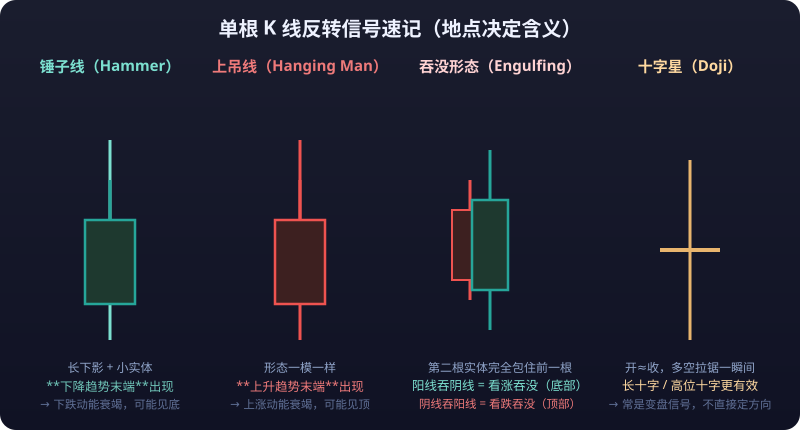
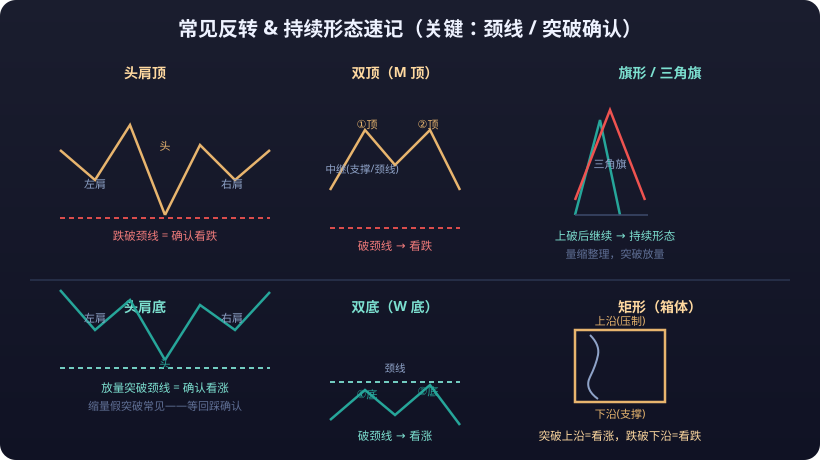

# 01 · Candlestick Patterns

> Candlestick patterns are the most "visual" language of technical analysis: how long a candle is, where its wicks point, and what shape a few candles form together have all been assigned meaning. This article walks through the common patterns across four levels — "single candle → reversal combinations → continuation combinations → gaps" — with diagrams and confirmation/failure conditions for each.

::: tip 💡 Master Principle
**Remember one master principle first: <mark>a pattern is a "description", not a "prophecy"</mark>.** A pattern's bullish implication only holds after it is confirmed by subsequent price and volume.
:::

---

## 1. Single-Candlestick Patterns

### 1.1 Hammer



**Pattern**: A small body at the top of the candle; an extremely long lower wick (usually ≥ 2× the body); little to no upper wick. Either color works; a bullish candle (close > open) is more reliable.

```text
   ┌─────────┐    ← small body at the top (bullish candle preferred)
   │  body   │
   └────┬────┘
        │
        │      ← lower wick ≥ 2× the body
        │
        └────  ← low of the session
```

**Where it appears**: At the end of a downtrend (key: it must appear at a low).

**Implication**: Bullish reversal. The long lower wick means sellers pushed price very low intraday, but buyers pulled it back before the close — a failed bearish attack and a sign of exhausted selling pressure.

**Confirmation**: The next candle closes bullish, above the hammer's body, with volume expanding versus the prior period.

**Failure scenarios**:
- Appearing mid-uptrend or at highs, it is not a hammer (see "Hanging Man" below).
- A lower wick that is not long enough (< 2× the body) is just an ordinary candle — meaningless.
- If the next day keeps falling on heavy volume, the hammer fails — that lower wick was just short covering, not a reversal.
- Bottom-fishing on the left side: going all-in the moment you see a hammer is the most common way to die. A single candle inside a trend is highly likely to be engulfed outright — you must wait for confirmation.

### 1.2 Hanging Man

**Pattern**: Exactly the same shape as the hammer (small body on top, long lower wick below), but the **location is inverted** — it appears at the highs of an uptrend.

```text
   ┌─────────┐
   │  body   │
   └────┬────┘
        │
        │      ← same shape
        │
        └────
```

**Implication**: Bearish reversal. The long lower wick shows heavy selling occurred intraday and was only temporarily bought back — a sign of buyer exhaustion and emerging selling pressure.

**Confirmation**: The next candle closes bearish and breaks below the **<mark>hanging man</mark>**'s body; or the next day opens sharply lower.

**Failure scenarios**:
- Appears at the highs but the next day closes bullish at a new high — it was just a shakeout, and the hanging man fails.
- "Hanging man + shrinking volume" produces especially many false signals: low volume means selling pressure was never heavy to begin with.

### 1.3 Engulfing

**Pattern**: Two candles. The second candle's body **completely engulfs** the first candle's body (wicks can be ignored). A **<mark>bullish engulfing</mark>** = the second candle is a big bullish candle wrapping the preceding bearish one; a bearish engulfing = a big bearish candle wrapping the preceding bullish one.

```text
Bullish engulfing (at a low)      Bearish engulfing (at a high)
  1st      2nd                     1st      2nd
┌────────┐  ┌───────────┐   ┌───────┐   ┌────────────┐
│ bearish│  │ ┌──────┐  │   │bullish│   │ ┌────────┐  │
│ (small)│  │ │bearish│ │   │(small)│   │ │bullish │  │
└────────┘  │ └──────┘  │   └───────┘   │ └────────┘  │
            └───────────┘               └────────────┘
  2nd bullish body engulfs the 1st     2nd bearish body engulfs the 1st
```

**Where it appears**: Bullish engulfing at the end of a decline; bearish engulfing at the end of a rally.

**Implication**: A "sudden handover" of power between bulls and bears. Bullish engulfing means buyers reversed their weakness and erased the entire prior day's loss in one session; bearish engulfing is the mirror image.

**Confirmation**:
- Volume **expands significantly** during the engulfing (especially for bullish engulfing, expansion adds credibility);
- The candle after a bullish engulfing continues to close bullish;
- Engulfing patterns are more effective at key locations (e.g., support, near a prior low).

**Failure scenarios**:
- A small bearish candle "engulfed" by a big bullish candle mid-uptrend may just be normal acceleration into a top.
- Engulfing patterns appear in droves inside ranging zones (both fade trades get engulfed), badly distorting the signal.
- An engulfing without volume expansion, in the middle of a trend, is noise.

### 1.4 Doji

**Pattern**: Open and close are nearly identical (the body is tiny or absent), leaving only upper and lower wicks. The longer the wicks, the stronger the "indecision" meaning of the **<mark>doji</mark>**.

```text
       │
   ────┼────     ← open ≈ close
       │
```

**Where it appears**: Anywhere, but a doji at the **end of a trend (high or low) is the most valuable**.

**Implication**: Neutral, leaning reversal. A doji means bulls and bears finished the session in a draw — mid-trend this is a "pause"; at trend's end it is "exhaustion". A doji at a low (morning star) is bullish; a doji at a high (evening star) is bearish.

**Confirmation**: A doji on its own has almost no directional meaning — **you must wait for the next candle to give direction**. The longer the wicks and the heavier the volume, the more credible it is as a top/bottom signal.

**Failure scenarios**:
- Treating a mid-trend doji as a reversal signal — dojis are common inside trends, and many are just continuation pauses.
- If the candle after the doji shows no clear direction, the pattern is void — do not force an interpretation.

### 1.5 Long Upper Wick / Long Lower Wick

The non-extreme version of 1.1 (Hammer) and 1.6 (Shooting Star): a modest body with one wick ≥ 2× the body — a long upper wick at highs is bearish (heavy overhead selling pressure), a long lower wick at lows is bullish (solid buying support below); the meaning matches the two extreme patterns, only with a milder wick ratio. Confirmation and failure scenarios are consistent too: the next day's direction + volume; but be extra careful with **wick-hunt moves** — instantaneous price spikes in extreme conditions leave false wicks, and in strong trends a long upper wick is often simply covered by the next day's bullish candle (late shorts get trapped).

### 1.6 Shooting Star

**Pattern**: A very small body at the bottom of the candle, an extremely long upper wick (≥ 2× the body), and almost no lower wick. The mirror image of the hammer.

```text
      │
      │      ← upper wick ≥ 2× the body
      │
   ┌──┴────┐
   │ body  │    ← small body at the bottom (bearish candle preferred)
   └───────┘
```

**Where it appears**: At the end of an uptrend (at the highs).

**Implication**: Bearish reversal. Intraday, buyers pushed price very high, but the close fell back near the starting point — massive overhead supply and buyer exhaustion. **"Shooting star" and "meteor" are two names for the same pattern** (both "Shooting Star" in English); some terminals also call it the "broom star".

**Confirmation**: The next day closes bearish and breaks below the shooting star's body; volume expansion helps.

**Failure scenarios**:
- Appears at the highs but price goes sideways for days without falling — the pattern fails (after digesting supply sideways, price may keep rising).
- In a strong markup wave, long upper wicks appear repeatedly while price still makes new highs — that is a "short squeeze" trait, not a top; shorting here easily gets squeezed.

---

## 2. Common Reversal Patterns

::: info 📖 The Shared Logic of Reversal Patterns
**"Momentum exhaustion + structural break" at trend's end.** When identifying one, look at the overall structure first (head/tops), then the neckline break, then volume. **The only thing that confirms a reversal is "an effective neckline break" — the pattern itself is always just an alarm.**
:::

### 2.1 Head and Shoulders Top / Bottom



**Pattern**: Three peaks — the middle one highest (the head), the two flanking ones lower (left and right shoulders). The horizontal line connecting the two shoulder lows is the **<mark>neckline</mark>**. Head and shoulders top: the neckline is effectively broken to the downside, confirming a top reversal. Head and shoulders bottom (inverse head and shoulders): the neckline is effectively broken to the upside, confirming a bottom reversal.

```text
Head and shoulders top:          Head and shoulders bottom (inverse):
      head
     ┌──┐
 left ┘  └┐    right              │  left     head    right
 ┌┐       └┐   ┌┐                 │  ┌┐      ┌──┐     ┌┐
┌┘└┐       └┐ ┌┘└┐               │ ┌┘└┐    ┌┘  └┐   ┌┘└┐
│   │        └─┘   │              │┌┘   └──┐┘    └───┘   └┐
┴───┴──────────────┴── neckline   │┘      └──────────────┘ neckline
```

**Where it appears**: After a prolonged uptrend/downtrend.

**Implication**: Head and shoulders top is bearish (end of a bullish move); head and shoulders bottom is bullish (end of a bearish move). Measured target: the vertical distance from the head to the neckline — after the break, price often travels roughly the same distance again.

**Confirmation**:
- Head and shoulders top: **volume expands** when the neckline breaks; after the break there is often a pullback to the neckline (a pullback that fails to reclaim it = secondary confirmation).
- Head and shoulders bottom: the upside break must come on **clearly expanded volume** (a low-volume break is less credible); after the break, price retests the neckline as support.
- Right-shoulder volume is usually smaller than left-shoulder volume (bullish/bearish momentum decaying).

**Failure scenarios**:
- **<mark>False breakout</mark>**: price breaks the neckline by less than 3% and snaps back (or recovers within 3 days of the break) — a false break; the pattern is void.
- Left-side traders who short on a "suspected head" often die in the final rally of the head and shoulders top — **you must wait for the neckline break**.
- Inside triangles or wide ranges, plenty of "shrunken head-and-shoulders" shapes appear — most are noise.

### 2.2 Double Top (M Top) / Double Bottom (W Bottom)

**Pattern**: Price rallies twice to similar highs (a **<mark>double top</mark>**) with a low in between; or probes down twice to similar lows (a **<mark>double bottom</mark>**). The low between the two peaks (or the high between the two troughs) is the neckline.

```text
Double top (M):                Double bottom (W):
    ┌──┐      ┌──┐            │   ┌──┐      ┌──┐
   ┌┘  └┐    ┌┘  └┐           │  ┌┘  └┐    ┌┘  └┐
  ┌┘    └────┘    └┐          │ ┌┘    └────┘    └┐
 ─┴─────────────────┴─ neck   ─┴──────────────────┴─ neckline
```

**Where it appears**: After a prolonged rise/fall.

**Implication**: Double top bearish, double bottom bullish. If the second top/bottom comes on clearly lighter volume than the first (momentum exhaustion), the reversal odds are higher. Measured target ≈ the vertical distance from the top/bottom to the neckline.

**Confirmation**: An effective neckline break + volume expansion; confirmation from the retest/pullback after the break.

**Failure scenarios**:
- Two peaks too close together or too small in shape — just short-term oscillation, not a pattern.
- A double bottom breaking out on **shrinking volume** easily evolves into "false breakout, retest, then fall again" — or even a multiple top.
- Drawing conclusions before the right-side neckline breaks is left-side top/bottom guessing — **a double top can become a triple top, a double bottom a triple bottom**; never pre-assume before the pattern completes.

### 2.3 Triple Top / Triple Bottom

**Pattern**: Three similar highs/lows, with the neckline connecting the intermediate pullback/bounce points. Essentially a reinforced double top/bottom — rarer but more reliable.

```text
Triple top:                     Triple bottom:
  ┌──┐  ┌──┐  ┌──┐               ┌──┐  ┌──┐  ┌──┐
 ┌┘  └┐┌┘  └┐┌┘  └┐             ┌┘  └┐┌┘  └┐┌┘  └┐
┌┘    └┘    └┘    └┐           ┌┘    └┘    └┘    └┐
┴─────┴─────┴──────┴ neckline  ┴─────┴─────┴──────┴ neckline
```

**Where it appears**: At the end of large-degree trends.

**Implication**: Same as double top/bottom, but three failed attacks on the same price show that level is the "battlefield" between bulls and bears; once it breaks, momentum releases more thoroughly.

**Confirmation**: Same as double top/bottom — neckline break + volume + pullback confirmation. The third top/bottom usually comes on the lightest volume.

**Failure scenarios**:
- If the neckline still holds after three attacks, the pattern becomes a wide box range — abandon pattern trading and switch to fading the range or staying out.
- In ranging markets, a "triple top" is often simply broken by the fourth attack — shorts get trapped.

### 2.4 Rounding Top / Rounding Bottom

**Pattern**: Price slowly and smoothly carves an arc-shaped top/bottom structure, like a pot lid or pot base. Tops usually come with gradually shrinking volume; bottoms with gradually expanding volume.

```text
Rounding top (lid):            Rounding bottom (bowl):
    ┌────────┐                   │
 ┌──┘        └──┐               ┌┴────────────┴┐
┌┘              └┐             ┌┘              └┐
│                │            ┌┘                └┐
└──────────────  └           ─┴──────────────────┴──
```

**Where it appears**: After long, slow bull/bear markets.

**Implication**: Rounding bottom bullish (the morphological expression of slow accumulation); rounding top bearish (slow distribution). Because these are "slow" patterns, they usually correspond to large-degree moves.

**Confirmation**:
- Rounding bottom: **clearly expanding volume** on the right-side rise (the left-side decline shrinks); a volume-backed break above the high at the start of the left side = confirmation.
- Rounding top: volume on the left, dry-up on the right; breaking the right-side low confirms.

**Failure scenarios**:
- Rounding patterns take a very long time (weeks to months); any single volume spike with a sharp drop/rise mid-way can destroy the pattern outright.
- If the right side of a rounding bottom stalls on shrinking volume, it easily becomes a "bowl-box" hybrid and the breakout recedes into the distance — the time cost of holding through it is enormous.
- Rounding patterns look beautiful in hindsight; before the "rim" actually forms, all you are looking at is an ordinary sideways stretch.

### 2.5 V-Shaped Reversal

**Pattern**: After a sharp drop (or spike), price reverses sharply the other way without any consolidation, tracing a pointed V. The V-top (inverted V) works the same way.

```text
V bottom (sharp fall left, sharp rise right):
     │      ╱
     │     ╱
     │    ╱
     │   ╱    ← turning point (often with a high-volume long lower wick)
     │  ╱
     ╲ ╱
      ╲   ← sharp decline
```

**Where it appears**: After panic sell-offs or euphoric spikes (e.g., black swans, liquidity crises, extreme-sentiment moves).

**Implication**: Reversal. The turning point usually comes with enormous volume and violent wicks (long lower/upper wicks).

**Confirmation**:
- Volume spike at the turning point (panic supply exhausted = selling pressure dried up);
- After the reversal, price quickly recovers the prior days' losses and pullbacks hold above the low/high;
- V reversals are more common in spot and crypto markets (no price limits, or fewer of them).

**Failure scenarios**:
- The V reversal is **the hardest pattern to identify in advance** — before the turning point, all you see is a one-way fall; any "bottom fishing" is a guess.
- Left-side bottom-fishers die inside the V: catching falling knives in a crash means the final leg down can far exceed imagination (in **<mark>leveraged</mark>** markets, direct **<mark>liquidation</mark>**).
- If volume dries up quickly during the bounce after a V reversal, it is most likely just a "dead-cat bounce" and price will retest the low.

---

## 3. Continuation Patterns

::: tip 💡 The Point of Continuation Patterns
Continuation patterns appear mid-trend and mean "the trend catches its breath, then continues". The point of recognizing them: **they tell you not to rush to close your with-trend positions, and not to fight the trend for counter-trend scalps.**
:::

### 3.1 Flag / Pennant

**Pattern**: A **<mark>flag</mark>** = after a steep flagpole (a rapid rally/selloff), price enters a tight parallel channel sloping against the flagpole's direction (the flag). A pennant = the flag is a small, rapidly narrowing triangle.

```text
Bull flag (steep pole up, flag drifting slightly down):
        ╱╱╱
      ╱╱╱ ╱─────────╱   ← flag (shallow pullback channel)
    ╱╱╱ ╱─────────╱
  ╱╱╱     ← flagpole
```

**Where it appears**: Mid-strong-trend (after a sharp rally/selloff).

**Implication**: Trend continuation. The flag is a technical correction of overbought/oversold conditions; once the correction completes, price most likely continues in the original direction.

**Confirmation**: The flag breaks in the original trend's direction; the break comes with volume; volume inside the flag usually declines.

**Failure scenarios**:
- If the flag consolidates too long (longer than the pole took), the pattern may fail and become a box or a reversal.
- A bearish break of the flag (in a bull flag) on volume = trend reversal alarm; longs must exit — do not cling to "it should keep rising".

### 3.2 Triangles (Symmetrical / Ascending / Descending)

**Pattern**: A triangular zone formed as the price range gradually narrows. Symmetrical triangle (two edges converging toward the middle), ascending triangle (flat upper edge, rising lower edge), descending triangle (flat lower edge, falling upper edge).

```text
Symmetrical:             Ascending:              Descending:
     ╱╲                  ┌──────┐               ╲
    ╱  ╲             ╱──┘      └──╱          ╱──┘ └──╱
   ╱    ╲           ╱              ╱        ╱      ╱
  ╱      ╲        ╱← rising floor  ╱      ╱── flat floor ╱
 ╱────────╲     (break up = bullish)   (break down = bearish)
```

**Where it appears**: Anywhere — but the pattern itself does not decide direction; **the breakout direction is the direction**.

**Implication**: A triangle is a "converging disagreement, coiling for a move" pattern. Symmetrical triangles have no directional bias; ascending triangles lean bullish (the flat top is a defined supply level — once it finally breaks on volume, the release is powerful); descending triangles lean bearish.

**Confirmation**:
- The breakout direction is decided by the side that breaks on volume — volume is the key;
- Breakouts closer to the apex are less reliable (the range is already spent); breakouts before roughly the 2/3 point are more valuable.

**Failure scenarios**:
- If a triangle stays sideways too long (over-converged), the eventual breakout often doesn't travel far — "the longer the base, the higher the rise" only holds with volume support.
- Guessing direction mid-triangle: a 50% proposition — same as a coin flip, but without the zero-commission advantage.
- A false breakout that falls back inside the triangle, followed by a break in the opposite direction (the "double breakout trap") — this is why you must wait for the close to confirm.

### 3.3 Rectangle (Box)

**Pattern**: Price oscillates back and forth between two near-horizontal parallel lines, like a box. Bulls and bears repeatedly exchange positions inside this **<mark>rectangle (box)</mark>** range.

```text
Rectangle (box):
┌──────────────────────────────┐   ← upper edge (resistance)
│   ╱╲  ╱╲  ╱╲  ╱╲           │
│  ╱  ╲╱  ╲╱  ╲╱  ╲          │
│                             │
└──────────────────────────────┘   ← lower edge (support)
```

**Where it appears**: Mid-trend (continuation box) or at trend's end (reversal box).

**Implication**: Continuation rectangle = after consolidation, a break in the original direction; reversal rectangle = after a long box, the breakout direction is the true direction. Before the break, the box interior is a battleground for fading the edges.

**Confirmation**: A volume-backed break of the box boundary + retest confirmation; the longer and more evenly traded the box, the more meaningful the break.

**Failure scenarios**:
- Frequent "false breaks of both edges" inside a rectangle is the classic signature of a ranging market — **<mark>stop-loss</mark>** orders get harvested again and again.
- Falling back into the box 2–3 days after the breakout = false break; chasers are trapped.
- A "breakout" at the edge of a large box without adequate volume is most likely a bull/bear trap.

### 3.4 Wedges (Rising / Falling)

**Pattern**: Two boundaries sloping in the same direction but gradually converging. A **<mark>rising wedge</mark>** (both edges slope up) is usually bearish (momentum exhaustion in the mid-to-late stage of a bull market); a falling wedge (both edges slope down) is usually bullish.

```text
Rising wedge (bearish):      Falling wedge (bullish):
      ╱      ╱               ╲      ╲
     ╱    ╱                 ╲    ╲
    ╱  ╱                   ╲  ╲
   ╱╱                     ╲╲
```

**Where it appears**: Rising wedges are common at the end of long rallies (terminal acceleration in the form of a false breakout); falling wedges at the end of long declines.

**Confirmation**: Volume expansion when the lower/upper edge breaks; declining volume inside the wedge.

**Failure scenarios**:
- Price frequently grazes the wedge edges and then slips out — pattern calls are difficult and need volume confirmation.
- A falling wedge mid-downtrend may just be the "slow leg" of a continuation; if the breakout fails, the crash resumes — a falling wedge is only bullish on the condition that it forms at the end of a large-degree decline.
- In strong coins/stocks, a rising wedge can evolve into a "curved acceleration", breaking straight up and squeezing shorts.

### 3.5 Diamond

**Pattern**: The first half looks like an expanding broadening formation (widening oscillation), the second half like a narrowing triangle — a diamond overall. It usually appears at large-degree tops and is a **bearish reversal-continuation hybrid** (bearish in most cases).

```text
Diamond:
     ╱  ╲
    ╱      ╲
   ╱          ╲
  ╱  ╱    ╲   ╲
     ╲      ╱
```

**Where it appears**: Wide, high-level oscillation after a long advance.

**Implication**: The widening expansion represents violent disagreement (the broadening mouth); the convergence means one side finally wins. A break below the diamond's lower edge confirms the bearish case; an upside break is theoretically possible but less likely.

**Confirmation**: Volume expansion on the downside break; volume inside the diamond usually expands first, then shrinks.

**Failure scenarios**:
- Diamonds are hard to draw precisely on a chart — different people draw different diamonds. An extremely subjective pattern, easily rationalized in hindsight.
- If a post-break retest fails to hold below the lower edge and price re-enters the diamond, the pattern is void.

---

## 4. Gap Theory

> A **<mark>gap</mark>** = a "jump" blank zone in price between two adjacent candles (no trades at all in that range). Gap theory mainly applies to stocks (especially A-shares, where price limits and overnight sessions make gaps more common); futures/crypto trade nearly 24 hours, so gaps are rarer and shorter-lived, and their reference value is discounted.

### 4.1 The Four Types of Gaps

| Gap type | Where it appears | Meaning | Filled? |
|---|---|---|---|
| Common gap | Inside a range | Meaningless, pure noise | Filled quickly (almost always) |
| Breakaway gap | End of a long consolidation/pattern | Marks the official trend launch | If filled, the breakout failed |
| Runaway gap (continuation) | Mid-trend | Trend accelerating | Usually not filled |
| Exhaustion gap | Trend's end | Final thrust; momentum about to run out | Filled quickly (common at tops) |

```text
Breakaway gap → Runaway gap → Exhaustion gap
      ↓            ↓           ↓
╱                        ╱
╱  ╱                 ╱  ╱
╱ ╱  ╱  ╱    ╱  ╱  ←── exhaustion gap (followed by a crash that fills it)
╱╱╱╱
↑ breakaway gap (gap on volume)  ↑ runaway gap (trend continuation)
```

### 4.2 Key Points for Each Gap

- **Breakaway gap**: Paired with volume expansion + a break of a key level (neckline, box top), it is one of the strongest confirmations of an "effective breakout". A breakaway gap unfilled for 3 days = valid; quickly filled = false breakout, signal void.
- **Runaway gap**: A gap mid-trend represents buying/selling pressure being handed off to new participants; the gap usually becomes support/resistance for the subsequent move. A runaway gap means the trend is still healthy — do not exit early.
- **Exhaustion gap**: An accelerating gap at trend's end, quickly followed by the gap filling and a reversal — common in the final markup/markdown wave. **An exhaustion gap must be confirmed by the fill; the day of the fill is often the turning day.**

### 4.3 Failure Scenarios in Gap Trading

- A breakaway gap filled within 2–3 days traps breakout chasers in a false break — you must combine volume and closing confirmation.
- Panic gaps (crash gaps) are "exhaustion-type" in nature, but in leveraged markets they first liquidate the dip-buyers before bouncing.
- Do not apply A-share gap theory verbatim to crypto: 24-hour trading + high volatility + no price limits mean gaps are often hourly or even minute-scaled — wrong degree, no meaning.

---

## Limitations and Pitfalls

1. **Patterns only complete in hindsight.** By the time you "see" a head and shoulders top, price has usually already fallen a good distance. The built-in dilemma of pattern analysis is the trade-off between confirmation and lag: confirm too late and there is no meat left; confirm too early and it is gambling.
2. **Pattern success rates are far below the legend.** Classic textbook patterns (such as the head and shoulders top) have real-world success rates of roughly 50%–60% — barely better than a coin flip — and the statistics depend heavily on subjective identification.
3. **The same chart supports multiple patterns.** Different people see different triangles/head-and-shoulders; the subjectivity of pattern recognition means "patterns" can self-fulfill or self-defeat.
4. **Ranging markets are pattern grinders.** Patterns work in trending markets and nearly all fail in ranges (an extremely high false-breakout ratio). Judge the market regime first, then apply patterns.
5. **Volume confirmation is indispensable.** Without volume, patterns routinely fail outright on illiquid instruments or in thin sessions.

::: tip 🧭 Patterns answer "maybe an opportunity"; a trading system answers "how to participate"
**However beautiful a pattern, without a stop-loss and position control it will still wipe you out.** Patterns only answer "maybe an opportunity"; the [07 · Trading Systems](../trading-system/) chapter answers "how to participate" — treat patterns as entry permits, not entry orders. That is the correct usage.
:::

::: warning ⚠️ Risk Warning
Pattern recognition depends heavily on subjective judgment; no pattern is by itself a reason to enter — confirm your stop-loss level and position size before entering.
:::
