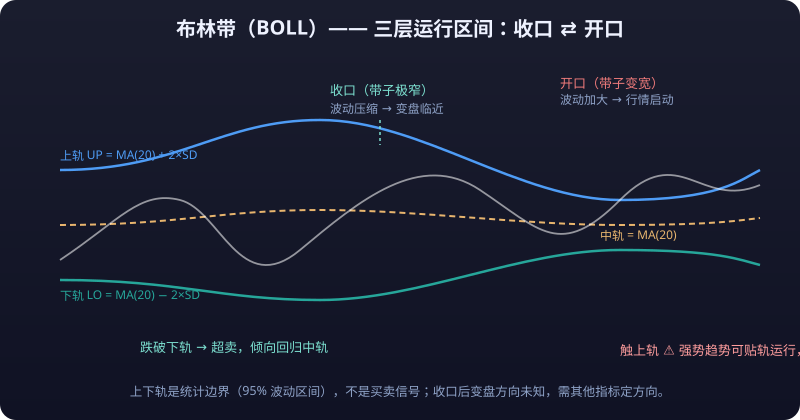

# 02 · Technical Indicators in Depth

> Technical indicators are second-order processing of "price + volume": moving averages are averages of price, MACD is the difference of moving averages, KDJ is the percentile position within a range... **Understanding "what raw material each indicator uses and how many processing steps it takes" matters far more than memorizing formulas** — it determines whether you can see through when an indicator will distort in a given market.

::: tip 💡 One-Sentence Summary
One-sentence summary: **<mark>all indicators lag</mark>.** Indicators are 100% accurate only when "describing history"; they offer zero guarantees when "predicting the future".
:::

---

## 1. Trend Indicators

### 1.1 MA (Moving Average)

**Formula**:

```text
MA(n) = (C₁ + C₂ + ... + Cₙ) / n     (C = close)
```

**Default parameters**: 5 / 10 / 20 / 60 / 120 / 250-day averages (software defaults are often 5/10/20/60). The longer the period, the smoother and the more lagging.

**Core usage**:

| Usage | Description |
|---|---|
| Golden/death cross | Short MA crossing above long MA = golden cross (bullish); crossing below = death cross (bearish) |
| **<mark>Bullish/bearish alignment</mark>** | Short > medium > long (e.g., 5>10>20>60) = bullish alignment, uptrend; the reverse = bearish alignment |
| **<mark>Support/resistance</mark>** | In an uptrend, a retest of the MA that holds = support; in a downtrend, a bounce off the MA = resistance |
| Price-MA deviation | Price stretched far from the MA = excessive **<mark>bias</mark>**; short-term mean reversion likely (read together with the outer Bollinger Bands) |

**Common mistakes**:
- Moving-average **<mark>golden and death crosses</mark>** **get repeatedly slapped in ranging markets** (cross up and price falls, cross down and price rises), because a range has no trend to follow in the first place.
- Moving averages are a "follow-trend tool", not a "bottom-fishing tool": in a bearish alignment, every bounce to the MA is an exit point, not a buy point.
- Short-period MAs (e.g., 5/10) cross constantly on high-volatility instruments — huge signal noise; use longer periods.

### 1.2 EMA (Exponential Moving Average)

**Formula**:

```text
EMA(n) = EMA(prev) + α × (today's close − EMA(prev))
α = 2 / (n + 1)
```

**Default parameters**: 12 / 26 / 50 (crypto markets often watch EMA 20/50/200).

**MA vs. EMA**:

| Item | MA | EMA |
|---|---|---|
| Weighting | All prices equally weighted | Recent prices weighted more |
| Reaction speed | Slow | Fast |
| Lag | Stronger | Weaker |
| Noise | Somewhat less | More |
| Best for | Large-degree slow trends | Medium/short-term, turning-point-sensitive instruments (e.g., crypto) |

**Core usage**:
- Golden/death cross usage is the same as MA, but signals come slightly earlier;
- EMA20 often serves as the short-term trend lifeline; EMA50/200 as the bull/bear divide (price above EMA200 = long-term bullish trend).

**Common mistakes**:
- Assuming "faster" means "more accurate": speed is bought with more false signals — fast and accurate cannot coexist.
- EMA 200 is watched by huge numbers of traders in A-shares/crypto, producing a "self-fulfillment" effect — but self-fulfillment also fails (at the start of a trend change, everyone cuts at once, creating an overshoot).

### 1.3 BOLL (Bollinger Bands)



**Formula**:

```text
Middle band MB = MA(20)
Upper band UP = MB + 2 × SD    (SD = 20-day standard deviation of closes)
Lower band LO = MB − 2 × SD
```

**Default parameters**: 20 days, 2 standard deviations (20/2).

**Core usage**:

| Usage | Description |
|---|---|
| Three bands | Middle band = 20-day MA (direction); upper/lower bands = the statistical band containing ~95% of price action |
| Expansion/squeeze | Expansion (bands widening) = volatility increasing, a move is starting; **<mark>squeeze</mark>** (bands extremely narrow) = volatility compressed, a regime change is near ("a Bollinger squeeze always precedes a big move") |
| Band-exit reversion | Price above the upper band → **<mark>overbought</mark>**, usually reverts to the middle band; below the lower band → **<mark>oversold</mark>**, usually reverts to the middle band |
| Middle-band support | In a trend, price rides the middle band; retests that hold it = healthy trend |

**Common mistakes**:
- **"Touch the upper/lower band = sell/buy" is the biggest mistake**: in a strong trend, price rides along the upper/lower band for extended stretches (one-sided squeeze markets); fading it gets slapped repeatedly. The bands are "statistical boundaries", not "trading signals".
- After a squeeze, a big move is "guaranteed" but **you don't know which way** — other signals must set the direction.
- Bollinger Bands stay permanently squeezed on low-volatility instruments, reducing their value.

---

## 2. Momentum Indicators

> The essence of momentum indicators: quantifying "the speed of the rise/fall". They do not answer "where price is", but "whether the rise/fall still has legs".

### 2.1 MACD (Moving Average Convergence Divergence)


**Formula**:

```text
DIF = EMA(12) − EMA(26)
DEA = EMA(9, DIF)
MACD histogram = 2 × (DIF − DEA)
```

**Default parameters**: 12 / 26 / 9.

**Core usage**:

| Usage | Description |
|---|---|
| Golden/death cross | DIF crossing above DEA = golden cross (bullish); below = death cross (bearish). Golden crosses above the 0 line are most reliable (bull market); death crosses below the 0 line are most dangerous (bear market) |
| 0 line | DIF above 0 = medium-term bullish; below = medium-term bearish |
| Histogram | Shrinking bars = momentum fading (trend may be nearing its end); red bars turning green = bull/bear handover |
| **<mark>Top divergence</mark>** | Price makes a new high but DIF's peak is lower than the previous one = top divergence (rising momentum exhausted, bearish; see below) |
| **<mark>Bottom divergence</mark>** | Price makes a new low but DIF's trough is higher than the previous one = bottom divergence (falling momentum exhausted, bullish) |

```text
Top divergence sketch:
  price       ↗ ↗
        ╱╲ ╱╲          ← price makes a new high
DIF     ╱  ╲╱
      ╱        ← DIF peak lower (didn't follow) → top divergence
```

**Common mistakes**:
- **Divergence can persist for a long time** ("divergence can diverge again"): in strong trends, divergence signals are often simply steamrolled — never treat them as an absolute reversal basis.
- Golden/death crosses appear constantly in ranging markets — high signal noise. MACD suits trending markets, not sideways ones.
- Watching only the histogram and ignoring the DIF/DEA level misses the critical context of where 0 line sits.

### 2.2 KDJ (Stochastic Oscillator)

**Formula**:

```text
RSV = (C − L₉) / (H₉ − L₉) × 100        (relative position within 9 periods)
K = K(prev) × 2/3 + RSV × 1/3
D = D(prev) × 2/3 + K × 1/3
J = 3K − 2D
```

**Default parameters**: 9 / 3 / 3 (RSV period 9; K, D smoothing 3).

**Core usage**:

| Usage | Description |
|---|---|
| Overbought/oversold | K, D values > 80 = overbought; < 20 = oversold |
| Golden/death cross | K crossing above D = golden cross (bullish), more reliable at lows (<20 zone); K crossing below D = death cross (bearish), more reliable at highs (>80) |
| J value | J > 100 = extremely overbought; J < 0 = extremely oversold; when J is stuck ("frozen"), refer to K/D |
| Divergence | K/D top divergence bearish; bottom divergence bullish |

**Common mistakes**:
- **<mark>Freezing (sideways pegging)</mark>**: in strong trends, KDJ stays pegged in overbought/oversold zones for a long time (K/D stuck above 80 or below 20); trading "sell overbought, buy oversold" here gets harvested by the trend repeatedly.
- KDJ is extremely sensitive to short-term price — the noisiest intraday signals. It suits short-term trading, not medium/long-term direction calls.
- A low golden cross is not a sufficient condition for a bottom — in a slow bleed, KDJ can produce several low golden crosses followed by death crosses in a row.

### 2.3 RSI (Relative Strength Index)


**Formula**:

```text
RS = average gain over n periods / average loss over n periods
RSI = 100 − 100 / (1 + RS)
```

**Default parameters**: 14 (6 / 14 / 24 as a common trio).

**Core usage**:

| Usage | Description |
|---|---|
| Overbought/oversold | RSI > 70 = overbought; < 30 = oversold |
| 50 divide | RSI > 50 = bulls in command (strong); < 50 = bears in command |
| Divergence | Top divergence (price new high, RSI not) bearish; bottom divergence bullish |
| Range reference | RSI hovering between 40–60 long term = ranging market; signals stop working |

**Common mistakes**:
- **Freezing, same disease as KDJ**: in one-sided moves, RSI stays above 70 or below 30 for long stretches and "overbought/oversold" signals fail completely (a strong stock's RSI can sit above 90 for a month).
- RSI divergence in trends often "diverges again and again" — same as MACD divergence; use it with price structure.
- Treating 30/70 as absolute thresholds is dogma: high-**volatility** instruments (e.g., crypto) routinely range far wider than 30–70.

### 2.4 CCI (Commodity Channel Index)

**Formula**:

```text
TP = (H + L + C) / 3
CCI = (TP − SMA(TP)) / (0.015 × MD)     (MD = mean absolute deviation of TP)
```

**Default parameters**: 14.

**Core usage**:
- CCI > +100: entered the strong zone (overbought, but strength can persist); CCI < −100: weak zone.
- Falling back below +100 from above = long exit signal; rising back above −100 from below = short exit signal.
- CCI is dimensionless and oscillates around 0 with no fixed ceiling/floor — it expresses "extremeness of deviation from the mean" better than RSI.

**Common mistakes**:
- CCI > 100 does not necessarily mean a top: in trending markets CCI can stay above 200 for a long time — fading it is fatal.
- CCI (14) is sensitive to price noise; too short a period produces messy signals.

### 2.5 WR (Williams %R)

**Formula**:

```text
WR = (Hₙ − C) / (Hₙ − Lₙ) × 100        (position of the close within the n-period range)
```

(Mirror image of KDJ's RSV: high WR = close near the bottom of the range = oversold; the same logic applies to terminals that plot it as 0 ~ −100.)

**Default parameters**: 14 (10 / 6 as a common two-line setup).

**Core usage**:
- WR > −20 (or > 80, depending on the terminal's sign convention) = overbought; WR < −80 (or < 20) = oversold.
- Two-line golden/death crosses follow KDJ logic, but WR is more sensitive and more volatile.

**Common mistakes**:
- High sensitivity brings high noise: WR overbought/oversold signals can fire several times a day — trading them directly = working for the commission.
- Same freezing problem as KDJ/RSI; fails in one-sided markets.

---

## 3. Volume Indicators

### 3.1 OBV (On Balance Volume)

**Formula**:

```text
Bullish close today: OBV = OBV(prev) + today's volume
Bearish close today: OBV = OBV(prev) − today's volume
Unchanged close:     OBV unchanged
```

**Default parameters**: None (a cumulative value, summed from the start date).

**Core usage**:
- OBV rising in step with price = volume-price cooperation, healthy trend.
- **OBV top divergence**: price makes a new high but OBV doesn't = the rise lacks volume support; be alert for a top.
- OBV flattening/rising first at the bottom while price still falls = accumulation signs ("volume leads price").

**Common mistakes**:
- OBV is cumulative; its magnitude depends on history — read only "shape and slope", never absolute values.
- OBV divergence has the same "diverge then diverge again" problem; wait for price-structure confirmation.

### 3.2 VWAP (Volume Weighted Average Price)

**Formula**:

```text
VWAP = Σ(price × volume) / Σ(volume)     (cumulative for the day/period)
```

**Default parameters**: Intraday cumulative (resets each trading day/settlement cycle); terminals usually show today's VWAP by default.

**Core usage**:
- The "today's cost basis" favored by institutional flows: price above VWAP = today's buyers collectively in profit (bullish lean); below = in loss (bearish lean).
- Intraday traders use VWAP as the bull/bear line: retest that holds above VWAP = go long; break below VWAP = flip short.
- The "settlement price" of crypto perpetuals is usually computed as a weighted average over some window — same principle as VWAP.

**Common mistakes**:
- VWAP resets daily; a single day's VWAP alone has little reference value. Multi-period VWAP (weekly/monthly) needs separate setup — do not mix them.
- VWAP is a "cost reference", not "support/resistance"; it generates no buy/sell points by itself — it is descriptive statistics only.

---

## 4. Volatility Indicators

### 4.1 ATR (Average True Range)

**Formula**:

```text
TR = max(today's high − today's low, |today's high − prev close|, |today's low − prev close|)
ATR(n) = n-period average of TR
```

**Default parameters**: 14.

**Core usage**: ATR measures "how much this instrument moves per day on average recently" — the cornerstone of **<mark>stop-loss</mark>** and position sizing:

| Usage | Formula | Description |
|---|---|---|
| Volatility stop | Stop price = entry ∓ k × ATR (k usually 2–3) | Stop distance adapts to volatility: not swept by noise, still protective |
| Position sizing | Position size = per-trade risk amount / (k × ATR) | Converts "how much to lose" into "how much to buy" |
| Breakout entry | Enter when close breaks entry + k × ATR | Volatility breakout method (e.g., the Turtle system) |
| Regime gauge | Rising ATR = expanding volatility; falling ATR = compressing volatility | Expanding marks a trend launching / turning intense; compressing marks consolidation / a possible breakout ahead |

**Common mistakes**:
- ATR is only a "volatility ruler" with no direction — it never tells you up or down, only "how big each step is".
- An ATR stop is "volatility-adaptive", not "loss-proof": in extreme conditions a single candle can far exceed 3×ATR (e.g., wick-hunt moves); position management remains the last line of defense.

---

## 5. Other Indicators

### 5.1 SAR (Stop And Reverse)

**Formula**:

```text
SAR(today) = SAR(prev) + AF × (EP − SAR(prev))
AF: acceleration factor, starts at 0.02, +0.02 on each new high/low, capped at 0.2
EP: the extreme of the current trend (highest/lowest point)
```

**Default parameters**: 0.02 / 0.2.

**Core usage**:
- SAR dots below price = bullish trend with support points below; SAR above price = bearish trend.
- A trend-following tool: SAR flipping from below to above (or vice versa) = reversal signal, often used as a trailing **<mark>take-profit</mark>**/trailing stop — as price keeps rising, the stop keeps ratcheting up.
- Compared with moving averages, SAR is better at "locking in profit" than at "catching turns".

**Common mistakes**:
- In sideways chop, SAR dots flip back and forth and get slapped repeatedly — disabled in ranging markets.
- SAR only suits instruments and timeframes with clear trends; the 0.02 parameter stops too tight on low-volatility instruments.

### 5.2 Ichimoku (One-Glance Equilibrium Cloud)

**Formula**:

```text
Conversion line   = (9-period high + 9-period low) / 2
Base line         = (26-period high + 26-period low) / 2
Leading span A    = (conversion line + base line) / 2      (plotted 26 periods ahead)
Leading span B    = (52-period high + 52-period low) / 2   (plotted 26 periods ahead)
Lagging line      = today's close plotted 26 periods back
```

**Default parameters**: 9 / 26 / 52.

**Core usage**:

| Component | Meaning |
|---|---|
| Cloud (between A/B) | Support/resistance zone: price above the cloud = bull market; below = bear market; inside = range |
| Cloud thickness | Thick cloud = strong support/resistance (hard to cross); thin cloud = easy to cross |
| Conversion/base lines | Like a 9-period and a 26-period MA: short crossing above long = bullish; entangled = range |
| Lagging line | Compared with price 26 periods ago: above = bullish, below = bearish |

**Common mistakes**:
- The cloud has 5 components; beginners take "price above the cloud" as the only signal, ignoring cloud thickness and lagging-line verification — **single-condition usage = random signals**.
- "Price crossing the cloud" lags badly: in fast markets the cloud often can't keep up with price, and by the time the signal fires, most of the move is over.

---

## 6. Indicator Combination Advice

### 6.1 How to Combine

::: tip 💡 Basic Principle
**Basic principle: <mark>keep only one indicator per dimension, and use different dimensions to cross-verify</mark>.**
:::

| Dimension | Recommended | Example |
|---|---|---|
| Main chart (price panel) | One MA/EMA set (e.g., EMA 20/50/200) + BOLL middle band | Judge trend direction and trend health |
| Sub-panel 1 (momentum) | MACD or RSI, pick one | Judge momentum strength, find divergence |
| Sub-panel 2 (volume) | Volume (OBV) | Verify the authenticity of breakouts and divergences |

**Example recommended combo**:

```text
Main chart: MA20 + MA60 (trend direction) + BOLL (volatility range)
Sub-panel: MACD (12/26/9, momentum + divergence)
Sub-panel: volume / OBV (volume confirmation)
```

**Workflow**: main chart sets direction → MACD times the entry → volume judges signal authenticity → ATR sets the stop distance.

### 6.2 Why More Indicators Means More Losses

1. **Signals contradict each other**: when KDJ is oversold (buy) but MACD just death-crossed (sell), you are stuck dithering — and dithering is where losses begin.
2. **Compounded lag**: every indicator lags; stacking 10 indicators = 10 layers of lag — the "signal" you finally see is old news.
3. **Multiplying noise**: every indicator produces false signals; the more indicators, the smaller the intersection and the more the contradictions, until only "feel" decides — which puts you right back at gut-feel trading.
4. **Curve-fitting trap**: when you cherry-pick entries that "happen to satisfy 5 indicators at once", you are overfitting history — such conditions almost never recur in the future.
5. **Decision paralysis**: more indicators = slower decisions = bigger **<mark>slippage</mark>** = missing the stop-loss point while hesitating.

::: tip 💡 Simple Beats Complex
**<mark>A simple system you can execute long-term beats a theoretically perfect complex system.</mark>** Most consistently profitable traders use just one main-chart indicator + one sub-panel indicator + volume.
:::

---

## Limitations and Pitfalls (Common Indicator Diseases)

1. **Lag cannot be eliminated**: all indicators are computed from historical prices; "today's" indicator signal reflects "yesterday's" momentum. By the time a golden cross prints, price has usually already risen well off the bottom.
2. **Indicators fail wholesale in ranging markets**: MA, MACD, KDJ, RSI produce dense false signals in sideways tape — that is their nature (they assume "a trend exists").
3. **Parameters hold no magic**: changing RSI to 7, 9, or 21 gives you no edge, just a different lag/sensitivity mix; what actually decides P&L are exit rules and position sizing.
4. **The self-fulfillment illusion**: once an indicator is widely used, its signal can "self-fulfill" short term (everyone buys the golden cross) — but when it fails (at trend changes), the damage is amplified just the same.
5. **Indicators can never answer "why"**: a MACD golden cross means nothing on a stock with a blown earnings report. **Landmines built from fundamentals and news are invisible to indicators** — technical analysis handles price, not value.

::: warning 🔄 Divergence Is Not a Reversal Button
**Divergence only says "momentum is fading"; it does not guarantee "price will reverse" — after a divergence, price can keep making new highs/lows for a long time.** Treating divergence as a reversal signal is the same as treating a golden cross as a must-rise signal: using a lagging indicator as a prediction tool.
:::

::: warning ⚠️ Risk Warning
**All indicators are computed from historical prices and lag by nature; overbought can become more overbought, oversold more oversold. No single indicator constitutes a trading signal, and parameter optimization overfits easily.**
:::
