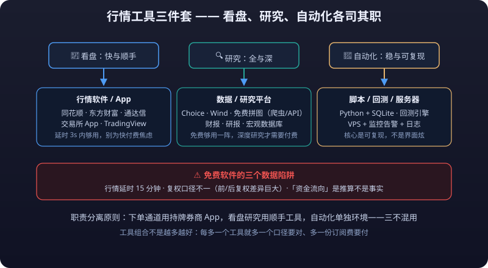

# 01 · A Panorama of Market Data Software

> Market data software is a trader's "eyes." Yet there are hundreds of such products on the market — free, paid, professional, and knock-offs all mixed together. Most people use one or two from start to finish without ever asking "why would I need another one?"
>
> This article divides market data tools into four classes by market and purpose: free A-share software, professional terminals, crypto market data, and international quotes, covering each one's strengths and target users. It then adds a section on candlestick charting engine fundamentals (also the charting foundation of Chapter 10 - System Integration), exposes the data traps of free software, and offers a multi-software workflow that separates **watching from trading**.

> **⚠️ Risk Warning**
>
> Free market data software commonly carries commercial arrangements such as **<mark>delayed quotes</mark>**, advertising, and stock-picking funnels; verify the completeness and timeliness of the data yourself. Professional terminals are expensive — buy only as needed. All product descriptions here are observations of the market landscape and imply no recommendation or endorsement. Markets carry risk; invest with caution. Nothing in this article constitutes investment advice.

---

## 1. Free A-Share Software: Three Pillars

Free A-share market data is dominated by three products: **THS (Tonghuashun), Eastmoney, and TDX (Tongdaxin)**. Their data all comes from exchanges or third-party vendors, so base quotes are nearly identical; the difference lies in **product positioning**.

| Software | Positioning | Strengths | Best for |
|---|---|---|---|
| THS | The most complete mobile "super app" | Great mobile experience; news / community / simulated trading / conditional orders in one place; rich Level-2 and membership add-ons | Retail investors who watch mainly on phones, especially beginners |
| Eastmoney | An "information gateway" that grew out of a data website | The most complete free data (money flow, F10 deep data, research center all in one app); fund distribution is its main business model | Traders wanting one-stop reading of news + quotes + research reports |
| TDX | A veteran trader's workhorse | Plain interface but hardcore features: multi-window watchlists, custom indicators, powerful formula system, granular order book data; many broker-customized versions | Experienced traders focused on efficiency who need formula-based screening / custom indicators |

**Selection advice**: Beginners should start with the THS or Eastmoney app (easy access to news). Once you begin systematic watching with fixed screen time, install desktop TDX (or your broker's customized version) — its formulas and multi-window layout are irreplaceable by phone apps.

### What Is the TDX Formula Language

TDX formulas are a **script language oriented toward quote computation** — think Excel formulas adapted to market data:

- Input is quote series (OHLC, volume, turnover, etc.), output is computed indicator curves or screening results;
- Three tiers of usage:
  1. **Indicator formulas**: write your own technical indicators (e.g., custom moving-average combos), plotted on the main/sub chart;
  2. **Conditional screener formulas**: output 0/1 signals for one-click filtering across the whole market;
  3. **Trading system formulas**: define buy/sell conditions; can do simple historical **<mark>backtests</mark>** (limited accuracy, reference only).

```text
// Example: dual MA golden-cross screener formula (for teaching; field syntax depends on your version)
MA5:MA(C,5);
MA20:MA(C,20);
CROSS(MA5,MA20);
```

- Compared with TradingView's Pine Script and Python on quant platforms: TDX formulas are the **fastest to learn and integrate seamlessly with the charting software**, but they **cannot express full strategy logic** (no standard library, hard to handle multi-instrument portfolios). They are positioned as "indicators and first-pass screening," not a quant backtesting language.
- Broker-customized versions have slight syntax differences; the standard version can be downloaded online for free. For advanced usage see [04 - Analysis & Scripting](analysis-scripting.md).

---

## 2. Professional Terminals: Paid Depth and Speed

Free software serves retail investors; professional terminals serve institutions. The three mainstream domestic terminals are **Wind, Choice (Eastmoney), and THS iFinD**.

| Terminal | Strengths | Pricing model (check official latest quotes) | Users |
|---|---|---|---|
| Wind | Institutional standard: broadest coverage (stocks/bonds/funds/futures/macro/alternative data), Excel plugin (embeds in WPS), heaviest terminal features | Annual fee per account, expensive (individual accounts pay too; there have been attempts at a "personal edition") | Brokers, funds, private funds, researchers |
| Choice (Eastmoney) | Eastmoney data system + research/news/fund databases, good value for money | Annual subscription, significantly cheaper than Wind, personal edition available | Individual researchers, small institutions |
| iFinD (THS) | THS data + financial terminal; AI features (natural-language Q&A) are distinctive | Annual subscription, between the two | Research/advisory users |

**How to read this**: free software provides "snapshot-grade" data, while professional terminals provide a **structured, exportable database with historical depth** — which is what research and quantification actually need. If an individual researcher wants serious quant backtesting, Wind's Excel plugin and Choice's personal edition are two common routes; if you only watch charts, free software suffices.

::: tip 💡 Low-Cost Trial Approach
Don't buy the most expensive terminal right away. First use free channels (Eastmoney research center, exchange websites' data pages, Tushare/AKShare — see [02 - Data & Research Platforms](research-platforms.md)) to figure out "what my research actually lacks," then buy what you're missing — most people's real needs stop at "free plus a little paid data." Terminals are institutional production tools, not personal necessities.
:::

---

## 3. Crypto Quotes: Exchange Apps and Third Parties

Crypto trades 24×7, so the selection logic differs completely: **there is no "free institutional terminal," but the exchanges' built-in market data is itself a primary quote source**.

| Tool | Positioning | Strengths |
|---|---|---|
| Binance/OKX apps | Official exchange quotes | Integrated with your account; shows **<mark>funding rates</mark>**/positions/depth; mark price and **<mark>liquidation</mark>** price displayed directly for perpetuals |
| TradingView | The global charting standard | Multi-market charts (including crypto), strongest drawing & indicator ecosystem, Pine Script support, direct connections to major exchanges' quotes |
| CoinGecko/CoinMarketCap | Crypto data aggregators | Whole-market market-cap rankings, movers lists, project basics (circulating supply/unlock schedules), information aggregation — good for coin selection and research |
| Sites like Coinglass | Vertical derivatives-data sites | Open interest, funding rates, **<mark>liquidation</mark>** data, long/short ratio and other contract-specific metrics |

**Combination approach**: use TradingView for charting and drawing (connected to exchange feeds), exchange apps for account and execution, CoinGecko/CoinMarketCap for whole-market context. Note that quotes shown on TradingView may differ slightly from the exchange itself (different source matching); defer to actual fills on the exchange.

**Quick glossary of crypto quote terms** (mechanisms detailed in [05 - Crypto Perpetuals](../crypto-perpetuals/)):

| Term | Meaning | Where to see it |
|---|---|---|
| Mark price | The contract's fair price (guards against spot manipulation), used for liquidation judgment | Exchange app / futures page |
| **Funding rate** | Periodic fee between longs and shorts, reflecting long-short imbalance | Exchange apps, sites like Coinglass |
| **<mark>Liquidation price</mark>** | Reference price at which forced liquidation triggers | Exchange app positions page |
| 24h volume / open interest | Market activity and capital participation | Exchange apps, CoinMarketCap |
| Order book depth | Standing orders across top five bid/ask levels | Exchange app/desktop |

---

## 4. International Quotes: The Free Puzzle of Stocks and Macro

| Tool | Positioning | Strengths |
|---|---|---|
| Yahoo Finance | The benchmark for free international quotes | Complete US/HK/global indices/FX/commodities quotes; historical data downloadable as CSV (restrictions on quantitative use have tightened; check latest policy) |
| Google Finance | Lightweight lookup | Minimal interface, good for quick quotes and FX rates; no deep tools |
| IBKR TWS | Broker terminal but complete market-data features | Best US equity data depth (market scanners, optional Level-2); account and quotes unified |
| TradingView | Same as above | Equally comprehensive drawing and indicator support for US/HK stocks |

International macro quotes beyond US stocks (dollar index, Treasury **<mark>yields</mark>**, precious metals) are freely viewable on Yahoo Finance and TradingView; professional-grade data (tick-by-tick, depth) requires paid subscriptions to exchanges or data vendors (Nasdaq Basic, NBBO, etc.), per each vendor's latest pricing.

---

## 5. Candlestick Charting Engine Fundamentals (Echoing Chapter 10)

If you've used enough software, you'll notice **candlestick rendering varies enormously**: same data, but different software handles zooming, crosshair, volume sync, and price adjustment differently. Understanding what a **<mark>charting engine</mark>** is helps you see where differences between market data products come from.

- **TradingView's dominance**: over the past decade TradingView has become almost the standard template for chart interaction — linked timeframes, drawing tools, indicator panels, zoom/pan logic — borrowed by a huge number of products. Its advantage isn't just pretty charts but **a unified cross-market, cross-device interaction language**: once you can read charts on TradingView, any TradingView-like product feels familiar.
- **lightweight-charts**: TradingView's open-source **lightweight chart library**; front-end engineers use it to embed candlestick charts quickly, and many market-data websites/apps render their charts with it. It only solves "drawing" — you must wire up data sources and strategy logic yourself.
- **klinecharts**: an open-source Chinese candlestick chart library (TypeScript), friendly to the Chinese ecosystem, common in domestic market-data products. There are also commercial options like TradingView's official paid chart component library (advanced charts).

**Engineering view**: this is the last link of "quote system → client rendering" from [Chapter 10 - System Integration](../system-integration/) — quotes travel from the exchange through a backend gateway that ingests and cleans them, then a front-end chart engine renders them. Understand chart engines and you understand why "two programs show the same price differently": adjustment algorithms, candle aggregation boundaries (especially daily close times across time zones), and indicator computation details can all differ.

Quick tour of mainstream chart engines:

| Engine | Type | Strengths | Who uses it |
|---|---|---|---|
| TradingView charts | Commercial component (standard) | The benchmark for interaction, full-featured | TradingView itself and licensed products |
| lightweight-charts | Open source (MIT) | Lightweight, fast, no bundled indicator library | Embedded charts in various market websites/apps |
| klinecharts | Open-source Chinese | Chinese docs, TypeScript, extensible | Domestic market-data products |
| TradingView advanced charts | Commercial subscription | Full indicator and drawing capability | Financial products with paid integrations |

**What ordinary users need to know**: the chart engine only determines how good the chart looks and feels — **it does not determine data accuracy or latency**. Whether the data is correct depends on the quote source (next section); don't mistake "pretty chart" for "accurate data."

---

## 6. "Data Traps of Free Software"

Free market data software is itself a **commercial product** and earns money in the following ways — understanding these tells you which information in free quotes is a "product feature" and which is a "trap":

| Trap | Mechanism | Countermeasure |
|---|---|---|
| Delayed quotes | Free Level-1 quotes usually lag live trading by seconds-to-minutes (e.g., 15-minute delay or small delays); order book/intraday data not fully real-time | Fast traders and order-book watchers must confirm whether their quote tier is delayed; professional speed costs money |
| Ads and stock-pick funnels | Home screens push "tomorrow's winners" and "guru picks" — actually ad slots/paid courses/advisory funnels | Treat the software as a tool, not an information source; treat all pick content as ads |
| Hidden order-flow monetization | Some free software funnels account openings via broker partnerships, and some even have order-flow arrangements with **<mark>market makers</mark>**/institutions — behind every "recommendation" there is an interest chain | Default every product's "picks," "heat rankings," and "AI diagnosis" to marketing; only raw quote data is neutral |
| Indicator/course harvesting | "Paid indicator formulas," "member strategy courses" — renamed public indicators sold for money | Indicator effectiveness is documented publicly; research free versions before deciding whether anything is worth paying for |

**In one sentence**: free software's data itself is usually accurate (verify against official disclosures), but **all "opinion content" inside the software should be assumed commercial**.

::: warning 🛑 Picks, Heat Rankings, and AI Diagnosis in Free Software Are Marketing by Default
**The data in free software is usually accurate, but all "opinion content" inside should be assumed commercial.** Every product's "recommendations," "heat rankings," and "AI stock diagnosis" sit atop an interest chain; only the quote data itself is neutral.
:::

### How to Audit Your Own Market Data Software

| Check | How |
|---|---|
| Are quotes delayed | Compare the same quote and timestamp across two programs; mismatched book prices vs. the exchange (or another program) suggest delay |
| Is data missing | Spot-check historical candles for one long-suspended/delisted stock and one recent IPO against exchange disclosures |
| Are indicators sane | Hand-compute a MACD or moving average value from accepted definitions and compare with the display (differences usually come from adjustment conventions) |
| Adjustment convention | The software must let you switch between forward/back/no adjustment; mixing conventions in historical analysis produces wrong conclusions |

---

## 7. Multi-Software Workflow: Separating Watching from Trading



Professional traders almost never "watch charts and place orders in the same program" — not because the software is bad, but because **<mark>separation of duties</mark> is part of discipline**:

| Stage | Suggested tool | Why |
|---|---|---|
| Watching/research | Desktop TDX or TradingView | Fixed drawing, multi-timeframe, indicator workflows; stable screen layout |
| Trade execution | Broker's official app/client | Trading and fund safety belong on official channels, avoiding extra risk from third-party order placement |
| Account & risk control | Broker/exchange official app | Positions, funds, and liquidation warnings are only trustworthy in official apps |
| Data & research | Data platforms/terminals | See [02 - Data & Research Platforms](research-platforms.md) |

- **Separate watching software from trading software**: if your charting program gets maliciously promoted, pops up ads, or misbehaves, your order channel is unaffected;
- **Place orders only via official clients**: any third-party "one-click order" or "copy-trading tool" means handing your trading authority to another program/person — at your own risk;
- For automated traders the separation goes further: quote source, signal program, and order module are independent — see [05 - Runtime & Automation Environment](automation-environment.md).

**Recommended combinations by user type**:

| User | Watching | Trading | Extras |
|---|---|---|---|
| Beginner retail | THS/Eastmoney app | Broker official app | Use **<mark>simulated trading</mark>** to learn features first |
| Desktop veterans | TDX (multi-window + formulas) | Broker official client | Formula screeners for first-pass filtering |
| Multi-market traders | TradingView (unified charting for A-shares/crypto/US) | Each market's official app | Pair crypto with exchange apps for funding rates |
| Semi-auto/research-oriented | TradingView + own scripts (see 04) | Broker/exchange official channels | Server automation see 05 |

::: warning ⚠️ More Tools ≠ Better
Reminder: more is not better — **the more tools you run, the longer you spend watching and the more scattered your attention becomes**. Pick a combination and stick with it for 1–2 weeks before adjusting; don't churn tools (changing tools = changing muscle memory, which is costly).
:::

---

## 8. FAQ Quick Answers

| Question | Quick answer |
|---|---|
| Is one program enough? | Keep one official channel each for watching and ordering — at least a two-piece set (see above) |
| TDX or THS? | Choose TDX for watching efficiency, THS for news and mobile; no conflict — install both |
| Is TradingView's free tier enough? | Enough for watching and drawing; paid tiers mainly add indicators/history/refresh rate (see official pricing) |
| Why doesn't my data match the official site? | Check adjustment convention first, then whether quotes are delayed, then closing times (time zones differ) |
| Phone vs desktop watching? | Phones suit patrol and emergencies; deep analysis (multi-window, multi-timeframe, formulas) requires a computer |
| Are professional terminals worth buying? | Watching only, no research → no; quant/deep research → evaluate personal editions first |
| One program across markets, or separate ones? | Unified charting → TradingView; ordering always via each market's official client |
| Will my watchlist leak? | Watchlist/position sync varies by product; assume sensitive info shouldn't be logged into third-party platforms |
| Should I distrust "upgrade to new version" prompts? | Any "upgrade" asking for passwords/codes is **<mark>phishing</mark>**; update only via official channels |

---

## 9. Next Steps

Once your tools are clear, head to [02 - Data & Research Platforms](research-platforms.md) to build your research data foundation; for differences in trading costs across platforms go straight to [03 - Broker & Futures Broker Selection](broker-selection.md).

---

::: warning ⚠️ Risk Warning
Your choice of market data software affects only how efficiently you "see," not your probability of "earning": the "signals," "picks," and "heat rankings" shown in these products are commercialized content that can induce chasing rallies and dumping lows. Free quotes generally carry delays and data limitations — confirm your quote tier before fast trading. Specific terms for paid terminals, quote subscriptions, and data exports follow each company's latest official announcements. Everything here is for learning and research only and does not constitute investment advice. Markets carry risk; invest with caution.
:::
