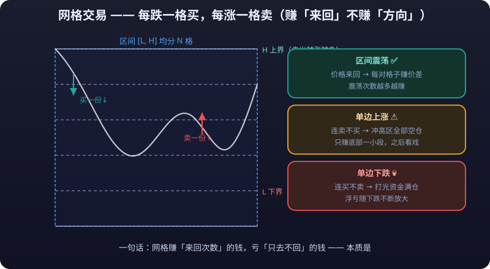

# Range Markets and Grid Trading in Practice

> The nightmare of trend traders is the range; so is the paradise of range traders. Grid trading (Grid Trading) is the most classic "mechanical" play in a range market: **no need to predict direction — just admit "I don't know where price will go, but I know it will likely bounce back and forth within a band"** — then slice the band into grids and buy low, sell high.
>
> But grids have one fatal mathematical weakness: **they always lose in a one-sided market**. This article dissects the principle, parameters, mathematical expectation, variants, and ways to die in one pass — so before using one, you know exactly what contract you are signing.

---

## 1. What Is a Range Market: Identify First, Act Later

### 1.1 Identifying traits (three rulers)

| Trait | Concrete sign | Reading |
|---|---|---|
| Flat moving averages | MA20 and MA60 near horizontal, repeatedly tangled | No clear direction |
| Bollinger squeeze | BOLL bandwidth narrowing, price bouncing inside the bands | **Volatility** compression |
| Clear highs/lows | A clean upper/lower boundary can be drawn and price touches it repeatedly | There is an edge to trade |

**Supporting confirmations (historical statistics; defer to actual conditions):**

- ADX < 20-25: insufficient trend strength;
- The oscillation has persisted for over a week with the boundaries tested multiple times;
- Volume shrinking (low-volume sideways), and breakout volume is also inadequate.

### 1.2 The two fates of a range

1. **Range continues**: price keeps bouncing inside the band — grids/range scalping make money;
2. **Range breaks**: price eventually picks a direction — **this is where every range strategy's reverse risk lives**.

> Key insight: **a range market is only confirmed "after the fact".** What you think is a range can turn into a trend at any moment. Every range strategy must reserve a "breakout contingency plan" (see Part 6) — otherwise ten months of profit can be wiped out in one month.

---

## 2. Overview of Range Strategies

| Strategy | Technique | Expected return source | Main risk |
|---|---|---|---|
| Manual range scalping | Sell at the upper edge, buy at the lower edge | Spread on each round trip | One-sided move after breakout |
| Range trading (semi-auto) | Orders placed at fixed support/resistance | Same, but rule-based | Range invalidated |
| Grid trading (automated) | Split into N cells, automatic buy-low sell-high | **Spread** per filled cell × cell count | Fully positioned and trapped in a one-sided market |
| Straddle/options (advanced) | Buy both ends of volatility | Breakout moves | **Time value** decay |

This article focuses on grids: they are the only way to execute range logic **fully automatically**, and also where retail traders most easily fall for "bot sales pitches".

---

## 3. Grid Trading, Fully Dissected



### 3.1 Principle and four parameters

**Principle:** evenly divide the price band [lower bound L, upper bound H] into N cells. Each time price falls one cell, buy one lot; each time it rises one cell, sell one lot. Each completed "buy+sell" pair earns one cell of spread. No directional judgment needed — only range judgment.

| Parameter | Definition | How to set it (example) |
|---|---|---|
| Lower bound L / Upper bound H | Grid edges | Use recent 1-2 month support/resistance; leave a buffer (±5% beyond bounds recommended) |
| Grid count N | How many cells to slice the band into | Wider band → more cells; crypto commonly 50-150 cells, narrow bands 10-30 |
| Per-cell capital | Amount bought per cell | Total capital ÷ estimated max fillable cells (see 3.3) |
| Total capital allocation | Overall grid investment | **No more than half of total capital**, leaving the other half for the "breakout plan" and life |

### 3.2 The grid's mathematical expectation: why one-sided markets lose

Use a simplified example (fees excluded):

- Band [80, 120], split into 5 cells of size 8, 100 CNY per cell;
- Each completed pair earns 8 CNY (one cell of spread);
- **Range case**: price bounces 10 times within the band; each pass fills several pairs, netting several cells of spread;
- **One-sided up**: price runs from 80 straight to 150. After building, the grid only sells and never buys again — it sells as it rises, going **completely flat above 120**; whatever happens beyond is none of your business. Worse: if you re-open a new grid at the highs, that becomes chasing.
- **One-sided down**: price falls from 120 straight to 50. The grid keeps buying — **the more it falls, the more it buys, until all capital is spent** — floating losses compound with every leg down. This is the mathematical source of "grids get fully positioned and trapped in one-sided markets".

| Market | Grid return | Why |
|---|---|---|
| Range oscillation | Positive (spread per pair) | Buy-low sell-high triggered repeatedly |
| One-sided up | Only part of the bottom, then flat | Sold out with no chance to buy back |
| One-sided down | Loss (floating loss while fully positioned) | Buys all the way down, digging deeper |

> **The expectation in one sentence: a grid earns money from "round trips" and loses money on "one-way trips".** More oscillations = more profit; stronger trends = harder losses. It is essentially a strategy that shorts volatility — and when volatility is released one-sidedly, shorting volatility bites back.

### 3.3 The correct per-cell capital calculation (important)

A grid's biggest risk is "capital exhausted after price breaks below L". **Full-grid capital = per-cell capital × maximum fillable cells**. Always assume the extreme case:

```text
Example: total available capital 100k CNY, willing to commit at most 60% (60k) to the grid
Band [80, 120], stop-loss possible at 60 (depth 40, cell size 4, max 10 cells)
Per-cell capital = 60k ÷ 10 cells = 6,000 CNY/cell
```

- **Reserve beyond the boundary**: keep separate funds for "catching falling knives" below L, with a clear **<mark>stop-loss</mark>** line (5%-10% below L triggers a full stop or pause);
- A grid should **never run fully invested** — full deployment means no room to recover when the range judgment is wrong.

### 3.4 Markets grids suit vs don't suit

| Suited | Not suited |
|---|---|
| Long-lasting narrow ranges with clear boundaries | One-sided trends (up or down) |
| Stable volatility, no major events | Around earnings/macro data/major policy |
| Major instruments (good **liquidity**, low **<mark>slippage</mark>**) | Small-cap coins/illiquid contracts (one wick kills) |
| Spot or low **<mark>leverage</mark>** (can hold long term) | High-leverage futures grids (a drop means **<mark>liquidation</mark>** — win spreads, lose principal) |

---

### 3.5 Estimating grid returns (numeric walkthrough)

Grid returns = **filled pairs × return per pair**, and filled pairs depend on how often price bounces — the least certain variable. Compute the per-pair return first:

```text
Example: band [100, 120], split into 10 cells of size 2, 5,000 CNY per cell
Return per pair = per-cell amount × cell spread% = 5000 × (2 ÷ 100) = 100 CNY/pair
Total grid capital = 10 × 5000 = 50,000 CNY
```

Annualized estimates by "pairs filled per day" (250 trading days; historical common levels, not predictions):

| Pairs per day | Daily return | Annual return | Annualized (on 50k grid capital) |
|---|---|---|---|
| 0.5 pairs (one pair every two days) | 50 CNY | 12,500 CNY | 25% |
| 1 pair | 100 CNY | 25,000 CNY | 50% |
| 2 pairs | 200 CNY | 50,000 CNY | 100% |

> Real-world caveats: ① the 100% annualized figure looks tempting, but **filled pairs are highly unstable in real markets** — fewer oscillations can mean zero fills for weeks; ② fees are not deducted above — denser grids mean a higher fee share; ③ **in one-sided markets this entire estimate collapses** — returns go negative. Recalculate any grid software's advertised "XX% annualized" yourself under this framework and ask one question: how many times a day does its assumption assume price crosses back and forth?

---

## 4. Grid Variants: Spot Grid / Futures Grid / Fund Grid

| Variant | Play | Risk profile | Notes |
|---|---|---|---|
| Crypto spot grid | Grid bots on Binance/OKX etc.; spot auto buy-low sell-high | No liquidation risk, but drawdown/trap risk | Most popular, best for beginners |
| Futures grid (coin-margined/USDT-margined) | Leveraged grid, more aggressive per-cell entries | **Leverage + decline = liquidation risk**; wick moves can trigger **<mark>forced liquidation</mark>** outright | Leverage ≤ 2-3x, only on low-volatility instruments |
| Fund grid | DCA-style grid with OTC funds (e.g. add a tranche for every 5% NAV drop) | Low trade frequency, relatively high fees | The "lazy person's grid", for those who won't watch markets |
| Manual grid | Alternate orders yourself at support/resistance | Saves fees, flexible | Requires discipline: order at price, follow the plan |

**Platform capability quick reference (defer to real-time platform features):**

- Top crypto exchanges (Binance, OKX, Bybit, etc.) all have built-in spot/futures grid bots with high parametrization;
- Domestic futures can approximate grids via conditional orders through some brokers/third-party software (confirm compliance first);
- Stocks/ETFs offer conditional orders or broker smart-order (grid) features — note A-share T+1: **shares bought today cannot be sold today, which limits grid frequency**.

> Whichever platform: **test small through one complete cycle first (at least 2-4 weeks), confirm parameters and platform rules (minimum order size, fees, grid trigger mode) before committing real capital.**

---

## 5. Range Trading (Manual Buy-Low Sell-High)

### 5.1 How to do it

1. Draw the band: use obvious recent 1-2 month support/resistance (prior highs/lows, high-volume congestion);
2. Act only near the edges: price hits the upper edge with stalling momentum → sell/short; hits the lower edge and stabilizes → buy/long;
3. Stop-loss: exit when **the range breaks** (upper edge broken on a closing basis with volume = the short thesis fails); don't trade mid-band (far from both edges, poor **risk-reward**);
4. Require risk-reward ≥ 2:1 per trade (edge-to-midpoint distance is the stop, edge-to-opposite-edge distance is the target).

::: danger 💀 Breaking the lower bound means the range failed — stop buying
**Below the lower bound = the range has failed. Stop buying.** Manually continuing to buy below L "because it's cheap" is catching falling knives outside the range — adding cells is adding fuel to the fire. Never run grid capital fully invested; keep the other half for the "breakout plan" and life.
:::

### 5.2 Difference from grids

| Dimension | Range trading | Grid |
|---|---|---|
| Execution | Manual, watching, waiting for triggers | Automatic, mechanical, around the clock |
| Trade frequency | Low (only at edges) | High (every cell triggers) |
| Discipline needed | Yes (control your hands) | Yes (control restarting/re-parameterizing) |
| When range judgment is wrong | Fast stop, limited loss | You notice after being trapped, large floating loss |
| Suited to | Those with time to watch | Those without time to watch |

---

## 6. Spotting Range-to-Trend Transitions: The Discipline of Pulling Grids on Breakouts

The most dangerous moment for any range strategy is when the range starts failing. **Three rules for pulling a grid:**

| Signal | Action |
|---|---|
| Upper edge broken on volume at close | Immediately pause/remove the grid; do not "wait for the retest to re-hang" — never predict retests on breakout day |
| Lower edge broken on volume | Pause the grid immediately and assess: break < 5% → switch to watch mode; > 5% → exit per the preset stop-loss |
| MAs start fanning out + ADX rising fast | The range premise has failed, the grid thesis no longer holds — pull it first, ask questions later |

**Decision flow:**

```text
Price breaks the range boundary
   ↓
Check volume: heavy-volume breakout → likely trend (pull the grid)
             low-volume false breakout → may return to range (may continue, but reduce grid capital)
   ↓
Check post-breakout behavior: 3 daily closes holding outside the range → confirmed trend,
switch the grid to a trend strategy or disable it
```

> **Core discipline: prefer pulling the grid on breakout and re-entering after confirmation over "betting it's a fake breakout" and letting the grid eat trend losses.** Pulling costs you "the gains if price returns to the range"; keeping it costs you "the full floating loss of a one-sided move" — these are asymmetric bets.

::: warning ⚠️ On breakout, prefer pulling first and confirming later — don't bet on a fake breakout
**On breakout, prefer pulling first and re-entering after confirmation, rather than "betting it's a fake breakout" and letting the grid eat trend losses.** Pulling costs you "the gains if price returns to the range"; keeping it costs you "the full floating loss of a one-sided move" — an asymmetric bet, and pulling sits on the better side of it.
:::

::: danger 💀 Grids earn round trips and lose one-way trips
**A grid earns money from "round trips" and loses money on "one-way trips".** More oscillations = more profit; stronger trends = harder losses — it essentially shorts volatility, and when volatility is released one-sidedly, shorting volatility bites back. One-sided markets always lose; recalculate any grid software's advertised "XX% annualized" yourself under this framework.
:::

---

## 7. Ways Grids Die: Checklist

| Death | Script | Antidote |
|---|---|---|
| Fully positioned in a one-sided market | Grid buys all the way down, capital exhausted, floating loss 30%+ | Commit only half of total capital + stop-loss line beyond the boundary |
| Catching falling knives below L | Buying below the lower bound "because it's cheap" | Below the bound = range failed, stop buying |
| Missing upside beyond H, then chasing | Pulled the grid on the upside breakout, then reluctantly reopened at the highs | Strictly forbidden to reopen a grid outside the original band immediately after a breakout |
| **<mark>Leveraged</mark>** grid liquidated | Futures grid meets a wick, **position** forcibly liquidated | Leverage ≤ 2-3x; never use futures grids on high-volatility instruments |
| Constantly tweaking parameters | Changing spacing/band whenever the grid loses, making things worse | Backtest parameters + test small first; while running only change "pause/stop-loss", never parameters |
| Fee erosion | High frequency, narrow spacing, profits all paid to the exchange | Per-cell spread ≥ 2× round-trip fees |
| Event shock | Grid left running into earnings/CPI, gapped through | Pause grids one day before major events |

---

## 8. Grid Launch Checklist

```markdown
□ Instrument and band: last 1-2 months' range drawn? 5% buffer beyond upper/lower bounds?
□ Market state: ADX < 25? Flat moving averages? — confirmed range market
□ Parameters: cell count and per-cell capital computed? Per-cell spread ≥ 2× round-trip fees?
□ Capital: total grid investment ≤ 50% of capital? Reserve funds beyond the boundary ready?
□ Stop-loss plan: what if price breaks 5% below the bound? (stop/pause) — written down
□ Event calendar: next macro event/earnings date? Should the grid pause?
□ Platform rules: minimum order size, fees, grid trigger mode confirmed?
□ Live testing: ran a complete 2-4 week cycle with small capital?
```

## 9. Quick Reference: Common Grid Fallacies

| Fallacy | Reality |
|---|---|
| Grid = guaranteed profit | Grids short volatility and always lose in one-sided markets — it's only a question of "when" |
| Denser spacing earns more | Denser spacing thins per-pair returns, raises fee share, and gets swept by wicks more easily |
| Wider band is safer | Too wide → big gaps between cells, few fills, capital tied up long; too narrow → easier to break |
| The deeper the drop, the more cells to add | Breaking below the bound proves the range judgment wrong; adding cells is fueling the fire |
| "The grid lost because the market was bad" | Market state should have been judged before launching; misjudging it is a strategy problem, not bad luck |
| Bot runs itself, no supervision needed | Events, breakouts, and parameter drift all need human intervention — "set and forget" is the biggest lie about grids |
| Spot grids carry no risk | No liquidation ≠ no loss; a one-sided drop can trap you deeply for years |

---

::: warning ⚠️ Risk Warning
Grid trading is not a "guaranteed-profit machine": in one-sided markets it compounds losses until capital runs out, and history offers plenty of cases of grids "earning half a year, losing it all in one month". All ranges, parameters, and rule-of-thumb thresholds here are **historical statistics, not predictions; defer to actual market conditions and platform real-time rules**. Leveraged grids carry liquidation risk and can wipe out principal or even produce a **<mark>negative balance</mark>**; participate only with money you can afford to lose, and fully understand the bot's true parameters and costs before running one.
:::
