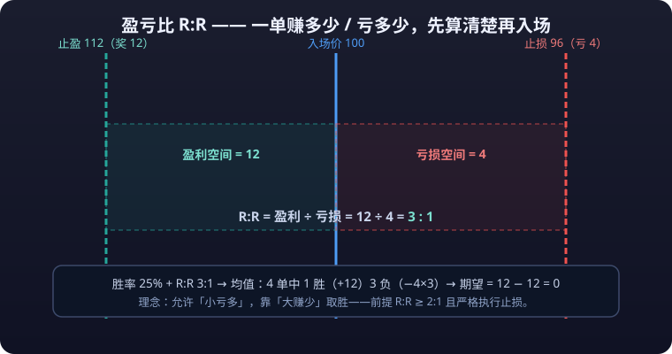

# 02 · Risk Management

> An old saying in trading: "Live long enough and the money comes; die too fast and no strategy saves you." This article covers exactly one thing: **how to make sure you always have a next hand to play.** Decide how much you can lose first, and only then consider how much you can make — that order is the line between life and death in trading.

---

## 1. Why Consider Risk Before Reward

### 1.1 The Asymmetry of Loss and Recovery

First, a mathematical fact: **the difficulty of recovering a loss accelerates.**

| Loss | Gain needed to break even |
|---|---|
| 10% | 11.1% |
| 20% | 25% |
| 30% | 42.9% |
| 40% | 66.7% |
| 50% | 100% |
| 60% | 150% |
| 70% | 233% |
| 80% | 400% |
| 90% | 900% |

The derivation (50% loss as the example): capital 10,000 → down 50%, 5,000 left → to climb from 5,000 back to 10,000 you need (10,000−5,000)/5,000 = **100%** — this is not "a matter of style", it is math.

> **Conclusion: the defensive value of a trade far exceeds its offensive value.** Only after deciding the maximum loss does the potential gain mean anything.

### 1.2 Three Principles of Risk Management

| Principle | Meaning | Concrete action |
|---|---|---|
| Risk before reward | Before entering, compute "worst-case loss" first, then "best-case gain" | Write the **<mark>stop-loss</mark>** first, then the **<mark>take-profit</mark>**, on every trade |
| Risk is a budget, not a feeling | Risk is a fixed fraction of total capital, unmoved by mood | Fixed-fraction method (next section) |
| Risk must be measurable and reviewable | "Be careful" is not risk management; "at most 1% of capital lost per trade" is | Log it in the journal; tally it weekly |

---

## 2. Position Sizing Methods

> The core of position sizing is not "how much to buy" but "how much to lose". **Every method revolves around one variable: the fraction of total capital at risk per trade.**

### 2.1 Fixed-Fraction Method (1%-2% risk per trade) — the only recommendation for beginners

**Rule**: each trade may lose at most 1% (conservative) or 2% (aggressive) of total capital; when the stop triggers, loss = total capital × risk fraction.

**Position calculation formula:**

```text
Position (amount invested) = risk amount per trade ÷ (entry price − stop price) × entry price

Example: total capital 10,000, risk fraction 1% (= 100 yuan at risk)
Entry 100, stop 95 (5 yuan risk per share)
Shares = 100 ÷ 5 = 20
Position value = 20 × 100 = 2,000 (i.e. 20% of total capital)
```

**Why 1%-2%? Look at the damage of losing streaks:**

| Risk per trade | Left after 10 straight losses | Left after 20 straight losses | Notes |
|---|---|---|---|
| 0.5% | 95.1% | 90.5% | Very safe, but profits accumulate slowly |
| 1% | 90.4% | 81.8% | Recommended range |
| 2% | 81.7% | 66.8% | Aggressive ceiling |
| 5% | 59.9% | 35.8% | 20 straight losses borders on **<mark>liquidation</mark>** |
| 10% | 34.9% | 12.2% | 20 straight losses ≈ out of the game |

> Even with a 30% win rate, 1% risk per trade survives a losing streak of nearly 30 trades. **The goal of position sizing is not to avoid losses — it is to still be in the game after losing.**

### 2.2 The Kelly Criterion (understand the concept and its limits)

The Kelly criterion computes **the theoretically optimal bet fraction given a known win rate and risk-reward ratio**:

```text
f* = (bp − q) / b

f* = optimal bet fraction (of total capital)
b  = risk-reward ratio (average win ÷ average loss)
p  = win rate
q  = loss rate (= 1 − p)
```

**Numeric example**: win rate 55% (p=0.55), risk-reward 1.5 (b=1.5):

```text
f* = (1.5 × 0.55 − 0.45) / 1.5 = (0.825 − 0.45) / 1.5 = 0.375 / 1.5 = 25%
```

**Why does almost no one bet full Kelly in practice?**

| Problem | Explanation |
|---|---|
| Parameter estimation error | Win rate and risk-reward are estimates; error turns "optimal" into disaster |
| Huge drawdowns | Full-Kelly drawdowns can reach 30%-50%+; most people mentally break mid-way |
| Ignores black swans | Kelly assumes the return distribution is known; tail risk (flash crashes, wicks) is not in the model |

**Practical usage: half Kelly or even quarter Kelly.** Multiply the Kelly output by 0.25-0.5 before using it. For the vast majority, just use the fixed-fraction method (1%-2%); the Kelly criterion mostly helps you understand "why heavy positions are forbidden" — **even a player with a 55% win rate can be wiped out in an ordinary drawdown betting more than 25%.**

<ExpectancyCalc />

### 2.3 Equal-Risk Sizing

**Problem**: two instruments have different stop distances (BTC stops at 3%, an altcoin at 8%); investing the same amount in each means completely different risk.

**Method**: make **the risk amount equal per trade**, not the invested amount:

```text
Risk amount = total capital × 1% (the same every trade)
Quantity = risk amount ÷ (entry price − stop price)

Example: total capital 10,000
BTC: entry 60,000, stop 58,200 (−3%), 1,800 risk per unit → quantity = 100/1,800 ≈ 0.055 BTC
Altcoin: entry 1.00, stop 0.92 (−8%), 0.08 risk per coin → quantity = 100/0.08 = 1,250 coins
```

- Sizing by risk amount makes the **risk exposure** of every trade in the account uniform; a single failure cannot break you.
- Cautionary counter-example: opening 10 positions at once, each with 10% of capital and a 1% risk budget, is fine; but if each trade puts ~10% of your *total* capital at risk (heavy size plus a wide stop), five simultaneous losses cost you half the account.

**Position sizing quick reference:**

| Method | Suited for | In one sentence |
|---|---|---|
| Fixed fraction 1%-2% | Everyone (especially beginners) | Lose at most 1%-2% of capital per trade |
| Half Kelly | Veterans with a proven statistical edge | Kelly output × 0.5, never full |
| Equal-risk sizing | Multi-instrument portfolios | Equal risk amount per trade, not equal invested amount |
| All-in / heavy bets | No one | Mathematical elimination |

---

## 3. Stop-Loss Methods



> A stop-loss is not "admitting defeat", it is "buying insurance". A position without a stop hands the counterparty a free call option.

### 3.1 Four Mainstream Stop Methods

| Method | How it's computed | Pros | Cons | Suits |
|---|---|---|---|---|
| Fixed-amount stop | Stop when the loss hits a fixed amount (e.g. 1% of capital) | Simple, precisely computable risk | Ignores market structure; can be swept out by normal noise | Beginners starting out |
| ATR stop | Stop = entry ∓ N × ATR | Self-adjusts with volatility, harder to sweep | Requires understanding ATR; larger losses in wild volatility | Trend following |
| Structure stop | Stop placed beyond the nearest support / resistance | The level has market logic; being swept means structure broke | Stop distance may be large; needs position adjustment | Swing / trend |
| Time stop | Exit if not profitable after N periods | Frees capital and attention; prevents death by a thousand cuts | May miss "slow-start" trends | Intraday / short-term |

### 3.2 ATR Stop Example

```text
ATR(14) = average true range of 14 candles (example: current ATR = 500, daily BTC)

Long entry at 60,000:
  2×ATR stop = 60,000 − 2×500 = 59,000 (stop distance 1.67%)
  4×ATR stop = 60,000 − 4×500 = 58,000 (looser; position must shrink accordingly)

When volatility expands (ATR rises to 800):
  2×ATR = 60,000 − 1,600 = 58,400 (stop automatically widens, avoiding a sweep)
```

**Stop adjustment discipline (iron rules):**

```text
✗ Never move the stop down ("give it one more chance" after the loss grows = slow liquidation)
✓ Moving the stop up is allowed (lock profit after gains, e.g. to breakeven)
✓ Execute immediately on touch — no "let me watch it a moment" pauses
```

### 3.3 Stops Are Not Omnipotent: Three Exceptions

1. **Gaps / wicks**: extreme moves can jump past your stop price (especially with high-**<mark>leverage</mark>** contracts); stop slippage can far exceed expectations.
2. **Liquidity evaporation**: small-cap instruments may have no counterparty at the extreme moment; the stop order may not fill.
3. **Stop distance too small**: a stop inside the normal noise band (e.g. 0.5% on a daily chart) gets swept by random wiggles — "over-stopping": shaken out every time, you eventually stop using stops at all.

---

## 4. Take-Profit and Trailing Take-Profit

### 4.1 Two Take-Profit Philosophies

| Philosophy | Approach | Traits |
|---|---|---|
| Target take-profit | Preset a risk-reward ratio (e.g. 1:2, 1:3), exit at the level | Simple, certain cash-out; may sell the big trend |
| Trailing take-profit | Let profits run; exit after a set retrace (fraction or amount) from the peak | Can catch the big trend; gives back more profit |

**A common compromise: scale out.** At risk-reward 1:1, exit 50% (locking half the profit and lowering the cost basis); trail the remaining 50%.

### 4.2 Three Ways to Write a Trailing Take-Profit

```text
① Fixed-percentage retrace: exit everything after a 20% retrace from peak profit
   Example: cost 100, rises to 130 (peak profit 30%) → retrace 20%×30% = 6 → exit at 124

② Fixed-price retrace: exit after an X% drop (e.g. 5%) from the highest price
   Example: high 130 → falls back to 123.5 (−5%) → exit

③ ATR trail: exit after a 2×ATR drop from the highest price (volatility-adaptive)
   Example: ATR=3, high 130 → falls back to 124 → exit
```

### 4.3 The Symmetry Principle of Take-Profit and Stop-Loss

- The stop decides "at most 1% lost on this trade"; the take-profit decides "whether the trade is worth taking" — **the ratio of stop distance to target distance is the risk-reward ratio**, and it must be computed before entry: trades with risk-reward < 1:1.5 are usually not worth taking.
- Trailing take-profits follow the same "only move in your favor" principle: a trailing level that has moved up **never moves back down**, or it degrades into "not taking profits again".

---

## 5. Maximum Drawdown Control

### 5.1 The Math of Drawdown and Recovery

| Maximum drawdown | Gain needed | Equivalent consecutive 1%-risk wins |
|---|---|---|
| 5% | 5.3% | 5 trades |
| 10% | 11.1% | 10 trades |
| 20% | 25% | 20 trades |
| 30% | 42.9% | 30 trades |
| 50% | 100% | 50 trades |
| 80% | 400% | 80 trades |

**Worked example (capital 10,000, drawdown 50%):**

<details>
<summary>📖 Click to expand: the math of why a 50% drawdown needs a 100% gain to break even</summary>

```text
Stage 1: 10,000 → drawdown 50% → 5,000 (lost 5,000)
Stage 2: 5,000 → needs +100% → 10,000 (made 5,000)
Conclusion: the same absolute amount is "−50%" on the way down but needs "+100%" on the way back.
The harsher version: earning it back from 5,000 at 2% risk per trade takes ~35 straight wins.
```

</details>

> **Two practical drawdown-control numbers:**
> - Daily loss hits **3%-5%** → stop trading for the day.
> - Account drawdown hits **10%-15%** → cut position size (e.g. risk from 1% down to 0.5%) until the drawdown recovers.
> - Account drawdown hits **20%** → full stop; review strategy and execution — look for the problem, not the market.

### 5.2 Common Sources of Drawdown (find yours)

| Source | Typical symptom | Countermeasure |
|---|---|---|
| Oversized positions | "This move feels safe" → risk quietly raised to 5%+ | Hard-code the risk fraction; any breach means stop |
| Revenge after losing streaks | A "get-it-back" trade after 3 straight losses | Losing-streak cap + cooling-off period |
| Strategy decay | Running a trend strategy in a range market | Monthly review; pause the strategy once confirmed |
| Black swans | Wicks in extreme markets, liquidity vanishing | Always keep position reserves; avoid high leverage |

---

## 6. The Math of Forced Liquidation: Leverage vs Loss Table <KbBadge t="Most important in this library" c="c-red" />

::: warning 🛑 Remember This One: Leverage Does Not Raise Your Win Rate, It Only Accelerates the Road to Zero
This is **the single most important table in the entire knowledge base**; screenshot it and keep it.
:::

### 6.1 Leverage vs Adverse-Move Liquidation Table

<LeverageCalc />

Assuming the **<mark>margin</mark>** model, no maintenance-margin buffer, wrong direction and refusing to cut:

| Leverage | Adverse move to liquidation | Math |
|---|---|---|
| 1x (no leverage) | Price falls 100% (<mark>goes to zero</mark>) | Buy with the full account; ride it to zero |
| 5x | ~20% | 1 ÷ 5 = 20% |
| 10x | ~10% | 1 ÷ 10 = 10% |
| 20x | ~5% | 1 ÷ 20 = 5% |
| 50x | ~2% | 1 ÷ 50 = 2% |
| 100x | ~1% | 1 ÷ 100 = 1% |

One-line recap: with 10x leverage long, a 10% adverse move zeroes the principal; for **<mark>leverage</mark>** basics see [Core Trading Concepts](../getting-started/core-concepts.md). BTC has moved 10%+ in a single day many times in history — **holding a 10x position through it = handing life and death to a day's random noise.**

### 6.2 The Three-Layer Multiplication of Losses

```text
Real loss = adverse move × leverage × position share

Example: total capital 10,000, 50x leverage, fully invested long, price moves 4% against you:
Loss = 4% × 50 = 200% of principal → liquidation, principal wiped out

Same market, only 20% of capital deployed:
Loss = 4% × 50 × 20% = 40% of principal → badly hurt but alive
```

> **Note**: live contracts also layer on the maintenance margin rate and the liquidation price (see the [Futures chapter](../futures/)), and wicks (extreme prices sweeping through in an instant) can fill far beyond the theoretical liquidation price.

### 6.3 Four Rules for Using Leverage

1. **Beginners should keep leverage ≤ 3x**, used only for hedging or small probe positions; the vast majority of those chasing "get rich on high leverage" end up liquidated.
2. **Leverage and stop-losses must coexist**: leveraged positions without stops are streaking naked.
3. **Manage position size and leverage separately**: high leverage is fine — provided the position is small enough that "fully wrong still loses affordably".
4. **Never**<mark>top up margin</mark>**to bag-hold** (a margin call is the exchange inviting you to "keep losing").

::: danger 💀 Never Top Up Margin to Bag-Hold a Losing Position
**Never top up margin to bag-hold (a margin call is the exchange inviting you to "keep losing").** Leverage + bag-holding = volunteering for elimination: live contracts also layer on the maintenance margin rate and the liquidation price, and under wick conditions the actual loss can far exceed the theoretical value — liquidation can happen before the percentages in the table.
:::

---

## 7. Risk Management Checklist (tick item by item before every order)

```text
□ 1. Have I written the stop price for this trade, with the stop-loss ≤ 1%-2% of capital?
□ 2. Is the position sized from the "risk amount", not a number off the top of my head?
□ 3. Is the risk-reward ≥ 1:1.5? (risk-reward ratio)
□ 4. Does this trade match the entry rules in my trading plan (not a spur-of-the-moment idea)?
□ 5. Is today's / this week's loss budget still intact (the daily / weekly caps from the drawdown rules above)?
□ 6. Am I free of revenge trading, overconfidence, or emotional turbulence?
□ 7. Is the leverage within the cap I set for myself?
□ 8. Do I understand and accept this trade's worst case (slippage included)?
□ 9. Is the journal template ready to fill in right after exit?
□ 10. If this trade loses, will I stop out exactly per plan, no negotiation?

If any answer is no → don't take the trade. There is always another setup; the principal exists only once.
```

**Monthly risk audit:**

| Check item | Passing line |
|---|---|
| Largest single-trade loss | ≤ 2% risk budget |
| Maximum drawdown in the month | ≤ 15% |
| Rule violations | 0 (target) |
| Liquidations / blow-throughs | 0 |
| Risk-reward ratio | actual average win ÷ actual average loss ≥ 1.5 |

---

::: warning ⚠️ Risk Warning
Leveraged trading can wipe out your entire principal and even leave you in debt from a blow-through (some platforms require making up the **<mark>negative balance</mark>**). The liquidation percentages in the table are theoretical; actual forced liquidation also depends on maintenance margins, fees, funding rates, and slippage — under wick conditions actual losses can far exceed theoretical values. Everything in this article is for study and research only and does not constitute investment advice; trade derivatives only with money you can afford to lose.
:::
