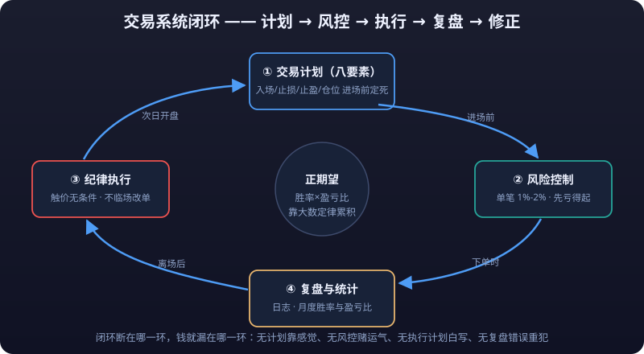

# 01 · Trading Plan

> This article answers one question: **what makes you dare to press a button at some price level and put your own money on the line?** If your answer is "a feeling", "news", or "other people bought it", it is no different in essence from tossing chips onto a roulette wheel. A trading plan turns every decision to enter, exit, place a **<mark>stop-loss</mark>**, or add to a position from "feelings" into "rules".

---

## 1. Why Write a Trading Plan: No Plan Means Gambling

| | Unplanned trader (gambling) | Planned trader (business) |
|---|---|---|
| Entry basis | Feels like it will rise / a friend said so / chasing hot themes | Predefined condition triggers (e.g. breakout + volume) |
| Stop-loss | Holds losers until it hurts too much, then cuts | Set before entry, executed unconditionally when hit |
| **<mark>Take-profit</mark>** | Exits after a small gain, or a winner turns into a loser | Exits in batches by rule |
| Position | By mood; adds after wins, ever larger | Fixed risk per trade, a fixed fraction of total capital |
| Review | Blames the market on losses, credits themselves on wins | Every trade journaled; win rate and risk-reward ratio tallied monthly |
| Long-run result | Random; fees and **<mark>slippage</mark>** drag the curve down | Positive expectancy, compounded slowly by the law of large numbers |

1. **Decision quality cannot be evaluated.** Gambling is defined not by "winning or losing" but by "results that cannot be reproduced and errors that cannot be located". Without a plan, you don't know why you won or why you lost, and you learn nothing.
2. **Emotions take over decisions.** If you haven't thought it through before entering, mid-trade you can only improvise with fear and greed — and the two almost invariably lead to chasing tops, bag-holding, and cutting at the bottom.
3. **Position control is lost.** One gambler's trait is "raise the stakes after winning, double down after losing" — in trading this is the standard script for **<mark>liquidation</mark>**.
4. **No positive expectancy.** The core of a trading plan is to construct a statistical edge where "win rate × average win > loss rate × average loss". Without a written plan, you don't even know whether you have an edge.

> **In one sentence: the purpose of writing a plan is not to predict the market, but to turn uncertainty into a manageable game of probabilities.** A plan forces you to think it through before entering — if this trade loses, how much do I lose, why, and how do I respond.



---

## 2. The Eight Elements of a Trading Plan

A complete trading plan contains at least the 8 items below. Miss one and the plan has a hole.

| # | Element | Question it answers | Consequence when missing |
|---|---|---|---|
| 1 | Market selection | Which market and which instruments will I trade only? | Crypto today, gold tomorrow, A-shares the day after — master of none |
| 2 | Trading timeframe | Which candlestick timeframe do I decide on? | Enter on the 5-minute, hold on the daily — muddled stop-loss logic |
| 3 | Entry rules | What conditions must appear before I enter? | Orders on gut feel, trapped right after entry |
| 4 | Exit rules | When to take profit? Scale out or exit all at once? | Exits after a small gain, missing the main rally |
| 5 | Stop-loss rules | Maximum loss on this trade? At what price do I exit unconditionally? | Bag-holding to liquidation, or winners turning into losers |
| 6 | Position sizing | What fraction of capital is at risk per trade? | All-in heavy bets, one trade wipes the account |
| 7 | Review frequency | How often do I review? What do I look at? | Repeating the same mistakes, treading water |
| 8 | Psychology checkpoints | In what mental states is trading forbidden? | Revenge trading, overconfidence blow-ups |

### Element by Element

**1. Market selection**

- Trade only instruments you have researched, that have historical data, and that are liquid.
- Beginner advice: **pick just 1-2 main instruments** — learning one market's temperament beats being the exit liquidity in ten markets.
- Write down explicit "won't trade" items: no instruments you don't understand, no extreme volatility, no illiquid names.

**2. Trading timeframe**

- The decision timeframe and the stop-loss timeframe must match: if you find entries on the 4-hour chart, the stop-loss must be computed on 4-hour structure, not on 5-minute wiggles.
- A common combo: daily sets direction → 4-hour finds structure → 1-hour or 15-minute finds the entry.

**3. Entry rules**

- Must be written as **conditions a computer can evaluate** (see Part 4).

**4. Exit rules**

- Profit targets (a fixed risk-reward ratio such as 1:2), trailing take-profit rules (e.g. exit after a 20% retrace), time-based exits (e.g. exit if not profitable after 5 days).

**5. Stop-loss rules**

- Locked in before entry; after entry it is **not allowed to be moved further away** (only tightened, never loosened). For stop-loss methods see [Risk Management](risk-management.md).

**6. Position sizing**

- The gold standard for beginners: **risk per trade no more than 1%-2% of total capital**. Note it is "risk", not "outlay": the money lost if the stop-loss triggers must be ≤ total capital × 1%.

**7. Review frequency**

- Daily, 5 minutes: record whether the day's trades followed the plan;
- Weekly, 30 minutes: tally win rate, risk-reward ratio, maximum drawdown, and rule violations;
- Monthly, 1 hour: review whether the strategy itself has stopped working and should be paused.

**8. Psychology checkpoints**

- Write down your "trading prohibitions": no new positions after 3 consecutive losses, no trading after a daily loss exceeds 3%, no trading during major emotional turbulence (arguments / insomnia / hangover).

---

## 3. A Complete Trading Plan Template (Copy and Fill In)

> Copy the template below into your notes app and fill it in item by item. **Any item you cannot fill in is something you haven't thought through yet.**

```markdown
# My Trading Plan (version: ____ updated: ____)

## 1. Self-positioning
- Source and share of my capital: ________ (only money I can afford to lose)
- Time I can devote to trading: ________ (determines usable timeframes)
- My risk preference (low / medium / high): ________ (drives position parameters)
- I am a trend / range / intraday trader: ________

## 2. Market and instruments
- Markets I trade only: ________ (e.g. crypto perpetuals / A-shares / gold futures)
- Main instruments: ________ (no more than 2)
- Instruments I explicitly won't trade, and why: ________

## 3. Timeframes
- Decision timeframe (direction): ________ (e.g. 4 hours)
- Entry timeframe (signals): ________ (e.g. 15 minutes)
- Baseline timeframe for stop-loss calculation: ________ (must match the entry timeframe)

## 4. Entry rules (must be evaluable conditions; the more explicit, the better)
- Trend direction condition: ________ (e.g. price > 200 EMA, EMA50 > EMA200)
- Pattern / structure condition: ________ (e.g. breakout above the high of the last 20 candles)
- Volume condition: ________ (e.g. volume > 1.5× the 5-day average)
- Time condition: ________ (e.g. US session / avoid the 30 minutes before major data releases)
- Entry veto conditions (one vote kills): ________ (e.g. already down 3% on the day, around major news)

## 5. Exit rules
- Profit target 1 (level): ________ (e.g. the 1:2 risk-reward level)
- Scale-out plan: ________ (e.g. 50% off at 1:1, 50% trailed)
- Trailing take-profit rule: ________ (e.g. exit all after a 20% retrace from peak profit)
- Time stop rule: ________ (e.g. exit if not profitable 5 days after entry)

## 6. Stop-loss rules
- Stop method: ________ (fixed amount / ATR / structure; see the Risk Management article)
- How the stop level is calculated: ________
- Stop adjustment rule: ________ (only tightening allowed, never loosening)

## 7. Position sizing
- Risk fraction per trade: ________% (1%-2% recommended, 2% absolute max)
- Position calculation: position = risk amount per trade ÷ (entry price − stop price) × leverage factor
- Maximum daily loss: ________% (3%-5% recommended; stop for the day when hit)
- Maximum weekly loss: ________% (8%-10% recommended; stop for a week when hit)

## 8. Review plan
- Daily review time and content: ________
- Weekly review time and content: ________
- Monthly review time and content: ________

## 9. Psychology checkpoints (trading prohibitions)
- [ ] After __ consecutive losses, no new positions; rest for __ days
- [ ] After a daily loss hits __ %, stop trading
- [ ] No trading during emotional turbulence (late nights / arguments / hangover / insomnia)
- [ ] After a win, must wait __ hours before adding to positions
- [ ] Every violation of the above is logged in the journal and self-penalized (e.g. 3 days hands-off)
```

---

## 4. How to Define Entry and Exit Rules: Turning "Feels Like It Will Rise" into Executable Conditions

### 4.1 Why "Feelings" Don't Work

"Feels like it will rise" = a vague conclusion the brain reaches on insufficient information; it cannot be verified and cannot be reviewed. **The core of rule-making is to decompose a feeling into observable, measurable, repeatable signals.**

### 4.2 The Four-Step Method: From Feeling → Rule

**Step 1: Write down what your feeling is based on.** For example, "BTC feels like it will rise because it has been rising lately".

**Step 2: Break it into objective conditions.**

| Feeling | Objectified |
|---|---|
| It has been rising lately | Closing price made new highs 3 days in a row |
| The rise looks strong | Volume on up days > volume on down days |
| Big players are buying | Volume > 1.5× the 5-day average (data replaces guesswork) |
| The trend is intact | Price is above the 20-day moving average |

**Step 3: Combine into a complete condition set (AND logic).** Refine each item until a computer can evaluate it:

```text
Entry buy conditions (enter only if ALL are satisfied):
① Daily close > 200 EMA (trend is up)
② 4-hour close breaks above the high of the previous 20 candles (breakout signal)
③ Breakout candle volume > 5-day average × 1.5 (volume confirmation)
④ More than 24 hours until major events such as Fed / CPI (avoid black swans)
```

**Step 4: Write the one-vote vetoes.** If **any** of these appears, don't trade:

```text
One-vote vetoes:
✗ Daily loss has reached 3%
✗ Weekly loss has reached 8%
✗ Clear 4-hour bearish divergence (RSI or MACD)
✗ Within 30 minutes of a news event
```

### 4.3 Test Criteria for Entry Rules

After writing the rules, backtest them item by item against the last 20-50 historical candles: how many times would they trigger? Did the triggers win or lose? If the rules show no edge in history, delete and rewrite. Three dimensions of testing:

| Test question | What it means |
|---|---|
| Is it decidable? | Every item must be hard data such as "price / volume / time" — no "feelings", no "roughly" |
| Is it repeatable? | Two different people looking at the same candle should reach the same conclusion |
| Is there historical support? | Backtest 20-50+ trades, tally win rate and risk-reward ratio before risking real money |

### 4.4 How to Define Exit Rules

Exiting is harder than entering, because it collides directly with greed. The rule-based approach:

| Exit type | Example rule | Problem it solves |
|---|---|---|
| Target exit | When profit reaches the 1:2 risk-reward level off the entry, exit 50% | Bank the profit |
| Trailing take-profit | Exit everything after a set retrace (fraction or amount) from peak profit | Let profits run without giving it all back |
| Structure exit | Exit when price breaks the most recent swing low formed after entry | Trend reversal signal |
| Time exit | Exit if not profitable after N days (e.g. 5) | Opportunity cost |
| Signal-reversal exit | Opposite signal appears (e.g. close below the 20-day MA) | Standard exit for trend strategies |

**Key point: exit rules must pair with entry rules.** Trend strategies use "signal-reversal exit + trailing take-profit"; range strategies use "target exit"; mixing the two is the most common mistake.

---

## 5. Trading Journal Template and Review Method

> The plan is "before", the journal is "during", the review is "after". Only the closed loop of the three produces a statistical sample.

### 5.1 Trading Journal Template (one record per trade)

```markdown
## Trade record #____
- Date/time: ________
- Instrument / direction: ________ (e.g. BTCUSDT perpetual long)
- Entry price / exit price: ________ / ________
- Position and leverage: ________
- P&L amount: ________ (BTC / USDT / CNY)

### Before entry
- Which entry rule triggered: ________ (copy the condition number from the plan)
- Planned stop: ________ planned target: ________
- Planned position: ________ actual position: ________

### During the trade
- Stop / target executed per plan: yes / no
- If no, what actually happened: ________ (record honestly)

### After exit
- Result: profit / loss / breakeven
- Error checklist (check honestly):
  [ ] Entered off-plan         [ ] Stop set too wide
  [ ] Didn't stop per plan     [ ] Took profit too early
  [ ] Position over limit      [ ] Added against the trend
  [ ] Revenge trade            [ ] Chased tops and bottoms
- One thing to improve for next time: ________
```

### 5.2 Review Method: Three Layers

**Layer 1: Compliance review (daily, 5 minutes).** Ask one question only: **did every trade follow the plan?** Any trade that violated the plan is recorded as a "violation" regardless of profit or loss — money made by violating rules is poison; it keeps you violating.

**Layer 2: Statistical review (weekly, 30 minutes).** Aggregate the week's data:

| Metric | This week | Last week | Notes |
|---|---|---|---|
| Number of trades | | | More samples, more validity |
| Win rate | | | Winning trades ÷ total trades |
| Average win / average loss | | | Gives the risk-reward ratio |
| Expectancy EV | | | See the formula in Part 6 |
| Violations | | | The most important metric; should be 0 |
| Largest single loss | | | Did it exceed the 1%-2% risk budget? |

**Layer 3: Strategy review (monthly, 1 hour).** Ask three questions:

1. Is this strategy still making money? (Is expectancy still positive over the last 20 trades?)
2. Has the market environment changed? (Trend turned to range? Volatility shifted?)
3. Is it strategy failure or execution drift? (Check the compliance rate — high compliance plus losses means a strategy problem.)

### 5.3 Example Review Record (BTCUSDT perpetual long)

```markdown
## Trade record #23
- Date/time: 2026-07-14 22:15
- Instrument / direction: BTCUSDT perpetual long
- Entry: 62,400  Exit: 63,150
- Position: 0.1 BTC (contract notional)  Leverage: 5x
- P&L: +750 USDT (about -8 USDT in fees)

### Before entry
- Rule triggered: ③ breakout signal (4h close broke the 20-candle high at 62,300) + ② 1.6× volume ✓
- Planned stop: 61,200 (structure below; risk ≈ 1.9% of position) ✓
- Planned target: 64,200 (risk-reward 1:2)
- Planned position: 0.1 BTC notional; risk = (62,400−61,200)/62,400 × 0.1 = 0.0019 BTC ≈ 118 USDT, 1.2% of total capital ✓

### During the trade
- Execution: price touched 63,000 at 22:40 then pulled back; at 22:55 the trailing
  take-profit condition triggered (20% retrace from peak profit); exited fully at
  63,150. ✓ Executed per plan.

### After exit
- Result: profit (+750 USDT, about 1.2 risk units)
- Error checklist: none ✓
- Improvement note: 30 minutes after exit the price ran to 63,800, but per the plan
  it was not re-entered. That behavior followed the rules; "making less" is not an error.
```

> Note how the example handles "making less": **as long as you executed per plan, the outcome — good or bad — is not an error.** What gets reviewed is "decision quality", not "a single outcome".

---

## 6. The Win Rate vs Risk-Reward Trade-off: Expectancy

### 6.1 The Expectancy Formula

Trading is in essence repeating a game with positive expectancy. Per-trade expectancy:

```text
EV = win rate × average win − loss rate × average loss

EV > 0  → trading these rules long-run is expected to make money
EV ≤ 0  → long-run certain loss, regardless of any single trade's outcome
```

### 6.2 A Numeric Example: Why a 30% Win Rate Can Still Make Money

Start with the most common misconception: **a high-win-rate system ≠ a profitable system.**

| Scenario | Win rate | Average win | Loss rate | Average loss | EV (per trade) |
|---|---|---|---|---|---|
| A (typical retail) | 70% | 100 yuan | 30% | 400 yuan | 70 − 120 = **−50 yuan** |
| B (typical winner) | 30% | 400 yuan | 70% | 100 yuan | 120 − 70 = **+50 yuan** |

- Scenario A is the true portrait of 90% of retail traders: **right 7 times out of 10** (because they exit after small gains, the win rate is naturally high), but one loss gives back all the profit of the seven wins — a long-run certain loss.
- Scenario B is the portrait of a mature trend trader: **wrong 7 times out of 10** (frequent small stop-outs), but every trend caught covers all the preceding trial-and-error costs — a long-run certain gain.

> **Win rate is the surface; the risk-reward ratio is the core.** Talking win rate without the risk-reward ratio is like counting goals scored but not goals conceded. Whether a system makes money is decided by EV, not win rate.

### 6.3 Risk-Reward Requirements at Different Win Rates

Assume you manage money at "1% risk per trade" and the average loss is fixed at 1 unit:

| Win rate | Required risk-reward (average win ÷ average loss) | Example EV (per 100 trades) |
|---|---|---|
| 20% | > 1:4 | 20×4 − 80×1 = 0 (needs 1:4.1+ to be positive) |
| 30% | > 1:2.33 | 30×2.5 − 70×1 = +5 risk units |
| 40% | > 1:1.5 | 40×1.6 − 60×1 = +4 risk units |
| 50% | > 1:1 | 50×1.1 − 50×1 = +5 risk units |
| 70% | > 1:0.43 | 70×0.5 − 30×1 = +5 risk units |

**Two corollaries:**

1. **With the risk-reward ratio set, the win rate reflects "entry quality"**: stop-loss rules and entry filtering decide the win rate; optimize both.
2. **Don't chase a high win rate and a high risk-reward ratio at once** — that would require near-perfect entries, which don't exist in reality; forcing it means missing every trade.

### 6.4 Validate Your Strategy with Expectancy

1. From the journal, tally win rate, average win, and average loss after ≥ 30 trades.
2. Plug them into the formula to get EV (in "risk units": the ratio average win ÷ average loss).
3. If EV ≤ 0: pause real-money trading; go back and refine entry/exit rules (see Part 4), or trade less often.
4. If EV > 0: **don't abandon it after 5 consecutive losses** — a positive-EV system still has losing streaks; that is normal variance. But if violations increase during the streak, fix discipline first, strategy second.

---

## 7. Common Misconceptions and Quick Reference

| Misconception | Reality |
|---|---|
| Plan = predicting direction | A plan is a "response playbook", not a forecast; when the forecast is wrong, the playbook remains |
| The more complex the plan, the better | Complex plans are hard to execute and review; subtract first |
| Write the plan once and done | Review it monthly; update when market structure changes |
| Losing per plan = failure | Losing per plan is a cost; making money off-plan is the real failure |
| Demo trading is useless | A demo tests the rules; real money tests the psyche — two different things |

---

::: warning ⚠️ Risk Warning
A trading plan does not guarantee profit; it only guarantees "losses stay controllable and the process stays reviewable". Any strategy can lose repeatedly for a long stretch (including strategies with positive expectancy). Participate only with money you can afford to lose; **<mark>leverage</mark>** trading can wipe out your principal and even produce a **<mark>negative balance</mark>**. Prices in the examples only illustrate the calculation and are not trading advice of any kind.
:::
