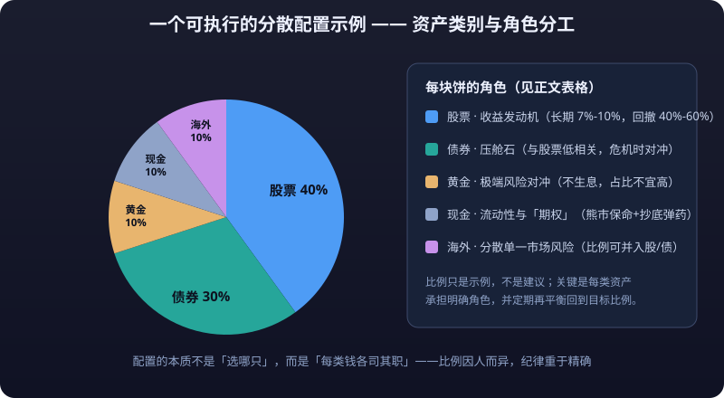

# Asset Allocation Basics

> Traders study "what to buy next"; asset allocators study "what to hold for the long run." This chapter answers three questions: why allocation matters more than stock picking and timing, what temperament each core asset class has, and how to combine them into a portfolio you can actually hold for years.

---

## 1. Why Asset Allocation Drives 90% of Long-Term Returns

### 1.1 What classic research found

One of the most famous studies in finance is Brinson, Hood, and Beebower's analysis of 91 large US pension funds from 1974–1983: **93.6% of the variance in portfolio returns could be explained by "asset allocation policy" (stock/bond ratios, etc.)**, while stock selection and timing contributed very little. Follow-up studies (Brinson 1991; Ibbotson & Kaplan 2000) reached similar conclusions across different markets and periods: **over the long run, your decision about which baskets to put money into matters an order of magnitude more than what you pick within each basket.**

**Why?**

### 1.2 An intuitive example

| Approach | Long-term experience |
|---|---|
| All-in on a single stock / single currency | High return ceiling, but one black swan can cause a **<mark>drawdown</mark>** of 60%+ — most people capitulate and exit midway |
| 60% stocks + 40% bonds, rebalanced regularly | Slightly lower returns than all-stock, but drawdowns shrink dramatically, so holders can stay invested for a decade or more |

> **Conclusion: the goal of allocation is not maximizing returns but "keeping the portfolio alive long-term with maximum drawdown under control" — only survivors get to enjoy compounding.**

### 1.3 Allocation vs trading: two legs, two pools of money

**The money this chapter discusses, and the trading discussed in the previous 13 chapters, use different money and different rules:**

| | Trading (chapters 07–11) | Allocation (this chapter) |
|---|---|---|
| Capital | Loss-tolerant satellite positions from "growth money" | The bulk of family assets (the four-bucket framework in [03 - Family Financial Planning](family-financial-planning.md)) |
| Horizon | Minutes to months | Years at a time |
| Goal | Positive expectancy, executed with discipline | Controlled volatility, beating inflation long-term |
| **Stop-loss** | Fixed per-trade percentage stop-loss | Rebalancing discipline + drawdown budget |
| Emotional demands | Very high (against human nature) | Moderate (mostly patience) |

**Both legs are indispensable**: someone who can only trade earns money with nowhere safe to go and no guardrails; someone who can only allocate never experiences market opportunity. **Build the allocation chassis first, then trade with small positions** — that is the order this chapter keeps emphasizing.

---

## 2. Core Asset Classes: Each One's Temperament

| Asset class | Historical annualized return (long-term basis) | Typical max drawdown | Correlation with stocks | Main role |
|---|---|---|---|---|
| Stocks (broad-based indexes) | 7%–10% | 40%–60% | 1.0 | Primary source of long-term returns |
| Bonds (government / high-grade credit) | 3%–5% | 5%–15% | Low / negative (in crises) | Ballast, **hedges** stock declines |
| Cash (money market funds / deposits) | 1%–3% (declining with rates) | ~0 | ~0 | **Liquidity**, emergencies, waiting for opportunities |
| Gold | 2%–5% (roughly tracks inflation over time) | 30%–50% (episodic) | Low (safe-haven traits in crises) | Extreme-risk hedge, inflation resistance |
| Real estate (tier-1/2 residential, long-term basis) | 5%–8% (incl. rent, historical data) | 20%–40% (policy restrictions / cycles) | Medium | Owner-occupancy need + long-term value preservation |
| Crypto assets | Extremely volatile (historical data, not indicative of future results) | 80%+ (common) | Medium-high (tracks risk appetite) | High risk, high volatility — position should be tiny |

**Key points:**

- **Stocks are the engine of long-term returns**: as inflation rises, corporate earnings and pricing power rise too; broad-based indexes beating inflation over decades has been a widespread pattern for the past century (historical data, not indicative of future results).
- **Bonds are the portfolio's shock absorber**: when stocks crash, bonds (especially government bonds) often rise or barely fall — their correlation is low or even negative.
- **Cash is not "no return" but an "option"**: it preserves life in bear markets and becomes ammunition for buying dips.
- **Gold produces no cash flow long-term** (no interest, no dividends); its value lies in crisis hedging — keep its share modest.
- **Real estate**'s core value is owner occupancy plus cheap mortgage leverage (**<mark>leverage</mark>**); its investment appeal depends on city, location, and population flows, and it cannot be diversified in small positions like stocks.
- **Crypto assets** are extremely volatile; in an allocation table they belong to the "satellite position that may **<mark>go to zero</mark>**" category — sized small enough that "zeroing out wouldn't affect your life."

### 2.1 Assets' meta-property: yield-bearing vs non-yield-bearing

Understand assets by splitting them into two groups:

| Category | Examples | Cash flow | Source of long-term return |
|---|---|---|---|
| Yield-bearing assets | Stocks, bonds, deposits, rental property | Dividends / interest / rent | Cash flow + price growth |
| Non-yield-bearing assets | Gold, crypto, owner-occupied homes | None | Price appreciation only |

- **Long-term returns are driven mainly by "yield-bearing capacity"**: reinvested dividends and compounded interest make up the bulk of long-term gains (historical data, not indicative of future results).
- **Non-yield-bearing assets lagging yield-bearing ones is the norm** (gold trailed stocks over the last century of long cycles — historical data); their role is "hedging," not "growth."
- From this follows an allocation principle: **put the bulk of the portfolio in yield-bearing assets (stocks + bonds + rentals), a small slice in hedges (gold etc.), and crypto-type volatile assets only within loss-tolerant positions.**

### 2.2 Correlation: the portfolio's "chemistry"

- **Correlation = how much two asset classes rise and fall together**, ranging from −1 to +1. Stock-bond correlation is low (even negative in crises), which is why the 60/40 portfolio works.
- Two caveats about correlation: ① correlations that are low in normal times **rise during crises** (global assets fall together) — don't expect perfect hedging; ② correlation drifts with the macro environment and needs periodic review; it is not a fixed constant.

---

## 3. The Stock-Bond Balance: The Classic Allocation Strategy

### 3.1 The 60/40 portfolio

The simplest classic portfolio: **60% stocks + 40% bonds**, rebalanced annually (or semiannually).

- **Why 60/40**: it balances "long-term return" against "a drawdown you can live with" — long-term returns aren't much lower than pure stocks, but max drawdown is more than halved.
- **Who it suits**: ordinary people without special preferences, office workers with no time to watch markets. Those with families and debt can lower the stock share (e.g., 50/50 or 40/60).

### 3.2 Rebalancing: principle and execution

**Principle**: asset classes' long-term return and risk characteristics are relatively stable, but short term they drift far from target weights. Rebalancing means "sell what rose too much, buy what fell too much," forcing you to **buy low and sell high** — the only consistently available alpha in asset allocation.

**Two execution methods:**

| Method | Rule | Pros | Cons |
|---|---|---|---|
| Fixed schedule | Adjust back to target on fixed dates every half-year / year | Simple, disciplined, low effort | May miss better rebalancing windows in extreme markets |
| Deviation threshold | Trigger rebalancing when any class deviates ±5 percentage points from target (e.g., stocks rising from 60% to 65%) | Trades only when needed, slightly better returns | Requires monitoring; emotionally harder to execute |

**Numeric example (fixed-schedule method; illustrative figures):**

Suppose an initial portfolio of CNY 1,000,000, targeting 60% stocks / 40% bonds:

| Point in time | Stock value | Bond value | Stock weight | Action |
|---|---|---|---|---|
| Start of year | 600k | 400k | 60% | Establish position |
| Year-end (stocks +20%, bonds +5%) | 720k | 420k | 63.2% | Sell CNY 36k of stocks, buy bonds |
| After rebalancing | 684k | 456k | 60% | Back to target weights |

**Counterintuitive but important**: rebalancing ("sell winners, buy losers") always feels awkward in the moment — why sell an asset that's performing well? Over longer horizons, though, this disciplined behavior contributes meaningfully to excess returns.

> **Note**: rebalancing incurs friction costs (taxes, subscription/redemption fees). Once or twice a year is enough; doing it too often erodes returns.

### 3.3 Risk parity: the one-line concept

The stock-bond balance splits by **dollar amount**; risk parity splits by **risk contribution**: fewer volatile stocks, more stable bonds, so each asset contributes roughly equally to portfolio volatility. Result: smaller portfolio volatility but greater sensitivity to rate changes. **Risk parity's problem**: bonds have low long-term returns, dragging overall performance down, and bond bear markets (rapidly rising rates) hurt it too. Understand it; don't deify it.

### 3.4 When to cut your stock allocation (only three cases)

| Situation | Reason |
|---|---|
| You'll need the money within 5 years (home purchase, school fees, retirement approaching) | Not enough time for drawdowns to recover |
| Income about to stop (job-loss risk, career-change gap) | Cash flow breaks, forcing sales at lows |
| Your sleep quality starts sounding alarms | Psychological tolerance is a real constraint on allocation: if you can't stomach it, you can't hold it |

**Beyond these, do not cut stock exposure because "it feels like a drop is coming" or "everyone else is running"** — that is timing, not allocation. Timing's failure rate was covered earlier.

---

## 4. Classic Allocation Models

### 4.1 Permanent Portfolio (Harry Browne)

| Asset | Weight | Logic |
|---|---|---|
| Stocks (broad-based index) | 25% | Profits in prosperity |
| Long-term government bonds | 25% | Preserves value in deflation |
| Gold | 25% | Preserves value in inflation |
| Cash (money market fund) | 25% | Survival in crises + ammunition |

- Rebalance once a year; the four classes cover the four macro states of "prosperity / inflation / deflation / crisis."
- **Pros**: some asset hedges every single extreme scenario; low volatility; sleep well.
- **Cons**: below-average long-term returns (gold and cash drag); suits extremely conservative people seeking stability.

### 4.2 All Weather portfolio (Bridgewater-inspired)

Map the economy onto the four quadrants of growth × inflation and assign an asset to each: stocks (prosperity), government/credit bonds (low growth), inflation-linked bonds / commodities (high inflation), etc. **Key insight**: don't predict which quadrant comes next — buy a bit of all four. Ordinary investors can simplify this into a mix of "stocks + long-term government bonds + gold/commodities," adjusting ratios by personal risk tolerance.

### 4.3 Lazy portfolios

- **Index fund version**: CSI 300 (or CSI 500) plus a China bond index fund, split 60/40 or 50/50, rebalanced annually — buildable in under an hour, then touch it once a year.
- **Three-account version**: cash (3–6 month emergency fund), stable sleeve (bonds/wealth products, the bulk), aggressive sleeve (index funds) — three accounts managed independently, never raided from one another.

> **Shared principle**: broad-based indexes (not individual stocks) are the default tool for ordinary people executing allocation — they diversify idiosyncratic risk by design and charge far lower fees than active funds.

### 4.4 Comparing the three models

| Model | Stock weight | Max-drawdown feel | Long-term return expectation | Suited to |
|---|---|---|---|---|
| 60/40 balanced | 60% | Moderate (~20%–30%) | Medium-high | Most office workers |
| Permanent Portfolio | 25% | Small | Medium-low | Extremely conservative, stability-seekers |
| All Weather (simplified) | 30%–50% | Small–moderate | Medium | Believers in macro hedging |
| Lazy portfolio | 50%–70% | Moderate–large | Medium-high | Those who want simplicity |

**How to choose**: first answer the "drawdown budget" question from [02 - Compounding and Return Expectations](compounding-returns.md) (how large a drawdown can you accept?), then pick a model — **the criterion is not how high the returns are, but "your state of mind looking at the equity curve at midnight."**

### 4.5 Building positions: lump sum or DCA?

| Approach | Best for | Caveats |
|---|---|---|
| Lump-sum entry | You already hold idle cash and can tolerate short-term swings | Don't buy everything at one point; spread entries over 2–3 months |
| Regular investing (DCA) | Salary cash flow, fixed monthly buys | The key discipline is "keep buying through drops" — stopping interrupts compounding |
| Buying dips (cautious) | Only with "growth money," with a hard total cap | Don't turn dip-buying into "catching falling knives"; deploy ammunition in tranches |

**Numeric example (the power of DCA; historical data, not indicative of future results; figures illustrative)**: CNY 5,000 per month at 7% annualized: after 10 years, total contributions of CNY 600,000 grow to roughly CNY 870,000; after 20 years, contributions of CNY 1,200,000 grow to roughly CNY 2,600,000. **Early gains come mostly from principal; later gains come mostly from compounding** — only past ten years does DCA truly hit its stride.

---

## 5. Allocation Advice Across Life Stages

| Stage | Income & debt profile | Risk tolerance | Allocation tendency (reference) |
|---|---|---|---|
| 20s (22–30) | Rising income, no major debt, can absorb volatility | High | Growth-oriented: 60%–80% stocks/indexes, rest bonds + cash; can accept a 50% drawdown |
| 30s (30–40) | Marriage, mortgages; fixed expenses squeeze cash flow | Medium-high | Balanced attack and defense: stocks 50%–60%, bonds + cash 40%–50%; keep a full 3–6 month emergency fund |
| 40s (40–50) | Peak income; education and retirement pressures coexist | Medium | Gradually reduce volatility: stocks 40%–50%, bonds 40%–50%; start a dedicated retirement account |
| 50s+ (50–65) | Declining income, nearing retirement | Low | Defensive: stocks 20%–40%, bonds and cash 60%–80%; prioritize capital preservation |

::: tip 💡 The right model isn't the highest-returning one
**The criterion is not how high the returns are, but "your state of mind looking at the equity curve at midnight."** The goal of allocation is not maximizing returns but keeping the portfolio alive long-term with maximum drawdown under control — only survivors get to enjoy compounding.
:::

**Two questions to gauge your own risk tolerance:**

1. **Drawdown test**: if your portfolio fell 30% within a year, would you think "great, time to add" or "sleepless"? The former can hold more stocks; the latter should dial down.
2. **Time test**: will you need this money within 5 years? Money needed within 5 years should not go into high-volatility assets at all.

---

## 6. Common Mistakes in Asset Allocation

| Mistake | Symptom | Consequence |
|---|---|---|
| All-in on one market | Only A-shares, only Bitcoin, only one property | No hedge when that market falls systematically; drawdowns start at 50% |
| Constant switching | Chasing whatever's hot, changing themes 5 times a year | Buy-high-sell-low; returns eroded by both costs and emotions |
| Treating investment as speculation | Using allocation money to chase fads, lever up, gamble on doubles | Breaks the precondition of "being able to hold"; lose both principal and composure |
| Fully invested, never rebalanced | Set and forget for ten years | Gains never banked, stock/bond ratio drifts uncontrolled, risk exposure grows |
| Over-diversification | 30 funds, 10 coins | You're diversified, not the risk; management cost and inner friction explode |
| Watching returns, ignoring drawdowns | Lured by a historical 20% annualized, blind to the -50% pothole along the way | Capitulate at the first big real-money drop and never capture that annualized figure |

### 6.1 What the six mistakes share

1. **No "target weights"**: going all-in, staying fully invested, constant switching — all symptoms of having no anchor. With an anchor there's rebalancing; without one, only chasing rallies and dumping declines.
2. **Treating volatility as the enemy**: volatility *is* the source of allocation returns (buy the dips, sell the peaks). If you hate volatility, you can't do allocation.
3. **Mistaking expected returns for promises**: a historical 20% annualized is an arithmetic-average view (see the average illusion in [02 - Compounding and Return Expectations](compounding-returns.md)); what you actually receive is roughly half that.
4. **No written record of "why I bought"**: write down "I'm buying because asset class X deserves Y%, target holding period 10 years" — anyone who can't write that down soon becomes a trend-chaser.

### 6.2 Annual allocation self-check checklist

- [ ] What are my target stock/bond weights? What are they actually? (deviation beyond 5 points triggers rebalancing)
- [ ] Did I adjust weights this year based on "feel"? What was my stated reason?
- [ ] Does any single currency / stock / theme exceed 10% of the portfolio? (if yes, write down why)
- [ ] Has the emergency fund or trading capital been raided from the allocation account?
- [ ] What was the blended fee rate (subscriptions/redemptions + management fees) this year? Did it exceed 1.5%?

**Three self-check questions:**

1. In my portfolio, is there a position cap such that "any single asset going to zero would still be acceptable"?
2. When did I last rebalance? What rule governed it?
3. Did I switch investment themes more than once this year?

---

## 7. Quick Reference

| Concept | One-liner |
|---|---|
| Allocation vs timing | 90% of long-term returns come from asset-class allocation; stock picking and timing contribute little (classic research finding) |
| Six asset classes | Stocks (engine), bonds (shock absorber), cash (ammunition), gold (hedge), property (occupancy + leverage), crypto (satellite position) |
| Stock-bond balance | 60/40 + regular rebalancing — the steadiest starting point for ordinary people |
| Rebalancing | Fixed schedule or deviation threshold; disciplined buy-low-sell-high in essence |
| Permanent Portfolio | 25% × 4 (stocks/bonds/gold/cash), covering four macro states |
| Life-stage allocation | 20s growth, 30s balanced, 40s volatility reduction, 50s+ defense |
| First principle | Build the chassis first (emergency fund + protection), then trade with small positions |

---

::: warning ⚠️ Risk Warning
All return, drawdown, and correlation figures here are **historical data, not indicative of future results**, shown only to convey orders of magnitude. Asset allocation reduces volatility and improves the holding experience but cannot eliminate risk: stocks and bonds can fall together (as in prolonged high-inflation periods), and gold and property can stagnate for years. No allocation strategy guarantees principal or returns — decide independently according to your own risk tolerance, and consult a licensed financial advisor when necessary.
:::
