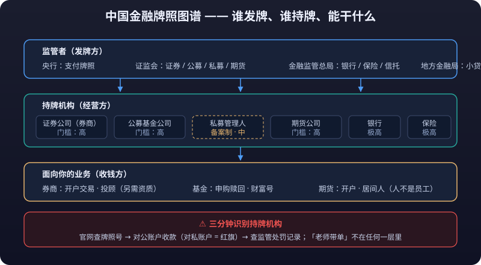

# 04 · 牌照与市场准入

> 「这家平台靠谱吗？」「这家公司是正规军吗？」——答案不在广告里，在牌照里。金融牌照是金融公司的护城河，也是交易者识别「谁是真的」的唯一硬标尺。本篇把中国金融牌照图谱、券商/期货/基金细分、境外牌照体系（香港 1-13 号牌、美国 FINRA/SEC）讲清楚，最后教你三分钟在官网核实一家机构。

::: warning ⚠️ 风险提示
本文为公开常识的客观整理，仅用于学习与研究，**不构成法律意见**。牌照类别、申请条件与监管要求持续调整，**具体以最新法律法规、监管规定及各监管机构官网为准**。持牌不等于无风险，请结合平台历史与产品风险综合判断。
:::

---

## 一、中国金融牌照图谱

### 1.1 主要牌照一览

| 牌照 | 发牌机构 | 经营什么 | 相对门槛 |
|---|---|---|---|
| 银行牌照 | 金融监管总局 | 吸收存款、发放贷款 | 极高 |
| 证券牌照 | 证监会 | 证券经纪、承销、资管、自营等 | 高 |
| 基金牌照（公募） | 证监会 | 公募基金募集与管理 | 高 |
| 基金牌照（私募/备案） | 中基协备案制 | 私募基金管理人 | 中（备案制） |
| 期货牌照 | 证监会 | 期货经纪、咨询、资管等 | 高 |
| 保险牌照 | 金融监管总局 | 人身/财产保险 | 极高 |
| 支付牌照 | 央行 | 支付机构（非银支付） | 高 |
| 小额贷款牌照 | 地方金融监管部门 | 小额放贷 | 中低 |
| 融资担保/融资租赁 | 地方金融监管部门 | 类金融业务 | 中低 |

**常识**：牌照的本质是「**<mark>特许经营权</mark> + 行为约束**」——不是想开就能开，开了就必须按监管规则经营。

::: tip 💡 官网查询永远免费且权威
**任何「正规」都可以被包装，但官网查询永远免费且权威。** 花三分钟验证牌照号、收款账户、处罚记录，胜过亏钱后打一晚上维权电话。
:::

### 1.2 为什么说「牌照是金融公司的护城河」

| 维度 | 解释 |
|---|---|
| 稀缺性 | 审批制下牌照供给有限，尤其银行、证券、保险类 |
| 资本门槛 | 注册资本动辄数亿至数十亿，新玩家难以进入 |
| 牌照附带牌照价值 | 一张券商牌照的价值远高于公司账面净资产（所谓「壳价」） |
| 行为约束 | 持牌须持续合规，违规会降级、暂停业务甚至<mark>吊销</mark> |
| 对用户 | 牌照 = 资金有监管托底（银行三方存管、客户**<mark>保证金</mark>**监控） |

::: warning ⚠️ 反向常识：牌照不直接保护用户
护城河保护的是持牌者，**不直接保护用户**——牌照只保证「正规经营」，不保证「不亏损」。看牌照是为了避开骗子，不是为了无脑信任。
:::

---

## 二、券商牌照细分

### 2.1 证券公司的四类核心业务资格

| 业务资格 | 内容 | 典型客户 |
|---|---|---|
| 证券经纪 | 代理客户买卖股票/基金/债券，收佣金 | 散户与机构 |
| 承销保荐（投行） | 帮助企业 IPO、再融资、并购，保荐责任重大 | 上市公司 |
| 证券自营 | 券商用自己的钱投资 | 券商自身 |
| 资产管理 | 代客理财（资管计划/公募子公司） | 高净值与机构 |

### 2.2 券商分类与监管

- 证监会按**风险管理能力与合规状况**对券商分类评级（AA、A、BBB……C），评级影响业务范围与缴纳保护基金比例。
- 投行项目**连带责任**：保荐机构对信披造假承担连带责任（注册制下显著强化）。
- 券商还须满足**净资本、风控指标**要求——监管部门用资本约束控制风险扩张。

**对散户的意义**：开户选**评级高、上市、历史长的头部券商**，本质是选「资本与风控更厚」的对手方；但交易体验、佣金费率同样重要，评级高不等于佣金低。

---

## 三、期货公司牌照与分类监管

### 3.1 期货业务范围

| 业务 | 说明 |
|---|---|
| 商品期货经纪 | 基础业务，几乎全部期货公司具备 |
| 金融期货经纪 | 需单独核准 |
| 期货投资咨询 | 提供策略建议（注意与「带单」区分：持牌咨询 ≠ 喊单荐股） |
| 资产管理 | 期货资管计划 |
| 风险管理子公司 | 场外期权、**<mark>基差</mark>**贸易、仓单服务（机构向） |

### 3.2 分类监管

- 证监会/期货业协会对期货公司分类评价（AA 至 D 类），高类别可开展更多创新业务。
- 期货公司同样受**净资本监管**：保证金规模与其净资本挂钩，控制单家公司可承载的风险总量。
- 客户保证金实行**独立存管**（中国期货市场监控中心统一监控）——资金不在期货公司账户里，这是行业最基础的安全设计。

---

## 四、公募 vs 私募基金牌照

### 4.1 公募基金

| 维度 | 内容 |
|---|---|
| 监管 | 证监会核准（公募牌照），募集对象为**不特定公众** |
| 门槛 | 股东实力、注册资本、投研团队、风控体系严格审查 |
| 产品 | 股票/债券/货币/混合/ETF/指数基金 |
| 销售 | 可在银行、券商、互联网平台面向大众销售 |
| 特点 | 强披露（每日净值、季报年报）、严运作（投资范围与比例限制） |

### 4.2 私募基金（备案制）

| 维度 | 常识要点 |
|---|---|
| 监管 | **中基协登记备案制**：管理人登记 + 产品备案，非审批制 |
| 注册资本 | 登记要求**实缴资本不低于一定金额**（历史上为 1000 万口径，具体以中基协现行登记须知为准） |
| 人员 | 须具备**相应数量的持证人员**（基金从业资格）与合规风控负责人 |
| <mark>合格投资者</mark> | 单只产品投资门槛通常 **100 万**；个人金融资产不低于 300 万或近 3 年年均收入不低于 50 万（具体标准以最新规定为准，同 [01](china-regulation.md) 第 4 节口径） |
| 销售限制 | 不得公开宣传推介，只能面向合格投资者 |

::: warning ⚠️ 常识提醒：备案不等于监管背书

- **私募 ≠ 公募的「高级版」**：私募门槛高是因为风险高，不是收益高。
- 「备案」不等于「监管背书」：中基协备案仅证明形式合规，**<mark>产品风险与盈亏不因备案而获得任何保障</mark>**——过去大量爆雷私募都有备案编号（呼应 [08-入土篇](../pitfalls/) 的爆雷套路）。
- 遇到「私募产品」第一步：在中基协官网查管理人登记状态、异常经营记录、关联方处罚。
:::

---

## 五、境外牌照

### 5.1 香港 SFC 受规管活动牌照详表

| 牌照 | 受规管活动 | 通俗理解 |
|---|---|---|
| 1 | 证券交易 | 股票买卖经纪 |
| 2 | 期货合约交易 | 期货经纪 |
| 3 | **<mark>杠杆</mark>**式外汇交易 | 外汇保证金 |
| 4 | 就证券提供意见 | 股票投顾 |
| 5 | 就期货合约提供意见 | 期货投顾 |
| 6 | 就机构融资提供意见 | 投行/保荐 |
| 7 | 提供自动化交易服务 | 电子交易平台 |
| 8 | 提供证券保证金融资 | 孖展（融资） |
| 9 | 提供资产管理 | 代客理财 |
| 10 | 提供信贷评级服务 | 信用评级 |
| 11 | 场外衍生工具交易 | OTC 衍生品 |
| 12 | 场外衍生工具结算 | OTC 清算 |
| 13 | 另类资产基金（拟议） | 另类资产 |

> 说明：香港现行受规管活动为 **1-12 类**；第 13 类「另类资产基金」为拟议新增，落地时间以 SFC 最新公告为准。

**查询**：SFC 官网「公众纪录册」可查持牌法团与个人的牌照状态、牌照类别、有无纪律处分——开港美股券商前必查。

### 5.2 美国 FINRA 系列考试常识

| 考试 | 通俗理解 | 常见于 |
|---|---|---|
| Series 7（一般证券代表） | 证券经纪核心资格：可销售股票/基金/期权等 | 券商代表 |
| Series 63（州证券法） | 各州证券法合规知识 | 券商代表（多数州要求） |
| Series 65 | 投资顾问考试（RIA 人员） | 投资顾问 |
| Series 66 | 63+65 合并 | 券商代表兼顾问 |
| Series 3 | 全国商品期货考试（NFA 相关） | 期货经纪 |
| Series 24 | 主管（general securities principal） | 券商管理岗 |

**常识**：FINRA 注册人员可在 **FINRA BrokerCheck（brokercheck.finra.org）** 查询——查历史违规记录、投诉、处罚，是验证「你的美股经纪人靠不靠谱」的公开渠道（美股券商开户时也应主动看其 SEC/FINRA 注册状态）。

### 5.3 SEC RIA（注册投资顾问）

| 维度 | 内容 |
|---|---|
| 概念 | Registered Investment Adviser：以「<mark>受托责任</mark>」提供投资建议的机构（私人客户资产管理、投顾） |
| 注册 | 管理规模超一定门槛（1 亿美元量级，具体以 SEC 规则为准）向 SEC 注册，以下向州注册 |
| 收费 | 通常按管理资产（AUM）收取管理费，而非交易佣金 |
| 与经纪商区别 | 经纪商是「执行交易」（Reg BI 最佳利益），RIA 是「管理资产」（受托责任）——利益冲突披露要求更严 |

---

## 六、「买壳 vs 申牌」的现实

### 6.1 两条路径的对比

| 路径 | 成本 | 时间 | 风险 |
|---|---|---|---|
| 直接申请牌照 | 资本+合规投入大 | 长（数月到数年） | 审批不确定性 |
| 收购持牌公司（买壳） | 数亿到数十亿（证券/期货类） | 快 | 壳的历史合规问题、负债与处罚遗留 |

**常识**：买壳的本质是购买「稀缺行政许可」本身——监管部门对股权变更同样有审批，**买了壳不代表自动能换股东**；历史上「先买壳后爆雷」的案例不少，因为买壳方往往带着高杠杆与激进业务诉求。

### 6.2 无牌经营的常见伪装

| 伪装 | 真相 |
|---|---|
| 「我们用的是某某持牌券商的白标」 | 可能只是租用通道，资金与合规责任归属存疑 |
| 「海外牌照，国内运营」 | 境内<mark>无牌运营</mark>本身即违规（见 [03-加密监管.md](crypto-regulation.md)） |
| 「正在申请中」 | 申请 ≠ 已持牌，禁止在无牌状态下开展受规管业务 |
| 盗用/仿冒牌照号 | 直接官网核对即可识破 |

---

## 七、对交易者的意义：三分钟识别持牌机构

### 7.1 官方查询渠道

| 我要验证什么 | 去哪查 |
|---|---|
| 券商/期货公司/基金公司是否持牌 | 证监会官网「监管信息公开」→「证券期货机构名录」 |
| 私募管理人是否登记 | 中国证券投资基金业协会官网（amac.org.cn） |
| 银行/保险/支付机构 | 金融监管总局官网、央行官网 |
| 香港持牌机构 | 香港 SFC 官网公众纪录册 |
| 美股券商/经纪人 | FINRA BrokerCheck、SEC 官网 |
| 期货经纪商（美国） | NFA BASIC 数据库 |

### 7.2 验证五步法

1. **对牌照号**：官网查到的机构全称、牌照号与对方宣称的完全一致。
2. **对主体**：收款账户名称必须是持牌机构本身，**绝无个人账户/第三方收款**。
3. **查记录**：看有无行政处罚、纪律处分、经营异常（私募尤其要看）。
4. **查域名**：官网域名与备案主体一致，仿冒站常差一个字母。
5. **反向验证**：可疑平台去监管机构官网搜它的名字——搜不到或对不上，一票否决。

::: tip 💡 最终常识：三分钟验证胜过事后维权
任何「正规」都可以被包装，但**官网查询永远免费且权威**。花三分钟验证，胜过亏钱后打一晚上维权电话。
:::

---

## 八、牌照速查表

| 我看到的身份 | 对应牌照/登记 | 查询机构 |
|---|---|---|
| 大陆券商 | 证券业务许可 | 证监会 |
| 大陆期货公司 | 期货业务许可 | 证监会 |
| 私募基金 | 私募管理人登记 | 中基协 |
| 港美股券商（香港主体） | 1 号牌（等） | 香港 SFC |
| 美股券商 | SEC 注册 + FINRA 会员 | SEC / FINRA |
| 外汇平台（美国） | NFA 会员 + CFTC 注册 | NFA BASIC |
| 加密交易所（香港） | VASP 牌照 | 香港 SFC |

---

## 延伸阅读

- 违规与处罚的具体类型：[01-中国金融监管体系.md](china-regulation.md)
- 境外牌照的监管背景：[02-美国与全球监管.md](us-global-regulation.md)
- 加密牌照现状：[03-加密监管.md](crypto-regulation.md)
- 无牌平台与仿冒牌照是骗局重灾区：[08-入土篇](../pitfalls/) 的 [02-骗局识别.md](../pitfalls/scam-detection.md)
