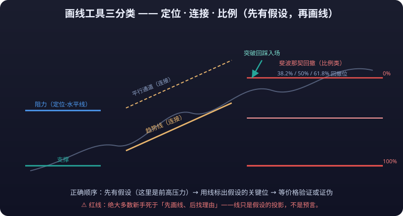

# 07 · 画线工具实战

> 画线是把「你看懂的价格结构」翻译成「屏幕上可验证的假设」的唯一手段。水平线标出**<mark>支撑压力</mark>**，**<mark>趋势线</mark>**标出节奏，通道标出边界，斐波那契标出回撤目标，XABCD 标出谐波结构——**<mark>工具本身没有预测能力，画线的质量取决于你「为什么在这里画」，而不是「画得有多准」</mark>。**

::: tip 💡 一句话总纲
一句话总纲：**画线是为了给交易决策提供「参考系」和「<mark>失效条件</mark>」，不是为了画出好看的图形。** 一条线如果没有对应的**<mark>止损</mark>**位或观察位，它就是装饰。
:::

---

## 1. 画线的本质：把结构翻译成假设

技术分析的画线工具成百上千，但所有工具本质上只做三件事：

| 工具类别 | 回答的问题 | 典型工具 |
|---|---|---|
| **定位类** | 「哪里是重要的价位/时间？」 | 水平线、垂直线、价格标签 |
| **连接类** | 「这段走势的节奏/边界/趋势是什么？」 | 趋势线、射线、通道、速度线 |
| **比例类** | 「回调/延伸/形态的目标位在哪里？」 | 斐波那契系列、XABCD、江恩 |

**画线的三层正确用法**：

1. **描述**（最低层）：用线把已经发生的结构画出来——这谁都会，但只有「事后验证」价值；
2. **预设**（中间层）：画线之前先有观点（「这里是前高压力」），线只是观点的可视化；
3. **触发**（最高层）：线给出明确的**触发条件**——突破/跌破/回踩确认，配合 [07-交易系统篇](../trading-system/) 的风控一起执行。

::: danger ⚠️ 红线提醒
**绝大多数新手死于「先画线、后找理由」。** 正确顺序永远是：**先有假设 → 再用画线标出假设的关键位 → 等价格验证或证伪**。
:::

---

## 2. 定位类：支撑压力与关键位

### 2.1 水平线（Horizontal Line）

水平线是最重要的单一工具，它画的不是「线」，是**价格锚点**：

- **画在哪**：前高/前低、整数关口、密集成交区边缘（配合 [03-量价分析](volume-price.md) 的筹码分布）、长期均线附近；
- **怎么用**：价格第一次触碰往往只是「测试」，第二次/第三次触碰才是真正的博弈点——**触碰次数越多、停留时间越久，这条线的「含金量」越高**；
- **失效条件**：收盘价有效突破（一般用 1.5%~3% 或 1 根 ATR，见 [02-技术指标详解](indicators.md) 的 ATR 章节）后，支撑变压力、压力变支撑。

### 2.2 价格标签（Price Label）与垂直线（Vertical Line）

- **价格标签**：把「我当时认为的重要价位」直接钉在图上。**建议只标 3~5 个，标多了等于没标**；
- **垂直线**：标出**时间**而非价格——财报日、CPI 公布、交割日、大额解锁日。时间类事件驱动的用法详见 [11-交易实战篇](../trading-practice/) 的事件驱动章节。

---

## 3. 连接类：趋势与节奏

### 3.1 趋势线（Trend Line）

趋势线连接**两个以上的显著低点（上升趋势）或高点（下降趋势）**：

- **最少两个点，第三个点确认**：两点成线只是「猜测」，第三个点回踩不破才值得尊重；
- **斜率的意义**：斜率越陡，越容易快速失效（陡峭趋势线被跌破时往往直接反转而不是横盘）；斜率越平缓，参考价值越持久；
- **画线原则**：连接实体边缘（影线穿透是常态，不必硬接影线顶端），优先选择「被多次测试」的线。

### 3.2 射线（Ray）与多段线（Polyline）

- **射线**：从起点向右无限延伸，适合「从历史关键位出发、预测未来延伸方向」的场景——例如从大级别底部画射线看当前趋势的延伸边界；
- **多段线**：手动把一段复杂走势「拉直」成折线，用于复盘走势结构（哪一段是主升、哪一段是调整），**不适合直接用作交易触发**，因为锚点是你自己选的，天然带主观性。

### 3.3 箭头（Arrow）

箭头是「标注」而不是「分析」：在图上标出「这里的突破是有效的」或「这里是假突破」。**建议与截图分享功能配合使用**——复盘时用箭头+文本标注还原当时的思考，详见 [07-交易系统篇](../trading-system/) 的交易复盘进阶。

---

## 4. 通道类：边界与回归

### 4.1 平行通道（Parallel Channel）与水平通道（Horizontal Channel）

- **平行通道**：一条趋势线 + 一条与之平行的边界线，框住一轮趋势的「上下轨」。用法：
  - 下轨买入、上轨卖出、中轨观望（震荡通道）；
  - **通道被突破 ≠ 立刻追**：突破后常见「回踩确认」再启动，直接追容易被**<mark>假突破</mark>**收割；
- **水平通道**：两条水平线框住一段横盘区间（箱体）。**箱体的价值在上下沿**：下沿买、上沿卖、突破箱体后原箱体变成「支撑/压力平台」。

### 4.2 回归通道（Regression Channel）与速度线（Speed Lines）

- **回归通道**：对区间内所有 K 线做线性回归，画出「最优中线 ± 标准差」的上下轨。**它比手工通道客观**——不依赖你手抖的锚点选择，适合验证「当前趋势是否仍在中线一侧运行」；
- **速度线（Speed Lines）**：把 A→B 的涨幅三等分，画 1/3、2/3 两条速度线。**用途**：趋势中回调到 1/3 线通常是强势整理，跌破 2/3 线往往意味着趋势加速恶化。属于「次级参考」，单独使用信号质量一般。

---

## 5. 比例类：斐波那契系列

### 5.1 斐波那契回撤（Fibonacci Retracement）

最常用的一档：从一段**显著摆动**（如最低→最高）拉出 0.236/0.382/0.5/0.618/0.786 等回撤位：

- **<mark>0.618 是「黄金位」</mark>**：回调到 0.618 不破 → 趋势健康；跌破 0.618 回撤位 → 原趋势大概率转弱；
- **用法**：在回撤位（尤其是 0.382/0.5/0.618 附近）等待企稳信号（如 [01-K线形态](chart-patterns.md) 的锤子线/吞没形态 + 放量），**而不是在回撤位直接挂单**；
- **常见误区**：把回撤位当「精确点位」而非「模糊区域」。0.618 附近 ±1% 都算有效，追求精确到小数点后两位是自欺。

### 5.2 斐波那契扩展 / 扇形 / 时间线

- **扩展（Fib Extension）**：预测突破后的目标位（1.272/1.618/2.618）。**用途**：**<mark>止盈</mark>**参考，而不是「必须到的价格」——到达目标位附近就应分批止盈并上移止损；
- **扇形（Fib Fan）**：从起点向不同斜率发出分位线，用于判断趋势回撤的「角度级别」；
- **时间线（Fib Time）**：在时间轴上按黄金分割分位画竖线，预测「变盘时间窗口」。**客观评估**：时间类工具的胜率与随机接近，更适合当作「到时间点就提高警惕」的提醒，而不是交易信号。

### 5.3 周期线（Cycle Lines）

周期线以**第一锚点 A 为原点**，把 **A→B 的时间间隔当作一个周期**，向右等比延伸 12 根竖线（A 处实线，后续虚线并带 `+1/+2…` 序号标签）。适合：

- **观察节奏是否「复现」**：在明显的波段低点 A 起、到下一个同类低点 B 量出周期，延伸线落在后续的「潜在同相位转折点」；
- **配合江恩/斐波那契时间线交叉验证**：不同时间工具在同一天共振时，才更值得警惕；
- **识别周期漂移**：如果转折点总比延伸线「晚几天」，说明周期在拉长，不要机械地按原周期抄底。

### 5.4 斐波那契通道（Fib Channel）

斐波那契通道 = **一条基准趋势线 + 一组按斐波那契比率平行偏移的通道线**。拖 A→B 定义摆动（基准线）后，系统以 A→B 的摆动幅度为 1 倍，向两侧按 0.236/0.382/0.5/0.618/0.786/1/1.272/1.618 生成 8 条平行分位线，横贯整个可视宽度：

- **方向敏感**：A→B 是向上摆动时，分位线在基准线上方按比例延伸（回调/扩展目标）；向下摆动则镜像到下方。**先点 A 再点 B 的顺序决定了通道的朝向**，这与斐波那契回撤的「起止决定方向」一致；
- **关键分位**：0.382/0.618 是「通道内回踩最常被测试」的中枢；1.272/1.618 在通道突破后变成**扩展目标带**（类似扩展工具）；0.236 是强势趋势中「浅回调」的观察位；
- **用法**：价格在通道内运行时，下轨/上轨是**区域边界**而非精确点位；通道被有效突破后，原边界反向成为支撑/压力，扩展位（1.272/1.618）是分批止盈的参考；
- **与平行通道的区别**：平行通道只画等宽上下轨（假设波动幅度恒定），斐波那契通道则把**同一摆动的黄金分割比例**映射成多条平行线，更适合「一波主升后判断回撤深度与延伸目标」的场景。

**客观评估**：通道线的间距由 A→B 摆动幅度决定，**锚点选得越长，通道越宽、参考价值越低**（几乎能包住任何行情）。请优先在「结构清晰的波段」上画，而不是在震荡行情里硬套。

### 5.5 楔形（Wedge）

楔形用**三条边收敛**描述趋势末段的「压缩」：点 1/点 2 分别是两条边的起点，点 3 是收敛点，两条边在收敛点之后继续以虚线投影延伸。按方向分两种：

- **上升楔形（Rising Wedge）**：两条边都向上倾斜且收敛，常出现在**上涨末段**——多方力量衰减，虽创新高但斜率放缓，跌破下边是转空信号；
- **下降楔形（Falling Wedge）**：两条边都向下倾斜且收敛，常出现在**下跌末段**——空方力量衰竭，突破上边是转多信号。

**用法**：

- **楔形内部不操作**：收敛意味着波动收窄，突破前方向未定，盲目高抛低吸容易被打脸；
- **看突破方向**：上升楔形跌破下边（配合放量）看空，下降楔形突破上边（配合放量）看多；**假突破**常见于楔形末端，突破后回踩确认再进场更稳；
- **收敛点的意义**：两条边越靠近收敛点，变盘越临近——可以把收敛点附近当作「时间上的警戒区」；
- **与三角形/通道的区别**：三角形是「收敛的形态」，楔形是「带方向倾斜的三角形」；通道两条边平行（波动幅度恒定），楔形两条边收敛（波动幅度递减）。

**客观评估**：楔形是最常被滥用的形态之一——震荡行情里随手一画到处都是「楔形」。请只在**结构清晰的趋势末段**（前期有明确的推动浪 + 当前斜率明显放缓）使用，并始终给楔形设定突破确认的失效条件（如收盘价 + 1 ATR 有效突破）。

### 5.6 平行射线 / 宽度通道（Parallel Ray / Width Channel）

这两件工具解决同一类需求：**已经画好一条趋势线后，再快速复制出「同斜率、不同位置」的参考线**。

- **平行射线（Parallel Ray）**：先点 A、B 定义**方向**，再点 C 作为**射线起点**——系统从 C 沿与 A→B 完全平行的方向向右无限延伸一条射线（A→B 用细虚线标出方向）。典型场景：把一段主趋势的斜率「搬运」到另一个价位，观察**同斜率、不同水平的走势是否复现**（比如把前高趋势线平移到当前低点做支撑参考）；
- **宽度通道（Width Channel）**：先点 A、B 定义**基准方向**，再点 C 决定**通道宽度**——系统画出过 A 与过 C 的两条无限平行线，并用虚线标出 B→C 的宽度连线。与「平行通道」的区别：平行通道的宽度由 A→B 两点价差自动决定，宽度通道的宽度由**第三个点 C 任意指定**，更适合「两条边分别贴合两段独立波动」的场景。

**用法**：

- **平行射线 = 斜率搬运**：先在明确的推动段 A→B 上定义斜率，再把它平移到你关心的关键价位（前高/前低/整数关口）。**不要**在斜率已经失效的行情里反复搬运——趋势线斜率本身会随主升/主跌段变化；
- **宽度通道 = 边界贴合**：C 点应当放在「另一条真实波动的高/低点」上，让上下轨分别贴合真实波动，而不是随手拖一个宽度——通道的参考价值完全取决于 C 是否贴合真实结构；
- **命中与编辑**：两条工具都是 3 锚点（A/B/C 均可拖拽），平行射线的方向参考线、宽度通道的两条平行线与宽度连线都在命中范围内，方便点击选中后整线拖移或微调锚点。

**客观评估**：平行类工具是「趋势线」的自然扩展，本身不产生新信息——它复制的只是**已存在结构的斜率**。真正有效的用法是：A→B 定义的是**大级别可靠趋势**，C 落在**小级别关键价位**，形成「大斜率 + 小位置」的组合观察，而不是在 5 分钟图上随手画两条平行线自嗨。

### 5.7 趋势角度 / 时间区间（Trend Angle / Time Range）

这两件工具分别把「斜率」和「时间窗」显性化，属于**辅助观察类**画线——它们不新增结构，而是把你本来看得见、但容易忽略的量化信息标注出来。

- **趋势角度（Trend Angle）**：拖 A→B 画一条线段，系统在 A 端画一段小圆弧，并在线段中点标注**相对水平方向的夹角**（屏幕空间，向上为正、向下为负，范围 −90°~+90°）。两点按时间排序（先左后右），选中后可整线拖移或拖锚点微调；
- **时间区间（Time Range）**：拖 A→B 框出两个时间点，系统在主图区画出**半透明竖带**（左右边框 + 顶部日期区间标签「起始 ~ 结束」）。竖带内部任意位置都能点选，适合标注「事件窗口」「财报/数据公布时段」或「一段结构完成的时间段」。

**用法**：

- **角度用于比较斜率变化**：主升段与回调段的夹角差异可以快速量化——比如「这一轮上涨角度 38°，比上一轮 52° 明显放缓」，比肉眼对比两条线更客观。注意：K 线图的横轴（时间）与纵轴（价格）量纲不同，角度是**屏幕空间**的值，改变图表宽度/缩放会变化，只适合在同一视图内横向比较；
- **时间区间用于给图表打「时间锚点」**：画区间时尽量让左右边框落在**关键时间点**（形态起点/终点、重大消息时刻）上，而不是随手一拖——区间的价值在于「这段时间发生了什么」；
- **命中与编辑**：角度工具按线段命中；时间区间按**区域命中**（带内任意位置可点选，外部按到边框的距离），方便点选后整带拖移或拖左右锚点调整区间。

### 5.8 价格带（Price Band）

价格带是**时间区间的横向孪生**：时间区间把「一段时间」涂成竖带，价格带则把「一段价格」涂成横贯全图的**水平带**。

- **拖法**：拖 A→B（纵向跨度）即可，系统自动按**价格升序**归一化两点（低价在上边、高价在下边），画出一条半透明水平带——上下两条边框线横贯全宽，左侧各带价格标签（`toFixed(2)`）；
- **命中**：带内任意位置（任意横坐标、纵坐标在上下边之间）都能点选，外部按到最近边框的**竖直距离**判定，方便选中后整带拖移或拖上下锚点微调区间；
- **典型用法**：标注**成交密集区 / 支撑压力带 / 目标价区间**——比如「下方 64_000~64_300 是前两周的筹码密集带，跌破下沿说明多头防线失守」。它比单条水平线更能表达「一个区间」而不是「一条线」，比矩形更贴合「只关心价格、不关心时间窗口」的场景。

**客观评估**：价格带是**支撑压力的区间化表达**，本身不预测方向。它的价值在于把「一条线容易误读为精确值」的陷阱，修正为「这是一个模糊区域」——价格在带内反复纠缠是常态，真正有信号意义的是**带沿的突破/失守**（配合成交量与[筹码分布](volume-price.md#5-筹码分布vpvr与密集成交区)一起看）。

### 5.9 斐波那契时间区间（Fib Time Zones）

斐波那契时间区间是**周期线的斐波那契版**：拖 A→B 定下基期（A 为原点、A→B 的时间间隔为基期），系统从 A 点向右按**斐波那契倍数**（1、2、3、5、8、13、21、34、55…）逐根画出分界线，并给相邻分界之间涂上**交替半透明竖带**——把「斐波那契日/周」的时间窗口直观地铺在图上。

- **拖法**：拖 A→B（横向跨度）即可，A 为原点、B 只用来确定基期长度；分界线依次落在 A 起 1×、2×、3×、5×、8×、13×、21×、34×、55× 基期的位置（首条 n=1 实线，其余虚线），顶部标倍数标签；
- **方向敏感**：与周期线一致，两点**保序**——A 在左向右延伸、A 在右则向左延伸，翻转拖动方向会镜像翻转，不会自动归一化掉你的意图；
- **命中**：任意相邻分界之间的**竖带区域**都能点选（带内任意位置），外部按到最近分界线的**水平距离**判定，方便选中后整线拖移或拖锚点调整原点/基期；
- **典型用法**：标注**斐波那契时间窗**——把一段显著趋势的起点设为 A、把「一个完整波段」设为基期，之后的分界线就是理论上容易发生**变盘/转折**的时间节点。适合复盘「前几次高低点是否落在分界线附近」，也适合在趋势运行中提前标注「下一个时间窗口在哪」。

### 5.10 图层管理：隐藏、锁定与清空

画线工具越用越多，图上会堆满「陈年旧线」——不是每条线都该被删除，但也不是每条线都该时刻可见、随时可点。**图层管理**解决的是「线多了之后怎么组织」：每条线可以**隐藏**（不渲染、不参与命中）或**锁定**（仍渲染，但不可选中、不可拖拽），也可以单行删除或一键清空。

- **隐藏（👁/🚫）**：隐藏后这条线**从图上消失**，也不再参与任何命中判定——它只是被「归档」了，落库数据还在，随时可以再显示回来。适合「暂时不需要看，但之后复盘还要用」的线（比如某个历史波段的多组平行通道）；
- **锁定（🔓/🔒）**：锁定后这条线**仍然渲染**（结构继续在图上作参考），但**点不到、拖不动**——鼠标/触屏点到它不会选中，也就不会误拖。适合「已经确认、只作参照」的关键位（比如周线级别的趋势线），防止日常缩放/平移时误碰；
- **单行删除（🗑）**：只删这一条；**全部清除**则清空当前交易对的所有画线。删除不可撤销，清除前要想清楚；
- **行选中态**：在面板里点某一行，图上对应画线同步选中（蓝色 + 锚点），方便从列表直接定位到图上的线；
- **入口**：桌面/移动端「画线」折叠面板内新增「图层管理」按钮（带当前数量），点开即见列表。

**客观评估**：图层管理是**纯组织工具**，本身不产生任何分析信号——它防的是「线太多导致视线污染」和「误拖关键位」。隐藏 ≠ 删除（数据仍在，随时可恢复），锁定 ≠ 不可见（结构仍在，只是不可操作）。合理用法：**关键位锁定、过程线随时隐藏、废弃线及时删**；把图面留给当下真正在用的结构，其余交给图层列表。

### 5.11 风险回报（Risk/Reward, R:R）

**<mark>风险回报</mark>**是最「交易员化」的辅助工具：它把**入场点、止损点、止盈点**三个价格一次性铺在图上，并自动算出盈亏比——这是仓位管理与「这笔交易值不值得做」的直观标尺。

- **画法**：连续点三个点——**A 入场 → B 止损 → C 止盈**（顺序即语义，系统保序不重排）；图上出现三条**横贯全宽**的水平线：入场线实线、止损/止盈线虚线（选中态全部变蓝），左侧各带价格标签，右侧入场线附近显示**盈亏比标签**（`1:{ratio}`）；
- **算法**：`risk = |A − B|`（入场到止损的距离）、`reward = |A − C|`（入场到止盈的距离）、`ratio = reward / risk`；当止损价与入场价相同（risk=0）时 ratio 记 0 不崩溃——也提醒你「没设止损的交易谈不上盈亏比」；
- **命中**：三条水平线任一条的竖直距离命中，方便点选后整组拖移，或拖任一锚点微调入场/止损/止盈；
- **典型用法**：下单前先在图上摆好「如果错了在哪走、如果对了在哪走」，一眼看清**盈亏比是否 ≥ 2**（通常要求至少 1:2 才值得承担风险）；也适合复盘——亏损单往往不是方向错，而是**盈亏比倒挂**（reward 远小于 risk 还在做）。

**客观评估**：R:R 是**风控前置**的工具，不是预测工具——它不告诉你「会不会涨」，只帮你把「错了亏多少、对了赚多少」摆到明面上。**盈亏比再漂亮，胜率太低也一样亏**；真正的仓位决策要把 R:R 与[胜率](../trading-system/)放在一起算期望值（EV = 胜率×reward − 败率×risk）。止损不设、止损乱设（离入场太近被正常波动扫掉）都是 R:R 工具最常见的误用。

---

## 6. 形态类：矩形 / 椭圆 / 圆 / 三角形 / 圆弧

形态类工具是「把肉眼看到的形状变成可测量对象」的辅助工具：

| 工具 | 用途 | 纪律 |
|---|---|---|
| 矩形 | 框出震荡区间/整理平台 | 上下沿才有意义，内部不交易 |
| 三角形 | 框出收敛/发散形态 | 突破方向比形态本身更重要 |
| 椭圆/圆/圆弧 | 标注弧形结构（圆弧底/顶） | 主观性最强，仅作复盘标注 |

> **核心提醒**：形态工具画出来的「形状」必须配合 [04-蜡烛图高阶](advanced-candles.md) 的**确认信号**（突破 + 量能 + 回踩）才有操作价值。光有一个三角形轮廓，什么也说明不了。

---

## 7. 结构类：XABCD 谐波形态 / 艾略特波浪 / 江恩角度线

### 7.1 XABCD 谐波形态（Harmonic Pattern）

**<mark>谐波形态</mark>**用 **X→A→B→C→D 五个点** 描述特定比例的价格结构（蝴蝶、蝙蝠、螃蟹、加特利等），核心是**各段之间的斐波那契比例关系**：

- **用法**：找到 XA、AB、BC、CD 满足经典比例（如 AB ≈ XA 的 0.618、BC ≈ AB 的 0.382~0.886、CD ≈ BC 的 1.272~1.618）的形态，在 D 点附近寻找反转信号；
- **争议与陷阱**：
  - 五个点全部事后可调，「先有形态后有价格」的样本里胜率虚高；
  - **务必在 D 点等「反转确认」**（反转 K 线 + 量能），不要因为「比例到了」就逆势抄底/摸顶；
- **建议**：把它当作「潜在反转区域」的探测器，而不是精确入场触发器。

### 7.2 艾略特波浪（Elliott Wave）

五浪结构（1~5 推动 + A~C 调整）的完整原理、三条铁律与「千人千浪」争议详见 [05-波浪与江恩与缠论](elliott-gann-chan.md)。**画线实操要点**：

- 用 5 点工具依次标出浪 1~5 的终点，**画之前先写下你的数浪假设**；
- 铁律校验：浪 2 不破浪 1 起点、浪 3 不是最短、浪 4 不与浪 1 重叠——违反即重数；
- **正确心态**：数浪是「描述框架」，波浪工具的价值在于逼你想清楚「现在处于什么位置」，而不是给出确定的买卖点。

### 7.3 江恩角度线（Gann Fan）

从起点按 1×8 到 8×1 的九条角度线，代表「时间 × 价格」的速度刻度：

- **1×1 线**（45°）是最重要的参考：价格在其上方运行 → 多头强势；跌破 → 转弱；
- **争议**：角度依赖坐标缩放（同一图形拉宽/拉高后角度全变），所以江恩线在不同软件/不同缩放下会「变形」——**务必在同一坐标系下使用，且只当趋势速度的参考，不当精确信号**。

### 7.4 江恩箱（Gann Box）

江恩箱是角度线的「区域化」版本：拖 A→B 两点框出矩形，箱内自动画出 10 条角度线——**1×1 双对角线（加粗）+ 四角 1×2 / 2×1**。

- **用法**：框住一段行情的整理区间后，观察价格在箱内的「角度节奏」——沿 1×1 走 = 均衡，跌破转 2×1 承托 = 降速，沿 2×1 陡升 = 加速段（警惕情绪高潮）；
- **共振**：箱体 1×1 对角线 / 上沿与斐波那契 0.5/0.618、通道边界重叠的位置，参考价值更高；
- **命中与编辑**：点击箱内任意位置选中（区域命中），A/B 两角锚点可分别拖拽；失效条件与 7.3 相同——**收盘明确跌破且不收回，即失效**；
- 完整实战（含时间-价格平衡、常见误区）见 [08-江恩箱与角度线实战](gann-box-angles.md)。

---

## 8. 辅助类：量度与文本标注

### 8.1 量度（Measure）

量度工具显示两点间的**价差与涨跌幅**，最适合：

- 测量「突破高度」：从箱体上沿到目标位的高度，用于估算突破后的等幅目标；
- 测量「回撤幅度」：快速判断当前回撤是 0.382 还是 0.5，配合斐波那契交叉验证；
- **量度给出的是数字，不是观点**——数字要放到你的交易计划里才有意义。

### 8.2 文本标注（Text）

文本标注是**复盘的第一生产力**：在图上写下「为什么在这里买」「当时忽略了什么」「这笔亏在哪个环节」。**建议给每笔交易建立「图形 + 文字」的双记录**，一个月后回看，比任何指标都更能暴露你的决策漏洞。

Kline Buty 的文本标注支持**多行文本（Enter 换行 / ⌘+Enter 确认）**，并可在编辑面板调整**字号（A−/A+）与颜色（默认跟随主题黄，或蓝/红/绿/白/紫）**——用颜色给标注分级（如红色=风险、绿色=机会），复盘时一眼扫过就能区分「计划」与「警示」。文本框整体可点击选中（不限于锚点），方便二次修改或删除。

---

## 9. 画线的纪律：从「会画」到「会用」

### 9.1 锚点选择的三条铁律

1. **锚点必须取自显著结构**：前高前低、放量顶底、长时间盘整边界——不要用随机波动的高低点；
2. **锚点越少越可信**：一条趋势线被测试 3 次以上才有价值，频繁重画 = 你在「迁就行情」；
3. **多周期对齐**：日线画的线放到 4H/1H 里应仍然「有意义」——大级别锚点对小级别始终有效，反之则经常失效（多周期方法见 [04-蜡烛图高阶](advanced-candles.md)）。

### 9.2 每条线都必须有「失效条件」

画完任何一条线，问自己三个问题：

| 问题 | 答不上来的后果 |
|---|---|
| 这条线代表什么观点？ | 线是装饰，删掉 |
| 价格到线上我怎么做？ | 没有触发计划，等于没画 |
| 价格怎么走就算这条线错了？ | 没有失效条件，你会一直扛单 |

::: tip 💡 画线的终极检验
**画线的终极检验**：把图上所有线遮住，如果你还能说出「支撑在哪、压力在哪、止损在哪、怎么算错」，那这些线就是有效的；说不出来，就是心理安慰。
:::

### 9.3 常见错误清单

- ❌ 画线密度过高（一屏 >10 条线）：信息过载，等于没有信息；
- ❌ 反复移动锚点去「拟合」行情：这是画线版的过度拟合，与 [06-技术分析批判与验证](ta-validation.md) 讲的回测过拟合是同一件事；
- ❌ 把回撤位/目标位当精确价格：它们是**区域**，不是**点位**；
- ❌ 用画线信号替代风控：再好的结构判断也要靠 [07-交易系统篇](../trading-system/) 的止损/仓位管理兜底。

### 9.4 移动端触屏编辑：画线的「指上操作」

- **触屏拖拽绘制**：所有画线工具由 pointer 事件驱动，手指按下 → 拖动（或逐点点击）→ 抬起即完成锚点；多点工具（楔形/安德鲁叉/XABCD 等）逐点点击落锚，与桌面点击一致；
- **轻点选中**：触屏轻点落在画线命中区域内即选中（显示锚点圆点），与桌面单击选中同一套命中逻辑（`hitTestDrawings` / `nearestAnchor`）；
- **整线拖动**：选中后手指在线上拖动 → 整线平移，所有锚点保持相对关系、增量一致（E2E 校验同一 id 各锚点增量一致）；
- **锚点拖拽**：选中后直接抓取某个锚点圆点拖动 → 仅该锚点移动（其余锚点不动），实现局部形态调整；
- **长按钉线与编辑互不干扰**：触碰已选画线或其锚点时，手势用于编辑（整线/锚点拖拽），不再启动长按钉十字光标；触屏编辑拖拽期间也不显示十字光标跟随手指（避免视觉噪音）。长按钉线只在空白区域生效；
- **触觉反馈**：长按钉线/关键操作带触觉反馈（navigator.vibrate，Android 有效）。

> **触屏与鼠标的心智差异**：桌面用「悬停+单击」区分选中与编辑，触屏没有悬停态，所以用「先轻点选中 → 再拖动编辑」的两段式交互，既避免误触，又保留与桌面一致的锚点编辑能力。

### 9.5 移动端画线完成自动切回「鼠标」

移动端每完成一条画线（含文本标注确认）后，工具**自动切回「鼠标」只读模式**，与桌面端「保持工具连续画线」的策略刻意区分：

- **避免误建**：画线刚完成、锚点还在眼前时，手指最可能的下一动作是微调，而不是立刻再画一条；若工具停留在原工具，空白处随手一点就会**误建一条新画线**（文本还会弹编辑器）；
- **直接可编辑**：自动切回后无需再手动点「鼠标」，选中态保持，直接触屏拖拽整线/锚点/文本本体即可微调（与 9.4 两段式交互衔接）；
- **实现**：`App.commitDrawing` 在移动端（`isMobile`）提交成功后 `setDrawingTool('none')`；桌面端逻辑不变（连续画线更顺手）。

---

### 9.6 文本标注快捷编辑：双击 / 长按即改字

文本标注的「改字」不再需要先点中画线、再进画线面板找「改字」按钮——**直接对文本本体发起快捷编辑**：

- **桌面端**：鼠标**双击**文本标注本体 → 直接打开文本编辑器，内容/字号/颜色全部回填，改完确认即落库；
- **移动端**：**长按**文本标注本体（约 250ms 不动）→ 直接打开移动端文本编辑器，同样回填后可改字/字号/颜色；
- **前置条件**：快捷编辑只在「鼠标」只读模式下生效（移动端画完自动切回鼠标，桌面需手动切回）；画线模式下双击/长按仍是绘制手势，不会误弹编辑器；
- **实现**：adapter 增加 `onEditText` 回调 + 容器 `dblclick` 监听（桌面），触屏 `touchstart` 命中文本后走 250ms 长按定时器（移动端）；命中文本时即使 pointer 已为拖拽接管（文本刚创建处于选中态），也以长按优先打开编辑器，拖拽/钉线互不干扰；
- **交互心智**：文本标注是「先写后调」的产物，快捷编辑把「改字」成本从三步（选中 → 开面板 → 点改字）降为一步（双击/长按），鼓励标注后随行情演进持续修订而非弃置。

---

### 9.7 移动端十字光标「松手保留」：读完 OHLC 再收手

移动端没有悬停态，「边拖边读 OHLC」一直是痛点：旧行为是**拖到哪显示到哪、一松手就消失**，手指一抬数字就没了，记不住几个价格。现改为**松手保留 2 秒**：

- **拖动 / 长按钉线后抬起**：十字光标保留 2s（`TOUCH_LINGER_MS = 2000`），给足时间读 OHLC + 指标值；期间手指不碰屏幕即可从容读数；
- **轻点立即消除**：保留期间轻点一下 → 立刻消失，不必干等 2s；任何新手势开始（再拖 / 捏合 / 轻点）都会先清掉上一手势的保留光标，随后按需重显；
- **超时自动消除**：2s 后自动清除，不残留干扰后续看图；
- **刻意不保留的路径**：双指捏合结束、画线 / 锚点编辑拖拽（这些场景保留十字光标会遮挡或干扰编辑），仍即时清除；
- **实现**：adapter 新增 `touchHoldFired` / `touchLingerTimer` / `touchLingering`，`onTouchEnd` 按手势类型分流——拖动 / 长按钉线 → `startTouchLinger()`（2s 后自动清），捏合 / 编辑 → 直接清；`onTouchStart` 先清上一手势保留光标；`destroy()` 一并清理计时器；
- **验证**：移动端 E2E 改写为「抬起 500ms 十字光标仍在 → 2.7s 自动清 → 保留期轻点立即清」，并在真机（可信 CDP 触摸，390×844）实测 371px 保留 / 0 清除。

---

### 9.8 OHLC 浮层防溢出：读数据不被视口截断

移动端屏幕窄，十字光标跟随手指时，OHLC 浮层默认「右移 12px、下移 8px」——手指常在图表**中下部**拖动，浮层很容易超出视口下沿，最后几行（成交量等）被截断。

- **横向**：贴容器右缘（`min(x+12, 宽−180)`），避免在右侧边缘时浮层伸出屏幕；
- **纵向**：按行数估算浮层高度（日期行 + 数据行 × 行高 + 内边距），若「手指下方放不下」且「手指上方放得下」→ **翻转到手指上方**；上方空间不足则保持下方。保证任意位置长按/拖动，浮层都完整落在视口内；
- **实现**：定位逻辑抽成纯函数 `clampTooltipPos(x, y, rowCount, 容器宽, 容器高)`（`src/components/tooltipPos.ts`），不依赖 DOM 测量即可稳定判定，单测覆盖中部/底部翻转/顶部不翻转/右缘/极窄容器五分支。

---

## 10. 小结：画线的「道」与「术」

| 层次 | 内容 | 对应工具 |
|---|---|---|
| 术（怎么画） | 锚点取自显著结构、多点确认、多周期对齐 | 趋势线/通道/斐波那契 |
| 法（怎么用） | 先假设后画线、区域而非点位、失效条件明确 | 水平线/XABCD/量度 |
| 道（为什么） | 画线是思考的可视化，不是预测的圣杯 | 全部工具 |

把本章的纪律和 [07-交易系统篇](../trading-system/)、[08-入土篇](../pitfalls/) 一起读，画线才能从「装饰」变成「决策」。

::: warning 🚨 先有假设，再画线；先有触发，再执行
**绝大多数新手死于「先画线、后找理由」。正确顺序永远是：先有假设 → 再用画线标出假设的关键位 → 等价格验证或证伪。** 画完任何一条线都要能回答「这条线代表什么观点」「价格到线上怎么做」「价格怎么走就算这条线错了」——三条答不上来，这条线就是装饰。
:::

---

## 内容约定

- 文中所有价格与图形均为示意，不代表任何具体品种或行情。
- 各画线工具的精确交互（锚点数、拖拽方式）以 Kline Buty 实际界面为准。
- 斐波那契比例、谐波形态比例均为「统计倾向」而非定律，使用前请先理解 [06-技术分析批判与验证](ta-validation.md) 的验证方法论。
- 涉及逆势交易（如谐波 D 点抄底）的仓位，务必先读完 [03-期货篇](../futures/) 的**<mark>保证金</mark>**与**<mark>强平</mark>**部分。

::: warning ⚠️ 风险提示
**画线是主观工具：同一段行情，两个人能画出完全相反的趋势线。画线的价值在于纪律化你的计划，而非预测市场——逆势抄底画得再漂亮也要先算保证金与强平价。**
:::
